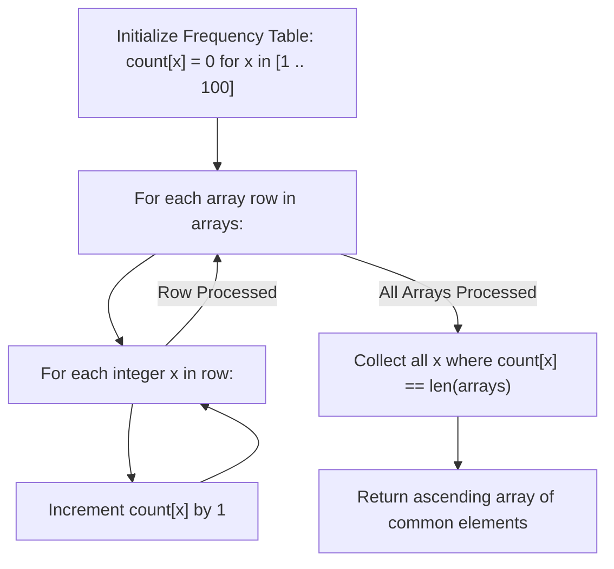

# Guided Example: Longest Common Subsequence Between Sorted Arrays

We trace common element identification, multi-array set intersection, and strict monotonicity preservation on representative sorted array collections:

- **Primary Input:** `arrays = [[2, 3, 6, 8], [1, 2, 3, 5, 6, 7, 10], [2, 3, 4, 6, 9]]`
- **Required Output:** `[2, 3, 6]`
- **Two-Array Input:** `arrays = [[1, 3, 4], [1, 4, 7, 9]]`
- **Required Output:** `[1, 4]`
- **Disjoint Input (Empty Result):** `arrays = [[1, 2, 3, 4, 5], [6, 7, 8]]`
- **Required Output:** `[]`

This instance demonstrates why strictly increasing order across all arrays guarantees that any common subset preserves relative order automatically, converting the general exponential/NP-hard Longest Common Subsequence problem into a linear multiset intersection.

---

## 1. Instance & Teaching Goal

Given an array of integer arrays `arrays` where each individual array `arrays[i]` is sorted in **strictly increasing order**, return an integer array representing the **longest common subsequence** between all arrays.

For `arrays = [[2, 3, 6, 8], [1, 2, 3, 5, 6, 7, 10], [2, 3, 4, 6, 9]]`:
- Number of arrays: $M = 3$.
- Array 0: `[2, 3, 6, 8]`
- Array 1: `[1, 2, 3, 5, 6, 7, 10]`
- Array 2: `[2, 3, 4, 6, 9]`
- Evaluate presence across all 3 arrays:
  - Element 1: only in Array 1 (Count 1)
  - Element 2: in Array 0, 1, 2 (Count 3) $\implies$ Common!
  - Element 3: in Array 0, 1, 2 (Count 3) $\implies$ Common!
  - Element 4: only in Array 2 (Count 1)
  - Element 5: only in Array 1 (Count 1)
  - Element 6: in Array 0, 1, 2 (Count 3) $\implies$ Common!
  - Element 7: only in Array 1 (Count 1)
  - Element 8: only in Array 0 (Count 1)
  - Element 9: only in Array 2 (Count 1)
  - Element 10: only in Array 1 (Count 1)
- Common elements present in all 3 arrays: `[2, 3, 6]`.
- Relative order: In every array, $2 < 3 < 6$. Because each array is strictly increasing, 2 appears before 3, and 3 appears before 6 in every single array.
- The subsequence `[2, 3, 6]` is valid and maximal in length.
- Output: `[2, 3, 6]`.

The teaching goal is to understand **order preservation in monotonic sequences**:
1. Why the general Longest Common Subsequence problem on $M$ arbitrary strings is NP-hard, but trivializes to linear set intersection when all inputs are strictly sorted.
2. Formulating the common subsequence as the exact intersection $\bigcap_{i=0}^{M-1} A_i$.
3. Evaluating frequency counting across bounded value domains ($1 \le x \le 100$) in $\mathcal{O}(\sum |A_i|)$ time.

---

## 2. Conceptual Foundation & Invariants

### Monotonic Intersection Equivalence Theorem

> **Monotonic Intersection Equivalence Theorem.**
> 1. *Strict Order Invariance:* Let $A_1, A_2, \dots, A_M$ be sequences strictly increasing in value:
>    $$\forall k, \quad A_k[0] < A_k[1] < \dots < A_k[|A_k|-1]$$
>    For any two values $x, y$ belonging to the intersection $\mathcal{S} = \bigcap_{k=1}^M A_k$, if $x < y$, then $x$ must appear strictly before $y$ in **every** sequence $A_k$.
> 2. *Subsequence Equivalence:* Because the relative order of any subset of $\mathcal{S}$ is universally identical across all $M$ arrays, the entire intersection set $\mathcal{S}$ sorted in ascending order forms a valid common subsequence for all arrays.
> 3. *Maximality:* A subsequence cannot contain elements absent from any input array. Thus the maximum possible length of any common subsequence is strictly bounded by $|\mathcal{S}|$. The sorted array of $\mathcal{S}$ is therefore the unique longest common subsequence.
> 4. *Frequency Counting:* Since elements within each array are distinct, an integer $x$ appears in all $M$ arrays if and only if its total occurrence count across all arrays equals $M$:
>    $$\text{count}(x) = M \iff x \in \bigcap_{k=1}^M A_k$$

---

## 3. Step-by-Step Worked Execution

We trace `arrays = [[2, 3, 6, 8], [1, 2, 3, 5, 6, 7, 10], [2, 3, 4, 6, 9]]`:
- Number of arrays: $M = 3$.
- Value range: $[1 \dots 100]$.

---

### Step 1: Process Array 0 (`[2, 3, 6, 8]`)
Increment frequency for each element:
- $\text{count}[2] \leftarrow 1$
- $\text{count}[3] \leftarrow 1$
- $\text{count}[6] \leftarrow 1$
- $\text{count}[8] \leftarrow 1$

---

### Step 2: Process Array 1 (`[1, 2, 3, 5, 6, 7, 10]`)
Increment frequency for each element:
- $\text{count}[1] \leftarrow 1$
- $\text{count}[2] \leftarrow 1 + 1 = 2$
- $\text{count}[3] \leftarrow 1 + 1 = 2$
- $\text{count}[5] \leftarrow 1$
- $\text{count}[6] \leftarrow 1 + 1 = 2$
- $\text{count}[7] \leftarrow 1$
- $\text{count}[10] \leftarrow 1$

---

### Step 3: Process Array 2 (`[2, 3, 4, 6, 9]`)
Increment frequency for each element:
- $\text{count}[2] \leftarrow 2 + 1 = 3$  ($== M$)
- $\text{count}[3] \leftarrow 2 + 1 = 3$  ($== M$)
- $\text{count}[4] \leftarrow 1$
- $\text{count}[6] \leftarrow 2 + 1 = 3$  ($== M$)
- $\text{count}[9] \leftarrow 1$

---

### Step 4: Extract Elements Matching $M = 3$
Scan frequencies $x = 1 \dots 10$:
- $x = 1: \text{count}[1] = 1 \neq 3$
- $x = 2: \text{count}[2] = 3 == 3 \implies$ **Include 2**
- $x = 3: \text{count}[3] = 3 == 3 \implies$ **Include 3**
- $x = 4: \text{count}[4] = 1 \neq 3$
- $x = 5: \text{count}[5] = 1 \neq 3$
- $x = 6: \text{count}[6] = 3 == 3 \implies$ **Include 6**
- $x = 7 \dots 10$: counts are all $1 \neq 3$.

---

### Final Result
The resulting common subsequence is:

$$\text{ans} = [2, 3, 6]$$

---

## 4. Complete Execution Trace

We record the cumulative frequency table across all arrays:

| Candidate Value $x$ | In Array 0? | In Array 1? | In Array 2? | Total Count $\text{count}[x]$ | Equals $M = 3$? | Appended to Result |
|---|---|---|---|---|---|---|
| 1 | No | Yes | No | 1 | No | — |
| 2 | **Yes** | **Yes** | **Yes** | **3** | **Yes** | `2` |
| 3 | **Yes** | **Yes** | **Yes** | **3** | **Yes** | `3` |
| 4 | No | No | Yes | 1 | No | — |
| 5 | No | Yes | No | 1 | No | — |
| 6 | **Yes** | **Yes** | **Yes** | **3** | **Yes** | `6` |
| 7 | No | Yes | No | 1 | No | — |
| 8 | Yes | No | No | 1 | No | — |
| 9 | No | No | Yes | 1 | No | — |
| 10 | No | Yes | No | 1 | No | — |

We compare results across different array sets:

| Input `arrays` | Number of Arrays $M$ | Intersection Set $\mathcal{S}$ | Strictly Ordered? | Output LCS |
|---|---|---|---|---|
| `[[1, 3, 4], [1, 4, 7, 9]]` | 2 | $\{1, 4\}$ | $1 < 4$ | `[1, 4]` |
| `[[2, 3, 6, 8], [1, 2, 3, 5, 6, 7, 10], [2, 3, 4, 6, 9]]` | 3 | $\{2, 3, 6\}$ | $2 < 3 < 6$ | `[2, 3, 6]` |
| `[[1, 2, 3, 4, 5], [6, 7, 8]]` | 2 | $\emptyset$ | — | `[]` |

---

## 5. Algorithmic Correctness

**Soundness.** Since each input array contains strictly increasing values, duplicate elements cannot exist within a single array. Thus, $\text{count}[x] = M$ proves that $x$ appears in every single array. Because all arrays are strictly sorted, for any two elements $a < b$ with $\text{count}[a] = \text{count}[b] = M$, $a$ appears before $b$ in every array. The constructed sequence is guaranteed to be a valid common subsequence.

**Completeness.** Any element in a common subsequence must exist in all $M$ arrays, requiring its count to be at least $M$. Because values are unique within each array, its count cannot exceed $M$. Hence, testing $\text{count}[x] == M$ captures all possible common elements without omission.

---

## 6. Traps This Instance Exposes

- **Overcomplicating with Dynamic Programming:** Standard LCS uses $\mathcal{O}(N_1 \cdot N_2 \dots N_M)$ dynamic programming. Recognizing that sorted arrays permit simple set intersection reduces exponential complexity to strictly linear time.
- **Duplicate Elements Within Rows:** If rows could have duplicates (e.g. `[1, 1, 2]`), a frequency count might reach $M$ from multiple occurrences in one row. Here, the specification explicitly guarantees *strictly increasing* rows, ensuring at most one occurrence per row.
- **Empty Intersection Handling:** If arrays share no elements (e.g. disjoint sets), the filter produces an empty list `[]` cleanly without special-case branching.

---

## 7. Complexity Derivation

- **Time Complexity:** $\mathcal{O}(\sum |arrays[i]| + K)$, where $\sum |arrays[i]|$ is the total number of elements across all arrays and $K = 100$ is the fixed maximum value range. Each element is visited once during frequency counting, and the table of size 100 is scanned once.
- **Auxiliary Space Complexity:** $\mathcal{O}(K) = \mathcal{O}(1)$ auxiliary space for the fixed-size frequency array of length 101.
