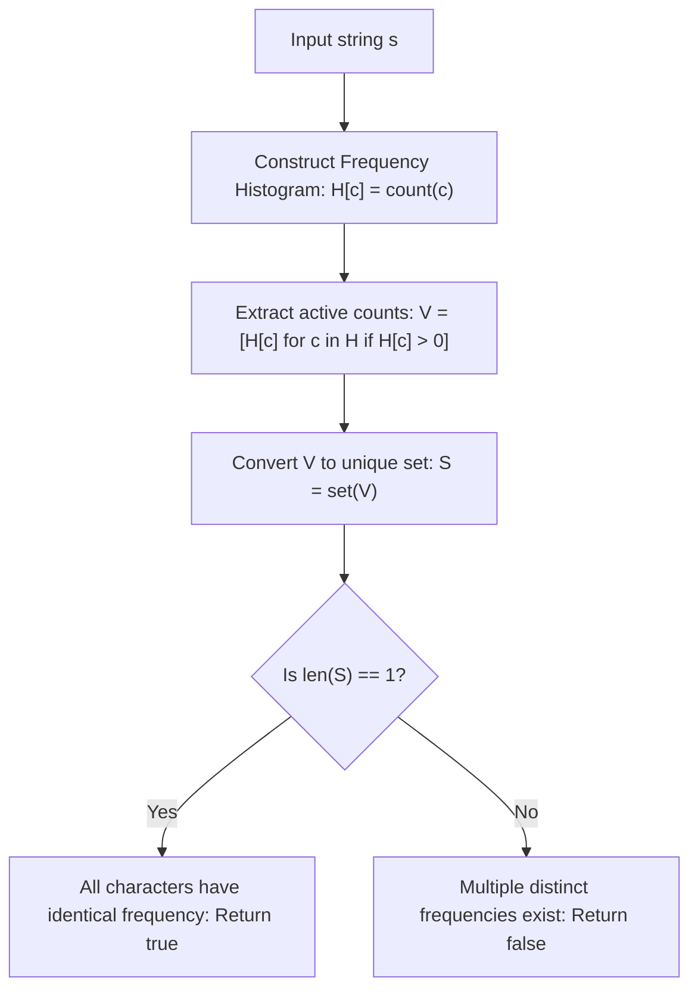

# Guided Example: Check if All Characters Have Equal Number of Occurrences

We trace frequency map aggregation and value-set cardinality evaluation on representative character strings:

- **Primary Input:** `s = "abacbc"`
- **Required Output:** `true`
- **Heterogeneous Input:** `s = "aaabb"`
- **Required Output:** `false`
- **Single Character Input (Boundary):** `s = "zzzz"`
- **Required Output:** `true`

This instance demonstrates tallying distinct character frequencies in an alphabet table, projecting the multiset of positive counts into a set, and testing whether the set of frequency values contains exactly one element.

---

## 1. Instance & Teaching Goal

Given a string `s`, determine whether **every character** that appears in `s` has the **same frequency** (the same number of occurrences).

For `s = "abacbc"` of length 6:
- Count of `'a'`: appearances at index 0 and 2 $\implies 2$.
- Count of `'b'`: appearances at index 1 and 4 $\implies 2$.
- Count of `'c'`: appearances at index 3 and 5 $\implies 2$.
- The distinct characters present are `{'a', 'b', 'c'}`.
- Their frequency values are $[2, 2, 2]$.
- All frequencies are equal to 2. Output: **true**.

For `s = "aaabb"` of length 5:
- Count of `'a'`: 3.
- Count of `'b'`: 2.
- Distinct frequency values: $\{3, 2\}$.
- The cardinality of the frequency set is $2 \neq 1$. Output: **false**.

The teaching goal is to understand **frequency distribution uniformity via set projection**:
1. Constructing the character frequency histogram $\mathcal{H}: \Sigma \to \mathbb{N}_0$.
2. Filtering to active characters ($\text{count} > 0$).
3. Formulating uniformity as $|\text{set}(\text{values}(\mathcal{H}))| = 1$.

---

## 2. Conceptual Foundation & Invariants

### Frequency Uniformity Invariant Theorem

> **Frequency Uniformity Invariant Theorem.**
> 1. *Character Support Formulation:* Let $\text{supp}(s) = \{c \in \Sigma \mid \text{count}(c, s) > 0\}$ be the set of distinct characters appearing in $s$.
> 2. *Equi-Frequency Predicate:* The string $s$ satisfies the equal occurrences property if and only if there exists an integer $k \ge 1$ such that:
>    $$\forall c \in \text{supp}(s), \quad \text{count}(c, s) = k$$
> 3. *Set Cardinality Equivalence:* The collection of values $\{\text{count}(c, s) \mid c \in \text{supp}(s)\}$ has identical elements if and only if its mathematical set projection has size 1:
>    $$\big| \{\text{count}(c, s) \mid c \in \text{supp}(s)\} \big| = 1$$
> 4. *Complexity:* A single linear pass over $s$ constructs the histogram of at most 26 lowercase English letters, and checking set cardinality takes $\mathcal{O}(|\Sigma|) = \mathcal{O}(1)$ time.

---

## 3. Step-by-Step Worked Execution

We trace `s = "abacbc"`:

---

### Step 1: Scan String and Populate Frequency Map
Iterate across all 6 characters of `s`:
- Index 0: `'a'` $\implies \mathcal{H}[\text{'a'}] = 1$.
- Index 1: `'b'` $\implies \mathcal{H}[\text{'b'}] = 1$.
- Index 2: `'a'` $\implies \mathcal{H}[\text{'a'}] = 1 + 1 = 2$.
- Index 3: `'c'` $\implies \mathcal{H}[\text{'c'}] = 1$.
- Index 4: `'b'` $\implies \mathcal{H}[\text{'b'}] = 1 + 1 = 2$.
- Index 5: `'c'` $\implies \mathcal{H}[\text{'c'}] = 1 + 1 = 2$.

Final histogram:
$$\mathcal{H} = \{\text{'a'}: 2, \text{'b'}: 2, \text{'c'}: 2\}$$

---

### Step 2: Extract Value Multiset
- Extract values: $[2, 2, 2]$.

---

### Step 3: Project onto Set and Check Cardinality
- Set projection: $\mathcal{S} = \{2\}$.
- $|\mathcal{S}| = 1$.
- Uniformity condition holds.
- Final Output: **true**.

---

## 4. Complete Execution Trace

We trace character occurrences for `s = "abacbc"`:

| Index $i$ | Character $s[i]$ | Running Count for `'a'` | Running Count for `'b'` | Running Count for `'c'` | State Invariant |
|---|---|---|---|---|---|
| 0 | `'a'` | 1 | 0 | 0 | Prefix `[a]` |
| 1 | `'b'` | 1 | 1 | 0 | Prefix `[a, b]` |
| 2 | `'a'` | 2 | 1 | 0 | Prefix `[a, b, a]` |
| 3 | `'c'` | 2 | 1 | 1 | Prefix `[a, b, a, c]` |
| 4 | `'b'` | 2 | 2 | 1 | Prefix `[a, b, a, c, b]` |
| 5 | `'c'` | 2 | 2 | 2 | Complete string |

We compare set cardinality across sample test strings:

| Input String $s$ | Distinct Characters | Histogram Map $\mathcal{H}$ | Value Multiset | Projected Set $\mathcal{S}$ | $|\mathcal{S}| == 1$? | Result |
|---|---|---|---|---|---|---|
| `"abacbc"` | `{'a', 'b', 'c'}` | `{'a': 2, 'b': 2, 'c': 2}` | $[2, 2, 2]$ | $\{2\}$ | **Yes** | **true** |
| `"aaabb"` | `{'a', 'b'}` | `{'a': 3, 'b': 2}` | $[3, 2]$ | $\{3, 2\}$ | **No** | **false** |
| `"zzzz"` | `{'z'}` | `{'z': 4}` | $[4]$ | $\{4\}$ | **Yes** | **true** |
| `"w"` | `{'w'}` | `{'w': 1}` | $[1]$ | $\{1\}$ | **Yes** | **true** |

---

## 5. Algorithmic Correctness

**Soundness.** If the set of frequency values has size 1, say $\{k\}$, then every character present in the string appears exactly $k$ times, satisfying the definition of equal occurrences. Returning `true` is mathematically sound.

**Completeness.** If there exist two characters $c_1, c_2 \in \text{supp}(s)$ such that $\text{count}(c_1) \neq \text{count}(c_2)$, the set of frequency values contains at least two distinct integers, so $|\mathcal{S}| \ge 2 \neq 1$. Returning `false` covers all non-uniform configurations without omission.

---

## 6. Traps This Instance Exposes

- **Including Absent Characters:** If a fixed array of size 26 is used, absent characters have count 0. If zero counts are included in the frequency set, a string like `"abacbc"` would have values $\{0, 2\}$, falsely rejecting it. Only active characters with positive counts must be evaluated.
- **Single Character Strings:** For strings like `"zzzz"` or `"w"`, only one character appears. The set has cardinality 1, which correctly returns `true`.
- **String Length Divisibility Trap:** Checking whether $\text{len}(s)$ is divisible by the number of unique characters is necessary but not sufficient. For example, in `"aaabbc"`, length is 6, unique characters are 3 ($6 / 3 = 2$), but counts are $3, 2, 1 \neq 2, 2, 2$. Explicitly verifying frequency equality is required.

---

## 7. Complexity Derivation

- **Time Complexity:** $\mathcal{O}(n)$, where $n = \text{len}(s)$. Counting frequencies takes $\mathcal{O}(n)$ time, and converting at most 26 values into a set takes $\mathcal{O}(|\Sigma|) = \mathcal{O}(1)$ time.
- **Auxiliary Space Complexity:** $\mathcal{O}(|\Sigma|) = \mathcal{O}(1)$ auxiliary space for the frequency histogram of 26 lowercase letters.
