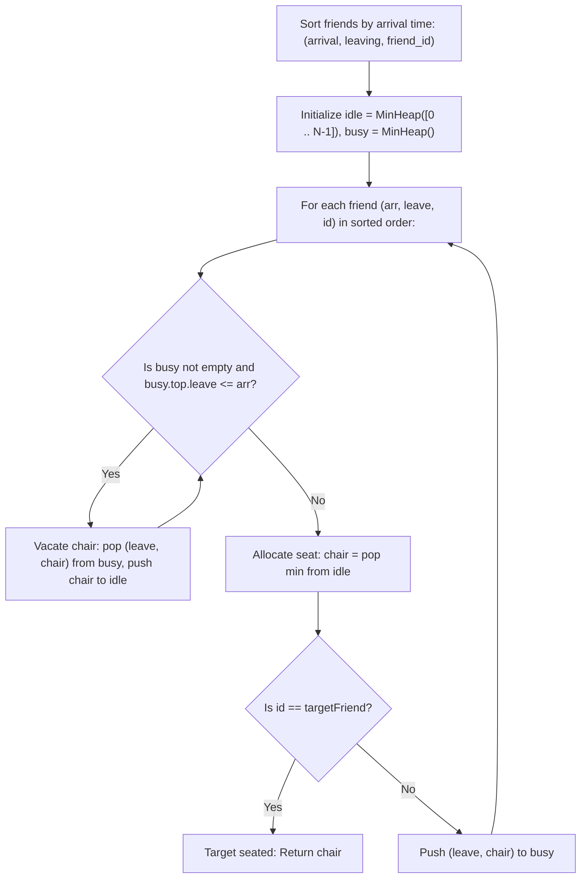

# Guided Example: The Number of the Smallest Unoccupied Chair

We trace discrete-event simulation, dual priority queues, and deterministic chair recycling on representative arrival/departure schedules:

- **Primary Input:** `times = [[1, 4], [2, 3], [4, 6]]`, `targetFriend = 1`
- **Required Output:** `1`
- **Alternative Target Input:** `times = [[3, 10], [1, 5], [2, 6]]`, `targetFriend = 0`
- **Required Output:** `2`

This instance demonstrates modeling chronological resource contention, handling simultaneous departure-before-arrival events at identical timestamps, and managing smallest-available index allocation using an idle min-heap and a busy min-heap in $\mathcal{O}(N \log N)$ time.

---

## 1. Instance & Teaching Goal

There are $n$ friends labeled from $0$ to $n - 1$. Each friend $i$ arrives at time $\text{times}[i][0]$ and departs at time $\text{times}[i][1]$.
- Infinite chairs are numbered $0, 1, 2, \dots$.
- Upon arrival, a friend immediately sits in the **smallest unoccupied chair**.
- When a friend leaves, their chair becomes immediately available. If a friend leaves at time $t$ and another arrives at time $t$, the departing friend vacates their chair **before** the arriving friend selects a seat.
- We must determine the chair assigned to a specific friend `targetFriend`.

For `times = [[1, 4], [2, 3], [4, 6]]` with `targetFriend = 1`:
- Friends and intervals:
  - Friend 0: $[1, 4)$
  - Friend 1: $[2, 3)$ (Target friend)
  - Friend 2: $[4, 6)$
- Chronological timeline:
  - **Time $t = 1$:** Friend 0 arrives. Smallest available chair is `0`. Friend 0 sits in chair `0`.
  - **Time $t = 2$:** Friend 1 (target) arrives. Chair `0` is occupied. Smallest available chair is `1`. Friend 1 sits in chair `1`.
  - We stop immediately because the target friend has been seated.
- Output: **1**.

For `times = [[3, 10], [1, 5], [2, 6]]` with `targetFriend = 0`:
- Sorted arrivals:
  - Time $1$: Friend 1 arrives $\to$ takes chair `0` (leaves at 5).
  - Time $2$: Friend 2 arrives $\to$ takes chair `1` (leaves at 6).
  - Time $3$: Friend 0 (target) arrives. Chairs `0` and `1` are occupied. Smallest available chair is `2`.
- Output: **2**.

The teaching goal is to understand **event-driven resource scheduling via dual priority queues**:
1. Chronological event sorting: Processing arrivals in ascending order of arrival time.
2. The Dual-Heap invariant:
   - `idle`: Min-heap of currently vacant chair indices $\{0, 1, 2, \dots\}$.
   - `busy`: Min-heap of currently occupied chairs ordered by `(leaving_time, chair_id)`.
3. Simultaneous event ordering: Evacuating all chairs where $\text{leaving\_time} \le \text{current\_arrival}$ prior to allocating a new seat.

---

## 2. Conceptual Foundation & Invariants

### Dual-Heap Chair Allocation Theorem

> **Dual-Heap Chair Allocation Theorem.**
> 1. *Resource Pool Partition:* At any simulation time $t$, the set of chairs is partitioned into two disjoint subsets:
>    $$\mathcal{C} = \mathcal{C}_{\text{idle}}(t) \cup \mathcal{C}_{\text{busy}}(t)$$
>    - $\mathcal{C}_{\text{idle}}(t)$: Unoccupied chair numbers.
>    - $\mathcal{C}_{\text{busy}}(t)$: Pairs $(\tau_{\text{leave}}, c)$ representing chairs occupied until time $\tau_{\text{leave}}$.
> 2. *Departure-First Invariant:* When friend $i$ arrives at timestamp $t_{\text{arr}}$, all occupied chairs with $\tau_{\text{leave}} \le t_{\text{arr}}$ must be transitioned from $\mathcal{C}_{\text{busy}}$ to $\mathcal{C}_{\text{idle}}$ before selecting a chair:
>    $$\forall (\tau, c) \in \mathcal{C}_{\text{busy}} \text{ with } \tau \le t_{\text{arr}}, \quad \mathcal{C}_{\text{busy}} \leftarrow \mathcal{C}_{\text{busy}} \setminus \{(\tau, c)\}, \quad \mathcal{C}_{\text{idle}} \leftarrow \mathcal{C}_{\text{idle}} \cup \{c\}$$
> 3. *Minimal Allocation:* Arriving friend $i$ is assigned the chair:
>    $$c^* = \min \mathcal{C}_{\text{idle}}(t_{\text{arr}})$$
>    Removing $c^*$ from $\mathcal{C}_{\text{idle}}$ and inserting $(t_{\text{leave}}, c^*)$ into $\mathcal{C}_{\text{busy}}$ takes $\mathcal{O}(\log N)$ heap operations.
> 4. *Upper Bound on Chairs:* At most $N$ friends can be present simultaneously. Therefore, the maximum chair index ever used is at most $N - 1$. Initializing $\mathcal{C}_{\text{idle}}$ with $\{0, 1, \dots, N - 1\}$ is sufficient.

---

## 3. Step-by-Step Worked Execution

We trace `times = [[1, 4], [2, 3], [4, 6]]` with `targetFriend = 1`:

---

### Step 1: Augment and Sort Friends by Arrival Time
- Friend 0: Arrival 1, Leaving 4, ID 0
- Friend 1: Arrival 2, Leaving 3, ID 1 (Target)
- Friend 2: Arrival 4, Leaving 6, ID 2
- Sorted array: `[(1, 4, 0), (2, 3, 1), (4, 6, 2)]`.
- Heaps initialized:
  - `idle = [0, 1, 2]`
  - `busy = []`

---

### Step 2: Process Event 1 (Friend 0 at $t = 1$)
- Current arrival $t = 1$.
- Evacuation check: `busy` is empty.
- Allocate chair: $c = \text{pop}(\text{idle}) = 0$.
- Target check: ID $0 \neq \text{targetFriend } (1)$.
- Record occupancy: push $(4, 0)$ to `busy`.
- State after event 1:
  - `idle = [1, 2]`
  - `busy = [(4, 0)]` (Chair 0 occupied until $t = 4$).

---

### Step 3: Process Event 2 (Friend 1 at $t = 2$)
- Current arrival $t = 2$.
- Evacuation check: `busy` has `(4, 0)`.
  - Is $4 \le 2$? No. Friend 0 is still sitting in chair 0.
- Allocate chair: $c = \text{pop}(\text{idle}) = 1$.
- Target check: ID $1 == \text{targetFriend } (1)$!
- **Match Found!** Return chair **1**.

---

### Secondary Trace: Simultaneous Handover at $t = 4$
Suppose we continued to Friend 2 at $t = 4$:
- Current arrival $t = 4$.
- Evacuation check:
  - Friend 1 left at $t = 3 \implies$ Chair 1 was freed.
  - Friend 0 leaves at $t = 4$: $4 \le 4$ holds $\implies$ Chair 0 is freed and pushed to `idle`!
- At $t = 4$, `idle` contains $\{0, 1, 2\}$.
- Friend 2 receives chair $\min(\text{idle}) = \mathbf{0}$, reusing the chair just vacated at $t = 4$.

---

## 4. Complete Execution Trace

We record heap transitions across arrival events for `times = [[1, 4], [2, 3], [4, 6]]`:

| Time $t$ | Arriving Friend | Vacated Chairs Released to `idle` | `idle` Heap Before Seat | Assigned Chair | Target Friend? | `busy` Heap After Seat |
|---|---|---|---|---|---|---|
| 1 | Friend 0 | None (`busy` empty) | `[0, 1, 2]` | **0** | No | `[(4, 0)]` |
| 2 | Friend 1 | None ($4 > 2$) | `[1, 2]` | **1** | **Yes (Target)** | `[(3, 1), (4, 0)]` |
| 4 | Friend 2 | Chair 1 (at 3), Chair 0 (at 4) | `[0, 1, 2]` | **0** | No | `[(6, 0)]` |

We compare chair allocations across different target friends for `times = [[3, 10], [1, 5], [2, 6]]`:

| Sorted Arrival | Friend ID | Interval | Chairs Vacated | Allocated Chair | Cumulative Busy State |
|---|---|---|---|---|---|
| $t = 1$ | 1 | $[1, 5)$ | None | **0** | `{Chair 0 until 5}` |
| $t = 2$ | 2 | $[2, 6)$ | None | **1** | `{Chair 0 until 5, Chair 1 until 6}` |
| $t = 3$ | 0 (Target) | $[3, 10)$ | None | **2** | `{Chair 0 until 5, Chair 1 until 6, Chair 2 until 10}` |

---

## 5. Algorithmic Correctness

**Soundness.** Friends are processed in strict chronological arrival order. By popping all departures satisfying $\tau \le t_{\text{arr}}$ prior to popping from `idle`, every chair whose occupant has departed is made available before the incoming friend selects a seat. Taking the minimum element from `idle` guarantees that the friend receives the strictly smallest available chair index, exactly matching the problem rules.

**Completeness.** Since arrival times are distinct and the simulation examines all arrivals up to `targetFriend`, the target friend is guaranteed to be seated and assigned the unique chair dictated by prior arrivals and departures.

---

## 6. Traps This Instance Exposes

- **Simultaneous Departure/Arrival Boundary:** If friend A leaves at time 4 and friend B arrives at time 4, friend A's chair must be recycled *before* friend B sits. Testing `busy[0][0] <= arrival` (less than or equal) ensures correct simultaneous handover. Using strict inequality `<` would falsely keep the chair occupied.
- **Original vs. Sorted Friend Indexing:** Sorting by arrival time permutes the friend indices. The original friend index $i$ must be preserved as metadata (e.g. `(arrival, leaving, i)`) so that `targetFriend` is identified by original identity, not sorted position.
- **Unbounded Chair Creation:** Rather than creating arbitrary new chair IDs dynamically, seeding `idle` with $[0, \dots, N-1]$ guarantees sufficient capacity while keeping the heap size bounded by $N$.

---

## 7. Complexity Derivation

- **Time Complexity:** $\mathcal{O}(N \log N)$, where $N$ is the number of friends. Sorting $N$ intervals takes $\mathcal{O}(N \log N)$ time. Each friend's chair is pushed and popped from the heaps at most twice, requiring $\mathcal{O}(\log N)$ per operation.
- **Auxiliary Space Complexity:** $\mathcal{O}(N)$ to store the augmented events list, the `idle` heap, and the `busy` heap.
