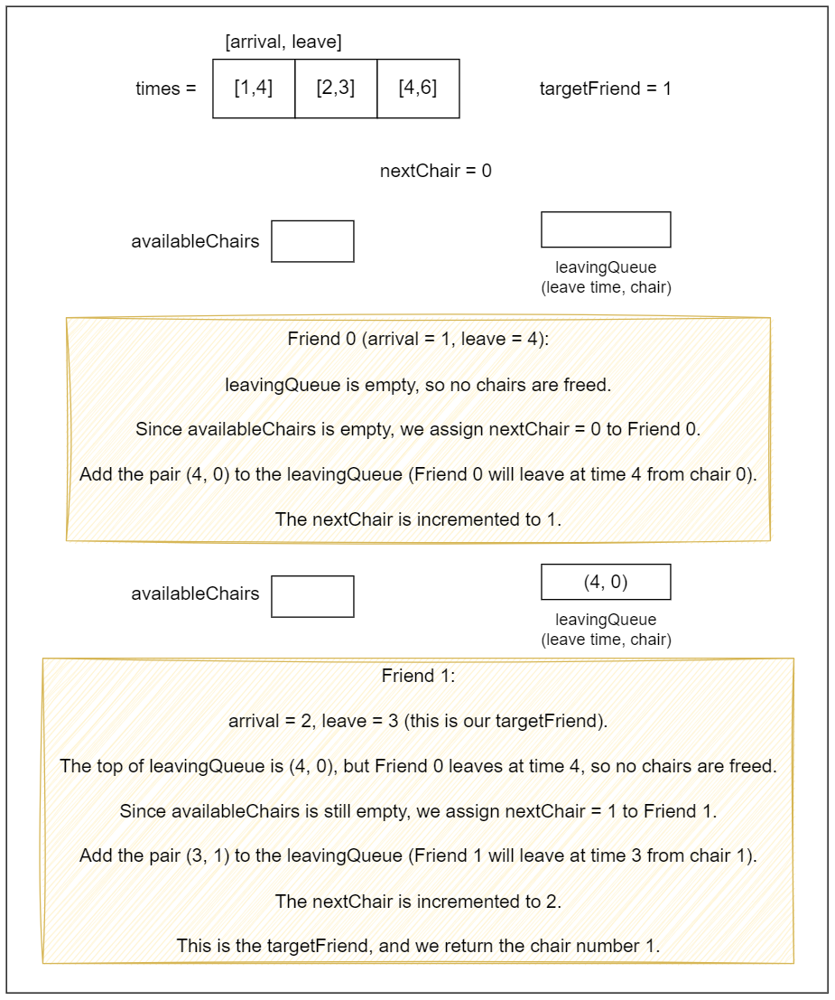

[TOC]

## Solution

---

### Overview

We have a party with friends who arrive and leave at different times. Each time a friend arrives, they sit on the lowest-numbered available chair. When they leave, their chair becomes available for others.

The input includes a 2D array of `times`, where each element represents the arrival and leaving time of a friend, and an integer `targetFriend`. We need to determine the chair number that the `targetFriend` will sit on based on the order of arrivals and departures.

Here are some related questions that we recommend for you to solve:

1. [Divide Intervals Into Minimum Number of Groups](https://leetcode.com/problems/divide-intervals-into-minimum-number-of-groups/description/)
2. [Meeting Rooms II](https://leetcode.com/problems/meeting-rooms-ii/description/)
3. [Meeting Rooms III](https://leetcode.com/problems/meeting-rooms-iii/description/)

---

### Approach 1: Brute Force

#### Intuition

The first approach we'll look at is simulating the process. We'll start by sorting the input so that we can process the people in chronological order. We can then iterate over the people in order of when they arrive and determine which chair each person will take until we determine the chair for the target person.

To accomplish this, we'll use an array `chairTime` with a length of `n`. Even though there are an infinite number of chairs, we only need to worry about the first `n` - even if everybody is at the party simultaneously, we won't need more than `n` chairs.
$\text{chairTime}[i]$ will represent the time the $i^{th}$ chair becomes available. Initially, all values of `chairTime` are `0`, because every chair is available at the beginning.

For each person `(arrival, leaving)`, we will iterate over `chairTime` and find the first chair with a value less than or equal to `arrival`. This is the chair that the current person will take. Let's say that it is the $i^{th}$ chair. We can then set $\text{chairTime}[i] = leaving$ since that's when the chair will become available again.

We can immediately return the answer when we figure out which seat `targetFriend` will take.

#### Algorithm

- Store the arrival and departure times of the `targetFriend` in `targetTime`.

- Sort the `times` array based on arrival times to ensure friends are seated in the order they arrive.

- Initialize an integer `n` to represent the total number of friends and create an array `chairTime` of size `n` to keep track of when each chair becomes available.

- Iterate through each `time` in the sorted `times` array:
  - For each time, loop through each chair (index `i`):
- If the $\text{chairTime}[i]$ (when the chair becomes available) is less than or equal to the arrival time of the current friend ($\text{time}[0]$):
      - Update $\text{chairTime}[i]$ to the departure time of the current friend ($\text{time}[1]$).
      - If the current `time` matches `targetTime`, return the chair index `i` (the chair assigned to the `targetFriend`).
      - Break out of the loop to move on to the next friend.

- If no chair is found for the `targetFriend`, return 0 (default return value).

#### Implementation

```python
class Solution:
    def smallestChair(self, times: List[List[int]], targetFriend: int) -> int:
        target_time = times[targetFriend]
        times.sort()

        n = len(times)
        chair_time = [0] * n

        for time in times:
            for i in range(n):
                if chair_time[i] <= time[0]:
                    chair_time[i] = time[1]
                    if time == target_time:
                        return i
                    break
        return 0
```

#### Complexity Analysis

Let $n$ be the size of the `times` array.

- Time complexity: $O(n^2)$

    We first sort the `times` array, which takes $O(n \log n)$. However, the nested loop within the `for` loop leads to an overall time complexity of $O(n^2)$. Specifically, for each entry in the sorted `times`, the inner loop checks each chair to see if it is available. In the worst case, this can lead to $n$ checks for each of the $n$ times, resulting in $O(n^2)$.

- Space complexity: $O(n)$

    The space complexity arises from the `chairTime` array, which stores the end times of chair usage. This array has a size equal to the number of friends $n$, leading to a space complexity of $O(n)$. Additionally, the `times` array is modified in place, so no extra space is used beyond what's necessary for `chairTime`.

    The space taken by the sorting algorithm ($S$) depends on the language of implementation:
- In Java, `Arrays.sort()` is implemented using a variant of the Quick Sort algorithm which has a space complexity of $O( \log n)$.
- In C++, the `sort()` function is implemented as a hybrid of Quick Sort, Heap Sort, and Insertion Sort, with a worst-case space complexity of $O(\log n)$.
- In Python, the `sort()` method sorts a list using the Timsort algorithm which is a combination of Merge Sort and Insertion Sort and has a space complexity of $O(n)$.

    Thus, the total space used is $O(n) +$\mathcal{O}(S)$= O(n)$.

---

### Approach 2: Event-based with Two Priority Queues

#### Intuition

An effective approach is to use an event-based method. We start by creating a list of events that represent the arrivals and departures of each friend (`{arrival time, friend index}`). By sorting these events by time, we establish a clear timeline for processing them sequentially.

To ensure that each arriving friend receives the smallest unoccupied chair, we use a min-heap `availableChairs`, which allows for efficient retrieval and removal of the smallest available chair. We also need to handle chair availability when friends leave, so we maintain another min-heap `occupiedChairs` to track the chairs being vacated and the corresponding times.

Initially, we populate the `availableChairs` queue with all chair numbers since all chairs are free at the start.

As we process each event, we check if any friends have left by comparing the current time with the departure times in the `occupiedChairs` queue. When a chair becomes available, we add it back to the `availableChairs` queue. When a friend arrives, we allocate the lowest-numbered chair from the `availableChairs`. If this friend is the `targetFriend`, we return their chair index.

#### Algorithm

- Initialize `n` as the size of `times`, and create an array `events` to store both arrival and leave events.
- Populate the `events` array with:
  - Arrival events as pairs of `{arrival time, friend index}`.
  - Leave events as pairs of `{leave time, -friend index}` (using bitwise NOT to distinguish).
- Sort the `events` array by time to process them in order.
- Create a min-heap `availableChairs` to keep track of free chairs and initialize it with all chair indices (0 to n-1).
- Create a min-heap `occupiedChairs` to track when chairs will be vacated, storing pairs of `{leave time, chair index}`.
- Iterate through each `event` in `events`:
  - Extract the `time` and `friendIndex` from the event.
- Free up chairs for friends that have left:
      - While the `occupiedChairs` heap is not empty and the top leave time is less than or equal to the current `time`, push the chair index back to `availableChairs` and pop it from `occupiedChairs`.
- Check if the `friendIndex` indicates an arrival:
      - If `friendIndex` is non-negative (indicating a friend has arrived):
- Get the chair index from `availableChairs`, and pop it to mark it as occupied.
- If the `friendIndex` matches `targetFriend`, return the chair index.
- Otherwise, push a new entry into `occupiedChairs` with the leave time and chair index.

- If the function reaches this point, return -1 (this case should not occur).

#### Implementation

```python
class Solution:
    def smallestChair(self, times, targetFriend):
        events = []  # to store both arrival and leave events

        # populate events with arrival and leave times
        for i in range(len(times)):
            events.append([times[i][0], i])  # Arrival
            events.append([times[i][1], ~i])  # Leave

        events.sort()  # Sort events by time

        available_chairs = list(
            range(len(times))
        )  # Tracking chairs that are free

        occupied_chairs = []  # When each chair will be free

        for event in events:
            time, friend = event

            # free up chairs if friends leave
            while occupied_chairs and occupied_chairs[0][0] <= time:
                _, chair = heapq.heappop(
                    occupied_chairs
                )  # Pop chair that becomes empty
                heapq.heappush(available_chairs, chair)  # available chairs

            # If friend arrives
            if friend >= 0:
                chair = heapq.heappop(available_chairs)
                if friend == targetFriend:
                    return chair
                heapq.heappush(
                    occupied_chairs, [times[friend][1], chair]
                )  # chair will be occupied till this time

        return -1  # should not come to this point
```

#### Complexity Analysis

Let $n$ be the size of the `times` array.

- Time complexity: $O(n \log n)$

    The first part of the algorithm constructs the `events` array, which takes $O(n)$ time since we iterate through the `times` array.

    The `events` array is then sorted, which takes $O(n \log n)$ time.

    In the main loop, we process each event. While processing, we might have to pop elements from the `occupiedChairs` priority queue, but since each chair is only added and removed once, the total time spent on these operations across all events is $O(n \log n)$ in the worst case.

    Therefore, the overall time complexity is dominated by the sorting step, yielding $O(n \log n)$.

- Space complexity: $O(n)$

    We create the `events` array, which stores $2n$ pairs (one for each arrival and one for each departure), requiring $O(n)$ space.

    The `availableChairs` priority queue can also store up to $n$ chairs, which adds another $O(n)$ space in the worst case.

    The `occupiedChairs` priority queue will also have a size that can grow up to $n$ in the worst case.

    The space taken by the sorting algorithm ($S$) depends on the language of implementation:
- In Java, `Arrays.sort()` is implemented using a variant of the Quick Sort algorithm which has a space complexity of $O( \log n)$.
- In C++, the `sort()` function is implemented as a hybrid of Quick Sort, Heap Sort, and Insertion Sort, with a worst-case space complexity of $O(\log n)$.
- In Python, the `sort()` method sorts a list using the Timsort algorithm which is a combination of Merge Sort and Insertion Sort and has a space complexity of $O(n)$.

    Thus, the total space used is $O(n) +$\mathcal{O}(n)$+$\mathcal{O}(n)$+$\mathcal{O}(S)$= O(n)$.

---

### Approach 3: Set with Sorted Insertion

#### Intuition

Building on the event-based concept, we can further optimize our approach using a set to manage available chairs. We begin by sorting the friends according to their arrival times, similar to the previous approach, while maintaining a priority queue `leavingQueue` to track departure times.

As we process each arrival event, we first check the `leavingQueue` for any friends who have left and add their chairs to the set of available chairs (`availableChairs`). When a friend arrives, we either assign the lowest numbered chair from the `availableChairs` or, if none are free, allocate the next available chair number. After assigning the chair, we record the departure time in the `leavingQueue`. If the arriving friend is our target, we return their assigned chair index.

</br>



</br>

#### Algorithm

- Initialize a priority queue `leavingQueue` to track the leave times and corresponding chair numbers, using a min-heap to ensure chairs are freed up in order of their leave times.
- Get the arrival time of the target friend using $targetArrival = \text{times}[targetFriend][0]$.

- Sort the `times` array to process friends in order of arrival.

- Initialize `nextChair` to track the next available chair number, starting from 0.
- Create a set of `availableChairs` to keep track of chairs that have become available.

- Iterate through each entry in `times`:
  - Extract `arrival` and `leave` times for the current friend.
- Free up chairs based on the current arrival time:
      - While there are chairs in `leavingQueue` that have a leave time less than or equal to the current `arrival`:
- Insert the chair number from `leavingQueue` into `availableChairs`.
- Remove the chair from `leavingQueue`.
- Determine the `currentChair` for the current friend:
      - If `availableChairs` is not empty, take the smallest chair from the set and remove it.
      - If no chairs are available, assign the next chair by incrementing `nextChair`.
- Push the current leave time and chair number into `leavingQueue`.
- If the `arrival` time of the current friend matches the `targetArrival`, return `currentChair`.

- If the loop completes without returning, it indicates the target friend's chair was not found; return 0 as a fallback (though this shouldn't normally happen with valid input).

#### Implementation

```python
class Solution:
    def smallestChair(self, times: List[List[int]], targetFriend: int) -> int:
        target_arrival = times[targetFriend][0]
        times = sorted(
            [
                (arrival, leave, index)
                for index, (arrival, leave) in enumerate(times)
            ]
        )

        next_chair = 0
        available_chairs = []
        leaving_queue = []

        for time in times:
            arrival, leave, index = time

            # Free up chairs based on current time
            while leaving_queue and leaving_queue[0][0] <= arrival:
                _, chair = heapq.heappop(leaving_queue)
                heapq.heappush(available_chairs, chair)

            if available_chairs:
                current_chair = heapq.heappop(available_chairs)
            else:
                current_chair = next_chair
                next_chair += 1

            # Push current leave time and chair
            heapq.heappush(leaving_queue, (leave, current_chair))

            # Check if it's the target friend
            if index == targetFriend:
                return current_chair

        return 0
```

#### Complexity Analysis

Let $n$ be the size of the `times` array.

- Time Complexity: $O(n \log n)$

    The `sort` function call takes $O(n \log n)$ time due to the sorting algorithm used.

    The `for` loop iterates through each of the $n$ times. Within this loop:
       - The $while (!\text{leavingQueue.empty}() \&\& \text{leavingQueue.top}().first \le arrival)$ operation has a complexity of $O(\log k)$ where $k$ is the number of elements in `leavingQueue`. Since in the worst case $k$ can be $n$, this part will be $O(\log n)$ in the worst case.
       - The insert and erase operations, which are part of the `set`, also take $O(\log n)$ time each.
       - The `leavingQueue.push()` operation is $O(\log n)$.

    Therefore, processing each time can take up to $O(n \log n)$ overall.

    Combining these parts, the dominant factor in the time complexity is the sorting step, leading to a total time complexity of $O(n \log n)$.

- Space Complexity: $O(n)$

    The `leavingQueue` is a priority queue that can store at most $n$ elements (one for each friend), which contributes $O(n)$ space.

    The `availableChairs` set can also store at most $n$ chair numbers, contributing another $O(n)$ space.

    The space taken by the sorting algorithm ($S$) depends on the language of implementation:
- In Java, `Arrays.sort()` is implemented using a variant of the Quick Sort algorithm which has a space complexity of $O( \log n)$.
- In C++, the `sort()` function is implemented as a hybrid of Quick Sort, Heap Sort, and Insertion Sort, with a worst-case space complexity of $O(\log n)$.
- In Python, the `sort()` method sorts a list using the Timsort algorithm which is a combination of Merge Sort and Insertion Sort and has a space complexity of $O(n)$.

    Thus, the total space complexity is dominated by these two structures, resulting in an overall space complexity of $O(n)$.

---