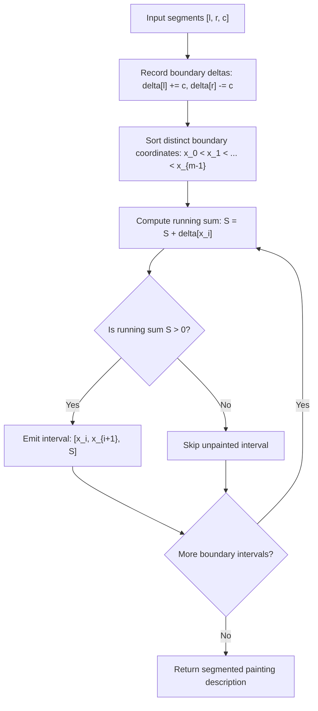

# Guided Example: Describe the Painting

We trace 1D difference arrays, coordinate discretization, and prefix sum painting segmentation on representative color segment inputs:

- **Primary Input:** `segments = [[1, 4, 5], [4, 7, 7], [1, 7, 9]]`
- **Required Output:** `[[1, 4, 14], [4, 7, 16]]`
- **Multi-Overlap Input:** `segments = [[1, 7, 9], [6, 8, 15], [8, 10, 7]]`
- **Required Output:** `[[1, 6, 9], [6, 7, 24], [7, 8, 15], [8, 10, 7]]`

This instance demonstrates modeling overlapping intervals as discrete boundary delta events ($+c$ at starts, $-c$ at ends), maintaining cumulative color mix values via prefix sums, and outputting non-empty homogeneous half-open intervals $[s_i, s_{i+1})$ in $\mathcal{O}(N \log N)$ time.

---

## 1. Instance & Teaching Goal

We paint a 1D line using half-open segments $[start, end)$ with color values $c$. Where multiple segments overlap, their color values add together. We must describe the painted line as a sorted list of disjoint segments $[left, right, mix]$ covering all painted sections.
- Adjacent segments that share the same color sum must remain distinct if they were formed by different original segment combinations.
- Any unpainted region ($mix = 0$) is omitted from the output.

For `segments = [[1, 4, 5], [4, 7, 7], [1, 7, 9]]`:
- Segment 1: $[1, 4)$ with color 5
- Segment 2: $[4, 7)$ with color 7
- Segment 3: $[1, 7)$ with color 9
- Interval $[1, 4)$: Covered by Segment 1 (color 5) and Segment 3 (color 9).
  - Mix sum: $5 + 9 = 14$. Segment: $[1, 4, 14]$.
- Interval $[4, 7)$: Covered by Segment 2 (color 7) and Segment 3 (color 9).
  - Mix sum: $7 + 9 = 16$. Segment: $[4, 7, 16]$.
- The point $x = 4$ is a boundary where the constituent colors change from $\{5, 9\}$ to $\{7, 9\}$.
- Final output: `[[1, 4, 14], [4, 7, 16]]`.

The teaching goal is to understand **sparse difference arrays and line sweep segmentation**:
1. Mapping intervals $[l, r)$ to differential boundary events: $+c$ at $l$ and $-c$ at $r$.
2. Merging boundary deltas at shared coordinates using a hash table.
3. Sorting unique boundary points and computing the running cumulative sum.
4. Constructing elementary segments between consecutive sorted coordinates where the running color sum is strictly positive.

---

## 2. Conceptual Foundation & Invariants

### Discrete Difference Array Invariant Theorem

> **Discrete Difference Array Invariant Theorem.**
> 1. *Interval Characteristic Function:* A segment $[l_k, r_k)$ with color $c_k$ defines a piecewise constant function:
>    $$\chi_k(x) = \begin{cases} c_k & \text{if } l_k \le x < r_k \\ 0 & \text{otherwise} \end{cases}$$
>    Its derivative in the sense of distributions is a pair of Dirac deltas: $\chi'_k = c_k \cdot \delta(x - l_k) - c_k \cdot \delta(x - r_k)$.
> 2. *Superposition of Color Mix:* The total color value at point $x$ is:
>    $$\mathcal{M}(x) = \sum_{k} \chi_k(x)$$
>    The value $\mathcal{M}(x)$ is constant on any open interval between consecutive distinct boundary coordinates in the sorted set of all endpoints $\mathcal{B} = \bigcup_k \{l_k, r_k\}$.
> 3. *Prefix Sum Reconstruction:* For sorted boundary coordinates $x_0 < x_1 < \dots < x_{m-1}$ with net deltas $\Delta(x_i) = \sum_{l_k = x_i} c_k - \sum_{r_k = x_i} c_k$:
>    $$\mathcal{M}(x) = \sum_{j \le i} \Delta(x_j) \quad \text{for all } x \in [x_i, x_{i+1})$$
> 4. *Output Filtering:* If $\mathcal{M}(x) > 0$ on $[x_i, x_{i+1})$, the tuple $[x_i, x_{i+1}, \mathcal{M}(x_i)]$ is emitted. If $\mathcal{M}(x) = 0$, the interval is unpainted and skipped.

---

## 3. Step-by-Step Worked Execution

We trace `segments = [[1, 4, 5], [4, 7, 7], [1, 7, 9]]`:

---

### Step 1: Accumulate Boundary Deltas
- Segment $[1, 4, 5]$:
  - Coordinate 1: $+5$
  - Coordinate 4: $-5$
- Segment $[4, 7, 7]$:
  - Coordinate 4: $+7$
  - Coordinate 7: $-7$
- Segment $[1, 7, 9]$:
  - Coordinate 1: $+9$
  - Coordinate 7: $-9$

Consolidated deltas at each coordinate:
- Coordinate 1: $+5 + 9 = \mathbf{+14}$
- Coordinate 4: $-5 + 7 = \mathbf{+2}$
- Coordinate 7: $-7 - 9 = \mathbf{-16}$

---

### Step 2: Sort Boundary Coordinates
Sorted coordinate list with consolidated deltas:

$$S = [(1, +14), (4, +2), (7, -16)]$$

---

### Step 3: Prefix Sum Sweep Across Intervals

#### Interval 1: Between $x_0 = 1$ and $x_1 = 4$
- Running sum at $x_0 = 1$:
  $$\text{sum} = 0 + 14 = 14$$
- Check $> 0$: $14 > 0$ (True).
- Emit interval: $[1, 4, 14]$.

#### Interval 2: Between $x_1 = 4$ and $x_2 = 7$
- Running sum at $x_1 = 4$:
  $$\text{sum} = 14 + 2 = 16$$
- Check $> 0$: $16 > 0$ (True).
- Emit interval: $[4, 7, 16]$.

#### Terminal Boundary $x_2 = 7$
- Running sum at $x_2 = 7$:
  $$\text{sum} = 16 + (-16) = 0$$
- All painting operations conclude.

---

### Final Output Assembly
$$\text{Output} = [[1, 4, 14], [4, 7, 16]]$$

---

## 4. Complete Execution Trace

We record coordinate boundary deltas and interval prefix sums for both test instances:

| Coordinate $x$ | Contributing Events | Net Delta $\Delta(x)$ | Running Color Mix Sum | Interval $[x_i, x_{i+1})$ | Emitted Output Segment |
|---|---|---|---|---|---|
| 1 | $+5 (\text{seg } 1), +9 (\text{seg } 3)$ | $+14$ | 14 | $[1, 4)$ | `[1, 4, 14]` |
| 4 | $-5 (\text{seg } 1), +7 (\text{seg } 2)$ | $+2$ | 16 | $[4, 7)$ | `[4, 7, 16]` |
| 7 | $-7 (\text{seg } 2), -9 (\text{seg } 3)$ | $-16$ | 0 | Terminal | — |

We trace the multi-overlap instance `segments = [[1, 7, 9], [6, 8, 15], [8, 10, 7]]`:

| Boundary $x$ | Delta $\Delta(x)$ | Running Mix | Next Boundary | Interval $[x_i, x_{i+1})$ | Segment Emitted |
|---|---|---|---|---|---|
| 1 | $+9$ | 9 | 6 | $[1, 6)$ | `[1, 6, 9]` |
| 6 | $+15$ | $9 + 15 = 24$ | 7 | $[6, 7)$ | `[6, 7, 24]` |
| 7 | $-9$ | $24 - 9 = 15$ | 8 | $[7, 8)$ | `[7, 8, 15]` |
| 8 | $-15 + 7 = -8$ | $15 - 8 = 7$ | 10 | $[8, 10)$ | `[8, 10, 7]` |
| 10 | $-7$ | $7 - 7 = 0$ | Terminal | $[10, \infty)$ | — |

---

## 5. Algorithmic Correctness

**Soundness.** Because intervals are half-open $[l, r)$, adding $+c$ at $l$ introduces color $c$ starting at coordinate $l$, and adding $-c$ at $r$ removes color $c$ exactly at $r$. Since no segments start or end strictly inside any open interval $(x_i, x_{i+1})$, the set of active colors—and therefore their sum—is invariant on $[x_i, x_{i+1})$. The emitted tuples accurately record the exact sum of colors present.

**Completeness.** Every interval endpoint in the input is represented in the sorted coordinate list $\mathcal{B}$. Because all potential transition points are visited and all intervals with non-zero sum are captured, the full length of the painting is described without gaps.

---

## 6. Traps This Instance Exposes

- **Do Not Merge Adjacent Segments with Same Color:** A common trap is merging adjacent intervals when their color sums are equal. The problem specification explicitly states: *"Adjacent segments that have the same color mix cannot be merged if their sets of colors are different"*. Using the boundary points directly naturally preserves necessary boundaries.
- **Sparse vs. Dense Coordinates:** Coordinates can reach $10^5$, but the number of segments is at most $10^5$. Using a fixed array of size $10^5$ is feasible, but using a hash map and sorting active keys handles arbitrary coordinate ranges up to $10^9$ without memory overhead.
- **Half-Open Interval Boundary:** A segment ending at $x = 4$ ceases its color contribution at $x = 4$. If another segment starts at $x = 4$, both $+c_{\text{new}}$ and $-c_{\text{old}}$ are incorporated into delta at coordinate 4 before computing the mix for $[4, \dots)$.

---

## 7. Complexity Derivation

- **Time Complexity:** $\mathcal{O}(N \log N)$, where $N$ is the number of segments. Populating the boundary map takes $\mathcal{O}(N)$ time. Sorting the at most $2N$ unique boundary coordinates takes $\mathcal{O}(N \log N)$ time. The single prefix sweep takes $\mathcal{O}(N)$ time.
- **Auxiliary Space Complexity:** $\mathcal{O}(N)$ to store the boundary delta table and the emitted interval list.
