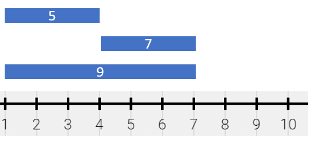
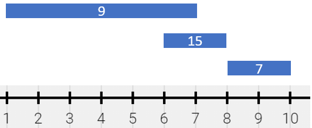
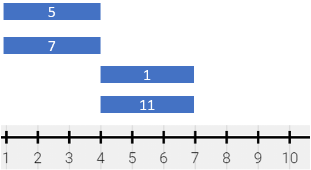

### 1. Description

There is a long and thin painting that can be represented by a number line. The painting was painted with multiple overlapping segments where each segment was painted with a **unique** color. You are given a 2D integer array `segments`, where $\text{segments}[i] = [\text{start}_{i}, \text{end}_{i}, \text{color}_{i}]$ represents the **half-closed segment** $[\text{start}_{i}, \text{end}_{i})$ with $\text{color}_{i}$ as the color.

The colors in the overlapping segments of the painting were **mixed** when it was painted. When two or more colors mix, they form a new color that can be represented as a **set** of mixed colors.

- For example, if colors `2`, `4`, and `6` are mixed, then the resulting mixed color is `{2,4,6}`.

For the sake of simplicity, you should only output the **sum** of the elements in the set rather than the full set.

You want to **describe** the painting with the **minimum** number of non-overlapping **half-closed segments** of these mixed colors. These segments can be represented by the 2D array `painting` where $\text{painting}[j] = [\text{left}_{j}, \text{right}_{j}, \text{mix}_{j}]$ describes a **half-closed segment** $[\text{left}_{j}, \text{right}_{j})$ with the mixed color **sum** of $\text{mix}_{j}$.

- For example, the painting created with $segments = [[1,4,5],[1,7,7]]$ can be described by $painting = [[1,4,12],[4,7,7]]$ because:

		<li>$[1,4)$ is colored `{5,7}` (with a sum of `12`) from both the first and second segments.

- $[4,7)$ is colored `{7}` from only the second segment.

	</li>

Return *the 2D array *`painting`* describing the finished painting (excluding any parts that are **not **painted). You may return the segments in **any order***.

A **half-closed segment** `[a, b)` is the section of the number line between points `a` and `b` **including** point `a` and **not including** point `b`.

### 2. Function Contract

- `n`: Input parameter.
- Returns expected result.

### 3. Examples

#### Example 1

- **Input:** $segments = [[1,4,5],[4,7,7],[1,7,9]]$
- **Output:** `[[1,4,14],[4,7,16]]`
- **Explanation:** The painting can be described as follows:
- [1,4) is colored {5,9} (with a sum of 14) from the first and third segments.
- [4,7) is colored {7,9} (with a sum of 16) from the second and third segments.
#### Example 2

- **Input:** $segments = [[1,7,9],[6,8,15],[8,10,7]]$
- **Output:** `[[1,6,9],[6,7,24],[7,8,15],[8,10,7]]`
- **Explanation:** The painting can be described as follows:
- [1,6) is colored 9 from the first segment.
- [6,7) is colored {9,15} (with a sum of 24) from the first and second segments.
- [7,8) is colored 15 from the second segment.
- [8,10) is colored 7 from the third segment.
#### Example 3

- **Input:** $segments = [[1,4,5],[1,4,7],[4,7,1],[4,7,11]]$
- **Output:** `[[1,4,12],[4,7,12]]`
- **Explanation:** The painting can be described as follows:
- [1,4) is colored {5,7} (with a sum of 12) from the first and second segments.
- [4,7) is colored {1,11} (with a sum of 12) from the third and fourth segments.
Note that returning a single segment [1,7) is incorrect because the mixed color sets are different.

### 4. Constraints

- $1 \le \text{segments.length} \le 2 * 10^{4}$

- $\text{segments}[i].length = 3$

- $1 \le \text{start}_{i} < \text{end}_{i} \le 10^{5}$

- $1 \le \text{color}_{i} \le 10^{9}$

- Each $\text{color}_{i}$ is distinct.