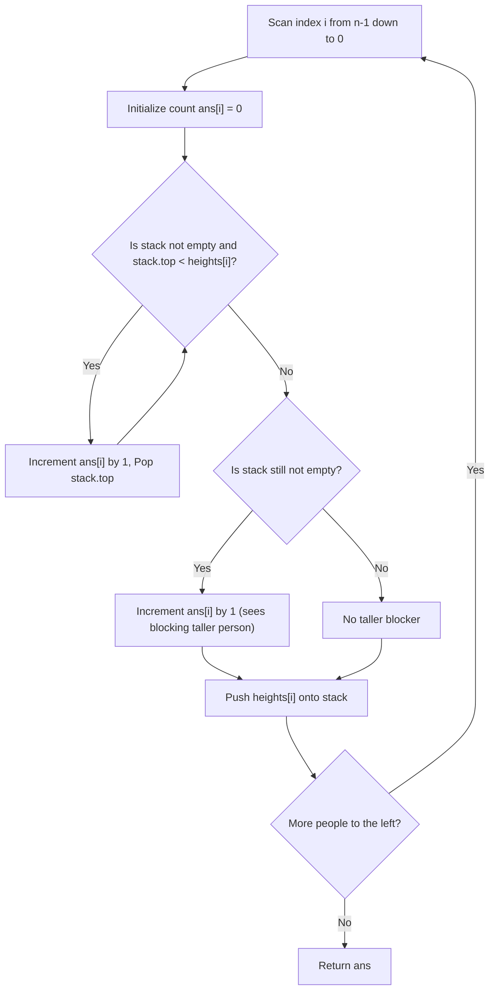

# Guided Example: Number of Visible People in a Queue

We trace monotonic decreasing stack maintenance, line-of-sight obstruction, and backward visibility resolution on representative queue height profiles:

- **Primary Input:** `heights = [10, 6, 8, 5, 11, 9]`
- **Required Output:** `[3, 1, 2, 1, 1, 0]`
- **Ascending Input (Cascade):** `heights = [5, 1, 2, 3, 10]`
- **Required Output:** `[4, 1, 1, 1, 0]`

This instance demonstrates line-of-sight visibility conditions in 1D queues, maintaining a strictly decreasing monotonic stack while scanning from right to left, and achieving optimal $\mathcal{O}(N)$ amortized time.

---

## 1. Instance & Teaching Goal

We are given an array of $n$ people lined up from left to right with distinct heights `heights`.
- Person $i$ can see person $j$ ($i < j$) if and only if everyone standing strictly between them is shorter than both:
  $$\max_{i < k < j} heights[k] < \min(heights[i], heights[j])$$
- Person $i$ looks to the right. We must return an array `ans` where `ans[i]` is the count of people person $i$ can see.

For `heights = [10, 6, 8, 5, 11, 9]`:
- Person 5 ($h = 9$): Standing at the right end. No one to the right $\implies 0$.
- Person 4 ($h = 11$): Sees person 5 ($h = 9$). Person 5 does not block anyone $\implies 1$.
- Person 3 ($h = 5$): Sees person 4 ($h = 11$). Person 4 is taller than person 3 and blocks all vision beyond $\implies 1$.
- Person 2 ($h = 8$):
  - Sees person 3 ($h = 5$).
  - Person 3 is shorter than person 2 ($5 < 8$), so person 2 can also see over person 3 to person 4 ($h = 11$).
  - Person 4 ($h = 11 > 8$) blocks further vision. Total seen: **2**.
- Person 1 ($h = 6$): Sees person 2 ($h = 8 > 6$), which blocks person 4 $\implies 1$.
- Person 0 ($h = 10$):
  - Sees person 1 ($h = 6$).
  - Over person 1, sees person 2 ($h = 8$).
  - Over person 2, sees person 4 ($h = 11$).
  - Person 4 ($11 > 10$) blocks person 5. Total seen: **3**.
- Output: `[3, 1, 2, 1, 1, 0]`.

The teaching goal is to understand **monotonic stack line-of-sight pruning**:
1. Backward traversal from right to left: Maintaining a stack of candidates visible to the current observer.
2. Invariant: The stack maintains strictly decreasing heights from bottom to top.
3. Popping shorter elements: If $h_{\text{top}} < heights[i]$, person $i$ sees $h_{\text{top}}$, and $h_{\text{top}}$ is permanently hidden from anyone further left.
4. Peeking at the first taller element: If the stack remains non-empty, person $i$ sees that taller person, who acts as the ultimate sight blocker.

---

## 2. Conceptual Foundation & Invariants

### Line-of-Sight Monotonic Stack Invariant Theorem

> **Line-of-Sight Monotonic Stack Invariant Theorem.**
> 1. *Sight Obstruction Criterion:* A person $j > i$ is visible to person $i$ if and only if no intervening person $k$ ($i < k < j$) satisfies $heights[k] \ge heights[j]$. Any such intervening taller person completely shadows person $j$ from person $i$.
> 2. *Right-to-Left Monotonic Stack:* When scanning backwards from index $n - 1$ to $0$, maintain a stack $\mathcal{S}$ of heights encountered so far:
>    $$\mathcal{S} = [s_1, s_2, \dots, s_m] \quad \text{with } s_1 > s_2 > \dots > s_m$$
> 3. *Visibility Counting Rules for Person $i$ with height $H = heights[i]$:*
>    - **Shorter Predecessors:** While $\mathcal{S}$ is non-empty and top element $s_{\text{top}} < H$:
>      - Person $i$ can see $s_{\text{top}}$.
>      - Increment $\text{ans}[i] \leftarrow \text{ans}[i] + 1$.
>      - Pop $s_{\text{top}}$ from $\mathcal{S}$ because person $i$ is strictly taller than $s_{\text{top}}$ and closer to any future observer to the left, making $s_{\text{top}}$ permanently invisible to all observers $< i$.
>    - **Blocking Taller Predecessor:** If $\mathcal{S}$ is still non-empty after popping, the new top element $s_{\text{top}} > H$:
>      - Person $i$ can see $s_{\text{top}}$.
>      - Increment $\text{ans}[i] \leftarrow \text{ans}[i] + 1$.
>      - Do not pop $s_{\text{top}}$, because $s_{\text{top}} > H$ can still be seen by a taller person to the left.
> 4. *Stack Push:* Push $H$ onto $\mathcal{S}$. The stack remains strictly decreasing.
> 5. *Amortized Linearity:* Each person is pushed onto the stack exactly once and popped at most once, bounding total operations by $2N = \mathcal{O}(N)$.

---

## 3. Step-by-Step Worked Execution

We trace `heights = [10, 6, 8, 5, 11, 9]`:

---

### Step 1: Index $i = 5$ ($h = 9$)
- Stack is empty.
- Visible count: $\text{ans}[5] = 0$.
- Push $9$: $\mathcal{S} = [9]$.

---

### Step 2: Index $i = 4$ ($h = 11$)
- Top is $9 < 11$.
  - Sees 9: $\text{ans}[4] \leftarrow 0 + 1 = 1$.
  - Pop 9. Stack becomes empty.
- Stack is empty (no taller person).
- Push $11$: $\mathcal{S} = [11]$.
- $\text{ans}[4] = 1$.

---

### Step 3: Index $i = 3$ ($h = 5$)
- Top is $11 > 5$. While loop does not execute.
- Stack is not empty: top is $11$.
  - Sees 11: $\text{ans}[3] \leftarrow 0 + 1 = 1$.
- Push $5$: $\mathcal{S} = [11, 5]$.
- $\text{ans}[3] = 1$.

---

### Step 4: Index $i = 2$ ($h = 8$)
- Top is $5 < 8$.
  - Sees 5: $\text{ans}[2] \leftarrow 0 + 1 = 1$.
  - Pop 5. Stack now $[11]$.
- Top is $11 > 8$. While loop stops.
- Stack is not empty: top is $11$.
  - Sees 11: $\text{ans}[2] \leftarrow 1 + 1 = 2$.
- Push $8$: $\mathcal{S} = [11, 8]$.
- $\text{ans}[2] = 2$.

---

### Step 5: Index $i = 1$ ($h = 6$)
- Top is $8 > 6$. While loop does not execute.
- Stack is not empty: top is $8$.
  - Sees 8: $\text{ans}[1] \leftarrow 0 + 1 = 1$.
- Push $6$: $\mathcal{S} = [11, 8, 6]$.
- $\text{ans}[1] = 1$.

---

### Step 6: Index $i = 0$ ($h = 10$)
- Top is $6 < 10$.
  - Sees 6: $\text{ans}[0] \leftarrow 0 + 1 = 1$. Pop 6. Stack $[11, 8]$.
- Next top is $8 < 10$.
  - Sees 8: $\text{ans}[0] \leftarrow 1 + 1 = 2$. Pop 8. Stack $[11]$.
- Next top is $11 > 10$. While loop stops.
- Stack is not empty: top is $11$.
  - Sees 11: $\text{ans}[0] \leftarrow 2 + 1 = 3$.
- Push $10$: $\mathcal{S} = [11, 10]$.
- $\text{ans}[0] = 3$.

---

### Final Result
$$\text{ans} = [3, 1, 2, 1, 1, 0]$$

---

## 4. Complete Execution Trace

We trace the stack transitions across backward iterations for `heights = [10, 6, 8, 5, 11, 9]`:

| Step $i$ | Person Height $h$ | Popped Elements ($s < h$) | Taller Blocker Seen ($s > h$) | Final Stack $\mathcal{S}$ | Visible Count $\text{ans}[i]$ |
|---|---|---|---|---|---|
| 5 | 9 | None | None | `[9]` | **0** |
| 4 | 11 | `9` ($+1$) | None | `[11]` | **1** |
| 3 | 5 | None | `11` ($+1$) | `[11, 5]` | **1** |
| 2 | 8 | `5` ($+1$) | `11` ($+1$) | `[11, 8]` | **2** |
| 1 | 6 | None | `8` ($+1$) | `[11, 8, 6]` | **1** |
| 0 | 10 | `6` ($+1$), `8` ($+1$) | `11` ($+1$) | `[11, 10]` | **3** |

We compare visibility distributions across contrasting height profiles:

| Height Profile | Pattern | Visible Counts Array | Description |
|---|---|---|---|
| `[10, 6, 8, 5, 11, 9]` | Mixed valleys | `[3, 1, 2, 1, 1, 0]` | Over-the-shoulder visibility over local minima |
| `[5, 1, 2, 3, 10]` | Ascending valley | `[4, 1, 1, 1, 0]` | First person sees all subsequent ascending elements |
| `[5, 4, 3, 2, 1]` | Strictly descending | `[1, 1, 1, 1, 0]` | Each person blocked immediately by next person |
| `[1, 2, 3, 4, 5]` | Strictly ascending | `[1, 1, 1, 1, 0]` | Next person is taller and blocks all further vision |

---

## 5. Algorithmic Correctness

**Soundness.** A person $j > i$ is popped by person $i$ if and only if $heights[j] < heights[i]$ and all people between $i$ and $j$ were already shorter than $heights[j]$ (and hence already popped). Thus person $i$ has an unobstructed line of sight to person $j$. Once popped, person $j$ is shadowed by the taller and closer person $i$, so no person to the left of $i$ can ever see $j$. The first element remaining on the stack that exceeds $heights[i]$ is also visible to $i$ because no intervening person was taller than $heights[i]$; however, that taller person completely obstructs anyone behind them. The count increment is exact.

**Completeness.** Every candidate to the right is either seen and popped, seen as the final blocker, or was already shadowed and popped by an intermediate taller person. Therefore, all visible people are counted without omission.

---

## 6. Traps This Instance Exposes

- **Missing the First Taller Person:** After popping all smaller elements, forgetting to check `if stk: ans[i] += 1` will fail to count the taller person who terminates the line of sight (e.g. person 3 ($h=5$) looking at person 4 ($h=11$)).
- **Quadratic Brute-Force TLE:** For each person $i$, scanning rightward until hitting a taller person takes $\mathcal{O}(N^2)$ time in the worst case (e.g. `[10, 9, 8, ..., 1]`), exceeding the time limit for $N = 10^5$. Monotonic stack ensures $\mathcal{O}(N)$.
- **Direction of Processing:** Scanning left-to-right requires maintaining visible frontiers with complex updates. Scanning right-to-left matches the direction of sight naturally, making the monotonic stack trivial and robust.

---

## 7. Complexity Derivation

- **Time Complexity:** $\mathcal{O}(N)$, where $N = \text{len}(heights)$. Each element is pushed onto the stack exactly once and popped at most once across the entire backward scan.
- **Auxiliary Space Complexity:** $\mathcal{O}(N)$ in the worst case to store the monotonic stack (e.g. strictly descending heights).
