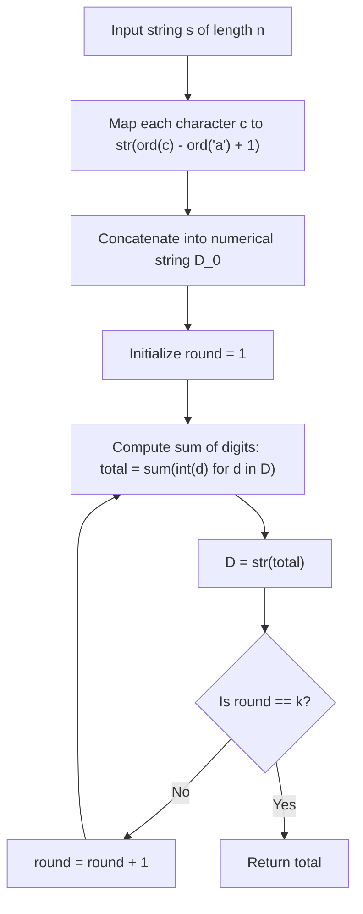

# Guided Example: Sum of Digits of String After Convert

We trace letter-to-alphabet position encoding, multi-digit decimal string expansion, and repeated digital sum transformations on representative string instances:

- **Primary Input:** `s = "leetcode"`, `k = 2`
- **Required Output:** `6`
- **Single-Pass Input:** `s = "iiii"`, `k = 1`
- **Required Output:** `36`
- **Two-Digit Letter Input:** `s = "zbax"`, `k = 2`
- **Required Output:** `8`

This instance demonstrates mapping lowercase English characters into 1-indexed alphabet ranks $1 \dots 26$, string concatenation of variable-length decimal representations, and executing $k$ rounds of digit sum contractions.

---

## 1. Instance & Teaching Goal

We are given a string `s` of lowercase English letters and an integer $k$.
1. **Convert:** Replace each character $c$ with its 1-indexed position in the alphabet: $\text{'a'} \to 1, \dots, \text{'z'} \to 26$. Concatenate these representations into one large numerical string.
2. **Transform:** Sum the decimal digits of the numerical string. Repeat this digit sum operation $k$ times in total.
3. Return the resulting integer.

For `s = "leetcode"` with $k = 2$:
- **Letter Conversion:**
  - `'l'` (12th letter) $\to \text{"12"}$
  - `'e'` (5th letter) $\to \text{"5"}$
  - `'e'` (5th letter) $\to \text{"5"}$
  - `'t'` (20th letter) $\to \text{"20"}$
  - `'c'` (3rd letter) $\to \text{"3"}$
  - `'o'` (15th letter) $\to \text{"15"}$
  - `'d'` (4th letter) $\to \text{"4"}$
  - `'e'` (5th letter) $\to \text{"5"}$
- Concatenated numerical string:
  $$\text{"12552031545"}$$
- **Transform 1 ($k = 1$):**
  $$1 + 2 + 5 + 5 + 2 + 0 + 3 + 1 + 5 + 4 + 5 = 33$$
- **Transform 2 ($k = 2$):**
  $$3 + 3 = 6$$
- Final result: **6**.

The teaching goal is to understand **positional digit expansion and iterative digital contraction**:
1. Mapping ASCII codepoints: $\text{pos}(c) = \text{ord}(c) - \text{ord}('a') + 1$.
2. Handling variable length digits: Letters `'a'` through `'i'` produce 1 digit ($1 \dots 9$), whereas `'j'` through `'z'` produce 2 digits ($10 \dots 26$).
3. Digital sum convergence: After the first transformation, the number shrinks exponentially from length $\le 200$ to at most $200 \times 9 = 1800$, and further transformations complete in near-constant time.

---

## 2. Conceptual Foundation & Invariants

### Digital Root and Contraction Invariant Theorem

> **Digital Root and Contraction Invariant Theorem.**
> 1. *Alphabet Rank Mapping:* The alphabet position function $\phi: \Sigma \to \{1, \dots, 26\}$ is:
>    $$\phi(c) = \text{ord}(c) - \text{ord}(\text{'a'}) + 1$$
> 2. *Base-10 Concatenation:* Let $s = c_1 c_2 \dots c_n$. The converted string $\mathcal{D}_0$ is the decimal concatenation:
>    $$\mathcal{D}_0 = \phi(c_1) \mathbin{\Vert} \phi(c_2) \mathbin{\Vert} \dots \mathbin{\Vert} \phi(c_n)$$
>    Its length satisfies $n \le |\mathcal{D}_0| \le 2n$.
> 3. *Digital Sum Operator:* For any positive integer string $X = d_1 d_2 \dots d_m$, the digital sum operator $\mathcal{S}(X)$ is:
>    $$\mathcal{S}(X) = \sum_{j=1}^m \text{int}(d_j)$$
> 4. *Exponential Contraction Bound:* For $n \le 100$, $|\mathcal{D}_0| \le 200$. The first transformation produces:
>    $$\mathcal{S}(\mathcal{D}_0) \le 200 \times 9 = 1800$$
>    The second transformation produces:
>    $$\mathcal{S}(\mathcal{S}(\mathcal{D}_0)) \le 1 + 9 + 9 + 9 = 28$$
>    Any subsequent transformations remain within $[1, 28]$. For all $k \ge 1$, intermediate numbers comfortably fit within standard machine integer registers.

---

## 3. Step-by-Step Worked Execution

We trace `s = "leetcode"` with $k = 2$:

---

### Step 1: Character Rank Mapping and Concatenation
Calculate position for each letter:
- $c_0 = \text{'l'}: 108 - 97 + 1 = 12 \implies \text{"12"}$
- $c_1 = \text{'e'}: 101 - 97 + 1 = 5 \implies \text{"5"}$
- $c_2 = \text{'e'}: 101 - 97 + 1 = 5 \implies \text{"5"}$
- $c_3 = \text{'t'}: 116 - 97 + 1 = 20 \implies \text{"20"}$
- $c_4 = \text{'c'}: 99 - 97 + 1 = 3 \implies \text{"3"}$
- $c_5 = \text{'o'}: 111 - 97 + 1 = 15 \implies \text{"15"}$
- $c_6 = \text{'d'}: 100 - 97 + 1 = 4 \implies \text{"4"}$
- $c_7 = \text{'e'}: 101 - 97 + 1 = 5 \implies \text{"5"}$

Concatenation:
$$\mathcal{D}_0 = \text{"12552031545"}$$
Total decimal digits: 11.

---

### Step 2: Transformation Round 1 ($k = 1$)
Sum each digit in $\text{"12552031545"}$:
- $1 + 2 = 3$
- $3 + 5 = 8$
- $8 + 5 = 13$
- $13 + 2 = 15$
- $15 + 0 = 15$
- $15 + 3 = 18$
- $18 + 1 = 19$
- $19 + 5 = 24$
- $24 + 4 = 28$
- $28 + 5 = 33$

Result after Round 1: $33$.
Updated string: $\mathcal{D}_1 = \text{"33"}$.

---

### Step 3: Transformation Round 2 ($k = 2$)
Sum each digit in $\text{"33"}$:
- $3 + 3 = 6$.

Result after Round 2: $6$.
Updated string: $\mathcal{D}_2 = \text{"6"}$.

---

### Step 4: Final Output
Both $k = 2$ rounds completed.
Final integer returned: **6**.

---

## 4. Complete Execution Trace

We trace character expansions for `s = "leetcode"`:

| Index | Character $c$ | ASCII Code $\text{ord}(c)$ | Offset from `'a'` (97) | Alphabet Rank $\phi(c)$ | Substring Appended |
|---|---|---|---|---|---|
| 0 | `'l'` | 108 | 11 | 12 | `"12"` |
| 1 | `'e'` | 101 | 4 | 5 | `"5"` |
| 2 | `'e'` | 101 | 4 | 5 | `"5"` |
| 3 | `'t'` | 116 | 19 | 20 | `"20"` |
| 4 | `'c'` | 99 | 2 | 3 | `"3"` |
| 5 | `'o'` | 111 | 14 | 15 | `"15"` |
| 6 | `'d'` | 100 | 3 | 4 | `"4"` |
| 7 | `'e'` | 101 | 4 | 5 | `"5"` |

We track rounds of digital summation across sample inputs:

| Input String $s$ | $k$ | Converted Numerical String $\mathcal{D}_0$ | Round 1 Sum | Round 2 Sum | Output Result |
|---|---|---|---|---|---|
| `"leetcode"` | 2 | `"12552031545"` | 33 | **6** | **6** |
| `"iiii"` | 1 | `"9999"` | **36** | — | **36** |
| `"zbax"` | 2 | `"262124"` | 17 | **8** | **8** |

---

## 5. Algorithmic Correctness

**Soundness.** Each letter is correctly mapped to its 1-indexed position $\text{ord}(c) - \text{ord}(\text{'a'}) + 1$. The first digit sum exhaustively adds all decimal digits of the concatenated sequence. Subsequent iterations compute the sum of digits of the prior integer. Each operation strictly preserves the mathematical definition specified by the problem.

**Completeness.** The loop executes exactly $k$ times. Because digit sums shrink the representation monotonically toward single-digit numbers, each round terminates in finite, deterministic steps, correctly returning the state after round $k$.

---

## 6. Traps This Instance Exposes

- **Single vs. Two-Digit Representation:** Forgetting that letters like `'t'` (20) or `'z'` (26) contribute two separate digits ($2$ and $0$, or $2$ and $6$) to the first sum. You cannot simply sum the ranks $\phi(c)$ directly; you must sum their individual decimal digits. For example, `'t'` contributes $2 + 0 = 2$, not $20$.
- **Large Initial Number Size:** The concatenated string can have length up to $200$. Parsing it directly into a standard 64-bit integer will overflow. Digits must be read directly as characters or iterated without converting the 200-digit string into a single scalar number.
- **Round Parameter $k = 1$:** When $k = 1$, only a single digit-summation round is performed. The code must not perform an extra reduction to a single digit.

---

## 7. Complexity Derivation

- **Time Complexity:** $\mathcal{O}(n + k \log(\text{sum}))$, where $n = \text{len}(s)$. The initial conversion and digit sum pass take $\mathcal{O}(n)$ time. The subsequent $k - 1$ rounds operate on numbers bounded by $1800$, each taking $\mathcal{O}(\log_{10} V) \le 4$ operations. Overall time is linear $\mathcal{O}(n)$.
- **Auxiliary Space Complexity:** $\mathcal{O}(n)$ to store the converted initial decimal string of length at most $2n$.
