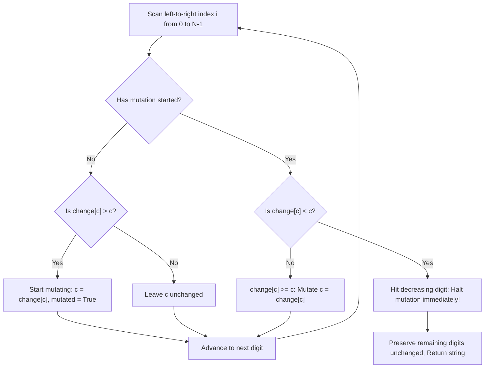

# Guided Example: Largest Number After Mutating Substring

We trace most-significant-digit dominance, contiguous substring mutation boundaries, and greedy left-to-right replacement on representative integer strings:

- **Primary Input:** `num = "132"`, `change = [9, 8, 5, 0, 3, 6, 4, 2, 6, 8]`
- **Required Output:** `"832"`
- **Multi-Digit Extension Input:** `num = "021"`, `change = [9, 4, 3, 5, 7, 2, 1, 9, 0, 6]`
- **Required Output:** `"934"`
- **Unmutated Input (Boundary):** `num = "5"`, `change = [1, 4, 7, 5, 3, 2, 5, 6, 9, 4]`
- **Required Output:** `"5"`

This instance demonstrates exploiting positional notation where higher-order digits strictly dominate lower-order digits, identifying the earliest strictly improving index to start the mutation interval, extending across non-decreasing replacement mappings ($change[d] \ge d$), and halting immediately upon encountering a decreasing replacement.

---

## 1. Instance & Teaching Goal

We are given a string `num` representing a large non-negative integer and an array `change` of length 10 where `change[d]` is the digit that replaces $d$. We may choose to mutate **at most one contiguous substring** of `num` by replacing each digit $d$ in that substring with `change[d]`. We seek the lexicographically largest integer string achievable.

For `num = "132"` with `change = [9, 8, 5, 0, 3, 6, 4, 2, 6, 8]`:
- Digit at index 0 is `'1'`. Replacement is $change[1] = 8$.
  - Since $8 > 1$, replacing index 0 increases the overall number from the $10^2$ place.
  - We begin the contiguous mutation interval at index 0: `num[0]` becomes `'8'`.
- Digit at index 1 is `'3'`. Replacement is $change[3] = 0$.
  - Since $0 < 3$, replacing index 1 would reduce the tens digit from 3 to 0, decreasing the number.
  - Because mutations must form a single contiguous substring, we must terminate the mutation window immediately before index 1.
- Digit at index 2 (`'2'`) remains untouched.
- Output: `"832"`.

For `num = "021"` with `change = [9, 4, 3, 5, 7, 2, 1, 9, 0, 6]`:
- Index 0: `'0' \to change[0] = 9 > 0 \implies` mutate to `'9'`.
- Index 1: `'2' \to change[2] = 3 > 2 \implies` mutate to `'3'`.
- Index 2: `'1' \to change[1] = 4 > 1 \implies` mutate to `'4'`.
- Output: `"934"`.

The teaching goal is to understand **lexicographical positional dominance and contiguous interval stopping rules**:
1. Why positional notation guarantees that increasing digit $i$ produces a larger value than any combination of changes strictly to the right of $i$.
2. Finding the earliest index $i$ where $change[num[i]] > num[i]$ to anchor the left boundary.
3. Propagating the mutation across neutral transitions ($change[num[j]] == num[j]$) to bridge toward subsequent strictly advantageous digits.
4. Enforcing the strict termination barrier: stopping the moment $change[num[j]] < num[j]$ is encountered.

---

## 2. Conceptual Foundation & Invariants

### Most Significant Digit Dominance Theorem

> **Most Significant Digit Dominance Theorem.**
> 1. *Positional Significance:* For any decimal string $A$ of length $N$, an increase at index $i$ from $d$ to $d'$ ($d' > d$) increases the numeric value by:
>    $$\Delta_i = (d' - d) \cdot 10^{N - 1 - i} \ge 10^{N - 1 - i}$$
>    The maximum possible subsequent loss from mutating all lower-order positions $j > i$ to $0$ is:
>    $$\sum_{j=i+1}^{N-1} 9 \cdot 10^{N - 1 - j} = 10^{N - 1 - i} - 1 < \Delta_i$$
>    Therefore, any mutation that increases the earliest possible digit is strictly superior to any mutation that leaves that digit untouched.
> 2. *Contiguous Interval Invariant:* The mutated region must form an interval $[L, R]$.
>    - **Left Boundary $L$:** The smallest index such that $change[num[L]] > num[L]$. If no such index exists, the optimal mutation is the empty substring (return `num` unchanged).
>    - **Right Boundary $R$:** The largest index $R \ge L$ such that for all $k \in [L, R]$, $change[num[k]] \ge num[k]$.
> 3. *Stopping Condition:* At the earliest index $R + 1$ where $change[num[R+1]] < num[R+1]$, mutating $R+1$ would decrease the overall number. Because the substring must be contiguous, the mutation window cannot skip $R+1$; it must terminate at $R$.

---

## 3. Step-by-Step Worked Execution

We trace `num = "132"` with `change = [9, 8, 5, 0, 3, 6, 4, 2, 6, 8]`:

---

### Step 1: Scan Index $i = 0$ (`c = '1'`)
- Current digit: $1$.
- Replacement: $change[1] = 8$.
- Comparison: $8 > 1$.
- Action: Strictly increases value at $10^2$ position.
- State: Start mutation interval. Set `changed = True`.
- New character at index 0: `'8'`.
- Running string: `"832"`.

---

### Step 2: Scan Index $i = 1$ (`c = '3'`)
- Current digit: $3$.
- Replacement: $change[3] = 0$.
- Comparison: $0 < 3$.
- State check: `changed` is currently `True`.
- Evaluation: Mutating index 1 would decrease the tens digit from 3 to 0.
- Rule: Since the mutation must be contiguous, we cannot skip index 1 to mutate later indices.
- Action: Break loop immediately.
- Mutation window $[0, 0]$ terminates.

---

### Step 3: Remaining Characters ($i = 2$)
- Character `'2'` at index 2 remains untouched.

---

### Final Result
$$\text{Output} = \text{"832"}$$

---

## 4. Complete Execution Trace

We trace character evaluations across candidate positions for `num = "132"`:

| Index $i$ | Current Digit $c$ | Replacement $change[c]$ | Comparison | Mutation Active? | Action Taken | Resulting Prefix |
|---|---|---|---|---|---|---|
| 0 | `'1'` | 8 | $8 > 1$ | No $\to$ **Starts** | Mutate to `'8'` | `"8"` |
| 1 | `'3'` | 0 | $0 < 3$ | Yes $\to$ **Halts** | Stop mutation | `"83"` |
| 2 | `'2'` | 2 | — | Inactive | Retain original | `"832"` |

We contrast greedy mutation behavior across sample inputs:

| Input `num` | Mapping `change` | Start Index $L$ | Stop Index $R$ | Mutated Substring | Final Output |
|---|---|---|---|---|---|
| `"132"` | `[9,8,5,0,3,6,4,2,6,8]` | 0 | 0 | `"1" \to "8"` | **"832"** |
| `"021"` | `[9,4,3,5,7,2,1,9,0,6]` | 0 | 2 | `"021" \to "934"` | **"934"** |
| `"5"` | `[1,4,7,5,3,2,5,6,9,4]` | None | None | None | **"5"** |
| `"334"`, change `'3' \to 3, '4' \to 5` | Custom | 2 | 2 | `"4" \to "5"` | **"335"** |

---

## 5. Algorithmic Correctness

**Soundness.** Suppose an optimal solution mutates interval $[L^*, R^*]$. Because higher-order digits strictly outweigh any combination of lower-order digits, $L^*$ must be the earliest position where a strictly beneficial change can occur. Once the mutation begins, every step with $change[d] \ge d$ either strictly improves or preserves the number's magnitude without introducing decreases. Terminating the moment $change[d] < d$ is encountered prevents introducing any value deficit at that position.

**Completeness.** Since the algorithm evaluates candidate starting positions from left to right, the first qualifying index $L$ is uniquely identified. Extending as far right as possible while $change[d] \ge d$ guarantees that the maximal valid substring is chosen.

---

## 6. Traps This Instance Exposes

- **Equal Replacement Continuations ($change[d] == d$):** If $num[k] = 3$ and $change[3] = 3$, mutating does not change the digit value, but it *bridges* the contiguous substring to subsequent positions that might strictly improve (e.g. $num = \text{"334"}$ where $change[3] = 3, change[4] = 5 \implies \text{"335"}$). Halting on equality would forfeit later gains. Only strictly smaller replacements ($change[d] < d$) mandate halting.
- **Premature Reset:** Thinking one can start a second mutation window later in the string violates the "at most one contiguous substring" rule.
- **Starting on Neutral Digits:** Starting the mutation on a digit where $change[d] == d$ before any strict improvement is unnecessary, though harmless if it immediately connects to an improvement. The standard left-to-right search begins at the first *strict* increase ($change[d] > d$).

---

## 7. Complexity Derivation

- **Time Complexity:** $\mathcal{O}(N)$, where $N = \text{len}(num)$. A single linear pass scans digits from left to right, performing $\mathcal{O}(1)$ array lookups per digit.
- **Auxiliary Space Complexity:** $\mathcal{O}(N)$ to store the mutable character list or output string.
