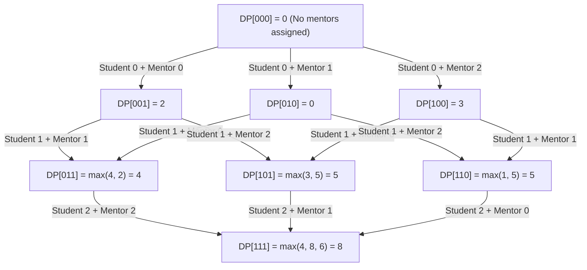

# Guided Example: Maximum Compatibility Score Sum

We analyze and execute the bitmask dynamic programming algorithm for finding the maximum weight bipartite matching between students and mentors on a representative instance.

- **Students ($M = 3, Q = 3$):**
  - Student 0: `[1, 1, 0]`
  - Student 1: `[1, 0, 1]`
  - Student 2: `[0, 0, 1]`
- **Mentors ($M = 3, Q = 3$):**
  - Mentor 0: `[1, 0, 0]`
  - Mentor 1: `[0, 0, 1]`
  - Mentor 2: `[1, 1, 0]`
- **Expected Output:** `8`

---

## 1. Instance & Intuition

We have $M$ students and $M$ mentors, each of whom answered $Q$ binary questions. A student-mentor pair $(i, j)$ earns a compatibility score equal to the number of question positions $k \in \{0, \dots, Q-1\}$ where their answers match:
$$C[i][j] = \sum_{k=0}^{Q-1} \mathbb{I}(\text{students}[i][k] = \text{mentors}[j][k])$$

Our objective is to find a bijection $\pi: \{0, \dots, M-1\} \to \{0, \dots, M-1\}$ maximizing the sum:
$$\sum_{i=0}^{M-1} C[i][\pi(i)]$$

Because $M \le 8$, the total number of permutations $M! \le 8! = 40{,}320$. Rather than evaluating permutations or exploring a naive search tree with duplicate subtrees, we observe optimal substructure: when matching student $i$, which mentors were assigned to previous students matters, but the exact pairing among earlier students does not. The set of used mentors completely captures the subproblem state.

---

## 2. Mathematical Formalism & State Space

Let an integer bitmask $S \subseteq \{0, \dots, M-1\}$ represent the subset of mentors assigned so far. The number of assigned students is strictly determined by the size of the subset, $i = |S| = \text{popcount}(S)$.

We define $DP[S]$ as the maximum total compatibility score achievable by matching the first $|S|$ students (indices $0, \dots, |S|-1$) to the distinct subset of mentors in $S$.

### Recurrence Relation

For a state $S$ with $|S| > 0$, student $i = |S| - 1$ must be paired with some mentor $j \in S$. Transitioning from subproblem $S \setminus \{j\}$:
$$DP[S] = \max_{j \in S} \Big( DP[S \setminus \{j\}] + C[|S|-1][j] \Big)$$

- **Base Case:** $DP[\emptyset] = DP[0] = 0$.
- **Target Value:** $DP[\{0, \dots, M-1\}] = DP[2^M - 1]$.

---

## 3. Step-by-Step State Evolution

### Precomputing Compatibility Scores

We compute the pair score matrix $C[i][j]$ for all $i, j \in \{0, 1, 2\}$:

| Student $i$ | Answers | Mentor 0 `[1, 0, 0]` | Mentor 1 `[0, 0, 1]` | Mentor 2 `[1, 1, 0]` |
|---|---|---|---|---|
| Student 0 | `[1, 1, 0]` | 2 (pos 0, 2 match) | 0 (0 matches) | 3 (pos 0, 1, 2 match) |
| Student 1 | `[1, 0, 1]` | 2 (pos 0, 1 match) | 2 (pos 1, 2 match) | 1 (pos 0 matches) |
| Student 2 | `[0, 0, 1]` | 1 (pos 1 matches) | 3 (pos 0, 1, 2 match) | 0 (0 matches) |

### Layer $k = 0$: Base State

- $DP[000_2] = 0$ (0 students, 0 mentors assigned).

### Layer $k = 1$: Assigning Student 0 ($|S| = 1$)

We iterate through all singleton mentor masks:
- Mask $001_2$ (Mentor 0): $DP[001_2] = DP[000_2] + C[0][0] = 0 + 2 = 2$.
- Mask $010_2$ (Mentor 1): $DP[010_2] = DP[000_2] + C[0][1] = 0 + 0 = 0$.
- Mask $100_2$ (Mentor 2): $DP[100_2] = DP[000_2] + C[0][2] = 0 + 3 = 3$.

### Layer $k = 2$: Assigning Student 1 ($|S| = 2$)

Each 2-mentor state considers which mentor was matched with Student 1:
- Mask $011_2$ (Mentors 0, 1):
  - Mentor 1 to Student 1: $DP[001_2] + C[1][1] = 2 + 2 = 4$.
  - Mentor 0 to Student 1: $DP[010_2] + C[1][0] = 0 + 2 = 2$.
  - $DP[011_2] = \max(4, 2) = 4$.
- Mask $101_2$ (Mentors 0, 2):
  - Mentor 2 to Student 1: $DP[001_2] + C[1][2] = 2 + 1 = 3$.
  - Mentor 0 to Student 1: $DP[100_2] + C[1][0] = 3 + 2 = 5$.
  - $DP[101_2] = \max(3, 5) = 5$.
- Mask $110_2$ (Mentors 1, 2):
  - Mentor 2 to Student 1: $DP[010_2] + C[1][2] = 0 + 1 = 1$.
  - Mentor 1 to Student 1: $DP[100_2] + C[1][1] = 3 + 2 = 5$.
  - $DP[110_2] = \max(1, 5) = 5$.

### Layer $k = 3$: Assigning Student 2 ($|S| = 3$)

Terminal mask $111_2$ (Mentors 0, 1, 2) has 3 candidate transitions for Student 2:
- Mentor 2 to Student 2: $DP[011_2] + C[2][2] = 4 + 0 = 4$.
- Mentor 1 to Student 2: $DP[101_2] + C[2][1] = 5 + 3 = 8$.
- Mentor 0 to Student 2: $DP[110_2] + C[2][0] = 5 + 1 = 6$.
- $DP[111_2] = \max(4, 8, 6) = 8$.

---

## 4. Execution Trace Table

The table below catalogs each mask evaluated in topological order of set cardinality:

| Step | Mask Binary | Mentors Assigned | $|S|$ | Student Matched | Candidate Predecessor States | Optimal Value | Running Best |
|---|---|---|---|---|---|---|---|
| 0 | $000_2$ | None | 0 | None | Base initialization | 0 | 0 |
| 1 | $001_2$ | {0} | 1 | Student 0 | $DP[000] + C[0][0] = 0 + 2 = 2$ | 2 | 2 |
| 2 | $010_2$ | {1} | 1 | Student 0 | $DP[000] + C[0][1] = 0 + 0 = 0$ | 0 | 0 |
| 3 | $100_2$ | {2} | 1 | Student 0 | $DP[000] + C[0][2] = 0 + 3 = 3$ | 3 | 3 |
| 4 | $011_2$ | {0, 1} | 2 | Student 1 | $\max(2+2, 0+2) = \max(4, 2)$ | 4 | 4 |
| 5 | $101_2$ | {0, 2} | 2 | Student 1 | $\max(2+1, 3+2) = \max(3, 5)$ | 5 | 5 |
| 6 | $110_2$ | {1, 2} | 2 | Student 1 | $\max(0+1, 3+2) = \max(1, 5)$ | 5 | 5 |
| 7 | $111_2$ | {0, 1, 2} | 3 | Student 2 | $\max(4+0, 5+3, 5+1) = \max(4, 8, 6)$ | 8 | 8 |

---

## 5. Algorithmic Correctness & Soundness

**Soundness.** Suppose towards contradiction that an optimal matching assigns subset $S$ to the first $k$ students, but achieves total compatibility strictly greater than $DP[S]$. By peeling off the assignment $(k-1, j)$ for the $k$-th student, the remaining assignment matches the first $k-1$ students to $S \setminus \{j\}$. By induction on subset size, the subproblem score cannot exceed $DP[S \setminus \{j\}]$. Hence the total score cannot exceed $DP[S \setminus \{j\}] + C[k-1][j] \le DP[S]$, establishing contradiction.

**Completeness.** Topological evaluation ordered by mask integer value (or bit count) ensures every subproblem $S \setminus \{j\}$ is finalized before $S$ is computed. Every valid one-to-one assignment corresponds to a path in this DAG from $0$ to $2^M - 1$, guaranteeing that no configuration is omitted.

---

## 6. Edge Cases & Traps

- **Disjoint Compatibility:** When answers never match ($C[i][j] = 0$ everywhere), every state evaluates to 0. Correct base case $DP[0] = 0$ ensures valid propagation without indexing errors.
- **Topological Order:** If masks are iterated arbitrarily instead of by bitcount or standard increasing integer order, a mask could read uncomputed predecessor entries. Iterating integer $mask$ from $0$ to $2^M - 1$ is naturally topological because removing any bit yields a strictly smaller integer ($S \setminus \{j\} < S$).
- **Subproblem State Definition:** Associating students with bitmask bits while iterating mentors is also possible, but keeping students ordered $0 \dots M-1$ and mentors in the bitmask aligns the recurrence directly with $|S|$.

---

## 7. Complexity Analysis

- **Time Complexity:** 
  - Compatibility matrix precomputation: $\mathcal{O}(M^2 \cdot Q)$ bit comparisons.
  - DP evaluation: There are $2^M$ states. For each state $S$ with $|S| = k$, we evaluate $|S| \le M$ incoming transitions.
  - Total DP time: $\sum_{k=1}^M \binom{M}{k} \cdot k = M \cdot 2^{M-1} = \mathcal{O}(M \cdot 2^M)$.
  - With $M \le 8, Q \le 8$, operations are bounded by $8 \cdot 2^7 = 1{,}024$, taking well under 1 millisecond.
- **Auxiliary Space Complexity:** $\mathcal{O}(2^M)$ array space to store the memoized values for each subset, which requires only $2^8 = 256$ entries.