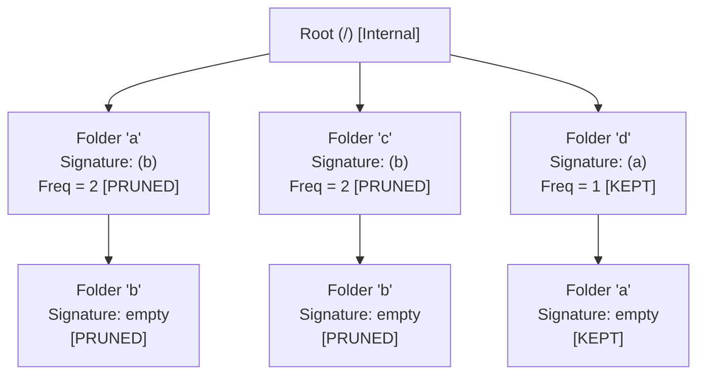

# Guided Example: Delete Duplicate Folders in System

We trace and analyze the subtree serialization and Merkle-style hashing algorithm on a representative directory tree to identify and prune duplicate folder subtrees in a file system.

- **Input:**
  `paths = [["a"], ["c"], ["d"], ["a", "b"], ["c", "b"], ["d", "a"]]`
- **Expected Output:**
  `[["d"], ["d", "a"]]`

---

## 1. Instance & Intuition

In a hierarchical file system, two folders are defined as identical if and only if:
1. They each contain a non-empty set of child subfolders.
2. Their child subfolders have identical names and identical recursive subtree structures.

Crucially:
- A folder's own name does **not** matter when comparing subfolder structures (e.g., folder `a` containing `b` and folder `c` containing `b` have identical subfolder layouts).
- Empty leaf folders cannot be considered identical or marked for deletion; only folders containing non-empty identical subfolder structures are marked.
- Deletion is performed simultaneously in a single pass. Folders that become identical only as a result of pruning earlier duplicates are preserved.

In our input:
- Root `/` contains three top-level directories: `a`, `c`, and `d`.
- Directory `a` contains child directory `b`.
- Directory `c` contains child directory `b`.
- Directory `d` contains child directory `a`.
- The leaves `a/b`, `c/b`, and `d/a` have no children.

Both `a` and `c` have exactly one child `b` with an empty subfolder tree. Their subfolder structures are identical. Thus `a` and `c` (along with their subtrees `a/b` and `c/b`) must be deleted. Directory `d` has child `a`, which is unique across the entire file system. Hence `d` and `d/a` survive.

---

## 2. Mathematical Formalism & State Space

We model the directory hierarchy as a rooted trie (or tree) $T = (V, E)$, where each node $u \in V$ represents a directory with name $\text{name}(u)$, and directed edges point to child subfolders.

### Post-Order Subtree Signature

For each node $u$, let $\text{children}(u) = (v_1, v_2, \dots, v_k)$ be its children sorted lexicographically by name ($\text{name}(v_1) < \text{name}(v_2) < \dots < \text{name}(v_k)$).

We define the subfolder serialization function $\sigma(u)$ recursively:
$$\sigma(u) = \begin{cases} 
\varepsilon & \text{if } \text{children}(u) = \emptyset \\
\sum_{i=1}^k \Big( \texttt{"("} + \text{name}(v_i) + \sigma(v_i) + \texttt{")"} \Big) & \text{if } \text{children}(u) \neq \emptyset
\end{cases}$$

Here $\varepsilon$ is the empty string, and concatenation is denoted by $+$. 

Notice that $\sigma(u)$ encodes only the names and serialized subtrees of its descendants, omitting $\text{name}(u)$. Consequently, two distinct nodes $u_1 \neq u_2$ have identical subfolder structures if and only if:
$$\sigma(u_1) = \sigma(u_2) \neq \varepsilon$$

---

## 3. Step-by-Step State Evolution

### Phase 1: Trie Construction

We insert each path into the trie rooted at `/`:
- Insert `["a"]` $\to$ creates node `/a`.
- Insert `["c"]` $\to$ creates node `/c`.
- Insert `["d"]` $\to$ creates node `/d`.
- Insert `["a", "b"]` $\to$ creates node `/a/b`.
- Insert `["c", "b"]` $\to$ creates node `/c/b`.
- Insert `["d", "a"]` $\to$ creates node `/d/a`.

### Phase 2: Post-Order DFS and Serialization

We compute $\sigma(u)$ from the leaves upward to the root:

1. **Leaf `/a/b`:** Has no children. $\sigma(/a/b) = \varepsilon$.
2. **Node `/a`:** Child is `b` with $\sigma = \varepsilon$.
   $$\sigma(/a) = \texttt{"(b)"}$$
   Frequency map updates: $\text{Freq}[\texttt{"(b)"}] = 1$.
3. **Leaf `/c/b`:** Has no children. $\sigma(/c/b) = \varepsilon$.
4. **Node `/c`:** Child is `b` with $\sigma = \varepsilon$.
   $$\sigma(/c) = \texttt{"(b)"}$$
   Frequency map updates: $\text{Freq}[\texttt{"(b)"}] = 2$.
5. **Leaf `/d/a`:** Has no children. $\sigma(/d/a) = \varepsilon$.
6. **Node `/d`:** Child is `a` with $\sigma = \varepsilon$.
   $$\sigma(/d) = \texttt{"(a)"}$$
   Frequency map updates: $\text{Freq}[\texttt{"(a)"}] = 1$.

### Phase 3: Marking Duplicates

We inspect each node $u$ with $\sigma(u) \neq \varepsilon$:
- Node `/a`: $\sigma(/a) = \texttt{"(b)"}$. Since $\text{Freq}[\texttt{"(b)"}] = 2 > 1$, mark `/a` as **Duplicate**.
- Node `/c`: $\sigma(/c) = \texttt{"(b)"}$. Since $\text{Freq}[\texttt{"(b)"}] = 2 > 1$, mark `/c` as **Duplicate**.
- Node `/d`: $\sigma(/d) = \texttt{"(a)"}$. Since $\text{Freq}[\texttt{"(a)"}] = 1$, node `/d` is **Unique**.

### Phase 4: Pre-Order Extraction

We traverse from the root `/`:
- Visit child `a`: Marked duplicate. **Prune** entire subtree (ignore `a` and `a/b`).
- Visit child `c`: Marked duplicate. **Prune** entire subtree (ignore `c` and `c/b`).
- Visit child `d`: Not marked. Emit path `["d"]`.
  - Recurse to child `a` of `d`: Not marked. Emit path `["d", "a"]`.
- Output paths: `[["d"], ["d", "a"]]`.

---

## 4. Execution Trace Table

| Node Path | Children (Sorted) | Child Signatures | Computed Signature $\sigma(u)$ | Global Signature Frequency | Duplicate Status |
|---|---|---|---|---|---|
| `/a/b` | None | None | $\varepsilon$ | N/A (Empty leaf) | Retained via parent |
| `/c/b` | None | None | $\varepsilon$ | N/A (Empty leaf) | Retained via parent |
| `/d/a` | None | None | $\varepsilon$ | N/A (Empty leaf) | Retained via parent |
| `/a` | `[b]` | `b: ""` | `"(b)"` | 2 | Marked for deletion |
| `/c` | `[b]` | `b: ""` | `"(b)"` | 2 | Marked for deletion |
| `/d` | `[a]` | `a: ""` | `"(a)"` | 1 | Preserved |

| Extraction Step | Traversal Stack | Node Examined | Node Status | Action Taken | Accumulated Paths |
|---|---|---|---|---|---|
| 1 | `[/]` | `/` | Root | Enumerate children `[a, c, d]` | `[]` |
| 2 | `[/, a]` | `/a` | Duplicate | Skip node and subtree | `[]` |
| 3 | `[/, c]` | `/c` | Duplicate | Skip node and subtree | `[]` |
| 4 | `[/, d]` | `/d` | Preserved | Append `["d"]`, visit children | `[["d"]]` |
| 5 | `[/, d, a]` | `/d/a` | Preserved | Append `["d", "a"]` | `[["d"], ["d", "a"]]` |

---

## 5. Algorithmic Correctness & Soundness

**Soundness.** Suppose two nodes $u$ and $v$ have identical non-empty subfolder structures. By definition, they must have the same set of child names $C = \{n_1, \dots, n_k\}$ and for each name $n_i$, the child subtrees $u.c_i$ and $v.c_i$ must be isomorphic. By structural induction on tree height, their post-order serializations $\sigma(u.c_i)$ and $\sigma(v.c_i)$ are identical. Sorting children lexicographically ensures canonical order of parenthetical blocks, yielding $\sigma(u) = \sigma(v)$. Conversely, because parentheses enclose each child's name and full serialization unambiguously, the encoding is injective. Therefore, $\sigma(u) = \sigma(v)$ holds if and only if the subtrees are structurally isomorphic.

**Completeness.** Marking occurs strictly on nodes where $\text{Freq}[\sigma(u)] > 1$. Filtering during pre-order DFS prunes the entire subtree beneath any duplicate ancestor. Every folder that is neither a duplicate nor a descendant of a duplicate is reached and emitted, ensuring all surviving paths are recovered without omissions.

---

## 6. Edge Cases & Traps

- **Empty Folder Fallacy:** If leaf folders with $\sigma = \varepsilon$ were counted in the frequency table, all leaf folders in the entire file system would be considered duplicates of each other and erroneously erased. Empty folders must be explicitly excluded from duplicate detection ($\sigma(u) \neq \varepsilon$).
- **Node Name Interference:** Including the node's own name $\text{name}(u)$ in its own serialization $\sigma(u)$ would prevent `/a` and `/c` from matching, because their strings would begin with `a` and `c` respectively. Only descendant names belong in the subfolder signature.
- **Child Ordering Invariance:** If children are serialized without lexicographical sorting, two folders with children `["x", "y"]` and `["y", "x"]` would generate different strings `(x)(y)` and `(y)(x)`, causing false negatives. Sorting children guarantees canonical representation.
- **Cascading Deletion Fallacy:** The problem specification explicitly states that marking occurs in a single simultaneous step. One must not iteratively recompute signatures or prune folders that become identical after the first deletion pass.

---

## 7. Complexity Analysis

- **Time Complexity:**
  - Let $N$ be the number of paths and $L$ be the maximum depth of a path. Let $F \le N \cdot L$ be the total number of distinct folder nodes in the trie.
  - Trie construction takes $\mathcal{O}(\sum |path|)$ time.
  - Post-order serialization visits each node once. At each node, sorting children by name takes $\mathcal{O}(k \log k)$ where $k$ is the out-degree.
  - String concatenation or polynomial rolling hashing takes time proportional to the length of serialized structures. With hashing or string intern pools, total time is bounded by $\mathcal{O}(F \cdot S_{name})$, where $S_{name} \le 10$ is the max directory name length.
  - Overall time complexity is linear in input size: $\mathcal{O}(F \cdot L)$.
- **Auxiliary Space Complexity:**
  - Trie representation requires $\mathcal{O}(F)$ nodes.
  - Storing subtree signatures in the hash table takes $\mathcal{O}(F \cdot L)$ string space.
  - The recursion stack for DFS is bounded by tree depth $\mathcal{O}(L)$.
  - Total auxiliary space is $\mathcal{O}(F \cdot L)$.
