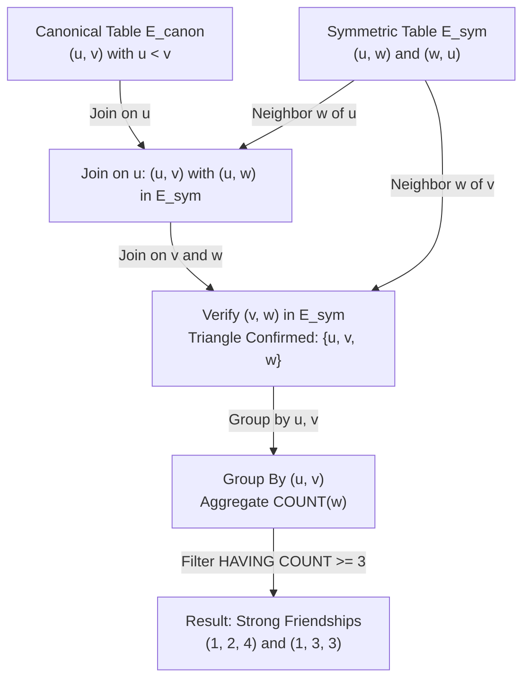

# Guided Example: Strong Friendship

We examine and execute the relational triangle-counting and neighborhood intersection method on a representative social graph to identify all pairs of friends who share at least three common friends.

- **Friendship Table ($E = 12$ edges):**
  - `(1, 2)`, `(1, 3)`, `(2, 3)`, `(1, 4)`, `(2, 4)`, `(1, 5)`, `(2, 5)`, `(1, 6)`, `(2, 6)`, `(3, 6)`, `(1, 7)`, `(3, 7)`
- **Expected Output:**
  - `(1, 2, 4)`
  - `(1, 3, 3)`

---

## 1. Instance & Intuition

In social network analysis, a friendship between two users $u$ and $v$ is classified as "strong" if they have a substantial shared peer group—specifically, at least three mutual friends.

A mutual friend $w$ forms a triangle $(u, v, w)$ in the undirected graph:
1. $u$ is connected to $v$ (the baseline edge $(u, v) \in E$).
2. $u$ is connected to $w$ (edge $(u, w) \in E$).
3. $v$ is connected to $w$ (edge $(v, w) \in E$).

The challenge arises from the database schema: friendships are stored undirected but represented canonically with $user1\_id < user2\_id$. If we only search for $u < w < v$ or $w > v$, we risk missing common friends whose IDs are ordered differently (for instance, $w < u < v$ or $u < v < w$).

To evaluate every mutual friend correctly without asymmetric case branching, we first project the canonically ordered table into a symmetric bidirectional edge set, then perform an equijoin to intersect open neighborhoods of each existing friendship edge.

---

## 2. Mathematical Formalism & State Space

Let the input table be $E_{canon} = \{(u, v) \mid u < v \text{ and } \{u, v\} \in E\}$.

### 1. Symmetric Edge Closure

We construct the full bidirectional edge relation $E_{sym}$:
$$E_{sym} = E_{canon} \cup \{(v, u) \mid (u, v) \in E_{canon}\}$$

For any user $x$, its open neighborhood is:
$$N(x) = \{y \mid (x, y) \in E_{sym}\}$$

### 2. Common Friends Formulation

For any existing friendship $(u, v) \in E_{canon}$, a user $w$ is a common friend if:
$$w \in N(u) \cap N(v)$$

Notice that $w \neq u$ and $w \neq v$ because the graph contains no self-loops ($(x, x) \notin E_{sym}$).

The common friend count for the edge is:
$$c(u, v) = |N(u) \cap N(v)| = \sum_{w} \mathbb{I}\Big((u, w) \in E_{sym} \wedge (v, w) \in E_{sym}\Big)$$

### 3. Filter Criterion

We select and return all tuples $(u, v, c(u, v))$ satisfying:
$$(u, v) \in E_{canon} \quad \text{and} \quad c(u, v) \ge 3$$

---

## 3. Step-by-Step State Evolution

### Step 1: Symmetric Edge Construction ($E_{sym}$)

We duplicate each pair in reverse order so every undirected edge appears in both directions:

| Canonical Edge $(u, v)$ | Reverse Edge $(v, u)$ |
|---|---|
| $(1, 2)$ | $(2, 1)$ |
| $(1, 3)$ | $(3, 1)$ |
| $(2, 3)$ | $(3, 2)$ |
| $(1, 4)$ | $(4, 1)$ |
| $(2, 4)$ | $(4, 2)$ |
| $(1, 5)$ | $(5, 1)$ |
| $(2, 5)$ | $(5, 2)$ |
| $(1, 6)$ | $(6, 1)$ |
| $(2, 6)$ | $(6, 2)$ |
| $(3, 6)$ | $(6, 3)$ |
| $(1, 7)$ | $(7, 1)$ |
| $(3, 7)$ | $(7, 3)$ |

Total rows in $E_{sym} = 2 \times 12 = 24$.

### Step 2: Neighborhood Extraction

We compute the neighbor set $N(x)$ for each relevant node:
- $N(1) = \{2, 3, 4, 5, 6, 7\}$
- $N(2) = \{1, 3, 4, 5, 6\}$
- $N(3) = \{1, 2, 6, 7\}$
- $N(4) = \{1, 2\}$
- $N(5) = \{1, 2\}$
- $N(6) = \{1, 2, 3\}$
- $N(7) = \{1, 3\}$

### Step 3: Candidate Edge Intersection

We evaluate each canonical edge $(u, v) \in E_{canon}$:

1. **Edge $(1, 2)$:**
   $$N(1) \cap N(2) = \{2, 3, 4, 5, 6, 7\} \cap \{1, 3, 4, 5, 6\} = \{3, 4, 5, 6\}$$
   Count: $4 \ge 3 \implies$ **Qualifies as Strong Friendship!**

2. **Edge $(1, 3)$:**
   $$N(1) \cap N(3) = \{2, 3, 4, 5, 6, 7\} \cap \{1, 2, 6, 7\} = \{2, 6, 7\}$$
   Count: $3 \ge 3 \implies$ **Qualifies as Strong Friendship!**

3. **Edge $(2, 3)$:**
   $$N(2) \cap N(3) = \{1, 3, 4, 5, 6\} \cap \{1, 2, 6, 7\} = \{1, 6\}$$
   Count: $2 < 3 \implies$ Disqualified.

4. **Edges with Node 4, 5, or 7:**
   - For $(1, 4)$: $N(1) \cap N(4) = \{2\}$, count $= 1 < 3$.
   - For $(2, 4)$: $N(2) \cap N(4) = \{1\}$, count $= 1 < 3$.
   - For $(1, 5)$: $N(1) \cap N(5) = \{2\}$, count $= 1 < 3$.
   - For $(2, 5)$: $N(2) \cap N(5) = \{1\}$, count $= 1 < 3$.
   - For $(1, 7)$: $N(1) \cap N(7) = \{3\}$, count $= 1 < 3$.
   - For $(3, 7)$: $N(3) \cap N(7) = \{1\}$, count $= 1 < 3$.

5. **Edges with Node 6:**
   - For $(1, 6)$: $N(1) \cap N(6) = \{2, 3\}$, count $= 2 < 3$.
   - For $(2, 6)$: $N(2) \cap N(6) = \{1, 3\}$, count $= 2 < 3$.
   - For $(3, 6)$: $N(3) \cap N(6) = \{1, 2\}$, count $= 2 < 3$.

---

## 4. Execution Trace Table

| Edge Evaluated $(u, v)$ | $\lvert N(u) \rvert$ | $\lvert N(v) \rvert$ | Common Neighbors $N(u) \cap N(v)$ | Total Count $c(u, v)$ | Threshold Check ($c \ge 3$) | Emitted Tuple |
|---|---|---|---|---|---|---|
| $(1, 2)$ | 6 | 5 | $\{3, 4, 5, 6\}$ | 4 | Pass ($4 \ge 3$) | `(1, 2, 4)` |
| $(1, 3)$ | 6 | 4 | $\{2, 6, 7\}$ | 3 | Pass ($3 \ge 3$) | `(1, 3, 3)` |
| $(2, 3)$ | 5 | 4 | $\{1, 6\}$ | 2 | Fail ($2 < 3$) | None |
| $(1, 4)$ | 6 | 2 | $\{2\}$ | 1 | Fail ($1 < 3$) | None |
| $(2, 4)$ | 5 | 2 | $\{1\}$ | 1 | Fail ($1 < 3$) | None |
| $(1, 5)$ | 6 | 2 | $\{2\}$ | 1 | Fail ($1 < 3$) | None |
| $(2, 5)$ | 5 | 2 | $\{1\}$ | 1 | Fail ($1 < 3$) | None |
| $(1, 6)$ | 6 | 3 | $\{2, 3\}$ | 2 | Fail ($2 < 3$) | None |
| $(2, 6)$ | 5 | 3 | $\{1, 3\}$ | 2 | Fail ($2 < 3$) | None |
| $(3, 6)$ | 4 | 3 | $\{1, 2\}$ | 2 | Fail ($2 < 3$) | None |
| $(1, 7)$ | 6 | 2 | $\{3\}$ | 1 | Fail ($1 < 3$) | None |
| $(3, 7)$ | 4 | 2 | $\{1\}$ | 1 | Fail ($1 < 3$) | None |

---

## 5. Algorithmic Correctness & Soundness

**Soundness.** A pair $(u, v)$ is reported if and only if it originates from $E_{canon}$ (guaranteeing $u < v$ and $(u, v) \in E$) and joins with distinct common nodes $w$ such that $(u, w) \in E_{sym}$ and $(v, w) \in E_{sym}$. Since $E_{sym}$ is the faithful bidirectional reflection of $E$, $(u, w) \in E_{sym} \iff \{u, w\} \in E$ and $(v, w) \in E_{sym} \iff \{v, w\} \in E$. Thus every counted node $w$ is a genuine mutual friend. Filtering with $COUNT \ge 3$ ensures no edge with fewer than three mutual peers is admitted.

**Completeness.** By building $E_{sym}$, any relative ordering between $u, v,$ and $w$ (whether $w < u < v$, $u < w < v$, or $u < v < w$) is captured uniformly without missing edges. Grouping by each canonical edge $(u, v)$ aggregates the complete intersection $N(u) \cap N(v)$. Hence no strong friendship is overlooked.

---

## 6. Edge Cases & Traps

- **Non-Existent Base Friendships:** Two users $x$ and $y$ might share 5 common friends without being friends with each other. If one groups pairs from $(x, w)$ and $(y, w)$ without asserting $(x, y) \in E_{canon}$, one would incorrectly report strangers as strong friends. The outer table must be restricted to $E_{canon}$.
- **Double Counting from Bidirectionality:** If grouping occurs on an arbitrary pair from $E_{sym} \times E_{sym}$, the pair $(1, 2)$ and its mirror $(2, 1)$ would both appear. Grounding the group key in $E_{canon}$ where $user1\_id < user2\_id$ guarantees each undirected edge appears exactly once.
- **Degenerate Common Neighbors:** Could a user be counted as their own common friend? In simple graphs with no self-loops, $(u, u) \notin E_{sym}$, so $w = u$ or $w = v$ can never satisfy $(u, w) \in E_{sym}$ and $(v, w) \in E_{sym}$ simultaneously.

---

## 7. Complexity Analysis

- **Time Complexity:**
  - Generating $E_{sym}$ takes $\mathcal{O}(E)$ time.
  - For each vertex $u$, intersecting neighbor lists takes time proportional to $\sum_{(u, v) \in E} \min(\deg(u), \deg(v))$.
  - In graph theory, triangle enumeration on a graph with $E$ edges takes $\mathcal{O}(E^{3/2})$ time in the worst case.
  - Aggregation and filtering via hash group-by takes $\mathcal{O}(E)$ time.
  - Overall time complexity is $\mathcal{O}(E^{3/2})$.
- **Auxiliary Space Complexity:**
  - $E_{sym}$ stores $2E$ rows.
  - Intermediate hash index for edge lookup or join processing requires $\mathcal{O}(E)$ auxiliary memory.
