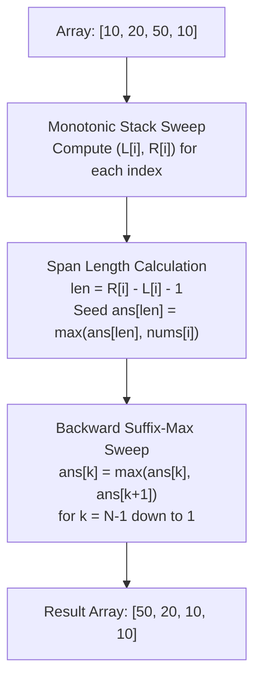

# Guided Example: Maximum of Minimum Values in All Subarrays

We trace and analyze the monotonic stack and prefix-suffix window propagation algorithm on a representative array to determine the maximum of minimums for every window size in linear time.

- **Input:** `nums = [10, 20, 50, 10]` ($N = 4$)
- **Expected Output:** `[50, 20, 10, 10]`

---

## 1. Instance & Intuition

Given an array of $N$ numbers, we wish to compute, for every possible window length $L \in \{1, \dots, N\}$, the maximum value among all subarray minima of size $L$.

A brute-force strategy would inspect all $\mathcal{O}(N^2)$ subarrays and compute their minima in $\mathcal{O}(N^3)$ or $\mathcal{O}(N^2)$ time with a deque, which is prohibitive for $N = 10^5$.

Instead of asking *"for a fixed length $L$, what is the maximum minimum?"*, we invert the question:
> **"For each element $nums[i]$, what is the largest window in which $nums[i]$ remains the minimum?"**

If $nums[i]$ is the minimum of a maximal contiguous range of length $k$, then $nums[i]$ is a valid candidate minimum for any window of length $L \le k$ contained within that range. Specifically, $nums[i]$ establishes a lower bound on the maximum minimum for window length $k$:
$$\text{ans}[k] \ge nums[i]$$

Furthermore, the function $g(L) = \max_{\text{all windows } W \text{ of size } L} \min(W)$ is monotonically non-increasing with respect to $L$:
$$g(L) \ge g(L+1) \quad \text{for all } 1 \le L < N$$
This holds because any window of length $L+1$ contains a sub-window of length $L$. The minimum over the larger set cannot exceed the minimum over its subset. Thus, a backward suffix sweep fills all intermediate window sizes in linear time.

---

## 2. Mathematical Formalism & Invariants

For each index $i \in \{0, \dots, N-1\}$:
- Let $L[i]$ be the index of the **previous smaller element** strictly less than $nums[i]$:
  $$L[i] = \max(\{j < i \mid nums[j] < nums[i]\} \cup \{-1\})$$
- Let $R[i]$ be the index of the **next smaller or equal element**:
  $$R[i] = \min(\{j > i \mid nums[j] \le nums[i]\} \cup \{N\})$$

The open interval $(L[i], R[i])$ defines the maximal span where $nums[i]$ is the unique minimum (breaking ties consistently via strict inequality on the left and weak inequality on the right).

The span length is:
$$\text{len}(i) = R[i] - L[i] - 1$$

### Monotonic Stack Invariant

We maintain a stack of indices storing elements in strictly increasing order of values:
$$\text{Stack} = [s_0, s_1, \dots, s_m] \implies nums[s_0] < nums[s_1] < \dots < nums[s_m]$$

When encountering an element $nums[i] \le nums[\text{top}]$, popping the top index $t$ establishes that:
1. The right boundary of $t$ is $R[t] = i$.
2. The left boundary of $t$ is the new top of the stack $L[t] = \text{Stack}[\text{top}-1]$ (or $-1$ if the stack becomes empty).

---

## 3. Step-by-Step State Evolution

We execute the monotonic stack on `nums = [10, 20, 50, 10]`:

### Phase 1: Boundary Computation via Monotonic Stack

1. **$i = 0$ ($nums[0] = 10$):**
   - Stack is empty. Push $0$.
   - Stack: `[0]`.

2. **$i = 1$ ($nums[1] = 20$):**
   - $nums[1] = 20 > nums[0] = 10$. Push $1$.
   - Stack: `[0, 1]`.

3. **$i = 2$ ($nums[2] = 50$):**
   - $nums[2] = 50 > nums[1] = 20$. Push $2$.
   - Stack: `[0, 1, 2]`.

4. **$i = 3$ ($nums[3] = 10$):**
   - Compare with top index $2$ ($nums[2] = 50$): $10 \le 50$. Pop $2$!
     - Popped index $t = 2$ ($nums[2] = 50$).
     - Right boundary $R[2] = 3$.
     - Left boundary $L[2] = \text{top} = 1$.
     - Span length: $\text{len}(2) = R[2] - L[2] - 1 = 3 - 1 - 1 = 1$.
   - Compare with top index $1$ ($nums[1] = 20$): $10 \le 20$. Pop $1$!
     - Popped index $t = 1$ ($nums[1] = 20$).
     - Right boundary $R[1] = 3$.
     - Left boundary $L[1] = \text{top} = 0$.
     - Span length: $\text{len}(1) = R[1] - L[1] - 1 = 3 - 0 - 1 = 2$.
   - Compare with top index $0$ ($nums[0] = 10$): $10 \le 10$. Pop $0$!
     - Popped index $t = 0$ ($nums[0] = 10$).
     - Right boundary $R[0] = 3$.
     - Left boundary $L[0] = -1$ (stack now empty).
     - Span length: $\text{len}(0) = R[0] - L[0] - 1 = 3 - (-1) - 1 = 3$.
   - Stack is now empty. Push $3$.
   - Stack: `[3]`.

5. **End of Array (Flush remaining elements with virtual boundary $i = 4$):**
   - Pop index $3$ ($nums[3] = 10$):
     - Right boundary $R[3] = 4$.
     - Left boundary $L[3] = -1$.
     - Span length: $\text{len}(3) = 4 - (-1) - 1 = 4$.

---

## 4. Execution Trace Table

### Boundary and Span Summary

| Index $i$ | $nums[i]$ | Left Boundary $L[i]$ | Right Boundary $R[i]$ | Valid Span $(L[i], R[i])$ | Maximal Length $\text{len}(i)$ | Seed Assignment $\text{ans}[\text{len}]$ |
|---|---|---|---|---|---|---|
| 0 | 10 | -1 | 3 | $(-1, 3)$ | $3 - (-1) - 1 = 3$ | $\text{ans}[3] = \max(0, 10) = 10$ |
| 1 | 20 | 0 | 3 | $(0, 3)$ | $3 - 0 - 1 = 2$ | $\text{ans}[2] = \max(0, 20) = 20$ |
| 2 | 50 | 1 | 3 | $(1, 3)$ | $3 - 1 - 1 = 1$ | $\text{ans}[1] = \max(0, 50) = 50$ |
| 3 | 10 | -1 | 4 | $(-1, 4)$ | $4 - (-1) - 1 = 4$ | $\text{ans}[4] = \max(0, 10) = 10$ |

### Backward Suffix Maximum Propagation

We initialize $\text{ans} = [0, 50, 20, 10, 10]$ (1-indexed for lengths $1 \dots 4$).

| Step | Length $k$ | Direct Candidate $\text{ans}[k]$ | Suffix Candidate $\text{ans}[k+1]$ | Final Propagated $\text{ans}[k]$ | Justification |
|---|---|---|---|---|---|
| 1 | 4 | 10 | Boundary base | 10 | Maximal span for full array |
| 2 | 3 | 10 | $\text{ans}[4] = 10$ | $\max(10, 10) = 10$ | Windows of size 4 imply size 3 |
| 3 | 2 | 20 | $\text{ans}[3] = 10$ | $\max(20, 10) = 20$ | Peak window `[20, 50]` has minimum 20 |
| 4 | 1 | 50 | $\text{ans}[2] = 20$ | $\max(50, 20) = 50$ | Single element `[50]` has minimum 50 |

Converting to 0-indexed output yields `[50, 20, 10, 10]`.

---

## 5. Algorithmic Soundness & Proof Sketch

**Soundness.** Let $M(L)$ be the true maximum minimum among all subarrays of length $L$.
1. For any element $nums[i]$ with maximal span length $\text{len}(i)$, the subarray $nums[L[i]+1 \dots R[i]-1]$ contains $nums[i]$ and has length $\text{len}(i)$. Every element in this subarray is $\ge nums[i]$, so its minimum is exactly $nums[i]$. Thus $M(\text{len}(i)) \ge nums[i]$. Seeding $\text{ans}[\text{len}(i)] \leftarrow \max(\text{ans}[\text{len}(i)], nums[i])$ is therefore sound.
2. For any window of length $L+1$ with minimum $v$, any subsegment of length $L$ inside it has minimum $\ge v$. Thus $M(L) \ge M(L+1)$. Propagating $\text{ans}[L] \leftarrow \max(\text{ans}[L], \text{ans}[L+1])$ maintains mathematical validity.

**Completeness.** Suppose an optimal subarray $S^*$ of length $L$ achieves the true maximum minimum $v = \min(S^*)$. The minimum element $nums[j] = v$ within $S^*$ has some maximal span of length $\text{len}(j)$. Since $S^*$ is contained within this maximal span, $L \le \text{len}(j)$. During seeding, $\text{ans}[\text{len}(j)]$ receives $nums[j] = v$. During suffix propagation, this value $v$ flows down to all $L \le \text{len}(j)$, guaranteeing that $\text{ans}[L] \ge v$. Hence no optimal value is underestimated.

---

## 6. Edge Cases & Traps

- **Equal Elements and Tie-Breaking:** When elements are identical (such as two $10$s in `[10, 20, 50, 10]`), using strict inequality for both left and right would cause overlapping intervals and duplicate counting. Using strict inequality on the left ($nums[j] < nums[i]$) and non-strict on the right ($nums[j] \le nums[i]$) partitions intervals consistently without double counting.
- **Unassigned Intermediate Lengths:** Some window lengths might not be the exact maximal span of any single element (e.g., in `[1, 100, 1]`, lengths 1 and 3 are seeded, but length 2 is not). The backward suffix pass $\text{ans}[k] = \max(\text{ans}[k], \text{ans}[k+1])$ is mandatory to propagate the valid upper bound to unseeded lengths.
- **Monotonicity Violation Fallacy:** Attempting forward propagation ($\text{ans}[k] = \max(\text{ans}[k], \text{ans}[k-1])$) is completely false: expanding a window can never increase its minimum; it can only maintain or decrease it. Propagation must proceed strictly from $N-1$ down to 1.

---

## 7. Complexity Analysis

- **Time Complexity:**
  - Every index $i \in \{0, \dots, N-1\}$ is pushed onto the stack exactly once and popped at most once.
  - Determining $L[i]$ and $R[i]$ takes $\mathcal{O}(N)$ amortized time.
  - Suffix propagation sweeps $N$ elements in reverse order, taking $\mathcal{O}(N)$ time.
  - Overall time complexity is $\mathcal{O}(N)$, optimal for reading the input.
- **Auxiliary Space Complexity:**
  - The monotonic stack stores at most $N$ integers: $\mathcal{O}(N)$.
  - The answer array of size $N+1$ requires $\mathcal{O}(N)$ space.
  - Total auxiliary space is $\mathcal{O}(N)$.
