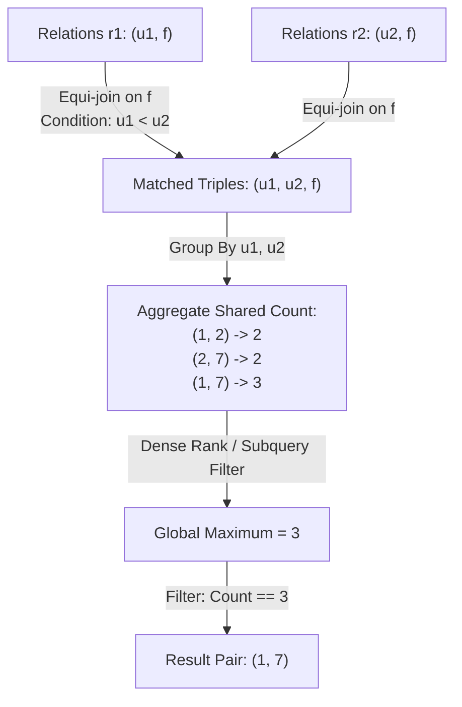

# Guided Example: All the Pairs With the Maximum Number of Common Followers

We trace and analyze the relational self-join and window-ranking method on a representative social graph to discover all user pairs that achieve the global maximum number of shared followers.

- **Relations Table ($R = 9$ entries):**
  - User 1 followed by: 3, 4, 5
  - User 2 followed by: 3, 4, 6
  - User 7 followed by: 3, 4, 5
- **Expected Output:**
  - `(1, 7)` with maximum shared follower count of 3

---

## 1. Instance & Intuition

In a directed social network, an edge $(f, u)$ indicates that follower $f$ follows user $u$. When two distinct users $u_1$ and $u_2$ are both followed by the same person $f$, the individual $f$ is defined as a *common follower* of the pair $(u_1, u_2)$.

We want to find which user pairs have the greatest overlap in their follower bases. Because the problem asks for all pairs attaining the global maximum:
1. Every distinct user pair $(u_1, u_2)$ with $u_1 < u_2$ that shares at least one follower must have its shared followers aggregated.
2. The global maximum count $M = \max_{(u_1, u_2)} \text{count}(u_1, u_2)$ must be identified.
3. Every pair whose intersection count equals $M$ must be emitted.

In our instance:
- Users 1 and 2 share followers $\{3, 4\}$ (count $= 2$).
- Users 2 and 7 share followers $\{3, 4\}$ (count $= 2$).
- Users 1 and 7 share followers $\{3, 4, 5\}$ (count $= 3$).

The global maximum count is 3, uniquely achieved by pair $(1, 7)$.

---

## 2. Relational Formalism & Self-Join Strategy

Let $R(user\_id, follower\_id)$ be the relation.

### Step 1: Follower-Centric Self-Join

To identify pairs that share a follower without generating $\mathcal{O}(|Users|^2)$ Cartesian product rows, we perform an inner equi-join on $follower\_id$:
$$J = \{(u_1, u_2, f) \mid (u_1, f) \in R \wedge (u_2, f) \in R \wedge u_1 < u_2\}$$

The strict inequality $u_1 < u_2$:
1. Eliminates degenerate self-pairs $(u_1, u_1)$.
2. Enforces canonical ordering, ensuring each pair $\{u_1, u_2\}$ is evaluated under a single key.

### Step 2: Aggregation and Grouping

We group relation $J$ by $(u_1, u_2)$ and compute the common follower cardinality:
$$C(u_1, u_2) = |\{f \mid (u_1, u_2, f) \in J\}| = \sum_{f} \mathbb{I}\Big((u_1, f) \in R \wedge (u_2, f) \in R\Big)$$

### Step 3: Global Maximum Filtering

Let $M = \max_{(u_1, u_2)} C(u_1, u_2)$. The final result is:
$$\text{Result} = \{(u_1, u_2) \mid C(u_1, u_2) = M\}$$

In SQL terms, this corresponds to ranking pairs by $C(u_1, u_2)$ descending using `DENSE_RANK()` or equating the group count to a scalar subquery `MAX(count)`.

---

## 3. Step-by-Step Join and Aggregation Trace

### Phase 1: Input Relation Table

The input contains 9 records across three users:

| `user_id` | `follower_id` |
|---|---|
| 1 | 3 |
| 1 | 4 |
| 1 | 5 |
| 2 | 3 |
| 2 | 4 |
| 2 | 6 |
| 7 | 3 |
| 7 | 4 |
| 7 | 5 |

### Phase 2: Inverted Index by `follower_id`

Grouping by follower reveals who follows multiple targets:
- Follower 3 follows: $\{1, 2, 7\}$
- Follower 4 follows: $\{1, 2, 7\}$
- Follower 5 follows: $\{1, 7\}$
- Follower 6 follows: $\{2\}$ (unique, produces no pairs)

### Phase 3: Generating Matched Pairs ($u_1 < u_2$)

1. **Follower 3:** Pairs formed from $\{1, 2, 7\}$:
   - $(1, 2)$ via follower 3
   - $(1, 7)$ via follower 3
   - $(2, 7)$ via follower 3
2. **Follower 4:** Pairs formed from $\{1, 2, 7\}$:
   - $(1, 2)$ via follower 4
   - $(1, 7)$ via follower 4
   - $(2, 7)$ via follower 4
3. **Follower 5:** Pairs formed from $\{1, 7\}$:
   - $(1, 7)$ via follower 5
4. **Follower 6:** Follows only user 2; produces no pair.

### Phase 4: Aggregation and Rank Assignment

We tally the occurrences of each $(u_1, u_2)$ pair:
- Pair $(1, 2)$: followers $\{3, 4\} \implies \text{count} = 2$.
- Pair $(2, 7)$: followers $\{3, 4\} \implies \text{count} = 2$.
- Pair $(1, 7)$: followers $\{3, 4, 5\} \implies \text{count} = 3$.

The maximum count observed is $\max(2, 2, 3) = 3$.

---

## 4. Execution Trace Table

| Follower $f$ | Users Followed | Valid Joined Tuples $(u_1, u_2, f)$ with $u_1 < u_2$ | Contribution to Pair Tally |
|---|---|---|---|
| 3 | $\{1, 2, 7\}$ | $(1, 2, 3)$, $(1, 7, 3)$, $(2, 7, 3)$ | $+1$ to $(1, 2)$, $(1, 7)$, $(2, 7)$ |
| 4 | $\{1, 2, 7\}$ | $(1, 2, 4)$, $(1, 7, 4)$, $(2, 7, 4)$ | $+1$ to $(1, 2)$, $(1, 7)$, $(2, 7)$ |
| 5 | $\{1, 7\}$ | $(1, 7, 5)$ | $+1$ to $(1, 7)$ |
| 6 | $\{2\}$ | None ($< 2$ users) | No contribution |

### Aggregated Pair Results

| User Pair $(u_1, u_2)$ | Shared Followers Set | Aggregated Count $C(u_1, u_2)$ | Dense Rank | Filter Status ($C = \max$) |
|---|---|---|---|---|
| $(1, 7)$ | $\{3, 4, 5\}$ | 3 | 1 | **Accepted** |
| $(1, 2)$ | $\{3, 4\}$ | 2 | 2 | Rejected |
| $(2, 7)$ | $\{3, 4\}$ | 2 | 2 | Rejected |

Final emitted row: `user1_id = 1, user2_id = 7`.

---

## 5. Algorithmic Correctness & Soundness

**Soundness.** Every row $(u_1, u_2, f)$ in the join relation $J$ satisfies $(u_1, f) \in R$ and $(u_2, f) \in R$ with $u_1 < u_2$. Because $(user\_id, follower\_id)$ is the primary key of $R$, follower $f$ cannot appear more than once for the same user $u$. Thus, each common follower $f$ contributes exactly 1 to the count for the pair $(u_1, u_2)$. Computing the maximum over all group sums and filtering for equality guarantees that every returned pair attains the true maximum.

**Completeness.** Suppose two users $a < b$ share $k$ common followers. Then for each of those $k$ followers $f_i$, the pair $(a, f_i)$ and $(b, f_i)$ both exist in $R$. The inner join on $follower\_id$ with $u_1 < u_2$ will produce exactly $(a, b, f_i)$ for each $i \in \{1, \dots, k\}$. The `GROUP BY` operation collects all $k$ rows. If $k$ equals the global maximum, the filter accepts $(a, b)$. Hence no maximizing pair can be omitted.

---

## 6. Edge Cases & Traps

- **Ties for the Maximum:** If multiple pairs achieve the identical top count (e.g., $(1, 2)$ has 4 followers and $(3, 4)$ also has 4 followers), both must be returned. Using `LIMIT 1` or `TOP 1` without ties is an error; one must use `DENSE_RANK() = 1` or `HAVING COUNT(*) = (SELECT MAX(...))`.
- **Symmetric Duplication:** Joining on $r1.user\_id \neq r2.user\_id$ instead of $r1.user\_id < r2.user\_id$ produces both $(1, 7)$ and $(7, 1)$. The problem requires canonical output where the smaller ID appears first. Enforcing $u_1 < u_2$ at join time avoids redundant computation and guarantees unique pairs.
- **Unconnected Users:** Users who share 0 followers do not appear in the inner join result. Since the problem seeks the maximum common followers (which is at least 1 in any valid test with shared followers), ignoring zero-intersection pairs is both mathematically correct and computationally optimal.

---

## 7. Complexity Analysis

- **Time Complexity:**
  - Let $R$ be the number of rows in `Relations`.
  - Hashing or indexing by `follower_id` takes $\mathcal{O}(R)$ time.
  - For each follower $f$ following $d_f$ users, the number of generated pairs is $\binom{d_f}{2} = \mathcal{O}(d_f^2)$.
  - Total joined rows $J = \sum_f \frac{d_f(d_f - 1)}{2}$.
  - Grouping by $(u_1, u_2)$ and computing the count takes $\mathcal{O}(J)$ time with hash aggregation.
  - Finding the maximum and filtering takes $\mathcal{O}(|Pairs|) \le \mathcal{O}(J)$ time.
  - Overall time complexity is $\mathcal{O}(R + J)$.
- **Auxiliary Space Complexity:**
  - Hash tables for the self-join and aggregation require $\mathcal{O}(R + J)$ auxiliary space.
