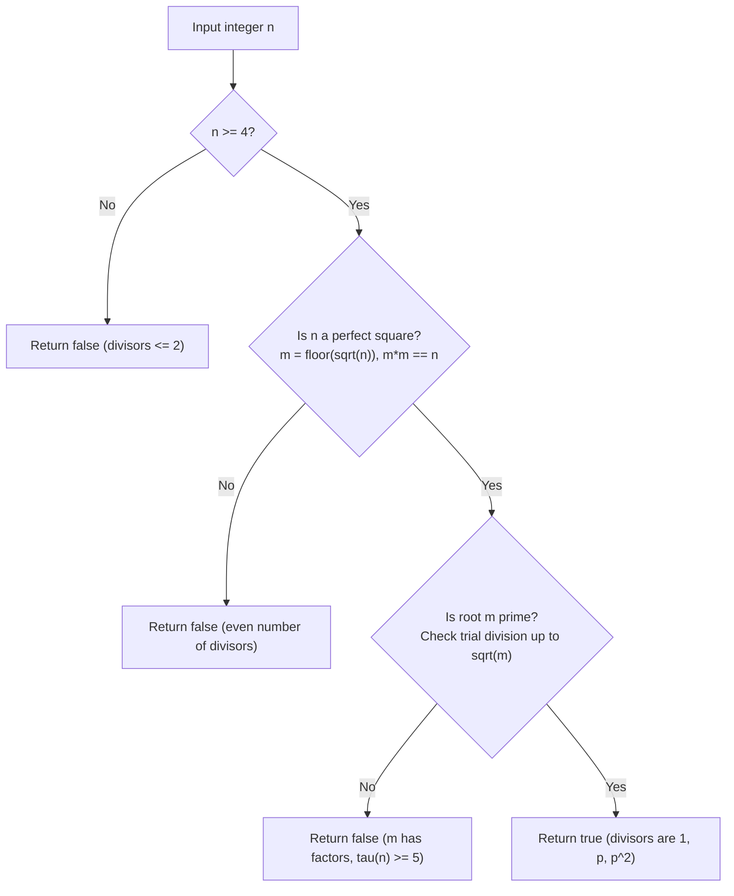

# Guided Example: Three Divisors

We formulate and execute the number-theoretic prime-square classification algorithm on representative integers to determine whether a number has exactly three distinct positive divisors.

- **Primary Instance:** $n = 9$ (Expected Output: `true`)
- **Counter-Instance A (Composite Square):** $n = 16$ (Expected Output: `false`)
- **Counter-Instance B (Prime):** $n = 7$ (Expected Output: `false`)
- **Counter-Instance C (Non-Square Composite):** $n = 12$ (Expected Output: `false`)

---

## 1. Instance & Intuition

The positive divisors of an integer $n \ge 1$ are all positive integers $d$ that divide $n$ without remainder ($n \bmod d = 0$). Divisors always appear in complementary pairs $(d, n/d)$:
- If $d < \sqrt{n}$, then $n/d > \sqrt{n}$.
- If $n$ is not a perfect square, all divisors pair up into distinct 2-element sets $\{d, n/d\}$, which means the total number of divisors $d(n)$ is strictly even.
- If $n$ is a perfect square, exactly one divisor satisfies $d = n/d = \sqrt{n}$, producing an odd divisor count.

For $n$ to possess **exactly three** divisors, two conditions are immediate:
1. The divisor count $3$ is odd, so $n$ **must** be a perfect square: $n = m^2$ for some integer $m > 1$.
2. The divisors must be $\{1, m, n\}$. If the base $m$ were composite, $m$ would have its own non-trivial factor $k \notin \{1, m\}$, and $k$ would divide $n$, introducing at least a fourth divisor $k$ and a fifth divisor $n/k$.

Thus, $n$ has exactly three positive divisors if and only if $n = p^2$ where $p$ is a prime number.

---

## 2. Number-Theoretic Characterization & Invariants

Let $n \ge 2$ have prime factorization:
$$n = p_1^{a_1} p_2^{a_2} \cdots p_k^{a_k}$$

The arithmetic divisor function $\tau(n)$ (or $d(n)$) counts the total number of positive divisors:
$$\tau(n) = \prod_{i=1}^k (a_i + 1) = (a_1 + 1)(a_2 + 1) \cdots (a_k + 1)$$

### Classification Theorem

We equate $\tau(n) = 3$:
$$\prod_{i=1}^k (a_i + 1) = 3$$

Because $3$ is a prime number, the integer 3 cannot be factored into two or more integers strictly greater than 1. Consequently:
1. $k = 1$ (the factorization consists of exactly one distinct prime factor).
2. $a_1 + 1 = 3 \implies a_1 = 2$.

Therefore:
$$\tau(n) = 3 \iff n = p^2 \quad \text{where } p \text{ is prime.}$$

---

## 3. Step-by-Step Factorization and Primality Verification

We evaluate our four representative test candidates through the two-phase validation pipeline:
- **Phase 1:** Exact Integer Square Root Verification.
- **Phase 2:** Primality Test on the Integer Square Root.

### Evaluation of $n = 9$

1. **Phase 1 (Square Root):**
   - Compute $m = \lfloor\sqrt{9}\rfloor = 3$.
   - Check $m^2 = 3^2 = 9 == 9$. Condition passes.
2. **Phase 2 (Primality of Root $m = 3$):**
   - $m > 1$ holds.
   - Trial divisors up to $\lfloor\sqrt{3}\rfloor = 1$: no divisors in range $[2, 1]$.
   - $3$ is prime.
3. **Conclusion:** Divisors of 9 are $\{1, 3, 9\}$, count $= 3$. Emits `true`.

### Evaluation of $n = 16$

1. **Phase 1 (Square Root):**
   - Compute $m = \lfloor\sqrt{16}\rfloor = 4$.
   - Check $m^2 = 4^2 = 16 == 16$. Condition passes.
2. **Phase 2 (Primality of Root $m = 4$):**
   - $m = 4$ is divisible by $2 \implies 4$ is composite.
3. **Conclusion:** Divisors of 16 are $\{1, 2, 4, 8, 16\}$, count $= 5 \ne 3$. Emits `false`.

### Evaluation of $n = 12$

1. **Phase 1 (Square Root):**
   - Compute $m = \lfloor\sqrt{12}\rfloor = 3$.
   - Check $m^2 = 3^2 = 9 \neq 12$. Condition fails.
2. **Conclusion:** Not a perfect square. Divisor count must be even ($\tau(12) = 6$). Emits `false`.

### Evaluation of $n = 7$

1. **Phase 1 (Square Root):**
   - Compute $m = \lfloor\sqrt{7}\rfloor = 2$.
   - Check $m^2 = 2^2 = 4 \neq 7$. Condition fails.
2. **Conclusion:** Prime number. Divisors are $\{1, 7\}$, count $= 2 \ne 3$. Emits `false`.

---

## 4. Comparative Execution Trace Table

The table below contrasts integers across distinct arithmetic structures:

| Candidate $n$ | Perfect Square Check $\lfloor\sqrt{n}\rfloor^2 == n$ | Base $m = \sqrt{n}$ | Prime Factorization of $n$ | Full Set of Divisors | Divisor Count $\tau(n)$ | Result |
|---|---|---|---|---|---|---|
| 1 | $1^2 = 1$ (Pass) | 1 | $1$ (Unit) | $\{1\}$ | 1 | `false` |
| 2 | $1^2 \ne 2$ (Fail) | 1 | $2^1$ | $\{1, 2\}$ | 2 | `false` |
| 4 | $2^2 = 4$ (Pass) | 2 (Prime) | $2^2$ | $\{1, 2, 4\}$ | 3 | `true` |
| 7 | $2^2 \ne 7$ (Fail) | 2 | $7^1$ | $\{1, 7\}$ | 2 | `false` |
| 9 | $3^2 = 9$ (Pass) | 3 (Prime) | $3^2$ | $\{1, 3, 9\}$ | 3 | `true` |
| 12 | $3^2 \ne 12$ (Fail) | 3 | $2^2 \cdot 3^1$ | $\{1, 2, 3, 4, 6, 12\}$ | 6 | `false` |
| 16 | $4^2 = 16$ (Pass) | 4 (Composite) | $2^4$ | $\{1, 2, 4, 8, 16\}$ | 5 | `false` |
| 25 | $5^2 = 25$ (Pass) | 5 (Prime) | $5^2$ | $\{1, 5, 25\}$ | 3 | `true` |
| 49 | $7^2 = 49$ (Pass) | 7 (Prime) | $7^2$ | $\{1, 7, 49\}$ | 3 | `true` |

### Primality Sweep for Base $m$

| Base $m$ | Trial Divisor Range $[2, \lfloor\sqrt{m}\rfloor]$ | Factors Detected | Primality Status | Square $n = m^2$ Status |
|---|---|---|---|---|
| 2 | Empty range | None | Prime | $n = 4$ has 3 divisors |
| 3 | Empty range | None | Prime | $n = 9$ has 3 divisors |
| 4 | $[2, 2]$ | 2 divides 4 | Composite | $n = 16$ has 5 divisors |
| 5 | $[2, 2]$ | None | Prime | $n = 25$ has 3 divisors |
| 6 | $[2, 2]$ | 2 divides 6 | Composite | $n = 36$ has 9 divisors |
| 7 | $[2, 2]$ | None | Prime | $n = 49$ has 3 divisors |

---

## 5. Algorithmic Correctness & Soundness

**Soundness.** Suppose the algorithm returns `true` for integer $n$. This occurs if and only if $n = m^2$ and $m$ is prime. Let $p = m$. The divisors of $p^2$ are generated by $p^j$ for $j \in \{0, 1, 2\}$, which are precisely $1, p,$ and $p^2$. Because $p$ is prime, $p > 1$, and $1 < p < p^2$, so these three integers are pairwise distinct. No other integer $d$ can divide $p^2$ because by unique prime factorization, any divisor must be of the form $p^j$. Hence $\tau(n) = 3$ holds strictly.

**Completeness.** Suppose $\tau(n) = 3$. Let $n = \prod_{i=1}^k p_i^{a_i}$ be its prime factorization. Then $\prod_{i=1}^k (a_i + 1) = 3$. Because 3 is prime and $a_i \ge 1$ for all prime factors, there cannot be multiple factors ($k = 1$), and the single exponent must satisfy $a_1 + 1 = 3 \implies a_1 = 2$. Thus $n = p_1^2$ for some prime $p_1$. The algorithm tests whether $n$ is a square and whether its root is prime, so it will unfailingly return `true`.

---

## 6. Edge Cases & Traps

- **The Boundary Case $n = 1$:** $1$ is a perfect square ($1^2 = 1$), but its root $m = 1$ is neither prime nor composite. The divisors of 1 are solely $\{1\}$ (count $= 1 \ne 3$). The condition $m > 1$ correctly rejects $n = 1$.
- **Floating-Point Precision:** Computing $\sqrt{n}$ via floating-point functions can suffer from precision rounding (e.g. producing $2.9999999999$ instead of $3$). Truncating and explicitly verifying $m \times m == n$ in exact integer arithmetic prevents false positives and negatives.
- **Direct Enumeration vs. Number Theory:** Directly running a loop from $1$ to $n$ and counting divisors takes $\mathcal{O}(n)$ time, while trial division up to $\sqrt{n}$ takes $\mathcal{O}(\sqrt{n})$. The prime-square property reduces verification to $\mathcal{O}(n^{1/4})$, which is instantaneous even for large integers.

---

## 7. Complexity Analysis

- **Time Complexity:**
  - Integer square root: $\mathcal{O}(1)$ or $\mathcal{O}(\log(\log n))$ via Newton's method.
  - Primality testing on $m = \sqrt{n}$: trial division checks integers $d \in [2, \sqrt{m}]$.
  - Since $m = \sqrt{n}$, $\sqrt{m} = n^{1/4}$.
  - The maximum number of trial divisions for $n \le 10^4$ is $\lfloor(10^4)^{1/4}\rfloor = 10$, requiring at most 4 prime checks ($2, 3, 5, 7$).
  - Overall time complexity is $\mathcal{O}(n^{1/4})$.
- **Auxiliary Space Complexity:** $\mathcal{O}(1)$ since all computations operate in place with a constant number of register variables.
