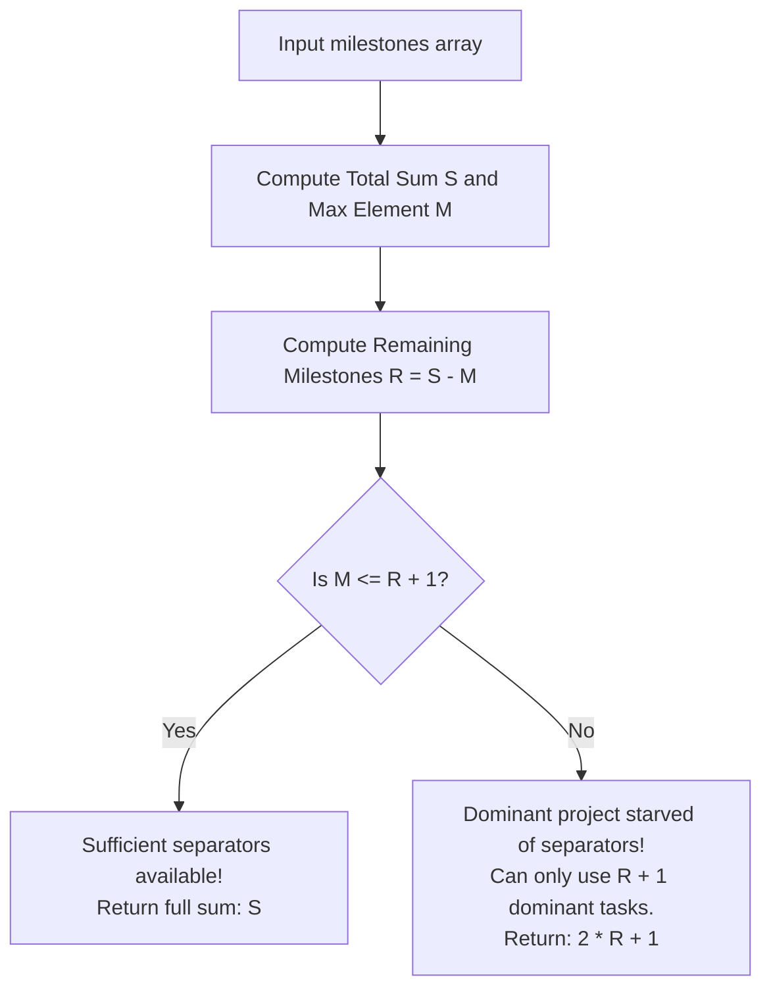

# Guided Example: Maximum Number of Weeks for Which You Can Work

We derive and execute the greedy interleaving and pigeonhole bound analysis on representative project milestone configurations to determine the maximum number of workable weeks.

- **Primary Instance (Dominant Bottleneck):** `milestones = [5, 2, 1]` ($N = 3$)
  - Total milestones: $S = 5 + 2 + 1 = 8$
  - Maximum single project: $M = 5$
  - Expected Output: `7`
- **Secondary Instance (Fully Schedulable):** `milestones = [1, 2, 3]` ($N = 3$)
  - Total milestones: $S = 6$, $M = 3$
  - Expected Output: `6`

---

## 1. Instance & Intuition

We are tasked with scheduling milestone tasks week by week under one strict constraint: **no two consecutive weeks may be spent on the same project**. Work terminates as soon as we cannot pick a project different from the preceding week.

Intuitively, the project with the single largest number of milestones represents the primary obstacle. Let $M$ be the maximum milestone count among all projects, and let $R = (\sum milestones) - M$ be the sum of all remaining milestones from all other projects combined.

To schedule $M$ milestones of the dominant project without placing two adjacent to each other, we need "buffer" weeks between them. Specifically, $M$ milestones require at least $M - 1$ intervening separation slots:
$$P_{dom} \;\; [\text{sep}_1] \;\; P_{dom} \;\; [\text{sep}_2] \;\; \dots \;\; [\text{sep}_{M-1}] \;\; P_{dom}$$

- If the other projects provide at least $M - 1$ milestones ($R \ge M - 1$), the buffer slots can be completely populated. All $S$ milestones can be scheduled without violation.
- If the other projects provide fewer than $M - 1$ milestones ($R < M - 1$), there are not enough buffer weeks to separate all $M$ occurrences of the dominant project. The maximum number of dominant milestones we can ever schedule is $R + 1$. Together with all $R$ buffer milestones, the schedule achieves a maximum length of $R + (R + 1) = 2R + 1$.

In our primary instance `[5, 2, 1]`:
- $M = 5$ (Project 0)
- $R = 2 + 1 = 3$ (Projects 1 and 2)
- Since $R = 3 < 5 - 1 = 4$, we can schedule at most $3 + 1 = 4$ milestones from Project 0.
- Total scheduled weeks $= 3 + 4 = 7$. Exactly 1 milestone of Project 0 remains unfinished.

---

## 2. Mathematical Formalism & Interleaving Bound

Let $A = [a_0, a_1, \dots, a_{N-1}]$ be the milestone counts.
Let:
$$S = \sum_{i=0}^{N-1} a_i \quad \text{and} \quad M = \max_{0 \le i < N} a_i$$
Let the remainder sum of non-dominant projects be:
$$R = S - M = \sum_{i \neq \text{argmax}(A)} a_i$$

### Upper Bound via the Pigeonhole Principle

Any valid sequence of project selections $w_1, w_2, \dots, w_K$ must satisfy $w_t \neq w_{t+1}$ for all $1 \le t < K$.
If project $p$ appears $k_p$ times in this sequence, the pigeonhole principle demands that at least $k_p - 1$ other project selections lie strictly between the first and last occurrences of $p$. Thus:
$$K - k_p \ge k_p - 1 \implies K \le 2(K - k_p) + 1$$

Applied to the dominant project with original count $M$:
1. If all $M$ milestones are used, $k_{dom} = M$, so the number of remaining milestones $R$ must satisfy $R \ge M - 1$. In that case, $K = M + R = S$.
2. If $R < M - 1$, then $k_{dom}$ cannot exceed $R + 1$. Hence $K = k_{dom} + R \le (R + 1) + R = 2R + 1$.

Therefore, the global maximum weekly schedule length is:
$$\text{MaxWeeks} = \begin{cases} 
S & \text{if } M \le R + 1 \\
2R + 1 & \text{if } M > R + 1 
\end{cases}$$

---

## 3. Step-by-Step Schedule Construction

### Primary Instance: `milestones = [5, 2, 1]`

- $M = 5$ (Project 0)
- $R = 2 + 1 = 3$ (Projects 1 and 2)
- Check condition: $M \le R + 1 \implies 5 \le 3 + 1 = 4$ (False).
- Dominant project exceeds available separator capacity.
- Maximum allowable weeks: $2R + 1 = 2(3) + 1 = 7$.

#### Concrete Week-by-Week Construction

We alternate Project 0 with available separator tasks:
- **Week 1:** Project 0 (Count remaining: `P0: 4, P1: 2, P2: 1`)
- **Week 2:** Project 1 (Count remaining: `P0: 4, P1: 1, P2: 1`)
- **Week 3:** Project 0 (Count remaining: `P0: 3, P1: 1, P2: 1`)
- **Week 4:** Project 1 (Count remaining: `P0: 3, P1: 0, P2: 1`)
- **Week 5:** Project 0 (Count remaining: `P0: 2, P1: 0, P2: 1`)
- **Week 6:** Project 2 (Count remaining: `P0: 2, P1: 0, P2: 0`)
- **Week 7:** Project 0 (Count remaining: `P0: 1, P1: 0, P2: 0`)
- **Week 8:** Only Project 0 has milestones left (`P0: 1`), but Week 7 was Project 0. No legal project choice exists.
- **Termination:** Process halts after week 7.

### Secondary Instance: `milestones = [1, 2, 3]`

- $M = 3$ (Project 2)
- $R = 1 + 2 = 3$ (Projects 0 and 1)
- Check condition: $M \le R + 1 \implies 3 \le 3 + 1 = 4$ (True).
- All milestones can be cleared. Total weeks: $S = 6$.
- **Schedule:** Project 2 $\to$ Project 1 $\to$ Project 2 $\to$ Project 1 $\to$ Project 2 $\to$ Project 0.

---

## 4. Execution Trace Table

### Parameter Calculation Across Benchmark Instances

| Instance Index | Milestones Array | Total Sum $S$ | Max $M$ | Remainder $R = S - M$ | Separation Threshold $R + 1$ | $M \le R + 1$? | Output Weeks Formula | Final Answer |
|---|---|---|---|---|---|---|---|---|
| 1 | `[5, 2, 1]` | 8 | 5 | 3 | 4 | False | $2R + 1 = 2(3) + 1$ | 7 |
| 2 | `[1, 2, 3]` | 6 | 3 | 3 | 4 | True | $S$ | 6 |
| 3 | `[5, 2, 2]` | 9 | 5 | 4 | 5 | True | $S$ | 9 |
| 4 | `[10]` | 10 | 10 | 0 | 1 | False | $2(0) + 1$ | 1 |
| 5 | `[4, 4, 4]` | 12 | 4 | 8 | 9 | True | $S$ | 12 |

### Week-by-Week Resource State for `[5, 2, 1]`

| Week $t$ | Project Chosen | Previous Week Project | Valid Move? | Project 0 Remaining | Project 1 Remaining | Project 2 Remaining | Buffer Tasks Remaining |
|---|---|---|---|---|---|---|---|
| 0 (Initial) | None | None | N/A | 5 | 2 | 1 | 3 |
| 1 | Project 0 | None | Yes ($0 \ne \text{None}$) | 4 | 2 | 1 | 3 |
| 2 | Project 1 | Project 0 | Yes ($1 \ne 0$) | 4 | 1 | 1 | 2 |
| 3 | Project 0 | Project 1 | Yes ($0 \ne 1$) | 3 | 1 | 1 | 2 |
| 4 | Project 1 | Project 0 | Yes ($1 \ne 0$) | 3 | 0 | 1 | 1 |
| 5 | Project 0 | Project 1 | Yes ($0 \ne 1$) | 2 | 0 | 1 | 1 |
| 6 | Project 2 | Project 0 | Yes ($2 \ne 0$) | 2 | 0 | 0 | 0 |
| 7 | Project 0 | Project 2 | Yes ($0 \ne 2$) | 1 | 0 | 0 | 0 |
| 8 (Halt) | None | Project 0 | Blocked (only P0 left) | 1 | 0 | 0 | 0 |

---

## 5. Algorithmic Correctness & Soundness

**Soundness.** Let $K$ be the number of weeks in any valid milestone sequence. Suppose $M > R + 1$. The dominant project can contribute at most $k_{dom}$ weeks. Since each dominant task must be separated by at least one non-dominant task, the number of non-dominant tasks must be at least $k_{dom} - 1$. Because there are only $R$ non-dominant milestones in total, $k_{dom} - 1 \le R \implies k_{dom} \le R + 1$. Summing both parts, the total length cannot exceed $k_{dom} + R \le (R + 1) + R = 2R + 1$. Thus, no schedule can exceed $2R + 1$ weeks when $M > R + 1$.

**Completeness.** When $M \le R + 1$, the standard multiset rearrangement theorem (or max-heap greedy scheduling) guarantees that all elements can be arranged such that no two adjacent elements are identical. Placing the dominant elements in alternate odd positions and filling the remaining slots cyclically with other projects guarantees a valid collision-free permutation of length $S$. When $M > R + 1$, taking all $R$ elements and interleaving them with $R + 1$ elements of the dominant project produces a valid collision-free alternating sequence of length $2R + 1$. Hence the formula is tight and achievable.

---

## 6. Edge Cases & Traps

- **Integer Overflow with Large Sums:** Milestone counts can reach $10^9$ per project with $N = 10^5$. The total sum $S$ can reach $10^{14}$, which overflows 32-bit signed integers. In statically typed languages, 64-bit integer types (`long long` or `int64`) are mandatory for $S, M,$ and $R$.
- **Single Project ($N = 1$):** If `milestones = [10]`, $M = 10, R = 0$. The formula evaluates $2(0) + 1 = 1$, which is correct: you work on the project for week 1, and on week 2 you are blocked.
- **Simulation Fallacy:** Attempting to simulate the weeks using a priority queue or max-heap will run $\mathcal{O}(\sum milestones)$ steps, which triggers Time Limit Exceeded when $\sum milestones = 10^{14}$. The problem reduces to an exact $\mathcal{O}(N)$ closed-form mathematical expression.

---

## 7. Complexity Analysis

- **Time Complexity:**
  - Finding the maximum element $M$ takes a single pass: $\mathcal{O}(N)$.
  - Computing the total sum $S$ takes a single pass: $\mathcal{O}(N)$.
  - Closed-form algebraic comparison and arithmetic takes $\mathcal{O}(1)$.
  - Total time complexity is $\mathcal{O}(N)$, optimal since every input element must be inspected.
- **Auxiliary Space Complexity:**
  - The algorithm maintains scalar accumulator variables ($S, M, R$) requiring $\mathcal{O}(1)$ auxiliary space.
