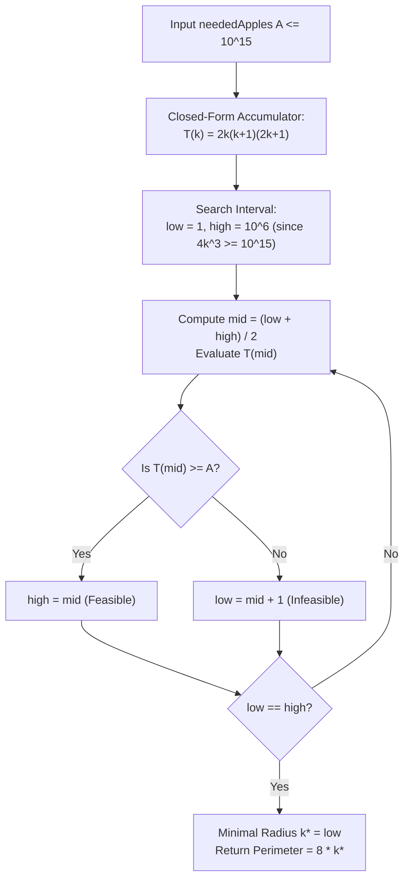

# Guided Example: Minimum Garden Perimeter to Collect Enough Apples

We derive the closed-form polynomial sum for garden apple distributions and execute monotonic binary search to find the minimal perimeter enclosing a target harvest.

- **Primary Instance:** $\text{neededApples} = 13$
  - Expected Output: $16$ (achieved at radius $k = 2$, perimeter $8k = 16$)
- **Boundary Instance:** $\text{neededApples} = 1$
  - Expected Output: $8$ (achieved at radius $k = 1$, perimeter $8k = 8$)

---

## 1. Instance & Intuition

The garden is an infinite 2D integer grid where every point $(i, j)$ contains an apple tree with $|i| + |j|$ apples. The harvest area must be an axis-aligned square centered at the origin $(0, 0)$ with side length $2k$, spanning coordinates $[-k, k] \times [-k, k]$ for some non-negative integer radius $k$.

- A square of radius $k$ has side length $2k$.
- The perimeter of this square is $4 \times (2k) = 8k$.
- The origin $(0, 0)$ has $|0| + |0| = 0$ apples.
- As radius $k$ grows by 1, a new outer concentric square perimeter layer of trees is encompassed.

Because apple counts $|i| + |j| \ge 0$ are non-negative and strictly positive for all $(i, j) \neq (0, 0)$, the total cumulative apples $T(k)$ inside a square of radius $k$ is strictly monotonic with respect to $k$. Thus, the minimum radius $k$ such that $T(k) \ge \text{neededApples}$ can be determined via closed-form summation and binary search (bisection).

---

## 2. Closed-Form Summation & Monotonic Invariants

### Apples on a Single Concentric Layer $r$

Consider the perimeter boundary of the square $[-r, r] \times [-r, r]$ for $r \ge 1$:
1. **Four Corners:** Points $(r, r), (r, -r), (-r, r), (-r, -r)$.
   Each corner has $|r| + |r| = 2r$ apples. Total across 4 corners:
   $$4 \times (2r) = 8r$$
2. **Four Edges (excluding corners):** Along each edge, one coordinate is fixed at $\pm r$ while the other coordinate $t$ varies in $[-(r-1), r-1]$.
   For each fixed edge:
   $$\sum_{t=-(r-1)}^{r-1} (r + |t|) = (2r - 1)r + 2 \sum_{t=1}^{r-1} t = 2r^2 - r + (r-1)r = 3r^2 - 2r$$
   Summing across all 4 edges:
   $$4 \times (3r^2 - 2r) = 12r^2 - 8r$$

Adding the corners and edges yields the exact number of apples on layer $r$:
$$L(r) = (12r^2 - 8r) + 8r = 12r^2$$

### Cumulative Apples $T(k)$ for Radius $k$

Summing layer counts from $r = 1$ to $k$:
$$T(k) = \sum_{r=1}^k 12r^2 = 12 \sum_{r=1}^k r^2 = 12 \left( \frac{k(k+1)(2k+1)}{6} \right) = 2k(k+1)(2k+1)$$

Notice that $T(k)$ is a cubic polynomial:
$$T(k) = 4k^3 + 6k^2 + 2k$$

Since $T(k)$ is strictly increasing for all $k \ge 1$, we binary search for the smallest positive integer $k$ satisfying:
$$2k(k+1)(2k+1) \ge \text{neededApples}$$
The desired perimeter is then simply $8k$.

---

## 3. Step-by-Step State Evolution

### Primary Trace: $\text{neededApples} = 13$

We initialize our binary search bounds:
- Lower bound: $\text{low} = 1$
- Upper bound: $\text{high} = 10^6$ (since $T(10^6) \approx 4 \times 10^{18} \gg 10^{15}$)

For small manual tracing, we examine candidate radii:
1. **Candidate $k = 1$:**
   - Perimeter: $8 \times 1 = 8$
   - Layer apples: $L(1) = 12(1)^2 = 12$
   - Cumulative apples: $T(1) = 2(1)(2)(3) = 12$
   - Test: $12 \ge 13$ is **False**. Insufficient apples.
2. **Candidate $k = 2$:**
   - Perimeter: $8 \times 2 = 16$
   - Layer apples: $L(2) = 12(2)^2 = 48$
   - Cumulative apples: $T(2) = T(1) + 48 = 12 + 48 = 60$
   - Equivalently: $T(2) = 2(2)(3)(5) = 60$
   - Test: $60 \ge 13$ is **True**. Feasible!
3. **Conclusion:** Minimal radius is $k = 2$.
   - Output Perimeter: $8 \times 2 = 16$.

---

## 4. Execution Trace Table

### Growth of Concentric Layers

| Radius $r$ | Perimeter $8r$ | Boundary Corners Apple Sum | Boundary Edges Apple Sum | Layer Apples $L(r) = 12r^2$ | Cumulative Apples $T(r)$ | Feasible for $A = 13$? |
|---|---|---|---|---|---|---|
| 0 | 0 | 0 | 0 | 0 | 0 | No |
| 1 | 8 | $4 \times 2 = 8$ | $4 \times (3 - 2) = 4$ | 12 | 12 | No ($12 < 13$) |
| 2 | 16 | $4 \times 4 = 16$ | $4 \times (12 - 4) = 32$ | 48 | 60 | **Yes ($60 \ge 13$)** |
| 3 | 24 | $4 \times 6 = 24$ | $4 \times (27 - 6) = 84$ | 108 | 168 | Yes ($168 \ge 13$) |
| 4 | 32 | $4 \times 8 = 32$ | $4 \times (48 - 8) = 160$ | 192 | 360 | Yes ($360 \ge 13$) |

### Binary Search Bisection on $A = 13$

| Bisection Step | Active Interval $[\text{low}, \text{high}]$ | Midpoint $m = \lfloor(\text{low}+\text{high})/2\rfloor$ | Evaluated $T(m)$ | Comparison $T(m) \ge 13$ | Interval Update Action |
|---|---|---|---|---|---|
| 1 | $[1, 4]$ | 2 | $T(2) = 60$ | $60 \ge 13$ (True) | $\text{high} \leftarrow 2$ |
| 2 | $[1, 2]$ | 1 | $T(1) = 12$ | $12 \ge 13$ (False) | $\text{low} \leftarrow 1 + 1 = 2$ |
| 3 | $[2, 2]$ | 2 | Converged ($\text{low} = \text{high}$) | Stop | Optimal $k = 2$, Emit $8 \times 2 = 16$ |

---

## 5. Algorithmic Correctness & Soundness

**Soundness.** For any integer radius $k \ge 1$, the trees included in the plot are exactly all points $(i, j) \in \mathbb{Z}^2$ such that $-k \le i \le k$ and $-k \le j \le k$. Decomposing the grid into concentric square boundaries of radius $r \in \{1, \dots, k\}$, every point $(i, j) \neq (0, 0)$ belongs to exactly one layer $r = \max(|i|, |j|)$. As shown in Section 2, the exact sum of $|i| + |j|$ on layer $r$ is $12r^2$. The identity $\sum_{r=1}^k r^2 = \frac{k(k+1)(2k+1)}{6}$ yields $T(k) = 2k(k+1)(2k+1)$ exactly. Evaluating $T(k) \ge \text{neededApples}$ precisely reflects whether the enclosed square contains enough apples.

**Completeness.** Since $T(k) = 4k^3 + 6k^2 + 2k$ is composed strictly of positive coefficients for $k > 0$, its derivative with respect to $k$ is $12k^2 + 12k + 2 > 0$. Thus $T(k)$ is strictly monotonic. Binary search over $[1, 10^6]$ is guaranteed to locate the unique first integer $k$ where the predicate $T(k) \ge \text{neededApples}$ transitions from false to true.

---

## 6. Edge Cases & Traps

- **64-bit Integer Overflow:** With $\text{neededApples} \le 10^{15}$, $k$ can reach $10^5$. Evaluating $T(k) = 2k(k+1)(2k+1)$ involves multiplying numbers around $10^5$, producing values up to $4 \times 10^{15}$, which exceeds the 32-bit signed integer limit ($2 \times 10^9$). Calculations must strictly use 64-bit integer types.
- **Upper Bound Setting in Binary Search:** Since $T(k) \approx 4k^3$, for $A = 10^{15}$, $k \approx (10^{15}/4)^{1/3} \approx 6.3 \times 10^4$. Setting an upper bound of $10^6$ safely encloses all valid test inputs while avoiding overflow in $T(10^6) \approx 4 \times 10^{18}$ (which fits well within standard 64-bit signed integer maximum $\approx 9.22 \times 10^{18}$).
- **Loop Termination Off-by-One:** Using strict bisection where $\text{high} = \text{mid}$ when feasible and $\text{low} = \text{mid} + 1$ when infeasible avoids infinite loops and guarantees convergence onto the minimal feasible index.

---

## 7. Complexity Analysis

- **Time Complexity:**
  - The search space is bounded by $[\text{low}, \text{high}] = [1, 10^6]$.
  - Each bisection step evaluates the polynomial $T(\text{mid})$ in $\mathcal{O}(1)$ elementary operations.
  - The number of iterations is $\lceil \log_2(10^6) \rceil \approx 20$.
  - Total time complexity is $\mathcal{O}(\log(\sqrt[3]{A})) = \mathcal{O}(\log A)$, executing in microseconds.
- **Auxiliary Space Complexity:**
  - Only scalar search bounds and midpoints are stored. Auxiliary space is $\mathcal{O}(1)$.