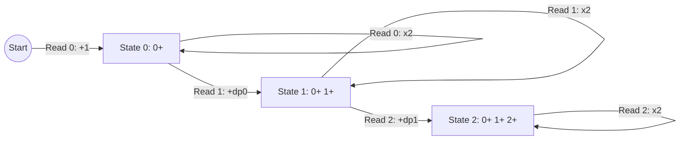

# Guided Example: Count Number of Special Subsequences

We formulate and trace the 3-state finite automaton dynamic programming recurrence on representative arrays to count index-distinct special subsequences modulo $10^9+7$.

- **Primary Instance:** `nums = [0, 1, 2, 0, 1, 2]` ($N = 6$)
  - Expected Output: `7`
- **Secondary Instance:** `nums = [0, 1, 2, 2]` ($N = 4$)
  - Expected Output: `3`

---

## 1. Instance & Intuition

A subsequence is termed *special* if and only if it strictly matches the regular language pattern:
$$\mathcal{L} = 0^+ 1^+ 2^+$$
That is, the subsequence contains one or more `0`s, followed by one or more `1`s, followed by one or more `2`s, with no other values or out-of-order transitions.

Subsequences are distinguished by their **source index sets**. For example, in `nums = [0, 1, 2, 2]`:
- Selecting indices `(0, 1, 2)` produces `[0, 1, 2]`.
- Selecting indices `(0, 1, 3)` produces `[0, 1, 2]`.
- Selecting indices `(0, 1, 2, 3)` produces `[0, 1, 2, 2]`.

All three are valid and distinct.

A naive combinatorial enumeration generates $2^N$ subsequences, which is impossible for $N = 10^5$. However, the pattern consists of three distinct linear phases:
1. **Phase 0:** Prefix matching $0^+$.
2. **Phase 1:** Prefix matching $0^+ 1^+$.
3. **Phase 2:** Completed special subsequence matching $0^+ 1^+ 2^+$.

When inspecting the current number $x$, each existing prefix in phase $k$ can either incorporate $x$ or omit $x$. The linear automaton structure allows rolling prefix counts in $\mathcal{O}(1)$ space and $\mathcal{O}(N)$ time.

---

## 2. Mathematical Formalism & State Transitions

Let $dp_0, dp_1, dp_2$ denote the number of valid subsequences formed so far in Phase 0, Phase 1, and Phase 2, respectively.
All calculations are performed in the quotient ring $\mathbb{Z} / (10^9 + 7)\mathbb{Z}$.

### Initial Conditions

Before processing any elements:
$$dp_0 = 0, \quad dp_1 = 0, \quad dp_2 = 0$$

### State Update Rules on Reading Element $x$

1. **When $x = 0$:**
   - Omit the current 0: retain existing $dp_0$ configurations.
   - Append to an existing $0^+$ prefix: $dp_0$ new configurations.
   - Start a brand new sequence of just this 0: $1$ new configuration.
   $$dp_0 \leftarrow (2 \cdot dp_0 + 1) \pmod{10^9+7}$$
   Phases 1 and 2 remain unchanged because a 0 cannot follow a 1 or 2.

2. **When $x = 1$:**
   - Omit the current 1: retain existing $dp_1$ configurations.
   - Append to an existing $0^+ 1^+$ prefix: $dp_1$ new configurations.
   - Transition from a $0^+$ prefix by appending this 1: $dp_0$ new configurations.
   $$dp_1 \leftarrow (2 \cdot dp_1 + dp_0) \pmod{10^9+7}$$
   Phases 0 and 2 remain unchanged.

3. **When $x = 2$:**
   - Omit the current 2: retain existing $dp_2$ configurations.
   - Append to an existing $0^+ 1^+ 2^+$ sequence: $dp_2$ new configurations.
   - Transition from a $0^+ 1^+$ prefix by appending this 2: $dp_1$ new configurations.
   $$dp_2 \leftarrow (2 \cdot dp_2 + dp_1) \pmod{10^9+7}$$
   Phases 0 and 1 remain unchanged.

---

## 3. Step-by-Step State Evolution

We trace the primary instance `nums = [0, 1, 2, 0, 1, 2]`:

- **Initial:** $[dp_0, dp_1, dp_2] = [0, 0, 0]$.

- **Step 1 ($i = 0, nums[0] = 0$):**
  - $dp_0 \leftarrow 2(0) + 1 = 1$. Subsequence: `{(0)}`.
  - State: $[1, 0, 0]$.

- **Step 2 ($i = 1, nums[1] = 1$):**
  - $dp_1 \leftarrow 2(0) + dp_0 = 0 + 1 = 1$. Subsequence: `{(0, 1)}`.
  - State: $[1, 1, 0]$.

- **Step 3 ($i = 2, nums[2] = 2$):**
  - $dp_2 \leftarrow 2(0) + dp_1 = 0 + 1 = 1$. Subsequence: `{(0, 1, 2)}`.
  - State: $[1, 1, 1]$.

- **Step 4 ($i = 3, nums[3] = 0$):**
  - $dp_0 \leftarrow 2(1) + 1 = 3$. Subsequences: `{(0), (3), (0, 3)}`.
  - State: $[3, 1, 1]$.

- **Step 5 ($i = 4, nums[4] = 1$):**
  - $dp_1 \leftarrow 2(1) + dp_0 = 2 + 3 = 5$.
  - Prior $dp_1$ sequences duplicated: `{(0, 1)}`, `{(0, 1, 4)}`.
  - Transitions from $dp_0$: `{(0, 4)}`, `{(3, 4)}`, `{(0, 3, 4)}`. Total $= 2 + 3 = 5$.
  - State: $[3, 5, 1]$.

- **Step 6 ($i = 5, nums[5] = 2$):**
  - $dp_2 \leftarrow 2(1) + dp_1 = 2 + 5 = 7$.
  - Prior $dp_2$ sequences duplicated: `{(0, 1, 2)}`, `{(0, 1, 2, 5)}`.
  - Transitions from $dp_1$ appending index 5:
    - From `(0, 1)`: `{(0, 1, 5)}`
    - From `(0, 1, 4)`: `{(0, 1, 4, 5)}`
    - From `(0, 4)`: `{(0, 4, 5)}`
    - From `(3, 4)`: `{(3, 4, 5)}`
    - From `(0, 3, 4)`: `{(0, 3, 4, 5)}`
  - Total $dp_2 = 2 + 5 = 7$.
  - State: $[3, 5, 7]$.

Final answer emitted: $dp_2 = 7$.

---

## 4. Execution Trace Table

### Primary Trace: `[0, 1, 2, 0, 1, 2]`

| Step $i$ | Value $nums[i]$ | Active Transition Recurrence | $dp_0$ ($0^+$) | $dp_1$ ($0^+ 1^+$) | $dp_2$ ($0^+ 1^+ 2^+$) | Incremental Meaning |
|---|---|---|---|---|---|---|
| Initial | None | Boundary condition | 0 | 0 | 0 | Empty set |
| 0 | 0 | $dp_0 \leftarrow 2(0) + 1$ | 1 | 0 | 0 | First `0` at index 0 |
| 1 | 1 | $dp_1 \leftarrow 2(0) + 1$ | 1 | 1 | 0 | Extends to `(0, 1)` |
| 2 | 2 | $dp_2 \leftarrow 2(0) + 1$ | 1 | 1 | 1 | First valid special `(0, 1, 2)` |
| 3 | 0 | $dp_0 \leftarrow 2(1) + 1$ | 3 | 1 | 1 | Index 3 adds standalone and combined 0s |
| 4 | 1 | $dp_1 \leftarrow 2(1) + 3$ | 3 | 5 | 1 | Index 4 merges with all 3 preceding 0-prefixes |
| 5 | 2 | $dp_2 \leftarrow 2(1) + 5$ | 3 | 5 | 7 | Index 5 completes 5 new special subsequences |

### Secondary Trace: `[0, 1, 2, 2]`

| Step $i$ | Value $nums[i]$ | Active Transition Recurrence | $dp_0$ | $dp_1$ | $dp_2$ | Subsequence Index Sets Recorded |
|---|---|---|---|---|---|---|
| Initial | None | Base initialization | 0 | 0 | 0 | None |
| 0 | 0 | $dp_0 \leftarrow 2(0) + 1 = 1$ | 1 | 0 | 0 | `{(0)}` |
| 1 | 1 | $dp_1 \leftarrow 2(0) + 1 = 1$ | 1 | 1 | 0 | `{(0, 1)}` |
| 2 | 2 | $dp_2 \leftarrow 2(0) + 1 = 1$ | 1 | 1 | 1 | `{(0, 1, 2)}` |
| 3 | 2 | $dp_2 \leftarrow 2(1) + 1 = 3$ | 1 | 1 | 3 | `{(0, 1, 2)}`, `{(0, 1, 3)}`, `{(0, 1, 2, 3)}` |

---

## 5. Algorithmic Correctness & Soundness

**Soundness.** We prove by induction on the prefix length that after processing $nums[0 \dots k]$:
- $dp_0$ is the exact number of index subsequences matching $0^+$.
- $dp_1$ is the exact number of index subsequences matching $0^+ 1^+$.
- $dp_2$ is the exact number of index subsequences matching $0^+ 1^+ 2^+$.

*Inductive Step:* Consider element $nums[k] = 1$. Any valid $0^+ 1^+$ subsequence either includes index $k$ or does not.
1. If it does not include index $k$, it must have been formed solely from $nums[0 \dots k-1]$, which gives $dp_1$ options.
2. If it includes index $k$, the preceding element must be either a $0$ or a $1$. If the predecessor was a $1$, the prefix up to index $k-1$ was already in phase $1$ ($dp_1$ options). If the predecessor was a $0$, the prefix was in phase $0$ ($dp_0$ options).
Summing these mutually exclusive and exhaustive cases gives $dp_1 + dp_1 + dp_0 = 2 \cdot dp_1 + dp_0$.
The same partition holds identically for $x = 0$ (with $+1$ for starting a new sequence) and $x = 2$. Modulo operations preserve equivalence in the integer ring.

**Completeness.** Every special subsequence ends with a $2$, preceded by some $1$, preceded by some $0$. Since all possible subset inclusion/exclusion branches are accounted for without dropping any transitions, every valid index set is counted exactly once.

---

## 6. Edge Cases & Traps

- **Missing Phases:** If the array contains no zeros (e.g., `[1, 2, 2]`), $dp_0$ remains 0, so $dp_1$ and $dp_2$ will never increment, correctly returning 0.
- **Out of Order Elements:** An array like `[2, 2, 0, 0]` reads twos first (where $dp_1 = 0$, so $dp_2$ stays 0), and later zeros (which cannot transition to higher phases without subsequent ones and twos). The final answer is correctly 0.
- **Arithmetic Overflow Before Modulo:** The computation $2 \cdot dp_k + dp_{k-1}$ can reach $3 \times (10^9 + 7) \approx 3 \times 10^9$, exceeding 32-bit signed integer capacity. Modulo arithmetic or 64-bit integer types must be employed at every addition step.

---

## 7. Complexity Analysis

- **Time Complexity:**
  - A single pass of length $N$ scans each number.
  - At each step, a single switch-case executes one modular addition/multiplication in $\mathcal{O}(1)$ time.
  - Total time complexity is strictly $\mathcal{O}(N)$.
- **Auxiliary Space Complexity:**
  - The DP state requires only three scalar integer variables ($dp_0, dp_1, dp_2$).
  - Total auxiliary space is $\mathcal{O}(1)$.