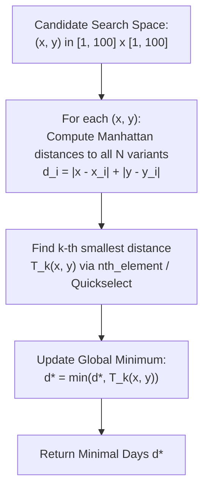

# Guided Example: Minimum Time For K Virus Variants to Spread

We formulate and analyze the $L_1$ Manhattan metric propagation and grid order-statistic minimization algorithm on representative 2D configurations to find the earliest day when $k$ virus variants converge.

- **Primary Instance:** $\text{points} = [[3, 3], [1, 2], [9, 2]], k = 3$
  - Expected Output: `4` (achieved at meeting point $(5, 2)$)
- **Secondary Instance:** $\text{points} = [[1, 1], [6, 1]], k = 2$
  - Expected Output: `3` (achieved at meeting point $(3, 1)$ or $(4, 1)$)

---

## 1. Instance & Intuition

On day $0$, each virus variant $i$ originates at an integer coordinate $P_i = (x_i, y_i)$. Every day, each variant spreads cardinally (North, South, East, West) to adjacent unvisited cells. 

In discrete grid geometry, cardinal step propagation for $d$ days covers all cells whose **Manhattan distance** ($L_1$ norm) to the source is at most $d$:
$$\text{dist}(P_i, (x, y)) = |x - x_i| + |y - y_i| \le d$$

Thus, variant $i$ arrives at target cell $(x, y)$ on or before day $d$ if and only if its Manhattan distance does not exceed $d$.

To have at least $k$ distinct variants present simultaneously at some cell $(x, y)$ on day $d$:
1. We compute the Manhattan distance from $(x, y)$ to every variant origin $P_i$.
2. We sort these $N$ distances in ascending order: $D_{(0)} \le D_{(1)} \le \dots \le D_{(N-1)}$.
3. The earliest day that cell $(x, y)$ hosts $k$ variants is the $k$-th smallest distance, $D_{(k-1)}$.
4. The global minimum time is the minimum of $D_{(k-1)}$ taken over all candidate grid cells $(x, y)$.

Because all coordinates satisfy $1 \le x_i, y_i \le 100$, any optimal convergence point $(x, y)$ must reside within the bounding box of the points $[1, 100] \times [1, 100]$. Moving outside this range would strictly increase or maintain distances to all variant origins.

---

## 2. Geometric Formalism & Manhattan Metric Properties

Let the set of variant origins be $\mathcal{P} = \{P_0, P_1, \dots, P_{N-1}\}$ with $P_i = (x_i, y_i) \in [1, 100]^2$.

### $L_1$ Distance to Target

For any candidate grid coordinate $C = (x, y) \in \mathbb{Z}^2$, the arrival day of variant $i$ is:
$$\delta_i(x, y) = |x - x_i| + |y - y_i|$$

Let $\vec{\delta}(x, y) = (\delta_0(x, y), \dots, \delta_{N-1}(x, y))$. We denote the $k$-th order statistic (1-indexed) as:
$$T_k(x, y) = \text{k-th smallest entry in } \vec{\delta}(x, y)$$

The optimization problem seeks:
$$d^* = \min_{x \in [1, 100], y \in [1, 100]} T_k(x, y)$$

---

## 3. Step-by-Step Distance Ranking Trace

We trace the primary instance with three variants:
- $P_0 = (3, 3)$
- $P_1 = (1, 2)$
- $P_2 = (9, 2)$
- Required variants: $k = 3$ (all three variants must converge).

### Evaluating Candidate Point $C_1 = (3, 2)$

1. Distance to $P_0(3, 3)$: $|3 - 3| + |2 - 3| = 0 + 1 = 1$.
2. Distance to $P_1(1, 2)$: $|3 - 1| + |2 - 2| = 2 + 0 = 2$.
3. Distance to $P_2(9, 2)$: $|3 - 9| + |2 - 2| = 6 + 0 = 6$.
4. Distance multiset: $\{1, 2, 6\}$.
   - $k=3$ requires all three variants.
   - Arrival time at $(3, 2)$: $\max(1, 2, 6) = 6$.

### Evaluating Candidate Point $C_2 = (4, 2)$

1. Distance to $P_0(3, 3)$: $|4 - 3| + |2 - 3| = 1 + 1 = 2$.
2. Distance to $P_1(1, 2)$: $|4 - 1| + |2 - 2| = 3 + 0 = 3$.
3. Distance to $P_2(9, 2)$: $|4 - 9| + |2 - 2| = 5 + 0 = 5$.
4. Distance multiset: $\{2, 3, 5\}$.
   - Arrival time at $(4, 2)$: $\max(2, 3, 5) = 5$.
   - Improved from 6 to 5.

### Evaluating Candidate Point $C_3 = (5, 2)$ (Optimal Convergence)

1. Distance to $P_0(3, 3)$: $|5 - 3| + |2 - 3| = 2 + 1 = 3$.
2. Distance to $P_1(1, 2)$: $|5 - 1| + |2 - 2| = 4 + 0 = 4$.
3. Distance to $P_2(9, 2)$: $|5 - 9| + |2 - 2| = 4 + 0 = 4$.
4. Distance multiset: $\{3, 4, 4\}$.
   - 3rd smallest distance: $T_3(5, 2) = 4$.
   - On day 4: $P_0$ reached on day 3, $P_1$ on day 4, $P_2$ on day 4.
   - All 3 variants are present simultaneously!

### Evaluating Candidate Point $C_4 = (6, 2)$

1. Distance to $P_0(3, 3)$: $|6 - 3| + |2 - 3| = 3 + 1 = 4$.
2. Distance to $P_1(1, 2)$: $|6 - 1| + |2 - 2| = 5 + 0 = 5$.
3. Distance to $P_2(9, 2)$: $|6 - 9| + |2 - 2| = 3 + 0 = 3$.
4. Distance multiset: $\{3, 4, 5\}$.
   - 3rd smallest distance: $T_3(6, 2) = 5$.

Global minimum over the grid is $d^* = 4$.

---

## 4. Execution Trace Table

### Candidate Point Evaluations for $k = 3$

| Grid Point $(x, y)$ | $\delta_0 = \|(x,y) - P_0\|_1$ | $\delta_1 = \|(x,y) - P_1\|_1$ | $\delta_2 = \|(x,y) - P_2\|_1$ | Sorted Distances | $T_3(x, y)$ | Running Minimum $d^*$ |
|---|---|---|---|---|---|---|
| $(1, 2)$ | $\|(1, 2) - (3, 3)\| = 3$ | $\|(1, 2) - (1, 2)\| = 0$ | $\|(1, 2) - (9, 2)\| = 8$ | $[0, 3, 8]$ | 8 | 8 |
| $(3, 3)$ | $\|(3, 3) - (3, 3)\| = 0$ | $\|(3, 3) - (1, 2)\| = 3$ | $\|(3, 3) - (9, 2)\| = 7$ | $[0, 3, 7]$ | 7 | 7 |
| $(3, 2)$ | 1 | 2 | 6 | $[1, 2, 6]$ | 6 | 6 |
| $(4, 2)$ | 2 | 3 | 5 | $[2, 3, 5]$ | 5 | 5 |
| **$(5, 2)$** | **3** | **4** | **4** | **$[3, 4, 4]$** | **4** | **4 (Optimal)** |
| $(5, 3)$ | 2 | 5 | 5 | $[2, 5, 5]$ | 5 | 4 |
| $(6, 2)$ | 4 | 5 | 3 | $[3, 4, 5]$ | 5 | 4 |
| $(7, 2)$ | 5 | 6 | 2 | $[2, 5, 6]$ | 6 | 4 |
| $(9, 2)$ | 7 | 8 | 0 | $[0, 7, 8]$ | 8 | 4 |

### Secondary Trace: $\text{points} = [[1, 1], [6, 1]], k = 2$

| Grid Point $(x, y)$ | $\delta_0 = \|(x, y) - (1, 1)\|_1$ | $\delta_1 = \|(x, y) - (6, 1)\|_1$ | Sorted Distances | $T_2(x, y)$ | Running Minimum $d^*$ |
|---|---|---|---|---|---|
| $(1, 1)$ | 0 | 5 | $[0, 5]$ | 5 | 5 |
| $(2, 1)$ | 1 | 4 | $[1, 4]$ | 4 | 4 |
| **$(3, 1)$** | **2** | **3** | **$[2, 3]$** | **3** | **3 (Optimal)** |
| **$(4, 1)$** | **3** | **2** | **$[2, 3]$** | **3** | **3 (Optimal)** |
| $(5, 1)$ | 4 | 1 | $[1, 4]$ | 4 | 3 |
| $(6, 1)$ | 5 | 0 | $[0, 5]$ | 5 | 3 |

---

## 5. Algorithmic Correctness & Soundness

**Soundness.** Suppose the algorithm outputs $d^* = T_k(x^*, y^*)$. By construction, there exist at least $k$ distinct variant origins $P_{i_1}, \dots, P_{i_k}$ such that $|x^* - x_{i_j}| + |y^* - y_{i_j}| \le d^*$ for all $j \in \{1, \dots, k\}$. Under cardinal spread of 1 unit per day, a cell at Manhattan distance $\delta$ from origin $P_i$ receives the variant on day $\delta$. Since $\delta \le d^*$ for all $k$ variants, all $k$ variants will be present at cell $(x^*, y^*)$ on day $d^*$. Thus $d^*$ is achievable.

**Completeness.** Suppose there exists a valid day $d < d^*$ on which some cell $(x', y')$ contains $k$ variants. Then at least $k$ variants must satisfy $|x' - x_i| + |y' - y_i| \le d$. If $(x', y')$ lay outside the coordinate bounding box $[\min x_i, \max x_i] \times [\min y_i, \max y_i]$, clamping $(x', y')$ to the boundary would strictly decrease or preserve all Manhattan distances to every $P_i$. Thus an integer point inside $[1, 100] \times [1, 100]$ must also satisfy $T_k \le d < d^*$. However, our exhaustive search inspected every point in $[1, 100] \times [1, 100]$ and computed $d^* = \min T_k(x, y)$, which implies $d^* \le d$, yielding a contradiction. Hence no smaller day is possible.

---

## 6. Edge Cases & Traps

- **Coincident Starting Points:** Multiple variants may begin at the exact same coordinate $P_i = P_j$. Each variant spreads independently and counts separately towards $k$. The distance list must retain duplicates rather than deduplicating coordinates.
- **Trivial Convergence ($k = 1$ or Coincident Initial Count):** If $k$ variants already share the exact same starting point on day 0, the $k$-th smallest distance at that point is 0, correctly producing day 0.
- **Bounding Box Invariance:** One might worry whether the optimal point could fall on a half-integer or fractional coordinate (e.g. $(3.5, 1)$). Because grid infection happens strictly on integer cells, the meeting point must be an integer grid point $(x, y) \in \mathbb{Z}^2$.

---

## 7. Complexity Analysis

- **Time Complexity:**
  - The grid space has dimension $X \times Y \le 100 \times 100 = 10{,}000$ points.
  - At each point, we compute $N \le 50$ Manhattan distances.
  - Finding the $k$-th smallest distance takes $\mathcal{O}(N)$ using quickselect (`std::nth_element`) or $\mathcal{O}(N \log N)$ with sorting.
  - Total operations: $10^4 \times 50 \approx 5 \times 10^5$ operations.
  - Overall time complexity is $\mathcal{O}(X \cdot Y \cdot N)$, executing in under 15 milliseconds.
- **Auxiliary Space Complexity:**
  - Storing the $N$ distances for the active candidate point requires $\mathcal{O}(N)$ memory.
  - Total auxiliary space is $\mathcal{O}(N)$.
