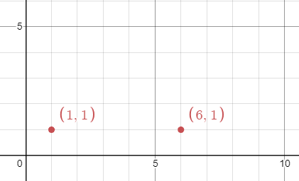
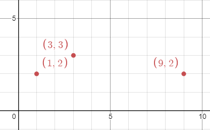

## Description

There are `n` **unique** virus variants in an infinite 2D grid. You are given a 2D array `points`, where $\text{points}[i] = [x_{i}, y_{i}]$ represents a virus originating at $(x_{i}, y_{i})$ on day `0`. Note that it is possible for **multiple **virus variants to originate at the **same** point.

Every day, each cell infected with a virus variant will spread the virus to **all **neighboring points in the **four** cardinal directions (i.e. up, down, left, and right). If a cell has multiple variants, all the variants will spread without interfering with each other.

Given an integer `k`, return *the **minimum integer** number of days for **any** point to contain **at least** *`k`* of the unique virus variants*.
### Function Contract

- Refer to method signature.

### Examples

#### Example 1

- **Input:** $points = [[1,1],[6,1]], k = 2$
- **Output:** `3`
- **Explanation:** On day 3, points (3,1) and (4,1) will contain both virus variants. Note that these are not the only points that will contain both virus variants.
#### Example 2

- **Input:** $points = [[3,3],[1,2],[9,2]], k = 2$
- **Output:** `2`
- **Explanation:** On day 2, points (1,3), (2,3), (2,2), and (3,2) will contain the first two viruses. Note that these are not the only points that will contain both virus variants.
#### Example 3

- **Input:** $points = [[3,3],[1,2],[9,2]], k = 3$
- **Output:** `4`
- **Explanation:** On day 4, the point (5,2) will contain all 3 viruses. Note that this is not the only point that will contain all 3 virus variants.
### Constraints

- $n = \text{points.length}$

- $2 \le n \le 50$

- $\text{points}[i].length = 2$

- $1 \le x_{i}, y_{i} \le 100$

- $2 \le k \le n$