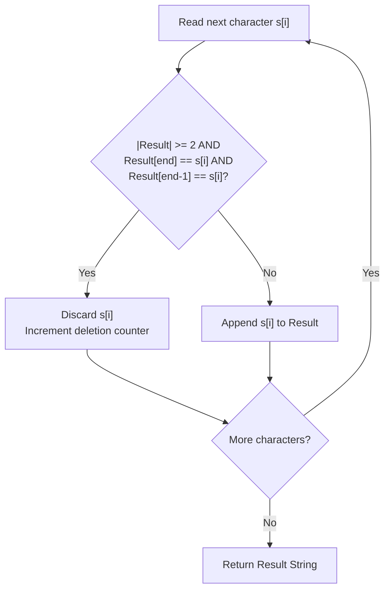

# Guided Example: Delete Characters to Make Fancy String

We trace and analyze the one-pass greedy run-length clamping algorithm on representative string instances to construct the unique minimal-deletion fancy string.

- **Primary Instance:** `s = "aaabaaaa"` ($N = 8$)
  - Expected Output: `"aabaa"` (deletes 3 characters)
- **Secondary Instance:** `s = "leeetcode"` ($N = 9$)
  - Expected Output: `"leetcode"` (deletes 1 character)

---

## 1. Instance & Intuition

A string is defined as *fancy* if it does not contain three consecutive identical characters. That is, for any character $c$, the substring $c c c$ is strictly forbidden.

When an input string contains a contiguous block of identical characters $c^k$ with $k \ge 3$:
1. To eliminate three consecutive occurrences within this block, at least $k - 2$ characters must be deleted.
2. Deleting any additional characters from this block beyond $k - 2$ would only increase total deletions unnecessarily.
3. Because the characters immediately preceding and succeeding this block are different from $c$ (by definition of a maximal contiguous block), keeping exactly $\min(k, 2)$ characters can never produce three consecutive identical characters across block boundaries.

Consequently, the global minimum deletion problem decomposes into independent local clampings of each contiguous character run to at most length 2:
$$c^k \longrightarrow c^{\min(k, 2)}$$

In `s = "aaabaaaa"`:
- The first run is `'a'` of length 3: clamped to length 2 (`"aa"`), deleting 1 `'a'`.
- The second run is `'b'` of length 1: preserved unchanged (`"b"`).
- The third run is `'a'` of length 4: clamped to length 2 (`"aa"`), deleting 2 `'a'`s.
- The resulting string is `"aabaa"`, deleting $1 + 0 + 2 = 3$ characters.

---

## 2. Formal Invariants & Run-Length Clamping

Let $s$ be decomposed into maximal monochromatic contiguous segments:
$$s = c_1^{k_1} c_2^{k_2} \dots c_m^{k_m}$$
where $c_j \in \{\texttt{'a'}, \dots, \texttt{'z'}\}$ and $c_j \neq c_{j+1}$ for all $1 \le j < m$.

### Output Structure

The unique minimum-deletion fancy string is:
$$f(s) = c_1^{\min(k_1, 2)} c_2^{\min(k_2, 2)} \dots c_m^{\min(k_m, 2)}$$

### Streaming Invariant

We can construct $f(s)$ incrementally in a single left-to-right streaming pass. Let $R$ be the accumulated result string. When examining character $s[i]$:
$$\text{Append } s[i] \iff |R| < 2 \;\vee\; R[|R|-1] \neq s[i] \;\vee\; R[|R|-2] \neq s[i]$$

If the last two characters in $R$ are already identical to $s[i]$, appending $s[i]$ would create a run of 3 identical characters. Hence $s[i]$ must be dropped.

---

## 3. Step-by-Step Character-by-Character Trace

We trace the streaming evaluation of `s = "aaabaaaa"`:

- **Initial:** Result buffer $R = \texttt{""}$, Deletions $= 0$.

- **Step 1 ($i = 0, s[0] = \texttt{'a'}$):**
  - $|R| = 0 < 2$. Condition satisfied.
  - Append `'a'`. $R = \texttt{"a"}$.

- **Step 2 ($i = 1, s[1] = \texttt{'a'}$):**
  - $|R| = 1 < 2$. Condition satisfied.
  - Append `'a'`. $R = \texttt{"aa"}$.

- **Step 3 ($i = 2, s[2] = \texttt{'a'}$):**
  - $|R| = 2$. Last two characters are $R[1] = \texttt{'a'}$ and $R[0] = \texttt{'a'}$.
  - $s[2] == R[1] == R[0] == \texttt{'a'}$.
  - **Discard** $s[2]$. $R = \texttt{"aa"}$, Deletions $= 1$.

- **Step 4 ($i = 3, s[3] = \texttt{'b'}$):**
  - $s[3] = \texttt{'b'} \neq R[1] = \texttt{'a'}$.
  - Append `'b'`. $R = \texttt{"aab"}$.

- **Step 5 ($i = 4, s[4] = \texttt{'a'}$):**
  - $R = \texttt{"aab"}$. Last two are $\texttt{'a'}$ and $\texttt{'b'}$.
  - Since $R[2] = \texttt{'b'} \neq \texttt{'a'}$, condition satisfied.
  - Append `'a'`. $R = \texttt{"aaba"}$.

- **Step 6 ($i = 5, s[5] = \texttt{'a'}$):**
  - $R = \texttt{"aaba"}$. Last two are $R[3] = \texttt{'a'}$, $R[2] = \texttt{'b'}$.
  - They are not both `'a'`. Condition satisfied.
  - Append `'a'`. $R = \texttt{"aabaa"}$.

- **Step 7 ($i = 6, s[6] = \texttt{'a'}$):**
  - $R = \texttt{"aabaa"}$. Last two are $R[4] = \texttt{'a'}$, $R[3] = \texttt{'a'}$.
  - Both equal $s[6] = \texttt{'a'}$.
  - **Discard** $s[6]$. $R = \texttt{"aabaa"}$, Deletions $= 2$.

- **Step 8 ($i = 7, s[7] = \texttt{'a'}$):**
  - $R = \texttt{"aabaa"}$. Last two are both `'a'`.
  - **Discard** $s[7]$. $R = \texttt{"aabaa"}$, Deletions $= 3$.

Final fancy string is `"aabaa"`.

---

## 4. Execution Trace Table

### Primary Trace: `s = "aaabaaaa"`

| Index $i$ | Character $s[i]$ | Buffer $\lvert R \rvert$ | Last Two Characters in $R$ | Triplet Conflict? | Action Taken | Current Result $R$ | Cumulative Deletions |
|---|---|---|---|---|---|---|---|
| 0 | `a` | 0 | None | No ($\lvert R \rvert < 2$) | Append `a` | `"a"` | 0 |
| 1 | `a` | 1 | `a` | No ($\lvert R \rvert < 2$) | Append `a` | `"aa"` | 0 |
| 2 | `a` | 2 | `a`, `a` | **Yes (`a` == `a` == `a`)** | Discard `a` | `"aa"` | 1 |
| 3 | `b` | 2 | `a`, `a` | No (`b` != `a`) | Append `b` | `"aab"` | 1 |
| 4 | `a` | 3 | `a`, `b` | No (`a` != `b`) | Append `a` | `"aaba"` | 1 |
| 5 | `a` | 4 | `b`, `a` | No (`b` != `a`) | Append `a` | `"aabaa"` | 1 |
| 6 | `a` | 5 | `a`, `a` | **Yes (`a` == `a` == `a`)** | Discard `a` | `"aabaa"` | 2 |
| 7 | `a` | 5 | `a`, `a` | **Yes (`a` == `a` == `a`)** | Discard `a` | `"aabaa"` | 3 |

### Secondary Trace: `s = "leeetcode"`

| Index $i$ | Character $s[i]$ | Buffer Tail ($R[-2], R[-1]$) | Conflict? | Action Taken | Current Result $R$ |
|---|---|---|---|---|---|
| 0 | `l` | N/A | No | Append | `"l"` |
| 1 | `e` | N/A | No | Append | `"le"` |
| 2 | `e` | `l`, `e` | No | Append | `"lee"` |
| 3 | `e` | `e`, `e` | **Yes** | Discard | `"lee"` |
| 4 | `t` | `e`, `e` | No | Append | `"leet"` |
| 5 | `c` | `e`, `t` | No | Append | `"leetc"` |
| 6 | `o` | `t`, `c` | No | Append | `"leetco"` |
| 7 | `d` | `c`, `o` | No | Append | `"leetcod"` |
| 8 | `e` | `o`, `d` | No | Append | `"leetcode"` |

---

## 5. Algorithmic Correctness & Soundness

**Soundness.** Let $R$ be the string produced by the greedy streaming rule. At no point can $R$ contain three equal consecutive characters: if $R$ already ended with two identical characters $c c$, any incoming $c$ is unconditionally rejected. Furthermore, adjacent blocks of characters come from different original monochromatic segments ($c_j \neq c_{j+1}$), so no triplet can arise across block boundaries. Thus, $R$ is strictly fancy.

**Completeness & Minimality.** Consider any maximal contiguous run of identical characters $c^k$ in $s$. In any valid fancy string, this run can contribute at most 2 characters; otherwise, three consecutive $c$'s would appear. Therefore, at least $\max(0, k - 2)$ characters must be deleted from this segment. Summing over all segments $j \in \{1, \dots, m\}$:
$$\text{Deletions} \ge \sum_{j=1}^m \max(0, k_j - 2)$$
The greedy algorithm achieves exactly this lower bound by preserving $\min(k_j, 2)$ characters from each segment. Because relative order is preserved and the number of deletions attains the theoretical minimum, the resulting string is the unique optimal fancy string.

---

## 6. Edge Cases & Traps

- **Short Strings ($N < 3$):** If $s$ has length 1 or 2 (e.g. `"a"` or `"aa"`), it is already fancy. The buffer check $|R| < 2$ naturally admits the characters without bounds errors or negative indices.
- **Homogeneous Strings:** If $s = \texttt{"aaaaa"}$ ($N = 5$), the first two are kept and all remaining $N - 2$ are dropped, yielding `"aa"`.
- **String Immutability Pitfall:** In languages with immutable strings, repeated string concatenation (`res += c`) inside a loop allocates $\mathcal{O}(N^2)$ characters, leading to Time Limit Exceeded. A dynamic character buffer, array builder, or list join guarantees linear time.

---

## 7. Complexity Analysis

- **Time Complexity:**
  - A single pass iterates $N$ characters from index $0$ to $N-1$.
  - At each step, inspecting the last two elements of the buffer and conditionally appending takes $\mathcal{O}(1)$ amortized time.
  - Final string conversion from the character buffer takes $\mathcal{O}(N)$.
  - Total time complexity is strictly $\mathcal{O}(N)$.
- **Auxiliary Space Complexity:**
  - Storing the output string requires at most $N$ characters: $\mathcal{O}(N)$.
  - Outside of the output buffer, only scalar loop indices are used: $\mathcal{O}(1)$ auxiliary space.
