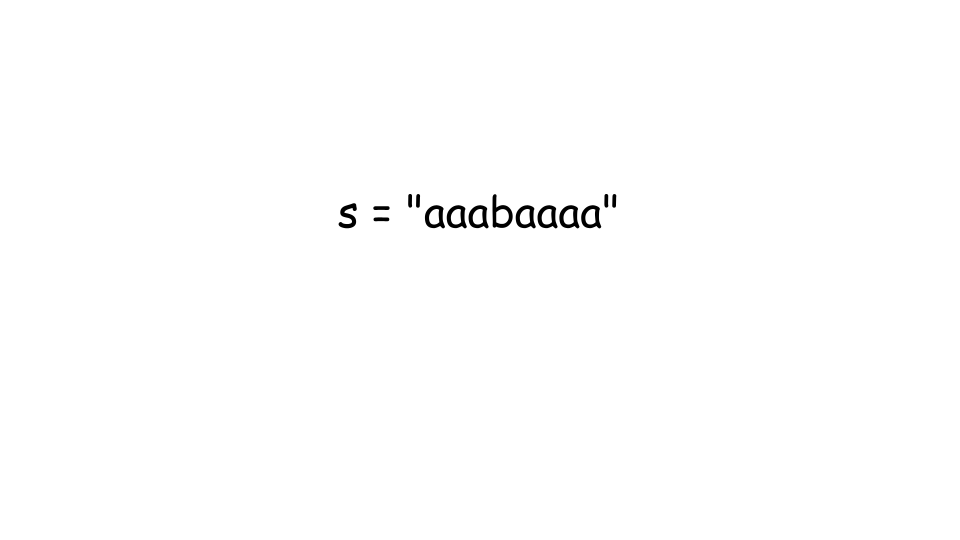
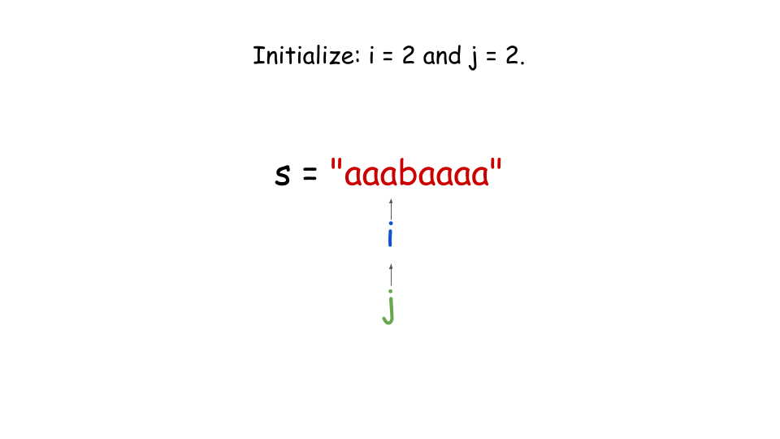
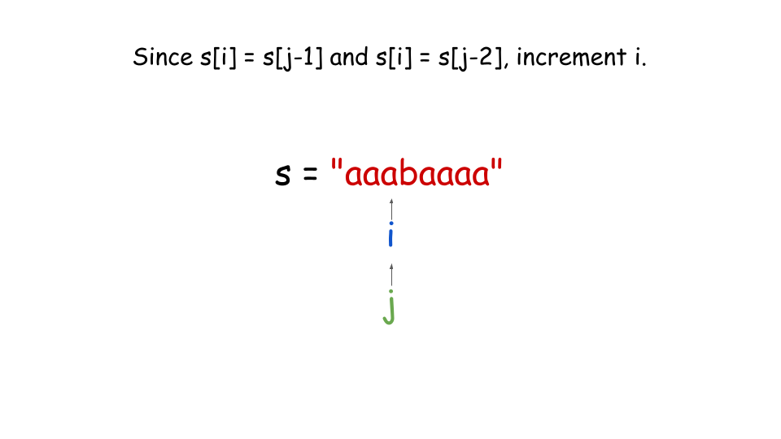
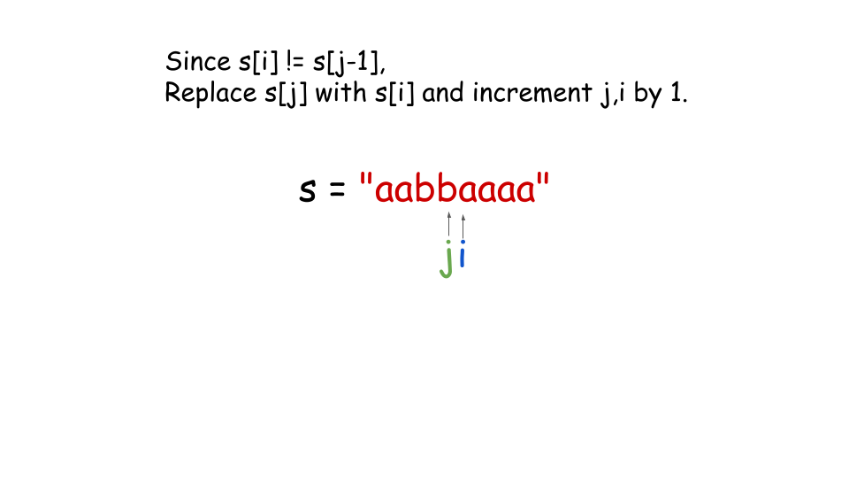
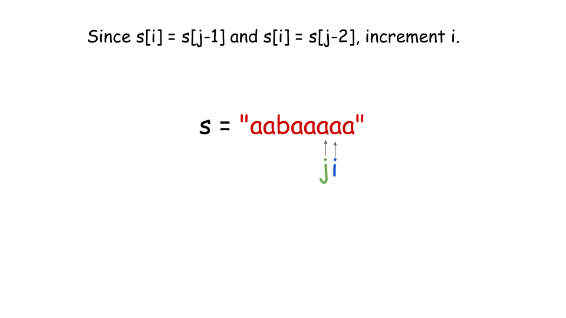
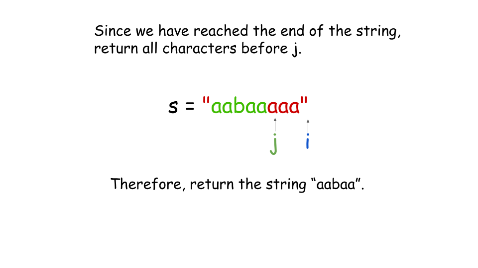

## Solution

---

### Approach 1: Insert characters in a new string

#### Intuition

We need to modify a string by removing characters so that no three consecutive characters are the same. So, while two identical characters in a row are fine, three or more repeated ones aren't allowed. Our goal is to make the fewest changes possible to achieve this.

The idea is simple: we go through the string and track how many times each character repeats in a row. If a character repeats fewer than three times, we can leave it as is. But when we hit three or more consecutive identical characters, we need to remove the extra ones—keeping only the first two.

For example, if we have the string "aaabbb", we keep the first two 'a's and remove the third one. Then, we do the same for 'b'. This guarantees that we never have three consecutive identical characters, and we’re only removing characters when it’s absolutely necessary.

#### Algorithm

1. Set `prev` to the first character of the string ($s[0]$), to keep track of the previous character.
2. Initialize `frequency` to 1, which counts the consecutive occurrences of `prev`.
3. Create a string `ans` to store the resulting fancy string, and append the first character of `s` to it.
4. Iterate through the string starting from the second character:
- If $s[i]$ is the same as `prev`:
- Increment `frequency` by 1 (since it's the same as the previous character).
- Otherwise:
- Update `prev` to the current character $s[i]$.
- Reset `frequency` to 1, as a new character is encountered.
- If `frequency` < 3, append the current character $s[i]$ to `ans`. This ensures that no three consecutive characters are added.
5. Return `ans`.

#### Implementation

```python
class Solution:
    def makeFancyString(self, s: str) -> str:

        prev = s[0]
        frequency = 1
        ans = s[0]

        for i in range(1, len(s)):
            if s[i] == prev:
                # If the current character is equal to the previous character, increment the
                # frequency.
                frequency += 1
            else:
                # Otherwise, we can restart the frequency counter with 1, and store the current
                # character's value in prev.
                prev = s[i]
                frequency = 1

            # If the frequency counter has value less than 3, add the character to the
            # answer string.
            if frequency < 3:
                ans += s[i]

        return ans
```

#### Complexity Analysis

Let `n` be the length of the string `s`.

- Time complexity: $O(n)$

    The algorithm processes each character in the string exactly once, iterating through the string from the first to the last character. For each character, it performs constant time operations. Since there are `n` characters in the string, the overall time complexity is given by $O(n)$.

- Space complexity: $O(n)$

    The `ans` string stores the resulting string, which in the worst case, could be the same size as the input string `s` (if no deletions are made). Therefore, the space required is $O(n)$.

---

### Approach 2: In-Place Two-Pointer Approach

#### Intuition

Can we avoid using a separate `ans` string to store the final result? If you think about it, the size of the result string (`ans`) is always less than or equal to the size of the original string `s`. So instead of building a new string, we can modify `s` directly by rearranging it in place.

To do this, we can use two pointers: one pointer, `i`, will go through the string as usual, while another pointer, `j`, will track the position where we place the next valid character. This way, we only make changes to `s` without needing extra space. Refer to [this](https://leetcode.com/explore/learn/card/array-and-string/205/array-two-pointer-technique/) explore card to learn more about the two-pointers algorithm.

As we iterate, we compare the current character $s[i]$ with the two characters right before it, $s[j - 1]$ and $s[j - 2]$. If $s[i]$ is different from both of these, it’s safe to place it at position `j` because it won't create three identical characters in a row. Once we place it, we move the `j` pointer forward.

At the end, we resize the string to the length of `j`, since that’s how many valid characters we’ve kept. This way, we solve the problem efficiently without needing any extra space, as all the changes happen directly in the original string.

#### Algorithm

1. If the length of `s` is less than 3, return `s`.
2. Set an integer variable `j` to 2, which will track the position in the string where the next valid character should be placed.
3. Iterate through the string starting from the third character (`i` = `2` to $\text{s.size}() - 1$):
- If $s[i]$ is not equal to the characters at positions $s[j - 1]$ or $s[j - 2]$, it indicates that adding $s[i]$ will not violate the condition of having three consecutive identical characters:
- Assign $s[i]$ to $s[j]$ and increment `j` by 1.
4. Resize the string `s` till the `j` index. This ensures that the resulting string contains only the valid characters up to index $j - 1$.
5. Return the modified string `s`.
















#### Implementation

```python
class Solution:
    def makeFancyString(self, s: str) -> str:
        # If size of string is less than 3, return it.
        if len(s) < 3:
            return s

        # Convert the string to a list for mutability.
        s_list = list(s)
        j = 2

        # Iterate through the string from index 2.
        for i in range(2, len(s)):
            # If the current character is not equal to the previously inserted
            # two characters, then we can add it to the result.
            if s_list[i] != s_list[j - 1] or s_list[i] != s_list[j - 2]:
                s_list[j] = s_list[i]
                j += 1

        # Resize the list to the number of valid characters and join it back into a string.
        return "".join(s_list[:j])
```

#### Complexity Analysis

Let `n` be the length of the string `s`.

- Time complexity: $O(n)$

    The algorithm processes each character in the string exactly once, iterating through the string from the first to the last character. For each character, it performs constant time operations. Since there are `n` characters in the string, the overall time complexity is given by $O(n)$.

- Space complexity: $O(1)$ or $O(n)$ depending on the programming language.

    The algorithm modifies the input string `s` in place and only uses integer variables, which do not depend on the length of the input string. Therefore, the space complexity is constant. However, since strings are immutable in both Java and Python, we cannot modify the input string in place and must create a new array / list to store the result. Consequently, the space complexity is $O(n)$ for Java and Python.

---