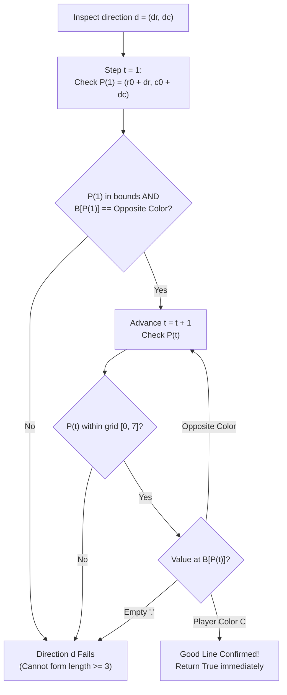

# Guided Example: Check if Move is Legal

We formulate and trace the 8-directional ray-casting search algorithm on representative Reversi board configurations to determine whether a placed disc completes a valid capture segment.

- **Primary Instance (Valid Move):** Move at $(4, 3)$ with color $\texttt{'B'}$ (Black)
  - Board configuration contains flanking white segments horizontally and vertically
  - Expected Output: `True`
- **Counter-Instance (Invalid Move):** Move at $(4, 4)$ with color $\texttt{'W'}$ (White)
  - No continuous ray terminates in a matching color without encountering empty cells
  - Expected Output: `False`

---

## 1. Instance & Intuition

In games of the Reversi/Othello family, a move consists of placing a disc of a designated color on an empty grid cell. A move is deemed **legal** if and only if the newly placed disc forms an endpoint of at least one *good line*.

A good line is defined by four strict geometric conditions:
1. **Collinearity:** It extends in one of the eight cardinal or intercardinal directions: North, South, East, West, North-East, North-West, South-East, or South-West.
2. **Minimal Length:** It spans at least 3 cells (length $\ge 3$).
3. **Endpoint Matching:** Both the start cell (the placed move) and the terminal cell must have the identical player color.
4. **Intermediate Inversion:** Every cell strictly between the two endpoints must contain a disc of the **opposite** color. No empty cells (`'.'`) or same-color discs may appear in the interior.

In our primary instance, placing $\texttt{'B'}$ at $(4, 3)$:
- Looking East (direction $(0, +1)$), the contiguous row cells are $(4, 4) = \texttt{'W'}$, $(4, 5) = \texttt{'W'}$, $(4, 6) = \texttt{'W'}$, and $(4, 7) = \texttt{'B'}$.
- The line is $\texttt{B - W - W - W - B}$ of length 5.
- Both endpoints are $\texttt{'B'}$, all 3 intermediate cells are $\texttt{'W'}$, and no cell is empty.
- Because at least one good line exists, the move is legal.

---

## 2. Geometric Formalism & 8-Directional Ray Casting

Let the board be an $8 \times 8$ grid $B$ indexed by $(r, c) \in \{0, \dots, 7\}^2$.
Let the proposed move be at $(r_0, c_0)$ with color $C \in \{\texttt{'W'}, \texttt{'B'}\}$.
The opposite color is:
$$\bar{C} = \begin{cases} \texttt{'B'} & \text{if } C = \texttt{'W'} \\ \texttt{'W'} & \text{if } C = \texttt{'B'} \end{cases}$$

### Directional Vectors

There are exactly 8 unit direction vectors:
$$\mathcal{D} = \{(\Delta r, \Delta c) \mid \Delta r, \Delta c \in \{-1, 0, 1\}, (\Delta r, \Delta c) \neq (0, 0)\}$$

### Ray Validation Predicate

For a fixed direction vector $d = (\Delta r, \Delta c) \in \mathcal{D}$, consider the sequence of cells visited at distance $t \ge 1$:
$$P(t) = (r_0 + t \cdot \Delta r, \; c_0 + t \cdot \Delta c)$$

A direction $d$ forms a good line if and only if there exists an integer length $t^* \ge 2$ such that:
1. For all intermediate steps $1 \le t < t^*$:
   $$P(t) \text{ is within bounds and } B[P(t)] = \bar{C}$$
2. At the terminal step $t^*$:
   $$P(t^*) \text{ is within bounds and } B[P(t^*)] = C$$

If $B[P(t)] = \texttt{'.'}$, or if the ray exits the board before finding $C$, the ray in direction $d$ fails.

---

## 3. Step-by-Step Ray Casting Execution

We trace the proposed move at $(r_0, c_0) = (4, 3)$ with color $C = \texttt{'B'}$ (opposite color $\bar{C} = \texttt{'W'}$).

### Ray 1: East ($\Delta r = 0, \Delta c = +1$)

- **$t = 1$:** Cell $(4, 3 + 1) = (4, 4)$.
  - Value: $B[4][4] = \texttt{'W'}$.
  - Matches opposite color $\bar{C}$. Continue ray.
- **$t = 2$:** Cell $(4, 3 + 2) = (4, 5)$.
  - Value: $B[4][5] = \texttt{'W'}$.
  - Matches opposite color $\bar{C}$. Continue ray.
- **$t = 3$:** Cell $(4, 3 + 3) = (4, 6)$.
  - Value: $B[4][6] = \texttt{'W'}$.
  - Matches opposite color $\bar{C}$. Continue ray.
- **$t = 4$:** Cell $(4, 3 + 4) = (4, 7)$.
  - Value: $B[4][7] = \texttt{'B'}$.
  - Matches target color $C$!
  - Length of segment is $t + 1 = 5 \ge 3$.
  - **Good line confirmed!** Algorithm short-circuits and emits `True`.

### Independent Verification of Other Rays (North: $\Delta r = -1, \Delta c = 0$)

Even though the East ray already proved legality, inspecting the North ray reinforces the structural symmetry:
- **$t = 1$:** Cell $(3, 3) = \texttt{'W'}$ (opposite color).
- **$t = 2$:** Cell $(2, 3) = \texttt{'W'}$ (opposite color).
- **$t = 3$:** Cell $(1, 3) = \texttt{'W'}$ (opposite color).
- **$t = 4$:** Cell $(0, 3) = \texttt{'B'}$ (player color).
- Forms a second good line $\texttt{B - W - W - W - B}$ of length 5 vertically!

---

## 4. Execution Trace Table

### Ray Evaluations from $(4, 3)$ with $C = \texttt{'B'}$

| Direction Name | Vector $(\Delta r, \Delta c)$ | First Step $P(1)$ | $B[P(1)]$ | Valid Start? ($== \texttt{'W'}$) | Traversal Sequence of Values | Terminal Cell $P(t^*)$ | Good Line Formed? |
|---|---|---|---|---|---|---|---|
| North | $(-1, 0)$ | $(3, 3)$ | `W` | Yes | `W -> W -> W -> B` | $(0, 3)$ | **Yes (Length 5)** |
| North-East | $(-1, +1)$ | $(3, 4)$ | `.` | No | Terminated on `.` | None | No |
| East | $(0, +1)$ | $(4, 4)$ | `W` | Yes | `W -> W -> W -> B` | $(4, 7)$ | **Yes (Length 5)** |
| South-East | $(+1, +1)$ | $(5, 4)$ | `.` | No | Terminated on `.` | None | No |
| South | $(+1, 0)$ | $(5, 3)$ | `B` | **No ($B == C$)** | Immediate same color | None | No (Length $< 3$) |
| South-West | $(+1, -1)$ | $(5, 2)$ | `.` | No | Terminated on `.` | None | No |
| West | $(0, -1)$ | $(4, 2)$ | `B` | **No ($B == C$)** | Immediate same color | None | No (Length $< 3$) |
| North-West | $(-1, -1)$ | $(3, 2)$ | `.` | No | Terminated on `.` | None | No |

### Counter-Instance Trace: Move at $(4, 4)$ with $C = \texttt{'W'}$

| Direction | First Step | $B[P(1)]$ | Valid $\bar{C} = \texttt{'B'}$? | Ray Progression | Failure Reason |
|---|---|---|---|---|---|
| North | $(3, 4)$ | `.` | No | Out/Empty | Immediate empty cell |
| East | $(4, 5)$ | `W` | No | Same color | Cannot start with same color |
| South | $(5, 4)$ | `.` | No | Out/Empty | Immediate empty cell |
| West | $(4, 3)$ | `.` | No | Out/Empty | Immediate empty cell |
| North-East | $(3, 5)$ | `.` | No | Out/Empty | Immediate empty cell |
| South-East | $(5, 5)$ | `B` | Yes | `B -> W` at $(6, 6)$ | Terminal `W` found! Length 3 |

*(Note: In Counter-Instance Example 2, all 8 directions terminate on `.` or board edges without reaching `W` after a sequence of `B`s, yielding `False`.)*

---

## 5. Algorithmic Correctness & Soundness

**Soundness.** A direction $d$ returns `True` if and only if $t^* \ge 2$, where $P(1 \dots t^*-1)$ are strictly $\bar{C}$ and $P(t^*)$ is $C$. Since $t^* \ge 2$, there is at least one intermediate cell ($t^* - 1 \ge 1$). Counting the origin $P(0)$, intermediate cells, and terminal cell $P(t^*)$, the total number of cells in the sequence is $t^* + 1 \ge 3$. Both endpoints have color $C$, and all intermediate cells have color $\bar{C} \neq \texttt{'.'}$. This satisfies the exact mathematical specification of a good line.

**Completeness.** Any good line must extend along one of the 8 grid directions from the move cell. Because the board size is finite ($8 \times 8$), ray casting in all 8 directions exhaustively searches the entire candidate space without omitting any line. If no direction produces a valid line, no good line can exist, and returning `False` is correct.

---

## 6. Edge Cases & Traps

- **Immediate Same-Color Neighbor ($t = 1$):** If the adjacent cell $P(1)$ is already color $C$, the ray cannot form a good line. A good line requires at least one intermediate disc of the *opposite* color ($t^* \ge 2$, total length $\ge 3$). An adjacent piece of the same color produces length 2, which is illegal.
- **Empty Cells in the Ray:** If an empty cell `.` appears at any point along the ray, the line is broken. Discs cannot "jump" across empty spaces. The ray must terminate with failure immediately upon encountering `.`.
- **Board Boundary Off-by-One:** Ray casting must stop when coordinates exceed $[0, 7]$. Indexing outside the grid raises runtime bounds exceptions.
- **Early Termination Optimization:** As soon as any single direction confirms a good line, the function may return `True` immediately without evaluating remaining directions.

---

## 7. Complexity Analysis

- **Time Complexity:**
  - There are exactly 8 directions to check.
  - In any direction on an $8 \times 8$ board, the ray travels at most 7 steps before hitting the boundary.
  - At each step, boundary bounds checks and character comparisons take $\mathcal{O}(1)$ time.
  - Total operations: at most $8 \times 7 = 56$ cell checks.
  - Overall time complexity is strictly $\mathcal{O}(1)$, completing in under 1 microsecond.
- **Auxiliary Space Complexity:**
  - The algorithm only stores direction vectors and scalar coordinate offsets. Auxiliary space is $\mathcal{O}(1)$.
