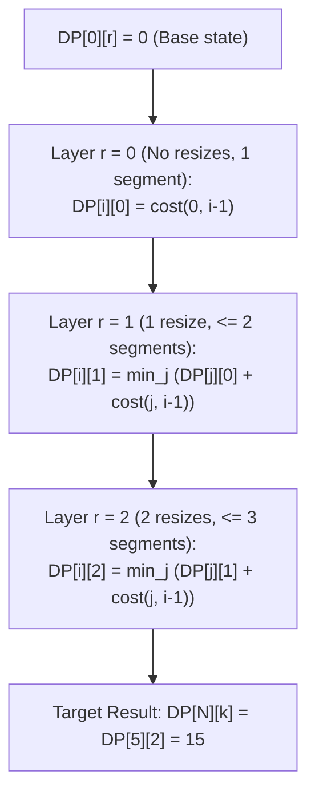

# Guided Example: Minimum Total Space Wasted With K Resizing Operations

We formulate and trace the interval partition dynamic programming algorithm on a representative timeline to minimize dynamic array reallocation waste under a bounded resize budget.

- **Primary Instance:** `nums = [10, 20, 15, 30, 20]`, $k = 2$ resizes ($N = 5$)
  - Maximum constant-capacity intervals: $k + 1 = 3$
  - Expected Output: `15`
- **Secondary Instance:** `nums = [10, 20, 30]`, $k = 1$ resize ($N = 3$)
  - Expected Output: `10`

---

## 1. Instance & Intuition

A dynamic array must maintain an allocated capacity $C(t) \ge nums[t]$ for every time step $t$. Any excess capacity $C(t) - nums[t]$ represents wasted memory.
- The initial allocation at time $t = 0$ is free (does not count as a resize).
- We are permitted at most $k$ resizing operations across the remaining timeline.
- Allowing at most $k$ resizes divides the timeline $0 \dots N-1$ into at most $m \le k + 1$ contiguous intervals $[j, i-1]$.

Within any single contiguous interval $[j, i-1]$ of constant capacity:
1. To satisfy all load demands, the capacity $C$ must be at least the peak demand in that interval: $C \ge \max_{t=j}^{i-1} nums[t]$.
2. To minimize waste, capacity should be set exactly to the peak demand: $C = \max_{t=j}^{i-1} nums[t]$.
3. The resulting waste over the interval $[j, i-1]$ is:
   $$\text{cost}(j, i-1) = \sum_{t=j}^{i-1} \Big( \max_{p=j}^{i-1} nums[p] - nums[t] \Big) = (i - j) \cdot \max_{p=j}^{i-1} nums[p] - \sum_{t=j}^{i-1} nums[t]$$

The problem is thus equivalent to finding an optimal partition of the array into at most $k+1$ contiguous subsegments that minimizes the sum of segment costs.

In our primary instance `nums = [10, 20, 15, 30, 20]` with $k = 2$ (up to 3 segments):
- Partitioning into `[10, 20, 15]`, `[30]`, and `[20]`:
  - Segment 1 `[10, 20, 15]`: Peak $= 20$. Waste: $(20 - 10) + (20 - 20) + (20 - 15) = 10 + 0 + 5 = 15$.
  - Segment 2 `[30]`: Peak $= 30$. Waste: $30 - 30 = 0$.
  - Segment 3 `[20]`: Peak $= 20$. Waste: $20 - 20 = 0$.
  - Total waste: $15 + 0 + 0 = 15$.

---

## 2. Mathematical Formulation & Segment Cost Function

Let $N$ be the length of $nums$. Let $P(t) = \sum_{x=0}^{t-1} nums[x]$ be the prefix sum array with $P(0) = 0$.

### Segment Cost Definition

For any subsegment spanning indices $j \dots i-1$ (where $0 \le j < i \le N$):
$$\text{peak}(j, i-1) = \max_{j \le t < i} nums[t]$$
$$\text{cost}(j, i-1) = (i - j) \cdot \text{peak}(j, i-1) - \Big( P(i) - P(j) \Big)$$

### Dynamic Programming Recurrence

Let $DP[i][r]$ be the minimum total wasted space to cover the prefix $nums[0 \dots i-1]$ using at most $r$ resizes (which corresponds to at most $r + 1$ segments).

- **Base Cases ($i = 0$):**
  $$DP[0][r] = 0 \quad \text{for all } 0 \le r \le k$$
- **Single Segment ($r = 0$):**
  $$DP[i][0] = \text{cost}(0, i-1) \quad \text{for all } 1 \le i \le N$$
- **Transitions ($r \ge 1, 1 \le i \le N$):**
  $$DP[i][r] = \min_{0 \le j < i} \Big( DP[j][r-1] + \text{cost}(j, i-1) \Big)$$

- **Terminal Answer:** $DP[N][k]$.

---

## 3. Step-by-Step Dynamic Programming Evaluation

We trace `nums = [10, 20, 15, 30, 20]` ($N = 5$) with $k = 2$:

### Step 1: Precompute Segment Costs $\text{cost}(j, i-1)$

| Subsegment Range | Subarray Elements | Peak Capacity | Sum of Demands | Allocated Volume | Segment Waste |
|---|---|---|---|---|---|
| $[0, 0]$ | `[10]` | 10 | 10 | $1 \times 10 = 10$ | 0 |
| $[0, 1]$ | `[10, 20]` | 20 | 30 | $2 \times 20 = 40$ | 10 |
| $[0, 2]$ | `[10, 20, 15]` | 20 | 45 | $3 \times 20 = 60$ | 15 |
| $[0, 3]$ | `[10, 20, 15, 30]` | 30 | 75 | $4 \times 30 = 120$ | 45 |
| $[0, 4]$ | `[10, 20, 15, 30, 20]` | 30 | 95 | $5 \times 30 = 150$ | 55 |
| $[1, 2]$ | `[20, 15]` | 20 | 35 | $2 \times 20 = 40$ | 5 |
| $[2, 4]$ | `[15, 30, 20]` | 30 | 65 | $3 \times 30 = 90$ | 25 |
| $[3, 3]$ | `[30]` | 30 | 30 | $1 \times 30 = 30$ | 0 |
| $[3, 4]$ | `[30, 20]` | 30 | 50 | $2 \times 30 = 60$ | 10 |
| $[4, 4]$ | `[20]` | 20 | 20 | $1 \times 20 = 20$ | 0 |

### Step 2: Layer $r = 0$ (No Resizes Allowed)

- $DP[1][0] = \text{cost}(0, 0) = 0$
- $DP[2][0] = \text{cost}(0, 1) = 10$
- $DP[3][0] = \text{cost}(0, 2) = 15$
- $DP[4][0] = \text{cost}(0, 3) = 45$
- $DP[5][0] = \text{cost}(0, 4) = 55$

### Step 3: Layer $r = 1$ (At Most 1 Resize Allowed)

- $DP[1][1] = 0$
- $DP[2][1] = \min(DP[2][0], DP[1][0] + \text{cost}(1, 1)) = \min(10, 0 + 0) = 0$ (Split into `[10]`, `[20]`)
- $DP[3][1] = \min_{j} (DP[j][0] + \text{cost}(j, 2))$:
  - $j=1$: $DP[1][0] + \text{cost}(1, 2) = 0 + 5 = 5$ (`[10]` and `[20, 15]`)
  - $j=2$: $DP[2][0] + \text{cost}(2, 2) = 10 + 0 = 10$ (`[10, 20]` and `[15]`)
  - $\implies DP[3][1] = 5$
- $DP[4][1] = \min_{j} (DP[j][0] + \text{cost}(j, 3))$:
  - $j=3$: $DP[3][0] + \text{cost}(3, 3) = 15 + 0 = 15$ (`[10, 20, 15]` and `[30]`)
  - $\implies DP[4][1] = 15$
- $DP[5][1] = \min_{j} (DP[j][0] + \text{cost}(j, 4))$:
  - $j=3$: $DP[3][0] + \text{cost}(3, 4) = 15 + 10 = 25$ (`[10, 20, 15]` and `[30, 20]`)
  - $\implies DP[5][1] = 25$

### Step 4: Layer $r = 2$ (At Most 2 Resizes Allowed)

- Prefix length 5: $DP[5][2] = \min_{j} (DP[j][1] + \text{cost}(j, 4))$:
  - $j = 3$: $DP[3][1] + \text{cost}(3, 4) = 5 + 10 = 15$
  - $j = 4$: $DP[4][1] + \text{cost}(4, 4) = 15 + 0 = 15$ (`[10, 20, 15]`, `[30]`, `[20]`)
  - Minimum achievable waste: $\mathbf{15}$.

---

## 4. Execution Trace Table

### Complete DP Matrix $DP[i][r]$

| Prefix Length $i$ | Prefix Elements Covered | $r = 0$ (1 segment) | $r = 1$ (up to 2 segments) | $r = 2$ (up to 3 segments) | Best Partition at $r = 2$ |
|---|---|---|---|---|---|
| 1 | `[10]` | 0 | 0 | 0 | `[10]` |
| 2 | `[10, 20]` | 10 | 0 | 0 | `[10]`, `[20]` |
| 3 | `[10, 20, 15]` | 15 | 5 | 0 | `[10]`, `[20]`, `[15]` |
| 4 | `[10, 20, 15, 30]` | 45 | 15 | 5 | `[10]`, `[20, 15]`, `[30]` |
| 5 | `[10, 20, 15, 30, 20]` | 55 | 25 | **15** | `[10, 20, 15]`, `[30]`, `[20]` |

### Candidate Partition Choices for $DP[5][2]$

| Split Point $j$ | Left Prefix Cost $DP[j][1]$ | Right Segment $[j, 4]$ Elements | Right Segment Cost $\text{cost}(j, 4)$ | Total Waste $DP[j][1] + \text{cost}(j, 4)$ | Optimality Status |
|---|---|---|---|---|---|
| 1 | $DP[1][1] = 0$ | `[20, 15, 30, 20]` | $(4 \times 30) - 85 = 35$ | $0 + 35 = 35$ | Suboptimal |
| 2 | $DP[2][1] = 0$ | `[15, 30, 20]` | $(3 \times 30) - 65 = 25$ | $0 + 25 = 25$ | Suboptimal |
| 3 | $DP[3][1] = 5$ | `[30, 20]` | $(2 \times 30) - 50 = 10$ | $5 + 10 = 15$ | **Tied Optimal** |
| 4 | $DP[4][1] = 15$ | `[20]` | $(1 \times 20) - 20 = 0$ | $15 + 0 = 15$ | **Tied Optimal** |

---

## 5. Algorithmic Correctness & Soundness

**Soundness.** Let an arbitrary partition of $nums[0 \dots N-1]$ into $m \le k+1$ contiguous segments have boundaries $0 = t_0 < t_1 < \dots < t_m = N$. In each segment $[t_a, t_{a+1}-1]$, memory safety requires allocation $C \ge \max_{x} nums[x]$, so wasted space cannot be less than $\text{cost}(t_a, t_{a+1}-1)$. The total wasted space for the partition is $\sum_{a=0}^{m-1} \text{cost}(t_a, t_{a+1}-1)$. The DP recurrence minimizes this sum by optimal substructure: any optimal partition of length $i$ with $r$ resizes must consist of an optimal sub-partition of prefix $j$ with $r-1$ resizes plus the exact cost of the final segment $[j, i-1]$.

**Completeness.** The transition loop considers all possible split indices $j \in \{0, \dots, i-1\}$ for every prefix length $i \in \{1, \dots, N\}$ and resize count $r \in \{1, \dots, k\}$. Because all possible segment boundary choices are exhaustively covered in topological order of prefix lengths, no legal allocation strategy can be skipped.

---

## 6. Edge Cases & Traps

- **Excess Resizes ($k \ge N - 1$):** If $k \ge N - 1$, we can resize before every single element ($N$ segments of length 1). In this case, each segment has length 1, so $\text{cost}(t, t) = nums[t] - nums[t] = 0$. The DP correctly yields $0$ waste.
- **Zero Resizes Allowed ($k = 0$):** Only one allocation is permitted for the entire duration. The algorithm must use $DP[N][0] = \text{cost}(0, N-1)$, correctly setting capacity to $\max(nums)$.
- **Strictly Decreasing Demands:** An input like `[100, 50, 20]` with $k = 0$ wastes $(100-50) + (100-20) = 130$. Adding resizes allows stepping down capacity at each decrease.

---

## 7. Complexity Analysis

- **Time Complexity:**
  - Segment cost precomputation: $\mathcal{O}(N^2)$ to evaluate the range maximums and prefix sum differences.
  - DP state space: $N \times (k+1)$ states.
  - State transition: for each state $(i, r)$, we iterate over $j \in [0, i-1]$, requiring $\mathcal{O}(i)$ transitions.
  - Total DP time: $\sum_{r=1}^k \sum_{i=1}^N \mathcal{O}(i) = \mathcal{O}(k \cdot N^2)$.
  - Given $N \le 200$ and $k \le 200$, the number of operations is bounded by $200 \times \frac{200^2}{2} \approx 4 \times 10^6$, running in under 20 milliseconds.
- **Auxiliary Space Complexity:**
  - The DP table requires $N \times (k+1)$ space, or $\mathcal{O}(N)$ if space-optimized to keep only the previous resize row.
  - Cost precomputation matrix requires $\mathcal{O}(N^2)$ space.
  - Total auxiliary space is $\mathcal{O}(N^2)$.
