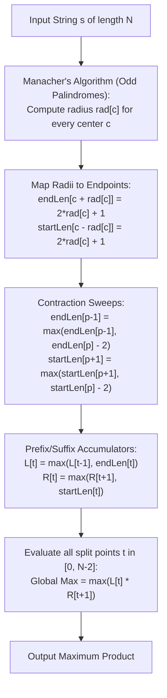

# Guided Example: Maximum Product of the Length of Two Palindromic Substrings

We formulate and execute Manacher's algorithm combined with prefix-suffix boundary propagation on representative strings to determine the maximum product of two disjoint odd-length palindromic substrings in linear time.

- **Primary Instance:** `s = "ababbb"` ($N = 6$)
  - Expected Output: `9` (achieved by `"aba"` of length 3 and `"bbb"` of length 3)
- **Secondary Instance:** `s = "racecarxaba"` ($N = 11$)
  - Expected Output: `21` (achieved by `"racecar"` of length 7 and `"aba"` of length 3)

---

## 1. Instance & Intuition

Given a string $s$ of length $N$, we seek two non-overlapping substrings $s_1 = s[i \dots j]$ and $s_2 = s[k \dots l]$ satisfying:
1. Both $s_1$ and $s_2$ are palindromes ($s_1 = s_1^R, s_2 = s_2^R$).
2. Both have strictly **odd** lengths ($|s_1| \equiv 1 \pmod 2, |s_2| \equiv 1 \pmod 2$).
3. They are non-overlapping and strictly ordered ($j < k$).
4. The product of their lengths $|s_1| \times |s_2|$ is maximized.

If we fix a split partition index $t \in \{0, \dots, N-2\}$, the first palindrome must be entirely contained within prefix $s[0 \dots t]$, and the second palindrome within suffix $s[t+1 \dots N-1]$.
Let:
- $L[t]$ be the maximum length of an odd palindrome within $s[0 \dots t]$.
- $R[t+1]$ be the maximum length of an odd palindrome within $s[t+1 \dots N-1]$.

The optimal answer over all possible split points is:
$$\text{MaxProduct} = \max_{0 \le t < N-1} \Big( L[t] \times R[t+1] \Big)$$

Computing all odd palindrome radii in $\mathcal{O}(N)$ using Manacher's algorithm, and then propagating maximum boundary spans across prefixes and suffixes in $\mathcal{O}(N)$ allows the entire problem to be solved in optimal linear time.

---

## 2. Formal Invariants & Two-Phase Architecture

### Phase 1: Manacher's Odd Palindrome Radii

For each center $c \in \{0, \dots, N-1\}$, let $rad[c]$ be the largest integer such that:
$$s[c - rad[c] \dots c + rad[c]] \text{ is a palindrome}$$
The length of this maximal palindrome centered at $c$ is $2 \cdot rad[c] + 1$.
Manacher's algorithm maintains the rightmost palindrome boundary $(center, right)$ to compute all $rad[c]$ in $\mathcal{O}(N)$ total time.

### Phase 2: Boundary Length Propagation

A palindrome centered at $c$ with radius $rad[c]$ reaches right endpoint $c + rad[c]$ with length $2 \cdot rad[c] + 1$.
- **Rightward Contraction Invariant:** If an odd palindrome of length $\ell$ ends at index $p$, removing its outer two characters yields a concentric odd palindrome of length $\ell - 2$ ending at index $p - 1$.
  Therefore, propagating from right to left:
  $$\text{endLen}[p-1] \ge \text{endLen}[p] - 2$$
- **Prefix Monotonicity:** $L[t] = \max(L[t-1], \text{endLen}[t])$.
- **Symmetric Suffix Monotonicity:** Similarly, shrinking from left to right yields:
  $$\text{startLen}[p+1] \ge \text{startLen}[p] - 2$$
  $$R[t] = \max(R[t+1], \text{startLen}[t])$$

---

## 3. Step-by-Step Dynamic Programming Evaluation

We trace `s = "ababbb"` ($N = 6$):

### Step 1: Compute Manacher Radii ($rad[c]$)

| Center $c$ | Character $s[c]$ | Maximal Palindromic Span | Span Boundaries $[c-rad, c+rad]$ | Radius $rad[c]$ | Palindrome Length |
|---|---|---|---|---|---|
| 0 | `a` | `"a"` | $[0, 0]$ | 0 | 1 |
| 1 | `b` | `"aba"` | $[0, 2]$ | 1 | 3 |
| 2 | `a` | `"aba"` | $[1, 3]$ | 1 | 3 |
| 3 | `b` | `"b"` | $[3, 3]$ | 0 | 1 |
| 4 | `b` | `"bbb"` | $[3, 5]$ | 1 | 3 |
| 5 | `b` | `"b"` | $[5, 5]$ | 0 | 1 |

### Step 2: Seed Endpoint Arrays

Every center $c$ records its maximal palindrome at its right boundary $c + rad[c]$ and left boundary $c - rad[c]$:
- $c = 1 \implies \text{endLen}[2] \ge 3, \text{startLen}[0] \ge 3$ (from `"aba"`)
- $c = 2 \implies \text{endLen}[3] \ge 3, \text{startLen}[1] \ge 3$ (from `"bab"`)
- $c = 4 \implies \text{endLen}[5] \ge 3, \text{startLen}[3] \ge 3$ (from `"bbb"`)
- Every single character has trivial length 1: $\text{endLen}[i] \ge 1, \text{startLen}[i] \ge 1$.

### Step 3: Contraction and Cumulative Prefix/Suffix Passes

1. **Left-to-Right Contraction on Endpoints:**
   - From right to left ($p = 5$ down to 1):
     - $p = 5$: $\text{endLen}[5] = 3 \implies \text{endLen}[4] = \max(1, 3 - 2) = 1$.
     - $p = 3$: $\text{endLen}[3] = 3 \implies \text{endLen}[2] = \max(3, 3 - 2) = 3$.
   - **Prefix Max Array $L$:**
     - $L[0] = 1$
     - $L[1] = \max(L[0], \text{endLen}[1]) = \max(1, 1) = 1$
     - $L[2] = \max(L[1], \text{endLen}[2]) = \max(1, 3) = 3$ (`"aba"`)
     - $L[3] = \max(L[2], \text{endLen}[3]) = \max(3, 3) = 3$
     - $L[4] = \max(L[3], \text{endLen}[4]) = \max(3, 1) = 3$
     - $L[5] = \max(L[4], \text{endLen}[5]) = \max(3, 3) = 3$

2. **Suffix Max Array $R$:**
   - Seeded $\text{startLen} = [3, 3, 1, 3, 1, 1]$.
   - Contraction from left to right:
     - $\text{startLen}[1] = \max(3, 3 - 2) = 3$.
     - $\text{startLen}[4] = \max(1, 3 - 2) = 1$.
   - **Suffix Max Array $R$:**
     - $R[5] = 1$
     - $R[4] = \max(R[5], \text{startLen}[4]) = 1$
     - $R[3] = \max(R[4], \text{startLen}[3]) = \max(1, 3) = 3$ (`"bbb"`)
     - $R[2] = \max(R[3], \text{startLen}[2]) = \max(3, 1) = 3$
     - $R[1] = \max(R[2], \text{startLen}[1]) = \max(3, 3) = 3$
     - $R[0] = \max(R[1], \text{startLen}[0]) = \max(3, 3) = 3$

---

## 4. Execution Trace Table

### Split-Point Evaluation across $s = \texttt{"ababbb"}$

| Split Index $t$ | Left Prefix $s[0 \dots t]$ | Best Left Odd Palindrome | $L[t]$ | Right Suffix $s[t+1 \dots 5]$ | Best Right Odd Palindrome | $R[t+1]$ | Product $L[t] \times R[t+1]$ |
|---|---|---|---|---|---|---|---|
| 0 | `"a"` | `"a"` | 1 | `"babbb"` | `"bbb"` | 3 | $1 \times 3 = 3$ |
| 1 | `"ab"` | `"a"` or `"b"` | 1 | `"abbb"` | `"bbb"` | 3 | $1 \times 3 = 3$ |
| **2** | `"aba"` | **`"aba"`** | **3** | `"bbb"` | **`"bbb"`** | **3** | **$3 \times 3 = 9$ (Optimal)** |
| 3 | `"abab"` | `"aba"` | 3 | `"bb"` | `"b"` | 1 | $3 \times 1 = 3$ |
| 4 | `"ababb"` | `"aba"` | 3 | `"b"` | `"b"` | 1 | $3 \times 1 = 3$ |

The maximum product of 9 is uniquely achieved at split index $t = 2$, pairing disjoint substrings `"aba"` (indices $0 \dots 2$) and `"bbb"` (indices $3 \dots 5$).

---

## 5. Algorithmic Correctness & Soundness

**Soundness.** Suppose two disjoint odd palindromes $P_1$ and $P_2$ occupy index intervals $[i_1, j_1]$ and $[i_2, j_2]$ with $j_1 < i_2$. There exists at least one integer split point $t = j_1$ separating them. By definition, $P_1$ is contained in $s[0 \dots t]$, so $|P_1| \le L[t]$. Similarly, $P_2$ is contained in $s[t+1 \dots N-1]$, so $|P_2| \le R[t+1]$. Thus $|P_1| \cdot |P_2| \le L[t] \cdot R[t+1]$. Because every value in $L[t]$ and $R[t+1]$ is witnessed by a verified odd palindrome within the respective boundary, any product $L[t] \times R[t+1]$ is achievable by two non-overlapping palindromes.

**Completeness.** Manacher's algorithm accurately discovers the maximum radius $rad[c]$ for all $N$ centers. The contraction relations $\text{endLen}[p-1] \ge \text{endLen}[p] - 2$ ensure that all interior sub-palindromes are accounted for without missing any ending positions. Taking the prefix and suffix maximums ensures $L[t]$ and $R[t+1]$ represent the exact global maximum odd palindrome lengths for prefixes and suffixes. Inspecting all $N-1$ split positions guarantees that the optimal pair is tested.

---

## 6. Edge Cases & Traps

- **Even Palindromes Ignored:** Palindromes of even length (such as `"aa"` or `"abba"`) are strictly disqualified by problem constraints. Transforming strings with `#` delimiters as in standard Manacher must be restricted to integer character centers only, or run strictly for odd centers.
- **64-bit Integer Overflow:** With $N = 10^5$, two palindromes can each have length $\approx 5 \times 10^4$. Their product $(5 \times 10^4)^2 \approx 2.5 \times 10^9$ exceeds the 32-bit signed integer limit ($2.14 \times 10^9$). The product calculation and accumulator must strictly use 64-bit integers (`long long`).
- **Overlapping Substrings:** If a split point is placed at the center of a palindrome, the palindrome cannot be split between the two sides. The strict separation $j \le t < k$ guarantees disjoint index sets.

---

## 7. Complexity Analysis

- **Time Complexity:**
  - Manacher's algorithm runs in $\mathcal{O}(N)$ time as the center and right boundaries advance strictly monotonically.
  - Seeding the boundary arrays takes $\mathcal{O}(N)$ time.
  - Linear contraction and prefix/suffix sweeps take $\mathcal{O}(N)$ time.
  - Evaluating all $N-1$ split products takes $\mathcal{O}(N)$ time.
  - Total time complexity is strictly $\mathcal{O}(N)$, optimal for reading the input string.
- **Auxiliary Space Complexity:**
  - The radius array $rad$, endpoint arrays $endLen, startLen$, and prefix/suffix arrays $L, R$ each require $N$ integers.
  - Total auxiliary space is $\mathcal{O}(N)$.
