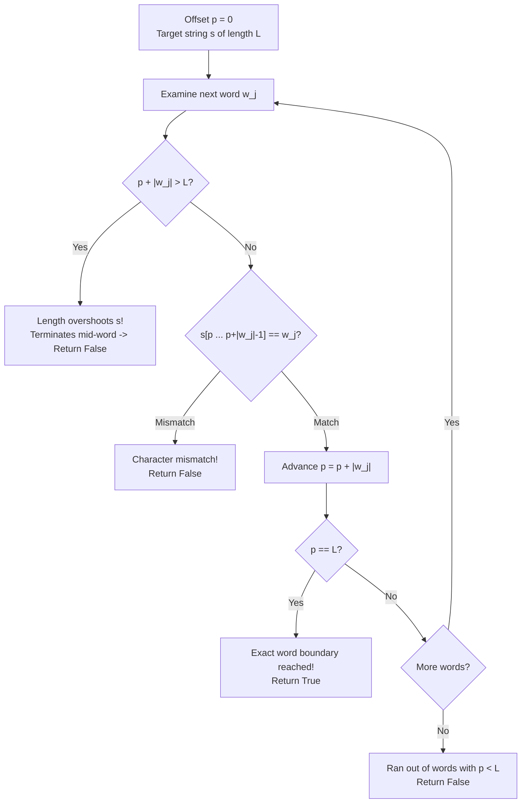

# Guided Example: Check If String Is a Prefix of Array

We formulate and execute the sequential word-boundary prefix matching algorithm on representative string arrays to determine whether a target string exactly equals a prefix concatenation.

- **Primary Instance (Valid Match):** `s = "iloveleetcode"`, `words = ["i", "love", "leetcode", "apples"]`
  - Expected Output: `True` (concatenation of first 3 words equals `s`)
- **Boundary Counter-Instance (Sub-Word Cut):** `s = "abc"`, `words = ["ab", "cd"]`
  - Expected Output: `False` (`"abc"` is a prefix of `"abcd"` but cuts inside `"cd"`)

---

## 1. Instance & Intuition

Given a string $s$ and an ordered sequence of words $W = [w_0, w_1, \dots, w_{m-1}]$, we want to determine if $s$ can be formed by concatenating the first $k$ words:
$$s = w_0 + w_1 + \dots + w_{k-1} \quad \text{for some } 1 \le k \le m$$

A critical requirement of the problem contract is that the match must terminate **strictly on a word boundary**:
- Simply being a prefix of the concatenated stream is necessary but not sufficient.
- If $s$ cuts off halfway through a word (e.g. $s = \texttt{"abc"}$ against $\texttt{"ab"} + \texttt{"cd"} = \texttt{"abcd"}$), it fails the condition because no integer $k$ produces an exact equality.
- If the first few words do not match the corresponding prefix of $s$ character-by-character, the match fails immediately.

In our primary instance:
- Word 0 (`"i"`): matches prefix of $s$ of length 1.
- Word 1 (`"love"`): matches next 4 characters (`"love"`), cumulative length 5 (`"ilove"`).
- Word 2 (`"leetcode"`): matches next 8 characters (`"leetcode"`), cumulative length 13 (`"iloveleetcode"`).
- The cumulative string exactly equals $s$ at word boundary $k = 3$. The remaining word `"apples"` is ignored.

---

## 2. Formal Invariants & Word-Boundary Matching

Let $|s| = L$. Let the prefix concatenation function be:
$$C(k) = \sum_{j=0}^{k-1} w_j = w_0 + w_1 + \dots + w_{k-1}$$
with length $\ell(k) = \sum_{j=0}^{k-1} |w_j|$.

### Two Necessary and Sufficient Conditions

String $s$ is a prefix of array $W$ if and only if there exists an integer $k \in \{1, \dots, m\}$ such that:
1. **Length Equality:** $\ell(k) = L$.
2. **Substring Concordance:** For every word $j \in \{0, \dots, k-1\}$, the slice of $s$ from $\ell(j)$ to $\ell(j+1)$ matches $w_j$:
   $$s[\ell(j) \dots \ell(j+1)-1] = w_j$$

### Pointer Propagation Invariant

We maintain an offset pointer $p$, initialized to $0$. As we iterate $j = 0, 1, \dots$:
- If $p + |w_j| > L$, the accumulated length exceeds $s$ before finishing $w_j \implies$ Return `False`.
- If $s[p \dots p+|w_j|-1] \neq w_j$, a character mismatch occurs $\implies$ Return `False`.
- Advance $p \leftarrow p + |w_j|$.
- If $p == L$, an exact word boundary match is achieved $\implies$ Return `True`.

---

## 3. Step-by-Step String Segmentation Trace

### Primary Trace: `s = "iloveleetcode"`, `words = ["i", "love", "leetcode", "apples"]`

- Total target length: $L = 13$. Offset pointer starts at $p = 0$.

1. **Word $j = 0$ (`"i"`), length $= 1$:**
   - Remaining target length needed: $13 - 0 = 13 \ge 1$.
   - Slice comparison: $s[0 \dots 0] = \texttt{"i"} == \texttt{"i"}$. Match!
   - Advance pointer: $p = 0 + 1 = 1$.
   - Check $p == L$: $1 == 13$ (False). Proceed.

2. **Word $j = 1$ (`"love"`), length $= 4$:**
   - Remaining target length needed: $13 - 1 = 12 \ge 4$.
   - Slice comparison: $s[1 \dots 4] = \texttt{"love"} == \texttt{"love"}$. Match!
   - Advance pointer: $p = 1 + 4 = 5$.
   - Check $p == L$: $5 == 13$ (False). Proceed.

3. **Word $j = 2$ (`"leetcode"`), length $= 8$:**
   - Remaining target length needed: $13 - 5 = 8 \ge 8$.
   - Slice comparison: $s[5 \dots 12] = \texttt{"leetcode"} == \texttt{"leetcode"}$. Match!
   - Advance pointer: $p = 5 + 8 = 13$.
   - Check $p == L$: $13 == 13$ (**True**).
   - **Exact boundary hit at $k = 3$ words.** Return `True`.

### Counter-Instance Trace: `s = "abc"`, `words = ["ab", "cd"]`

- Total target length: $L = 3$. Offset pointer starts at $p = 0$.

1. **Word $j = 0$ (`"ab"`), length $= 2$:**
   - Slice comparison: $s[0 \dots 1] = \texttt{"ab"} == \texttt{"ab"}$. Match.
   - Advance pointer: $p = 0 + 2 = 2$.
   - Check $p == L$: $2 == 3$ (False). Proceed.

2. **Word $j = 1$ (`"cd"`), length $= 2$:**
   - Test bounds: $p + |w_1| = 2 + 2 = 4 > 3$.
   - The word extends beyond the end of $s$. A complete word `"cd"` cannot fit in the remaining 1 character `'c'`.
   - **Boundary violation.** Return `False`.

---

## 4. Execution Trace Table

### Primary Trace Evaluation

| Word Index $j$ | Word $w_j$ | Length $\lvert w_j \rvert$ | Starting Offset $p$ | Target Slice $s[p \dots p+\lvert w_j \rvert-1]$ | Slice Concordance | New Offset $p'$ | Boundary Hit ($p' == 13$)? | Action |
|---|---|---|---|---|---|---|---|---|
| 0 | `"i"` | 1 | 0 | `"i"` | Match | 1 | No ($1 \ne 13$) | Advance |
| 1 | `"love"` | 4 | 1 | `"love"` | Match | 5 | No ($5 \ne 13$) | Advance |
| 2 | `"leetcode"` | 8 | 5 | `"leetcode"` | Match | 13 | **Yes ($13 == 13$)** | **Halt & Return True** |
| 3 | `"apples"` | 6 | 13 | N/A | N/A | N/A | N/A | Unreached |

### Counter-Instance Comparison

| Target $s$ | Words Array | Matched Prefix Slices | Point of Failure | Termination Reason | Result |
|---|---|---|---|---|---|
| `"iloveleetcode"` | `["i", "love", "leetcode", "apples"]` | `"i"`, `"love"`, `"leetcode"` | None ($k = 3$) | Exact equality reached | `True` |
| `"iloveleetcode"` | `["apples", "i", "love", "leetcode"]` | None | Word 0 (`"apples"`) | Immediate prefix mismatch | `False` |
| `"abc"` | `["ab", "cd"]` | `"ab"` | Word 1 (`"cd"`) | Length overshoot ($4 > 3$) | `False` |
| `"abcd"` | `["ab"]` | `"ab"` | Exhausted words | Ran out of words ($p = 2 < 4$) | `False` |

---

## 5. Algorithmic Correctness & Soundness

**Soundness.** If the algorithm returns `True`, it did so because for some index $k$, $p = \sum_{j=0}^{k-1} |w_j| = |s|$ and every preceding slice $s[\dots]$ was verified equal to $w_j$. By string concatenation, $C(k) = w_0 + \dots + w_{k-1} = s$. Because $k \ge 1$ and $k \le m$, $s$ is proven to be a prefix string of `words`.

**Completeness.** Suppose $s$ is indeed a prefix string of `words`, so $s = C(k^*)$ for some $k^* \le m$. Then for all $j < k^*$, the length of the prefix never exceeds $|s|$, and each slice $s[\sum_0^{j-1}|w_t| \dots \sum_0^j|w_t|-1]$ is identically $w_j$. The algorithm sequentially verifies each segment without early rejection, reaching $p = |s|$ at step $k^*$, where it unfailingly returns `True`.

---

## 6. Edge Cases & Traps

- **Mid-Word Prefix Fallacy:** Assuming that checking whether $s$ is a prefix of the concatenated string is sufficient. If `words = ["ab", "cde"]` and `s = "abc"`, `s` is a prefix of `"abcde"`, but it is **not** a prefix string of the array because it requires cutting `"cde"` in half. Matching must terminate precisely at a word boundary.
- **Array Exhaustion:** If all words in `words` match prefixes of $s$ but their total combined length is strictly less than $|s|$ (e.g. $s = \texttt{"abcdef"}$, $words = [\texttt{"ab"}, \texttt{"cd"}]$), the loop exits without reaching $p == |s|$. The algorithm must return `False`.
- **String Re-allocation Overhead:** Repeatedly concatenating strings (`accum += word`) copies characters repeatedly, resulting in $\mathcal{O}(L^2)$ time. Tracking the integer offset pointer $p$ and slicing or character-indexing keeps execution strictly linear $\mathcal{O}(L)$.

---

## 7. Complexity Analysis

- **Time Complexity:**
  - The algorithm compares characters up to length $L = |s|$.
  - At most $\min(m, L)$ words are inspected before either matching $s$, exceeding $L$, or finding a mismatch.
  - Total character comparisons cannot exceed $L$.
  - Total time complexity is strictly $\mathcal{O}(L)$ (or $\mathcal{O}(\min(L, \sum |w_j|))$).
- **Auxiliary Space Complexity:**
  - Only scalar indices ($p, j$) and string views/references are retained.
  - Auxiliary space is $\mathcal{O}(1)$.
