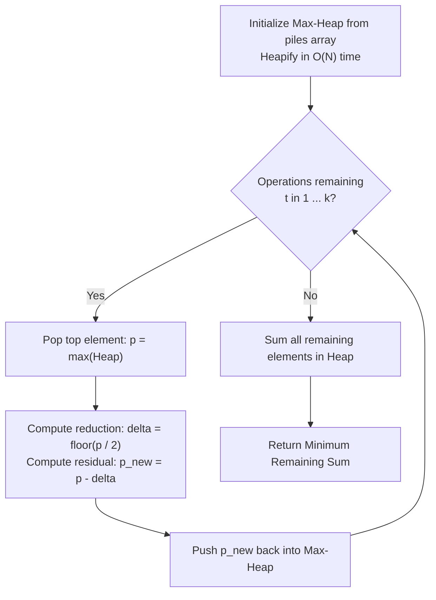

# Guided Example: Remove Stones to Minimize the Total

We formulate and trace the max-heap greedy stone reduction algorithm on representative stone configurations to minimize total residual stones under a fixed operation budget.

- **Primary Instance:** `piles = [5, 4, 9]`, $k = 2$ operations ($N = 3$)
  - Initial stone total: $S_0 = 5 + 4 + 9 = 18$
  - Expected Output: `12` (removes 6 stones)
- **Secondary Instance:** `piles = [4, 3, 6, 7]`, $k = 3$ operations ($N = 4$)
  - Initial stone total: $S_0 = 20$
  - Expected Output: `12` (removes 8 stones)

---

## 1. Instance & Intuition

We have $N$ piles of stones. In each operation, we are permitted to choose any single pile of current size $p$ and remove $\lfloor p / 2 \rfloor$ stones, leaving:
$$p' = p - \lfloor p / 2 \rfloor = \lceil p / 2 \rceil$$
We must perform exactly $k$ operations to minimize the final sum of stones across all piles.

Because the initial total number of stones $S_0 = \sum p_i$ is fixed, minimizing the remaining sum is mathematically equivalent to **maximizing the total number of stones removed**:
$$\min \sum_{i=1}^N p_i^{(\text{final})} \iff \max \sum_{t=1}^k \Delta_t \quad \text{where } \Delta_t = \lfloor p_{(t)} / 2 \rfloor$$

Notice that the stone reduction function $g(p) = \lfloor p / 2 \rfloor$ is non-decreasing. To maximize the immediate reduction $\Delta_t$ at step $t$, the optimal choice is always to select a pile currently possessing the **maximum number of stones**. 

By organizing the piles into a max-heap (priority queue):
1. The largest pile is extracted in $\mathcal{O}(\log N)$ time.
2. It is replaced by its halved value $\lceil p / 2 \rceil$.
3. The new value is pushed back into the heap.

In our primary instance `piles = [5, 4, 9]` with $k = 2$:
- Largest initial pile is 9. Halving it removes $\lfloor 9/2 \rfloor = 4$ stones, leaving 5. Piles: `[5, 5, 4]`.
- Largest pile is now 5. Halving it removes $\lfloor 5/2 \rfloor = 2$ stones, leaving 3. Piles: `[5, 4, 3]`.
- Total removed: $4 + 2 = 6$. Remaining sum: $18 - 6 = 12$.

---

## 2. Mathematical Formalism & Greedy Diminishing Returns

Let the multiset of pile sizes at step $t$ be $\mathcal{P}_t = \{p_1, p_2, \dots, p_N\}$.

### Marginal Gain and Submodularity

Applying an operation to pile $p$ yields marginal reduction:
$$\Delta(p) = \lfloor p / 2 \rfloor$$
The residual pile size is $r(p) = p - \lfloor p / 2 \rfloor$.

Because $p_a \ge p_b \implies \lfloor p_a / 2 \rfloor \ge \lfloor p_b / 2 \rfloor$, picking any non-maximal pile $p_b < \max(\mathcal{P}_t)$ achieves a strictly smaller or equal immediate reduction than picking the maximal pile.

Furthermore, halving exhibits **diminishing marginal returns**: applying successive operations to the same pile produces a strictly decreasing sequence of reductions:
$$\lfloor p / 2 \rfloor \ge \left\lfloor \lceil p / 2 \rceil / 2 \right\rfloor \ge \dots$$
Because each available operation has a diminishing marginal gain that depends solely on the pile's current state, the greedy strategy of repeatedly taking the element with the largest available reduction is provably optimal.

---

## 3. Step-by-Step Priority Queue Simulation

We trace `piles = [5, 4, 9]` with $k = 2$:

- **Initialization:**
  - Piles: `[5, 4, 9]`.
  - Max-Heap structure: Root $= 9$, children $= [5, 4]$.
  - Total initial stones: $S_0 = 18$.

- **Operation 1 ($t = 1$):**
  - Extract maximum: $p = 9$.
  - Compute stones removed: $\lfloor 9 / 2 \rfloor = 4$.
  - Compute residual pile: $9 - 4 = 5$.
  - Reinsert $5$ into max-heap.
  - Heap state: `[5, 5, 4]`.
  - Running stones removed: $4$. Remaining total: $18 - 4 = 14$.

- **Operation 2 ($t = 2$):**
  - Extract maximum: $p = 5$.
  - Compute stones removed: $\lfloor 5 / 2 \rfloor = 2$.
  - Compute residual pile: $5 - 2 = 3$.
  - Reinsert $3$ into max-heap.
  - Heap state: `[5, 4, 3]`.
  - Running stones removed: $4 + 2 = 6$. Remaining total: $14 - 2 = 12$.

- **Budget Exhausted:** Exactly $k = 2$ operations executed.
  - Final piles: $\{5, 4, 3\}$.
  - Final sum: $5 + 4 + 3 = 12$.

---

## 4. Execution Trace Table

### Primary Trace: `piles = [5, 4, 9]`, $k = 2$

| Step $t$ | Current Max-Heap | Top Pile $p$ | Stones Removed $\lfloor p / 2 \rfloor$ | Residual Pile $\lceil p / 2 \rceil$ | Updated Max-Heap | Cumulative Removed | Remaining Sum |
|---|---|---|---|---|---|---|---|
| 0 | `[9, 5, 4]` | N/A | 0 | N/A | `[9, 5, 4]` | 0 | 18 |
| 1 | `[9, 5, 4]` | 9 | 4 | 5 | `[5, 5, 4]` | 4 | 14 |
| 2 | `[5, 5, 4]` | 5 | 2 | 3 | `[5, 4, 3]` | 6 | **12** |

### Secondary Trace: `piles = [4, 3, 6, 7]`, $k = 3$

| Step $t$ | Top Pile Extracted | $\lfloor p / 2 \rfloor$ Removed | Residual Value | Active Multiset | Remaining Total |
|---|---|---|---|---|---|
| Initial | None | 0 | N/A | $\{7, 6, 4, 3\}$ | 20 |
| 1 | 7 | 3 | 4 | $\{6, 4, 4, 3\}$ | 17 |
| 2 | 6 | 3 | 3 | $\{4, 4, 3, 3\}$ | 14 |
| 3 | 4 | 2 | 2 | $\{4, 3, 3, 2\}$ | **12** |

---

## 5. Algorithmic Correctness & Soundness

**Soundness.** Each step performs a legal operation: a pile $p$ is replaced by $p - \lfloor p / 2 \rfloor$. After $k$ operations, exactly $k$ valid reductions have taken place.

**Optimality (Matroid Greedy Property).** Let each potential removal operation be associated with a marginal benefit $\lfloor x / 2 \rfloor$. As demonstrated in Section 2, the marginal returns from successive operations on any single pile form a monotonically decreasing sequence:
$$\Delta_1(p) \ge \Delta_2(p) \ge \Delta_3(p) \ge \dots$$
Across all piles, the total collection of potential reductions forms a multiset of independent marginal gains with polymatroid structure. The globally optimal subset of $k$ operations is obtained by selecting the $k$ largest marginal gains available. Because the marginal gains on each pile are ordered, the largest unselected gain across all piles at any point is always given by $\lfloor \max_i(p_i) / 2 \rfloor$. Thus, picking the global maximum at every step is provably optimal.

---

## 6. Edge Cases & Traps

- **Piles of Size 1:** If a pile has size $p = 1$, $\lfloor 1 / 2 \rfloor = 0$. Halving it removes 0 stones and leaves 1. If all piles become 1 before $k$ is exhausted, subsequent operations remove 0 stones. The heap continues to function correctly without negative numbers.
- **Large Sums:** Pile sizes up to $10^4$ with $N = 10^5$ can have an initial sum of $10^9$. In statically typed languages, 64-bit integer accumulators (`long long`) prevent arithmetic overflow.
- **Bucket/Counting Optimization:** Because pile sizes do not exceed $10^4$, a bucket array (frequency map) of size $10{,}001$ can implement the priority queue in $\mathcal{O}(N + M + k)$ time without heap comparisons, where $M = 10^4$.

---

## 7. Complexity Analysis

- **Time Complexity:**
  - Initial heap construction (heapify): $\mathcal{O}(N)$ using bottom-up linear heap build.
  - $k$ iterations: each iteration extracts the maximum and reinserts the residual in $\mathcal{O}(\log N)$ time.
  - Total heap operations: $\mathcal{O}(k \log N)$.
  - Summing the final heap elements: $\mathcal{O}(N)$.
  - Overall time complexity is $\mathcal{O}(N + k \log N)$. With $N, k \le 10^5$, this requires $\approx 1.7 \times 10^6$ operations, executing in under 30 milliseconds.
- **Auxiliary Space Complexity:**
  - The binary heap stores the $N$ integers in array form: $\mathcal{O}(N)$.
  - Total auxiliary space is $\mathcal{O}(N)$.
