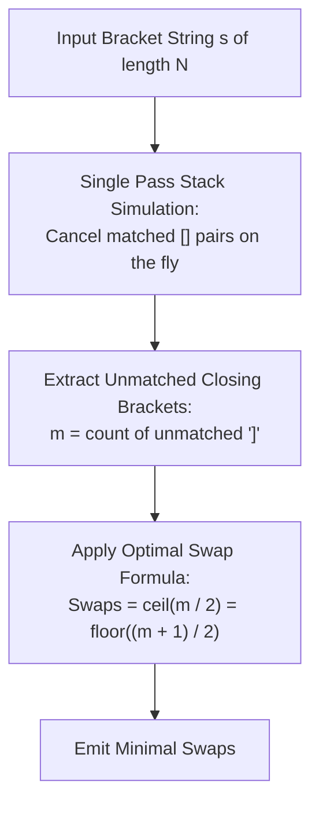

# Guided Example: Minimum Number of Swaps to Make the String Balanced

We formulate and execute the bracket stack reduction and greedy swap pairing theorem on representative bracket strings to determine the minimum number of swaps to achieve balance.

- **Primary Instance:** `s = "]]][[["` ($N = 6$)
  - Initial unmatched closing brackets: $m = 3$
  - Expected Output: `2`
- **Secondary Instance:** `s = "][]["` ($N = 4$)
  - Initial unmatched closing brackets: $m = 1$
  - Expected Output: `1`

---

## 1. Instance & Intuition

A bracket string is balanced if it conforms to standard parenthesization (every opening bracket `[` is paired with a subsequent closing bracket `]`, and no prefix contains more closing brackets than opening brackets).
We are given that $s$ has equal numbers of `[` and `]`, namely $N/2$ of each. In one operation, we may swap the characters at any two indices.

If we iteratively eliminate all valid adjacent pairs `[]` from $s$, the remaining characters form an **irreducible kernel**. Because the total counts of `[` and `]` are equal, every eliminated pair removes one `[` and one `]`. Consequently, the irreducible kernel must consist entirely of $m$ closing brackets followed by $m$ opening brackets:
$$s_{\text{kernel}} = \underbrace{\texttt{]} \dots \texttt{]}}_{m} \;\; \underbrace{\texttt{[} \dots \texttt{[}}_{m} = \texttt{]}^m \texttt{[}^m$$

Now, consider the effect of swapping the **first unmatched `]`** with the **last unmatched `[`**:
$$\texttt{]} \dots \texttt{]} \;\; \texttt{[} \dots \texttt{[} \longrightarrow \texttt{[} \dots \texttt{]} \;\; \texttt{[} \dots \texttt{]}$$
Notice what happens:
1. The newly placed `[` at the far left immediately pairs with the subsequent `]`.
2. The newly placed `]` at the far right immediately pairs with the preceding `[`.

A single swap eliminates **two** unmatched closing brackets and **two** unmatched opening brackets!
Therefore, each swap reduces the deficit $m$ by 2. When $m = 1$, a single swap resolves the remaining pair.
The minimum number of swaps required is:
$$\text{MinSwaps} = \left\lceil \frac{m}{2} \right\rceil = \left\lfloor \frac{m + 1}{2} \right\rfloor$$

In our primary instance `s = "]]][[["`:
- There are no existing balanced pairs. The kernel is `]]][[[` with $m = 3$.
- Minimum swaps: $\lceil 3 / 2 \rceil = 2$.

---

## 2. Mathematical Formalism & The Canonical Irreducible Kernel

Let the prefix balance function be:
$$B(t) = \sum_{i=0}^t \begin{cases} +1 & \text{if } s[i] = \texttt{'['} \\ -1 & \text{if } s[i] = \texttt{']'} \end{cases}$$

A string is balanced if and only if $B(t) \ge 0$ for all $0 \le t < N$ and $B(N-1) = 0$.

### Maximal Deficit Invariant

Let $D = \max_{0 \le t < N} (-B(t))$ be the maximum prefix deficit.
Alternatively, simulating a stack:
- When encountering `[`, increment stack size: $\text{open} \leftarrow \text{open} + 1$.
- When encountering `]`:
  - If $\text{open} > 0$, decrement $\text{open} \leftarrow \text{open} - 1$ (pair resolved).
  - If $\text{open} == 0$, increment unmatched closing counter: $m \leftarrow m + 1$.

After scanning the entire string:
$$m = \text{number of unmatched } \texttt{']'} \text{ brackets}$$
Because total brackets are balanced ($B(N-1) = 0$), the number of unmatched opening brackets is also identically $m$.

### Swap Efficiency Upper Bound

Every swap exchanges at most one `]` with one `[`. In any prefix balance profile, exchanging an earlier `]` with a later `[` increases the prefix balance between their indices by $+2$.
Since the maximum prefix deficit is $m$, each swap can reduce the maximum deficit by at most 2:
$$D_{\text{new}} \ge D_{\text{old}} - 2$$
To reach deficit $0$, the number of swaps $k$ must satisfy:
$$2k \ge m \implies k \ge \left\lceil \frac{m}{2} \right\rceil$$

---

## 3. Step-by-Step Greedy Cancellation and Swap Trace

### Primary Instance: `s = "]]][[["` ($N = 6$)

#### Step 1: Cancellation Pass
- $i = 0, s[0] = \texttt{']'}$: no open bracket available $\implies m = 1$.
- $i = 1, s[1] = \texttt{']'}$: no open bracket available $\implies m = 2$.
- $i = 2, s[2] = \texttt{']'}$: no open bracket available $\implies m = 3$.
- $i = 3, s[3] = \texttt{'['}$: $\text{open} = 1$.
- $i = 4, s[4] = \texttt{'['}$: $\text{open} = 2$.
- $i = 5, s[5] = \texttt{'['}$: $\text{open} = 3$.
- Unmatched kernel: $m = 3$ closing brackets and 3 opening brackets.

#### Step 2: Swap 1
- Target: Swap first unmatched `]` at index 0 with last unmatched `[` at index 5.
- Transformed string:
  $$\underline{\texttt{[}} \;\; \texttt{]} \;\; \texttt{]} \;\; \texttt{[} \;\; \texttt{[} \;\; \underline{\texttt{]}}$$
- Re-evaluating:
  - Indices 0 and 1 form `[]` (balanced).
  - Indices 4 and 5 form `[]` (balanced).
  - Remaining middle substring: indices 2 and 3 form `][` ($m = 1$).

#### Step 3: Swap 2
- Target: Swap `]` at index 2 with `[` at index 3.
- Transformed string:
  $$\texttt{[} \;\; \texttt{]} \;\; \underline{\texttt{[}} \;\; \underline{\texttt{]}} \;\; \texttt{[} \;\; \texttt{]}$$
- The entire string is now `[][] [] []`, which is completely balanced!
- Total swaps performed: **2**.

---

## 4. Execution Trace Table

### Primary Trace: `s = "]]][[["`

| Step $i$ | Character $s[i]$ | Active Open Count | Unmatched Closing $m$ | Prefix Balance $B(i)$ | Cumulative Status |
|---|---|---|---|---|---|
| Initial | None | 0 | 0 | 0 | Initialized |
| 0 | `]` | 0 | 1 | -1 | Unmatched closing bracket |
| 1 | `]` | 0 | 2 | -2 | Unmatched closing bracket |
| 2 | `]` | 0 | 3 | -3 | Unmatched closing bracket |
| 3 | `[` | 1 | 3 | -2 | Opening bracket starts buffer |
| 4 | `[` | 2 | 3 | -1 | Opening bracket |
| 5 | `[` | 3 | 3 | 0 | Terminal state: $m = 3$ |

**Result Calculation:** $\lfloor (3 + 1) / 2 \rfloor = 2$ swaps.

### Secondary Trace: `s = "][]["`

| Step $i$ | Character $s[i]$ | Active Open Count | Unmatched Closing $m$ | Notes |
|---|---|---|---|---|
| 0 | `]` | 0 | 1 | Unmatched closing |
| 1 | `[` | 1 | 1 | Open buffer $= 1$ |
| 2 | `]` | 0 | 1 | Matched with index 1 (`[]` resolved) |
| 3 | `[` | 1 | 1 | Final unmatched opening |

**Result Calculation:** $\lfloor (1 + 1) / 2 \rfloor = 1$ swap (swap index 0 and 3 $\to$ `"[[]]"`).

---

## 5. Algorithmic Correctness & Soundness

**Lower Bound (Optimality).** Any swap involves two indices $i < j$. Swapping $s[i]$ and $s[j]$ can alter prefix balance $B(t)$ only for $t \in [i, j-1]$. The maximum possible increase in $B(t)$ anywhere is $+2$ (which occurs when $s[i]$ changes from `]` to `[` and $s[j]$ from `[` to `]`). Since the initial maximum deficit is $m$, reaching a non-negative balance everywhere requires total increase of at least $m$. With each swap providing at most $+2$, no algorithm can use fewer than $\lceil m / 2 \rceil$ swaps.

**Upper Bound (Achievability).** We explicitly exhibited the constructive exchange: swapping the outermost unmatched `]` and `[` in $\texttt{]}^m \texttt{[}^m$ yields $\texttt{[} \texttt{]}^{m-1} \texttt{[}^{m-1} \texttt{]}$. The outer two brackets pair with adjacent brackets, reducing the kernel to $\texttt{]}^{m-2} \texttt{[}^{m-2}$. Repeating this construction $\lfloor m / 2 \rfloor$ times leaves at most 1 pair (if $m$ is odd), which is cleared with one final swap. The construction achieves exactly $\lceil m / 2 \rceil$ swaps, proving tightness.

---

## 6. Edge Cases & Traps

- **Already Balanced String:** An input like `s = "[[]]"` has $m = 0$. The formula produces $\lfloor 1 / 2 \rfloor = 0$, correctly requiring zero operations.
- **Physical String Swapping Pitfall:** Actually modifying the string and repeatedly scanning it would take $\mathcal{O}(N^2)$ time. Because $N = 10^6$, the string must not be mutated. The closed-form formula derives the exact answer from a single linear counting pass.
- **Counter Variable Clamping:** When simulating the stack, ensuring $\text{open}$ is never decremented below 0 is essential; otherwise, closing brackets would incorrectly cancel future opening brackets that appear before them.

---

## 7. Complexity Analysis

- **Time Complexity:**
  - A single linear pass scans string $s$ of length $N$.
  - At each character, a constant number of scalar comparisons and increments occur.
  - The final arithmetic evaluation $\lfloor (m + 1) / 2 \rfloor$ takes $\mathcal{O}(1)$.
  - Total time complexity is strictly $\mathcal{O}(N)$, optimal for reading the input.
- **Auxiliary Space Complexity:**
  - Only two integer counters (`open` and `m`) are maintained.
  - Total auxiliary space is $\mathcal{O}(1)$.
