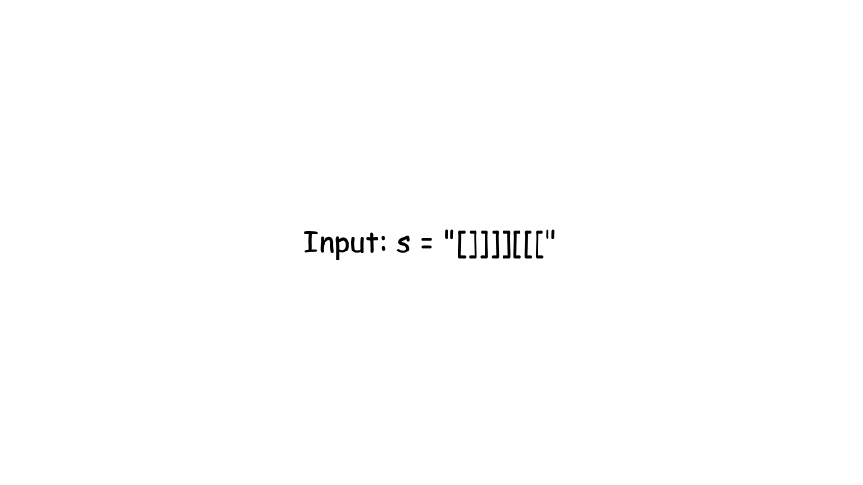
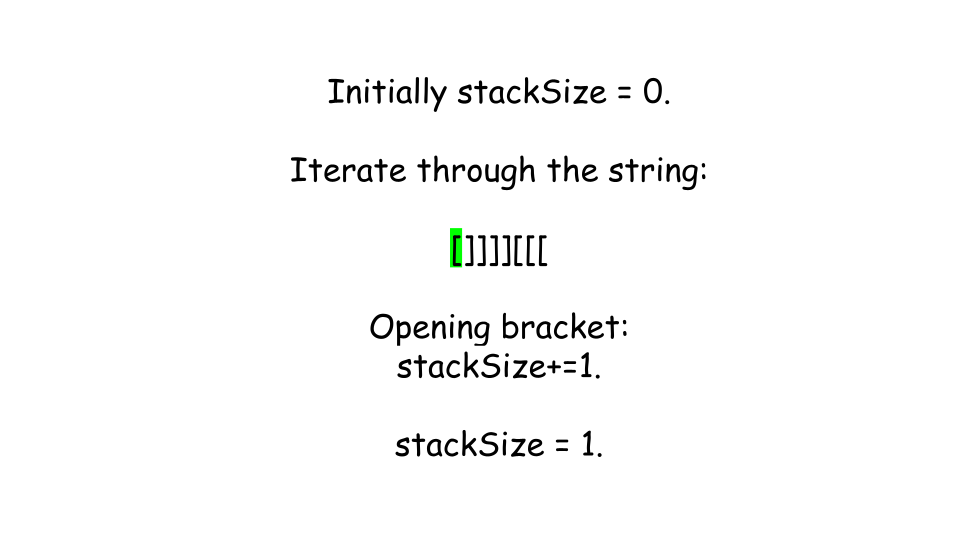
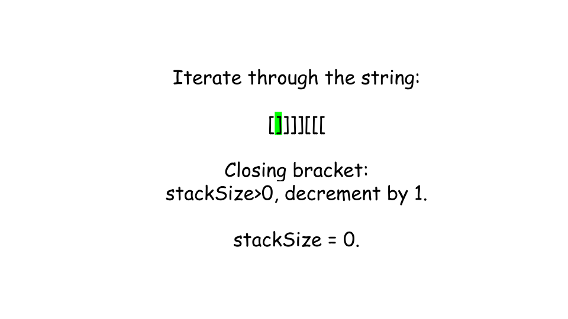
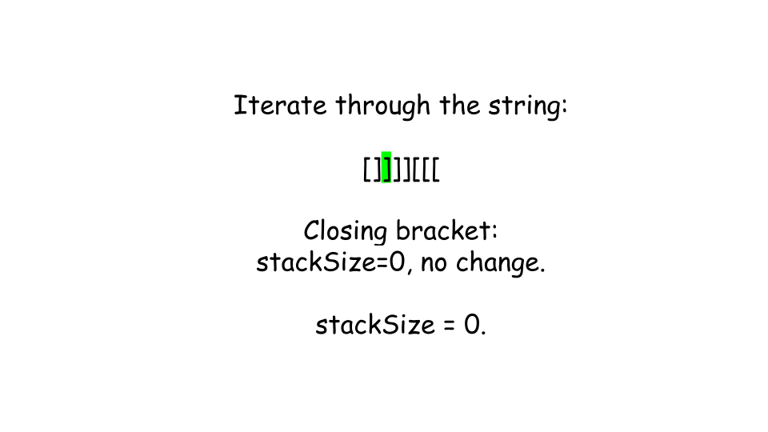
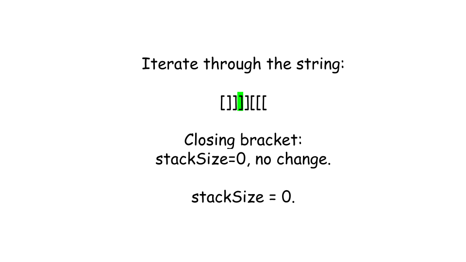
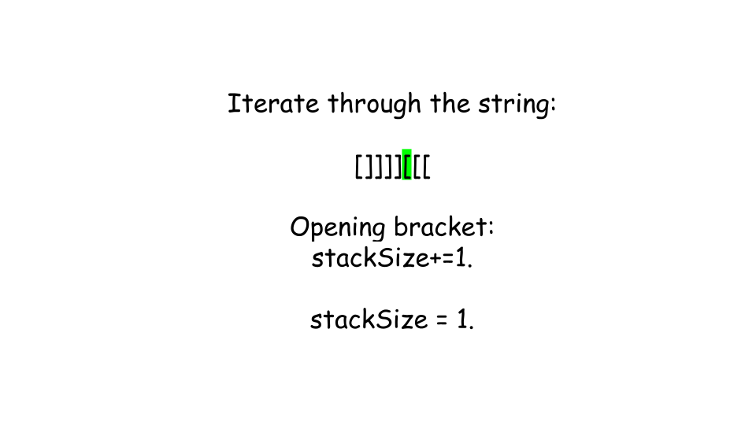
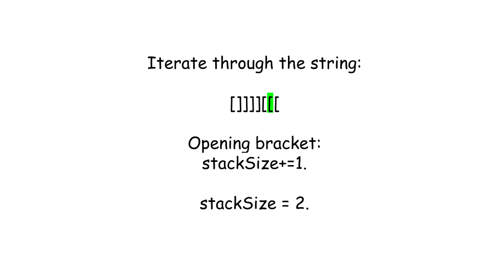
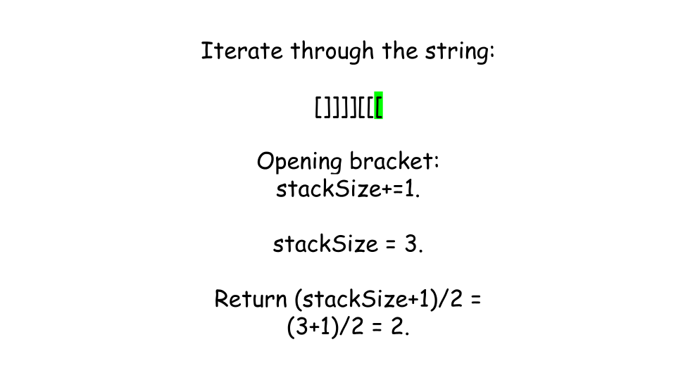

[TOC]

## Solution

---

### Approach 1: Stack

#### Intuition

We are given a 0-indexed string `s` of even length `n` made up of `n/2` opening brackets `[` and `n/2` closing brackets `]`. Our task is to return the minimum number of swaps to make the string balanced.

Balanced parentheses mean that every opening bracket `[` has a matching closing bracket `]` in the correct order. Unbalanced parentheses occur when there are more closing brackets `]` than opening brackets `[` at some point in the string.

There are two key points to keep in mind:
1. Swapping balanced brackets won't help. If you swap characters in a balanced pair like `[]`, it becomes `][`, which makes the string unbalanced. So, this type of swap increases the problem instead of solving it.
2. Swapping unbalanced brackets can fix the string. If a closing bracket `]` appears before its matching opening bracket `[`, a swap between an unbalanced `]` and an unbalanced `[` will balance one pair.

What is the maximum number of brackets that you can balance with a single swap? The answer is 2 for all parentheses of the form `][`. Therefore, the optimal approach is to swap unbalanced parentheses with each other. Since 2 unbalanced parentheses are made balanced with a single swap, the total number of swaps to balance are given by $unbalanced / 2$.

Let's understand this with an example:

For the string `]]][[[`,

There are total 3 mismatches in the string. Now, we need to swap the `]` and `[` at index `0` and `5` respectively.

The string is now given by `[]][[]`. There is 1 mismatch in the string. So, swap `]` and `[` at index `2` and `3` respectively. This swap reduced exactly 2 mismatches.

The string is balanced and given by `[][][]`. Therefore, it requires exactly 2 swaps to balance the string.

To solve the problem, we can use a stack to keep track of unmatched opening brackets `[` as we move through the string. Each time we find a closing bracket `]`, we check if there’s an unmatched opening bracket `[` on the stack. If there is, we remove it, as we’ve found a match and balanced the pair. If the stack is empty when we encounter a closing bracket `]`, this bracket is unbalanced.

We count how many unbalanced closing brackets `]` we find. After traversing the string, the number of unbalanced `]` brackets tells us how many swaps are needed. Each swap fixes two brackets—one unbalanced `[` and one unbalanced `]`. So, the minimum number of swaps is half the total number of unbalanced closing brackets.

#### Algorithm

1. Initialize a `stack` to keep track of unmatched opening brackets `[` and an integer `unbalanced` to count unbalanced closing brackets `]`.
2. Traverse the string `s` character by character:
- If the current character is an opening bracket `[`, push it onto the `stack`.
- If the current character is a closing bracket `]`:
- Check if the `stack` is not empty:
- If it is not empty, pop the top element from the `stack`.
- If the `stack` is empty, increment the `unbalanced` counter.
3. Return the result as the minimum number of swaps required to balance the string. The minimum number of swaps is calculated as $(unbalanced + 1) / 2$.

#### Implementation

```python
class Solution:
    def minSwaps(self, s: str) -> int:
        stack = deque()
        unbalanced = 0
        for ch in s:
            # If an opening bracket is encountered, push it in the deque.
            if ch == "[":
                stack.append(ch)
            else:
                # If the deque is not empty, pop it.
                if stack:
                    stack.pop()
                # Otherwise increase the count of unbalanced brackets.
                else:
                    unbalanced += 1
        return (unbalanced + 1) // 2
```

#### Complexity Analysis

Let $n$ be the size of the given string `s`.

- Time complexity: $O(n)$

    We iterate through each character of the string exactly once in the loop. Each push or pop operation on the stack takes constant time $O(1)$. Therefore, the total time complexity is $O(n)$.

- Space complexity: $O(n)$

    In the worst case, we may end up pushing all opening brackets `[` into the stack, so the space used by the stack can go up to $O(n)$. Therefore, the space complexity is $O(n)$.

---

### Approach 2: Space-Optimized Stack

#### Intuition

We only need to count the unbalanced opening brackets `[` that don't have matching closing brackets `]`. This helps us figure out how many swaps are needed. Instead of using a stack, we can track the number of unmatched brackets with an integer, which saves space.

The `stackSize` represents the number of unmatched `[` brackets as we go through the string. When we encounter a closing bracket `]`, we try to balance it by reducing `stackSize` if there’s already an unmatched opening bracket (i.e., `stackSize` > 0).

After the loop, the value of `stackSize` will show how many opening brackets are still unmatched. These remaining `[` brackets need to be balanced with closing brackets by performing swaps. Each swap balances two brackets (one `[` and one `]`), so the minimum number of swaps is $(stackSize + 1) / 2$.

#### Algorithm

1. Initialize `stackSize` to 0. This integer will keep track of the number of unmatched opening brackets `[`.
2. For each character `ch` in the string `s`:
- If `ch` is an opening bracket `[`, increment `stackSize` by 1.
- If `ch` is a closing bracket `]`:
- Check if `stackSize` is greater than 0:
- If true, decrement `stackSize` by 1 (indicating a matching opening bracket has been found).
- If false, do nothing (this indicates an unbalanced closing bracket `]`).
3. Return the result as the minimum number of swaps required to balance the string. The minimum number of swaps is calculated as `(stackSize+1)/2`.


















#### Implementation

```python
class Solution:
    def minSwaps(self, s: str) -> int:
        stack_size = 0
        for ch in s:
            # If character is opening bracket, increment the stack size.
            if ch == "[":
                stack_size += 1
            else:
                # If the character is closing bracket, and we have an opening bracket, decrease
                # the stack size.
                if stack_size > 0:
                    stack_size -= 1
        return (stack_size + 1) // 2
```

#### Complexity Analysis

Let $n$ be the size of the given string `s`.

- Time complexity: $O(n)$

    We iterate through each character of the string exactly once in the loop. Each increment or decrement operation on the `stackSize` variable takes constant time $O(1)$. Therefore, the total time complexity is $O(n)$.

- Space complexity: $O(1)$

    We only use a single integer (`stackSize`) to keep track of unmatched opening brackets, which means the space complexity is constant. Thus, the space complexity is $O(1)$.

---