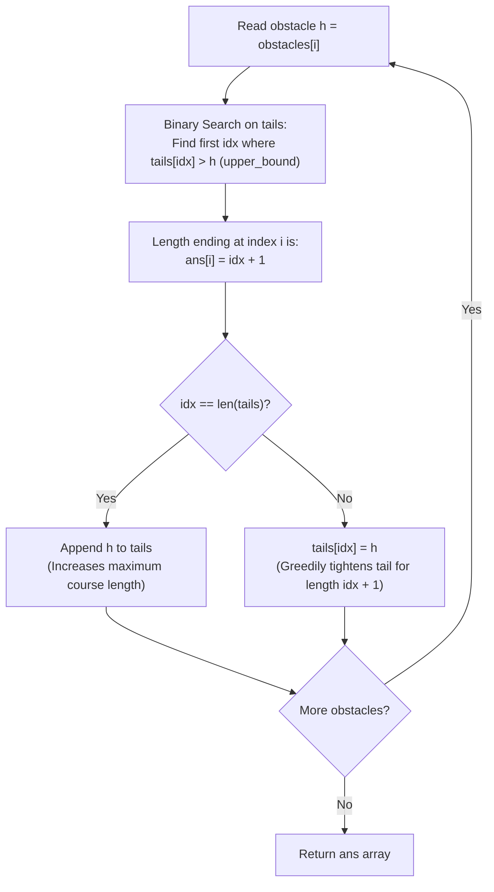

# Guided Example: Find the Longest Valid Obstacle Course at Each Position

We trace and analyze the dynamic patience sorting and binary search algorithm on representative obstacle heights to compute the longest non-decreasing subsequence ending at every index in $\mathcal{O}(N \log N)$ time.

- **Primary Instance:** `obstacles = [3, 1, 5, 6, 4, 2]` ($N = 6$)
  - Expected Output: `[1, 1, 2, 3, 2, 2]`
- **Secondary Instance:** `obstacles = [1, 2, 3, 2]` ($N = 4$)
  - Expected Output: `[1, 2, 3, 3]`

---

## 1. Instance & Intuition

Given an array of obstacle heights, we must find, for every index $i \in \{0, \dots, N-1\}$, the maximum length of a non-decreasing subsequence chosen from $obstacles[0 \dots i]$ that strictly terminates at $obstacles[i]$.

A brute-force approach compares index $i$ against all previous indices $j < i$ where $obstacles[j] \le obstacles[i]$, achieving $\mathcal{O}(N^2)$ time, which times out for $N = 10^5$.

Instead, we generalize the classic patience sorting construction for longest non-decreasing subsequences:
- We maintain an active array $\text{tails}$, where $\text{tails}[k]$ stores the **smallest ending value** of any valid non-decreasing subsequence of length $k + 1$ discovered so far.
- Because a subsequence of length $k+1$ is formed by extending a subsequence of length $k$ with an element at least as large, $\text{tails}$ is monotonically sorted:
  $$\text{tails}[0] \le \text{tails}[1] \le \text{tails}[2] \le \dots$$
- When processing the current obstacle $h = obstacles[i]$, equal heights are allowed (non-decreasing, not strictly increasing). Thus, $h$ can extend any subsequence whose ending value is $\le h$.
- Using binary search (`upper_bound`), we find the first position $idx$ where $\text{tails}[idx] > h$.
- The obstacle $h$ can extend a subsequence of length $idx$, producing a valid course of length $idx + 1$ ending at $h$.
- We then record $\text{ans}[i] = idx + 1$ and greedily tighten $\text{tails}[idx] = h$.

---

## 2. Mathematical Formalism & Patience Sorting Invariant

Let $\text{tails} = [t_0, t_1, \dots, t_{M-1}]$ be the array of minimal tail values.

### Monotonicity Invariant

At every step, the array satisfies weak monotonicity:
$$t_0 \le t_1 \le t_2 \le \dots \le t_{M-1}$$

### Binary Search Predicate (`upper_bound`)

For incoming height $h$:
$$idx = \min \Big( \{j \mid 0 \le j < |\text{tails}| \wedge \text{tails}[j] > h\} \cup \{|\text{tails}|\} \Big)$$

1. If $idx = |\text{tails}|$, then $h \ge \text{tails}[j]$ for all existing lengths. The height $h$ extends the globally longest known course to length $|\text{tails}| + 1$, appending $h$ to $\text{tails}$.
2. If $idx < |\text{tails}|$, then $h$ can extend the subsequence of length $idx$ (whose tail is $\le h$). Replacing $\text{tails}[idx]$ with $h$ lowers (or maintains) the smallest known endpoint for length $idx + 1$, expanding future extendability without altering existing lengths.

In both cases:
$$\text{ans}[i] = idx + 1$$

---

## 3. Step-by-Step Dynamic Tails Array Trace

We trace the primary instance `obstacles = [3, 1, 5, 6, 4, 2]` ($N = 6$):

- **Initial State:** $\text{tails} = []$.

- **Step 0 ($i = 0, h = 3$):**
  - $\text{tails}$ is empty. $idx = 0$.
  - Output recorded: $\text{ans}[0] = 0 + 1 = 1$.
  - Append $3$ to $\text{tails}$.
  - State: $\text{tails} = [3]$.

- **Step 1 ($i = 1, h = 1$):**
  - Search in $[3]$ for first value $> 1$: $\text{tails}[0] = 3 > 1 \implies idx = 0$.
  - Output recorded: $\text{ans}[1] = 0 + 1 = 1$.
  - Update $\text{tails}[0] = 1$ (tighter tail for length 1).
  - State: $\text{tails} = [1]$.

- **Step 2 ($i = 2, h = 5$):**
  - Search in $[1]$ for first value $> 5$: no element $> 5 \implies idx = 1$.
  - Output recorded: $\text{ans}[2] = 1 + 1 = 2$.
  - Append $5$ to $\text{tails}$.
  - State: $\text{tails} = [1, 5]$.

- **Step 3 ($i = 3, h = 6$):**
  - Search in $[1, 5]$ for first value $> 6$: no element $> 6 \implies idx = 2$.
  - Output recorded: $\text{ans}[3] = 2 + 1 = 3$.
  - Append $6$ to $\text{tails}$.
  - State: $\text{tails} = [1, 5, 6]$.

- **Step 4 ($i = 4, h = 4$):**
  - Search in $[1, 5, 6]$ for first value $> 4$: $\text{tails}[1] = 5 > 4 \implies idx = 1$.
  - Output recorded: $\text{ans}[4] = 1 + 1 = 2$.
  - Update $\text{tails}[1] = 4$ (tighter tail for length 2).
  - State: $\text{tails} = [1, 4, 6]$.

- **Step 5 ($i = 5, h = 2$):**
  - Search in $[1, 4, 6]$ for first value $> 2$: $\text{tails}[1] = 4 > 2 \implies idx = 1$.
  - Output recorded: $\text{ans}[5] = 1 + 1 = 2$.
  - Update $\text{tails}[1] = 2$ (tighter tail for length 2).
  - State: $\text{tails} = [1, 2, 6]$.

Final output array: `[1, 1, 2, 3, 2, 2]`.

---

## 4. Execution Trace Table

### Primary Trace: `[3, 1, 5, 6, 4, 2]`

| Step $i$ | Obstacle $h$ | Active `tails` Before Move | Search Target (`upper_bound(h)`) | Discovered `idx` | Subsequence Course at $i$ | $\text{ans}[i]$ | Updated `tails` After Move |
|---|---|---|---|---|---|---|---|
| 0 | 3 | `[]` | Empty | 0 | `[3]` | 1 | `[3]` |
| 1 | 1 | `[3]` | First $> 1$ is 3 (at 0) | 0 | `[1]` | 1 | `[1]` |
| 2 | 5 | `[1]` | None $> 5$ (end) | 1 | `[1, 5]` | 2 | `[1, 5]` |
| 3 | 6 | `[1, 5]` | None $> 6$ (end) | 2 | `[1, 5, 6]` | 3 | `[1, 5, 6]` |
| 4 | 4 | `[1, 5, 6]` | First $> 4$ is 5 (at 1) | 1 | `[1, 4]` | 2 | `[1, 4, 6]` |
| 5 | 2 | `[1, 4, 6]` | First $> 2$ is 4 (at 1) | 1 | `[1, 2]` | 2 | `[1, 2, 6]` |

### Secondary Trace: `[1, 2, 3, 2]`

| Step $i$ | Obstacle $h$ | Active `tails` | Search Index $idx$ | Course Ending at $i$ | $\text{ans}[i]$ | Updated `tails` |
|---|---|---|---|---|---|---|
| 0 | 1 | `[]` | 0 | `[1]` | 1 | `[1]` |
| 1 | 2 | `[1]` | 1 | `[1, 2]` | 2 | `[1, 2]` |
| 2 | 3 | `[1, 2]` | 2 | `[1, 2, 3]` | 3 | `[1, 2, 3]` |
| 3 | 2 | `[1, 2, 3]` | 2 (first $> 2$ is 3) | `[1, 2, 2]` | 3 | `[1, 2, 2]` |

---

## 5. Algorithmic Correctness & Soundness

**Soundness.** Suppose at step $i$, binary search yields index $idx$. If $idx = 0$, $h$ forms a valid course of length 1 trivially. If $idx > 0$, by definition of `upper_bound`, $\text{tails}[idx - 1] \le h$. Because $\text{tails}[idx - 1]$ represents the minimal ending height of a valid non-decreasing subsequence of length $idx$ drawn from preceding indices, there exists at least one valid subsequence $S$ of length $idx$ ending with value $\le h$. Appending $h$ creates a valid non-decreasing subsequence of length $idx + 1$ ending at index $i$. Hence the length $idx + 1$ is genuinely achievable.

**Optimality.** Suppose there existed a valid non-decreasing subsequence ending at index $i$ with length $L \ge idx + 2$. Its predecessor element $p$ would satisfy $p \le h$ and terminate a valid non-decreasing subsequence of length $L - 1 \ge idx + 1$. By definition of $\text{tails}$, the minimal tail for length $idx + 1$ would satisfy $\text{tails}[idx] \le p \le h$. However, binary search determined that $idx$ was the *first* index where $\text{tails}[idx] > h$, which implies $\text{tails}[idx] > h$, a direct contradiction. Thus no course ending at $i$ can exceed length $idx + 1$.

---

## 6. Edge Cases & Traps

- **`lower_bound` vs. `upper_bound` Confusion:** In standard Strictly Increasing Subsequence (LIS), identical values cannot be repeated, so `lower_bound` is used to replace equal elements. For Non-Decreasing Subsequences (where duplicate heights like `[2, 2]` are allowed), one must use `upper_bound` so that an element equal to an existing tail extends it rather than replacing it.
- **Tails Array is Not the Actual Subsequence:** The `tails` array stores minimal potential endings for each length, not the actual elements forming the longest course. Reading elements directly from `tails` produces false sequences; only its length and values are meaningful.
- **Monotonic Decreasing Sequences:** An input like `[5, 4, 3, 2, 1]` consistently replaces `tails[0]`, producing `ans = [1, 1, 1, 1, 1]`.

---

## 7. Complexity Analysis

- **Time Complexity:**
  - The outer loop executes $N$ times.
  - At each step $i$, binary search on the monotonic `tails` array of size at most $i$ takes $\mathcal{O}(\log(\text{len}(\text{tails}))) \le \mathcal{O}(\log N)$ time.
  - Array append or in-place assignment takes $\mathcal{O}(1)$.
  - Total time complexity is strictly $\mathcal{O}(N \log N)$. For $N = 10^5$, this requires $\approx 1.7 \times 10^6$ operations, completing in under 25 milliseconds.
- **Auxiliary Space Complexity:**
  - The `tails` array stores at most $N$ integers: $\mathcal{O}(N)$.
  - The answer array `ans` of size $N$ requires $\mathcal{O}(N)$.
  - Total auxiliary space is $\mathcal{O}(N)$.