## Solution

---

### Overview

As shown in the picture, we have `4` obstacles.
- The longest course ending at $\text{obstacles}[0]$ contains **1** obstacle, $\text{obstacles}[0]$ itself.

- The longest course ending at $\text{obstacles}[1]$ contains **2** obstacles, $\text{obstacles}[0] and [1]$.

- The longest course ending at $\text{obstacles}[2]$ contains **3** obstacles, $\text{obstacles}[0], [1], and [2]$.

- The longest course ending at $\text{obstacles}[3]$ contains **3** obstacles, $\text{obstacles}[0], [1], and [3]$. Note that the course must be non-decreasing so it can't contain $\text{obstacles}[2]$ as it is taller than $\text{obstacles}[3]$.

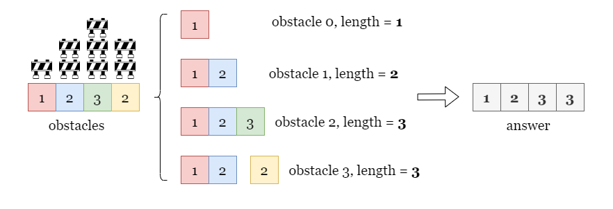

We need to find `answer`, where $\text{answer}[i]$ represents the length of the longest course that ends with $\text{obstacles}[i]$. In our case, $answer = [1, 2, 3, 3]$.

---

### Approach: Greedy + Binary Search.

#### Intuition

Given an array of integers, find the longest non-decreasing subsequence. This problem sounds similar to **[Longest Increase Subsequence](https://leetcode.com/problems/longest-increasing-subsequence/) (LIS)**. If you have already solved LIS, this problem will be much easier for you. We will solve this with a greedy approach. The key is:

> The longest course for index `i` is determined by two factors:
> - $\text{obstacles}[i]$, which is required.
> - the longest course before index `i` whose last obstacle is shorter than or equal to $\text{obstacles}[i]$.
>
> By combining the two terms above, we can determine the longest course for index `i`.

**In short, the longest course ending at index `i` depends on the courses ending before index `i`.**

Now we have found the relationship between the current problem to a smaller subproblem. It seems that we need to store all the previous obstacle courses we have met before index `i`. Then for the obstacle at index `i`, we can choose any course that had a final obstacle less than or equal to $\text{obstacles}[i]$ and simply append $\text{obstacles}[i]$ to create a new obstacle course with a longer length. We should greedily choose the longest one out of them to make the longest course for `i`.

The problem is that there might be many sequences with the same length and it's impractical to store all of them. Which one should we record? Let's use the following example to illustrate, for $i = 5$, we find that there are two previous courses of length `3` before `i`, as shown in the picture below.

- `1 -> 4 -> 6`

- `1 -> 2 -> 3`

Which one should be considered for $i = 5$?

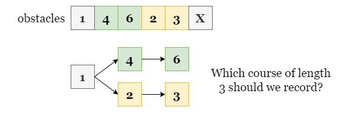

Suppose $\text{obstacles}[5] = 5$, if we only record the course $1 - 4 - 6$, we can't append `5` to it to make a longer course because $\text{obstacles}[5] < 6$.

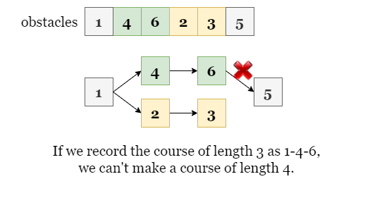

However, if we record and use the course $1 - 2 - 3$, we can append `5` to it, making the longest course of length `4`.

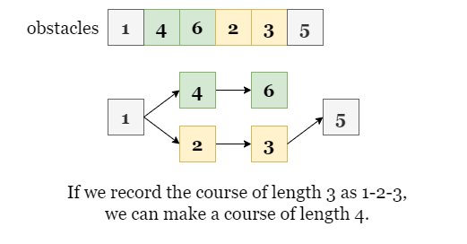

Therefore, we should always focus on the courses that have the shortest ends. As you may have noticed, we don't even need to care about the exact course, but only the height of its last obstacle. Going back to the example above, we don't need to record the whole course, but only the height of its last obstacle is as `3`, so we can make a longer course based on that with any following obstacle that is taller than or equal to `3`.

In summary, we use an array `lis` to record the height of the shortest ending obstacle for courses of each length: $\text{lis}[i]$ is the height of the shortest ending obstacle for the course of length $i + 1$.

<br>

As shown below, suppose we have built `lis` (Here, $\text{lis}[4] = 7$ means the lowest end of a course with length `5` we have met so far is `7`).

At the iteration step `i`, we have to find the longest course end by the current obstacle with $h = \text{obstacles}[i] = 6$. We want to append it to the longest obstacle course we found previously whose end is shorter than or equal to `6`.

This could be done by using a binary search on `lis`. We just need to find the rightmost insertion position (which we call `idx`) of $h = 6$ to `lis`. In this example, our insertion index is $idx = 4$, which means that the lowest end of a sequence of length `4` is shorter than or equal to $h = 6$. We can safely append `6` to this sequence to make a sequence with length `5`.

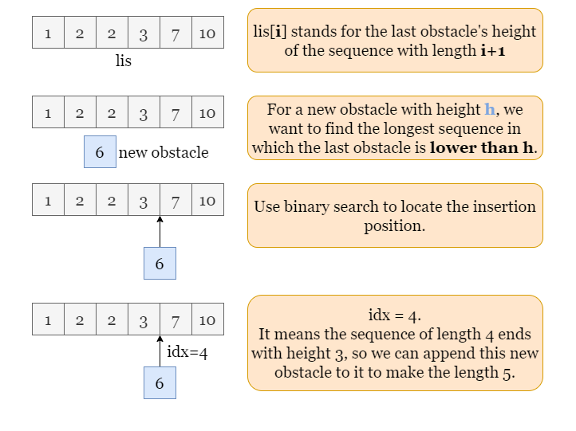

The last step is to update $\text{lis}[4] = 6$, which means that the lowest ending obstacle of a sequence with length `5` is `6`. With updates such as these, we ensure that `lis` is always in non-decreasing order and contains the lowest heights.

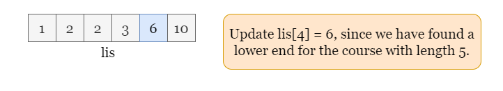

Please refer to the following slides as an example:

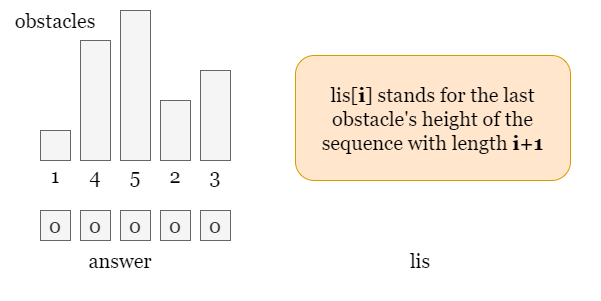

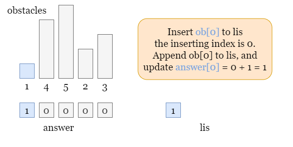

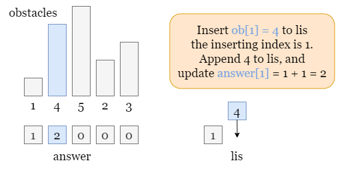

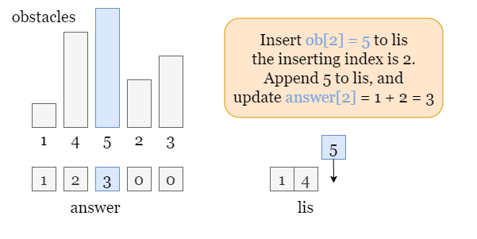

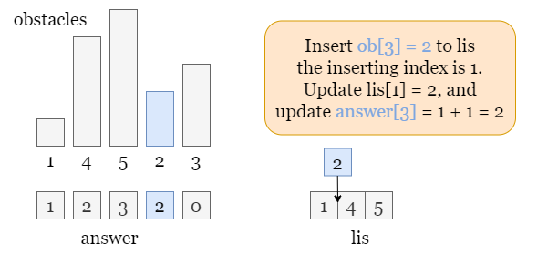

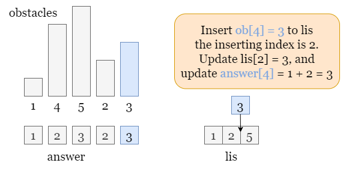

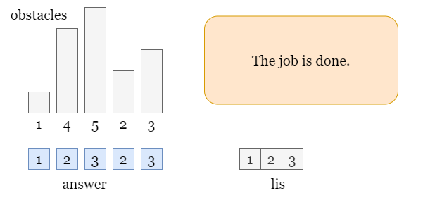

<details>

<summary>You can also practice on the following LIS problems! (click to show)</summary>

<br>

- [300. Longest Increasing Subsequence](https://leetcode.com/problems/longest-increasing-subsequence/)
- [673. Number of Longest Increasing Subsequence](https://leetcode.com/problems/number-of-longest-increasing-subsequence/)
- [2407. Longest Increasing Subsequence II](https://leetcode.com/problems/longest-increasing-subsequence-ii/)

</details>

<br>

#### Algorithm

1) Initialize an empty array `lis`, an array `answer` of the same length as `obstacles`.
2) Iterate over `obstacles`. At each step `i`, we find `idx`, the rightmost insertion position of $\text{obstacles}[i]$ to `lis`.
- If `idx` equals the length of `lis`, append $\text{obstacles}[i]$ to `lis`.
- Otherwise, update $\text{lis}[idx] = \text{obstacles}[i]$.
- Update $\text{answer}[i] = idx + 1$.
3) Return `answer` once the iteration ends.

#### Implementation

```python
    def longestObstacleCourseAtEachPosition(self, obstacles: List[int]) -> List[int]:
        n = len(obstacles)
        answer = [1] * n

        # lis[i] records the lowest increasing sequence of length i + 1.
        lis = []

        for i, height in enumerate(obstacles):
            # Find the rightmost insertion position idx.
            idx = bisect.bisect_right(lis, height)

            if idx == len(lis):
                lis.append(height)
            else:
                lis[idx] = height
            answer[i] = idx + 1

        return answer
```

#### Complexity Analysis

Let $n$ be the length of the input array `obstacles`.

* Time complexity: $O(n \cdot\log n)$

- We traverse over `obstacles` to find the longest sequence. At each step `i` in the iteration, we apply a binary search over `lis` to find the insertion position of the current height $\text{obstacles}[i]$.
- One binary search over an sorted array of size $k$ takes $\log k$ time. Imagine the case where we append every height to `lis` after each step. In the second half of the traverse, there are always more than $n / 2$ elements in `lis`, thus all these $n / 2$ binary searches take $O(\log n)$ time. In this case, the time complexity is $O(n \cdot\log n)$.
- To sum up, the time complexity is $O(n \cdot\log n)$.

* Space complexity: $O(n)$

- We create an array `lis` to store the height of the ending of each sequence. The maximum length of the longest obstacle course is $n$, thus the size of `lis` is $n$ in the worst-case scenario.

<br/>