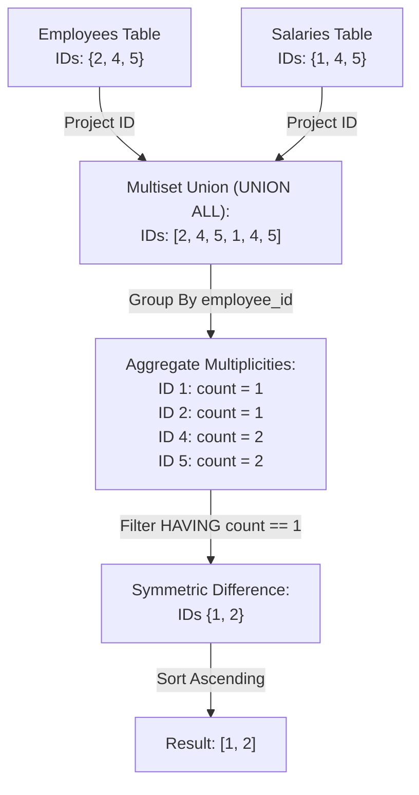

# Guided Example: Employees With Missing Information

We formulate and analyze the relational symmetric difference and full outer join aggregation on representative database tables to identify employee records with missing attributes.

- **Primary Instance:**
  - `Employees`: IDs $\{2, 4, 5\}$
  - `Salaries`: IDs $\{1, 4, 5\}$
  - **Expected Output:** IDs `1` and `2` in ascending order

---

## 1. Instance & Intuition

In relational database systems, employee information is frequently normalized across multiple tables—here, personal identity in `Employees` (storing `name`) and financial compensation in `Salaries` (storing `salary`).

An employee profile is considered to have **missing information** if their record appears in one table but lacks a matching entry in the other:
1. An ID present in `Employees` but absent from `Salaries` has an identity on file but no recorded salary.
2. An ID present in `Salaries` but absent from `Employees` has payroll entries but lacks personal identification.
3. An ID present in both tables has complete information and is excluded.

In terms of set theory, this corresponds to the **symmetric difference** between the two ID domains:
$$\mathcal{M} = (\mathcal{E} \setminus \mathcal{S}) \cup (\mathcal{S} \setminus \mathcal{E})$$

In our primary instance:
- ID 1 is in `Salaries` but not `Employees` (lacks name) $\implies$ Missing.
- ID 2 is in `Employees` but not `Salaries` (lacks salary) $\implies$ Missing.
- IDs 4 and 5 are in both tables $\implies$ Complete (excluded).
- The result set $\{1, 2\}$, sorted in ascending order, is emitted.

---

## 2. Relational Set Algebra & Symmetric Difference

Let $\mathcal{E} = \pi_{\text{employee\_id}}(\text{Employees})$ and $\mathcal{S} = \pi_{\text{employee\_id}}(\text{Salaries})$.

### Formulation 1: Symmetric Difference via Outer Join

Using a full outer join on $\text{employee\_id}$:
$$J = \text{Employees} \;\; \rlap{\raisebox{0.5ex}{$\subset$}}{\supset} \;\; \text{Salaries}$$
Rows with missing information are those with null attributes in either side:
$$\mathcal{M} = \{id \mid (id, \text{name}, \text{salary}) \in J \wedge (\text{name is NULL} \vee \text{salary is NULL})\}$$

### Formulation 2: Multiset Frequency Union

Consider the multiset union of both key projections:
$$U = \pi_{\text{employee\_id}}(\text{Employees}) \cup_{\text{all}} \pi_{\text{employee\_id}}(\text{Salaries})$$
Because `employee_id` is unique within each individual table:
- IDs present in both tables appear exactly $1 + 1 = 2$ times in $U$.
- IDs present in only one table appear exactly 1 time in $U$.
- Therefore, grouping by ID and selecting entries with $\text{COUNT} = 1$ extracts the exact symmetric difference:
$$\mathcal{M} = \{id \in U \mid \text{multiplicity}(id, U) = 1\}$$

---

## 3. Step-by-Step Set Evolution and Join Execution

We trace the primary instance through the multiset aggregation pipeline:

### Step 1: Individual Table Inspection

| Source Table | `employee_id` | Attribute Present | Attribute Status |
|---|---|---|---|
| `Employees` | 2 | `name` = "Bob" | Present |
| `Employees` | 4 | `name` = "David" | Present |
| `Employees` | 5 | `name` = "Eve" | Present |
| `Salaries` | 1 | `salary` = 50000 | Present |
| `Salaries` | 4 | `salary` = 60000 | Present |
| `Salaries` | 5 | `salary` = 75000 | Present |

### Step 2: Projection and Union All

We extract the ID columns and combine them:
- Projected from `Employees`: `[2, 4, 5]`
- Projected from `Salaries`: `[1, 4, 5]`
- Combined Multiset: `[2, 4, 5, 1, 4, 5]`

### Step 3: Multiplicity Tallying

- ID 1: appears once (from `Salaries`).
- ID 2: appears once (from `Employees`).
- ID 4: appears twice (once in `Employees`, once in `Salaries`).
- ID 5: appears twice (once in `Employees`, once in `Salaries`).

### Step 4: Filtering and Ordering

- Criteria: $\text{Frequency} == 1$.
- Matching IDs: $\{1, 2\}$.
- Sort numeric ascending: `1`, followed by `2`.

---

## 4. Execution Trace Table

### Primary Instance Join Evaluation

| `employee_id` | In `Employees`? | In `Salaries`? | Multiplicity in Union | Information Completeness | Output Eligibility |
|---|---|---|---|---|---|
| 1 | No | Yes | 1 | Missing `name` | **Included (Rank 1)** |
| 2 | Yes | No | 1 | Missing `salary` | **Included (Rank 2)** |
| 4 | Yes | Yes | 2 | Complete | Excluded |
| 5 | Yes | Yes | 2 | Complete | Excluded |

### Comparison Across Diagnostic Configurations

| Test Configuration | `Employees` IDs | `Salaries` IDs | Symmetric Difference | Ascending Output |
|---|---|---|---|---|
| Partial Overlap | $\{2, 4, 5\}$ | $\{1, 4, 5\}$ | $\{1, 2\}$ | `[1, 2]` |
| Exact Match | $\{3, 8\}$ | $\{3, 8\}$ | $\emptyset$ | Empty table |
| Completely Disjoint | $\{10, 20\}$ | $\{30, 40\}$ | $\{10, 20, 30, 40\}$ | `[10, 20, 30, 40]` |
| Empty Right Table | $\{7\}$ | $\emptyset$ | $\{7\}$ | `[7]` |

---

## 5. Algorithmic Correctness & Soundness

**Soundness.** Let an ID $x$ be emitted by the algorithm. Then $x$ appears with multiplicity 1 in the multiset union $\pi(\text{Employees}) \cup_{\text{all}} \pi(\text{Salaries})$. Because each individual table contains unique `employee_id` values, $x$ cannot appear more than once in `Employees`, nor more than once in `Salaries`. A multiplicity of 1 implies that $x$ exists in exactly one table, which means either `name` or `salary` is absent. Thus every emitted ID is genuinely missing information.

**Completeness.** Suppose an employee ID $y$ has missing information. By definition, $y$ belongs to $(\mathcal{E} \setminus \mathcal{S}) \cup (\mathcal{S} \setminus \mathcal{E})$. If $y \in \mathcal{E} \setminus \mathcal{S}$, it appears once in `Employees` and zero times in `Salaries`, giving multiplicity 1 in the union. If $y \in \mathcal{S} \setminus \mathcal{E}$, it appears zero times in `Employees` and once in `Salaries`, giving multiplicity 1 in the union. The aggregation groups by `employee_id` and filters by $\text{COUNT} = 1$, so $y$ is guaranteed to be retained. Sorting enforces strict ascending order.

---

## 6. Edge Cases & Traps

- **Identical Tables:** When both tables contain the exact same set of IDs, every ID has frequency 2 in the union. The filter $\text{COUNT} = 1$ correctly produces an empty output table without errors.
- **Empty Table:** If one of the tables is completely empty, all IDs from the non-empty table have frequency 1 and must be returned.
- **`UNION` vs. `UNION ALL`:** Using `UNION` instead of `UNION ALL` deduplicates keys prior to grouping, turning all frequencies into 1 and erroneously reporting every employee as having missing information. `UNION ALL` is required to preserve multiplicities.
- **Ascending Sort Requirement:** Neglecting the `ORDER BY employee_id ASC` clause produces non-deterministic row ordering that fails automated verification.

---

## 7. Complexity Analysis

- **Time Complexity:**
  - Let $E$ be the number of rows in `Employees` and $S$ be the number of rows in `Salaries`.
  - Scanning both tables takes $\mathcal{O}(E + S)$ time.
  - Hashing or grouping IDs into buckets takes $\mathcal{O}(E + S)$ time.
  - Filtering entries with count 1 takes $\mathcal{O}(|\mathcal{M}|)$ where $|\mathcal{M}| \le E + S$.
  - Sorting the filtered IDs in ascending order takes $\mathcal{O}(|\mathcal{M}| \log |\mathcal{M}|)$.
  - Total time complexity is $\mathcal{O}(E + S + |\mathcal{M}| \log |\mathcal{M}|)$.
- **Auxiliary Space Complexity:**
  - The intermediate hash map or union buffer requires $\mathcal{O}(E + S)$ space to track counts.
