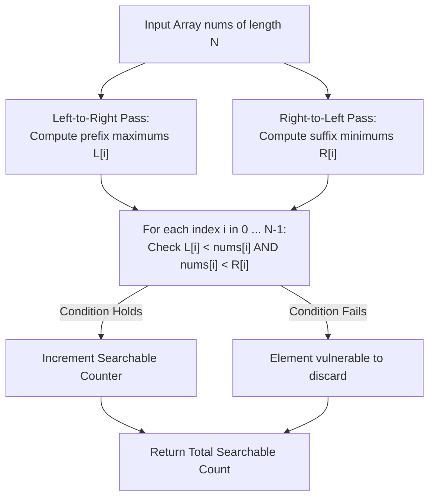

# Guided Example: Binary Searchable Numbers in an Unsorted Array

We formulate and analyze the bidirectional prefix-maximum and suffix-minimum filtering theorem on representative unsorted arrays to count all elements guaranteed to be located under adversarial pivot sequences.

- **Primary Instance:** `nums = [1, 3, 2, 4]` ($N = 4$)
  - Expected Output: `2` (elements `1` and `4` are guaranteed to be found)
- **Secondary Instance:** `nums = [-1, 5, 2]` ($N = 3$)
  - Expected Output: `1` (element `-1` is guaranteed to be found)

---

## 1. Instance & Intuition

In a generalized binary search on an unsorted array, an algorithm picks any arbitrary element as a pivot:
- If $\text{pivot} == \text{target}$, the search succeeds immediately.
- If $\text{pivot} < \text{target}$, the algorithm assumes the target lies to the right, discarding the pivot and all elements to its left.
- If $\text{pivot} > \text{target}$, the algorithm assumes the target lies to the left, discarding the pivot and all elements to its right.

Because the array is not necessarily sorted, an erroneous discard can occur. We seek elements that are **guaranteed to be found regardless of which pivot sequence is chosen** (even against an adversarial selection strategy).

Consider a target element $x = nums[i]$:
1. Suppose there exists some element to the left of $i$ (index $j < i$) with $nums[j] > nums[i]$. If an adversary selects $nums[j]$ as the pivot, then $\text{pivot} > \text{target}$, which discards the pivot and **everything to its right**, erroneously eliminating the target $nums[i]$. Thus, every element to the left must be strictly smaller than $nums[i]$.
2. Suppose there exists some element to the right of $i$ (index $k > i$) with $nums[k] < nums[i]$. If an adversary selects $nums[k]$ as the pivot, then $\text{pivot} < \text{target}$, which discards the pivot and **everything to its left**, erroneously eliminating the target $nums[i]$. Thus, every element to the right must be strictly greater than $nums[i]$.

Conversely, if both conditions hold:
- Any pivot chosen to the left is smaller than $nums[i]$, discarding only elements to its left and preserving $nums[i]$.
- Any pivot chosen to the right is larger than $nums[i]$, discarding only elements to its right and preserving $nums[i]$.
- Choosing $nums[i]$ itself succeeds.

Therefore, an element $nums[i]$ is binary searchable if and only if it is simultaneously strictly greater than all elements to its left and strictly less than all elements to its right.

---

## 2. Mathematical Formalism & Invariant Characterization

Let $nums$ be an array of $N$ unique integers.

### Left and Right Extrema Arrays

For each index $i \in \{0, \dots, N-1\}$:
- **Strict Prefix Maximum:**
  $$L[i] = \max_{0 \le j < i} nums[j] \quad (\text{with } L[0] = -\infty)$$
- **Strict Suffix Minimum:**
  $$R[i] = \min_{i < k < N} nums[k] \quad (\text{with } R[N-1] = +\infty)$$

### Characterization Theorem

An element at index $i$ is binary searchable if and only if:
$$L[i] < nums[i] < R[i]$$

This property is identical to identifying "partition pivots" in quicksort: elements that would remain in their exact same position if the array were sorted.

---

## 3. Step-by-Step Prefix Max and Suffix Min Sweeps

We trace `nums = [1, 3, 2, 4]` ($N = 4$):

### Step 1: Forward Sweep for Prefix Maximums ($L$)

- $i = 0$: $L[0] = -\infty$. Running max becomes $nums[0] = 1$.
- $i = 1$: $L[1] = 1$. Running max becomes $\max(1, 3) = 3$.
- $i = 2$: $L[2] = 3$. Running max becomes $\max(3, 2) = 3$.
- $i = 3$: $L[3] = 3$. Running max becomes $\max(3, 4) = 4$.
- Prefix maximum array: $L = [-\infty, 1, 3, 3]$.

### Step 2: Backward Sweep for Suffix Minimums ($R$)

- $i = 3$: $R[3] = +\infty$. Running min becomes $nums[3] = 4$.
- $i = 2$: $R[2] = 4$. Running min becomes $\min(4, 2) = 2$.
- $i = 1$: $R[1] = \min(4, 2) = 2$. Running min becomes $\min(2, 3) = 2$.
- $i = 0$: $R[0] = 2$. Running min becomes $\min(2, 1) = 1$.
- Suffix minimum array: $R = [2, 2, 4, +\infty]$.

### Step 3: Simultaneous Verification

1. **Index 0 ($nums[0] = 1$):**
   - $L[0] = -\infty < 1$ (Pass)
   - $R[0] = 2 > 1$ (Pass)
   - **Status: Guaranteed Searchable.**
2. **Index 1 ($nums[1] = 3$):**
   - $L[1] = 1 < 3$ (Pass)
   - $R[1] = 2$. Check $3 < 2$ (**Fails!** Pivot 2 to the right would discard index 1)
   - **Status: Vulnerable.**
3. **Index 2 ($nums[2] = 2$):**
   - $L[2] = 3$. Check $3 < 2$ (**Fails!** Pivot 3 to the left would discard index 2)
   - $R[2] = 4 > 2$ (Pass)
   - **Status: Vulnerable.**
4. **Index 3 ($nums[3] = 4$):**
   - $L[3] = 3 < 4$ (Pass)
   - $R[3] = +\infty > 4$ (Pass)
   - **Status: Guaranteed Searchable.**

Total guaranteed searchable elements: $1 + 0 + 0 + 1 = 2$.

---

## 4. Execution Trace Table

### Primary Trace: `nums = [1, 3, 2, 4]`

| Index $i$ | Value $nums[i]$ | Left Max $L[i]$ | $L[i] < nums[i]$? | Right Min $R[i]$ | $nums[i] < R[i]$? | Adversary Counter-Pivot | Searchable? |
|---|---|---|---|---|---|---|---|
| 0 | 1 | $-\infty$ | True ($-\infty < 1$) | 2 | True ($1 < 2$) | None | **Yes** |
| 1 | 3 | 1 | True ($1 < 3$) | 2 | **False ($3 \not< 2$)** | Pivot 2 at index 2 ($2 < 3 \implies$ discards left) | No |
| 2 | 2 | 3 | **False ($3 \not< 2$)** | 4 | True ($2 < 4$) | Pivot 3 at index 1 ($3 > 2 \implies$ discards right) | No |
| 3 | 4 | 3 | True ($3 < 4$) | $+\infty$ | True ($4 < \infty$) | None | **Yes** |

### Secondary Trace: `nums = [-1, 5, 2]`

| Index $i$ | Value $nums[i]$ | Left Max $L[i]$ | Right Min $R[i]$ | Verification $L[i] < nums[i] < R[i]$ | Result |
|---|---|---|---|---|---|
| 0 | -1 | $-\infty$ | $\min(5, 2) = 2$ | $-\infty < -1 < 2$ (Pass) | **Searchable** |
| 1 | 5 | -1 | 2 | $-1 < 5 \not< 2$ (Fails on right) | Discardable |
| 2 | 2 | 5 | $+\infty$ | $5 \not< 2 < \infty$ (Fails on left) | Discardable |

---

## 5. Algorithmic Correctness & Soundness

**Soundness.** Suppose $L[i] < nums[i] < R[i]$. We prove by induction on search iterations that $nums[i]$ is never discarded. At any step, let the active interval of surviving indices be $[low, high]$ containing $i$ ($low \le i \le high$). Suppose pivot $p = nums[m]$ is chosen:
1. If $m = i$, the search terminates successfully.
2. If $m < i$, then $m$ is to the left of $i$. Since $nums[m] \le L[i] < nums[i]$, the pivot is strictly smaller than the target. The search discards $[low, m]$ and recurses on $[m+1, high]$. Because $m < i$, $i \in [m+1, high]$, so index $i$ survives.
3. If $m > i$, then $m$ is to the right of $i$. Since $nums[m] \ge R[i] > nums[i]$, the pivot is strictly greater than the target. The search discards $[m, high]$ and recurses on $[low, m-1]$. Because $m > i$, $i \in [low, m-1]$, so index $i$ survives.
Since the search space shrinks by at least one element per iteration while preserving index $i$, the algorithm must eventually pick pivot $m = i$ and succeed.

**Completeness.** If $L[i] \ge nums[i]$, let $j < i$ satisfy $nums[j] \ge nums[i]$. (Because array elements are unique, $nums[j] > nums[i]$). If the adversary selects $nums[j]$ on the first step, $\text{pivot} = nums[j] > nums[i]$, so all elements at indices $\ge j$ (including $i$) are discarded, causing search failure. An analogous elimination occurs if $R[i] \le nums[i]$. Thus, condition $L[i] < nums[i] < R[i]$ is strictly necessary.

---

## 6. Edge Cases & Traps

- **Single Element ($N = 1$):** `nums = [7]`. $L[0] = -\infty, R[0] = +\infty$. The single element is always trivially found on the first pivot, producing count 1.
- **Strictly Increasing Array:** In a sorted array, $L[i] < nums[i] < R[i]$ holds for every element. All $N$ elements are searchable, producing count $N$.
- **Strictly Decreasing Array:** In a reversed array (e.g. `[3, 2, 1]`), for every element $i > 0$, $L[i] > nums[i]$; and for $i < N-1$, $R[i] < nums[i]$. No element satisfies both conditions, so the count is 0.

---

## 7. Complexity Analysis

- **Time Complexity:**
  - Prefix maximum pass: $\mathcal{O}(N)$ sequential scan.
  - Suffix minimum pass: $\mathcal{O}(N)$ reverse scan.
  - Verification loop: $N$ checks evaluating two inequalities in $\mathcal{O}(1)$.
  - Total time complexity is strictly $\mathcal{O}(N)$, optimal for reading the input.
- **Auxiliary Space Complexity:**
  - The suffix minimum array requires $N$ integers: $\mathcal{O}(N)$.
  - The prefix maximum can be tracked with a single scalar variable during the verification loop.
  - Total auxiliary space is $\mathcal{O}(N)$.
