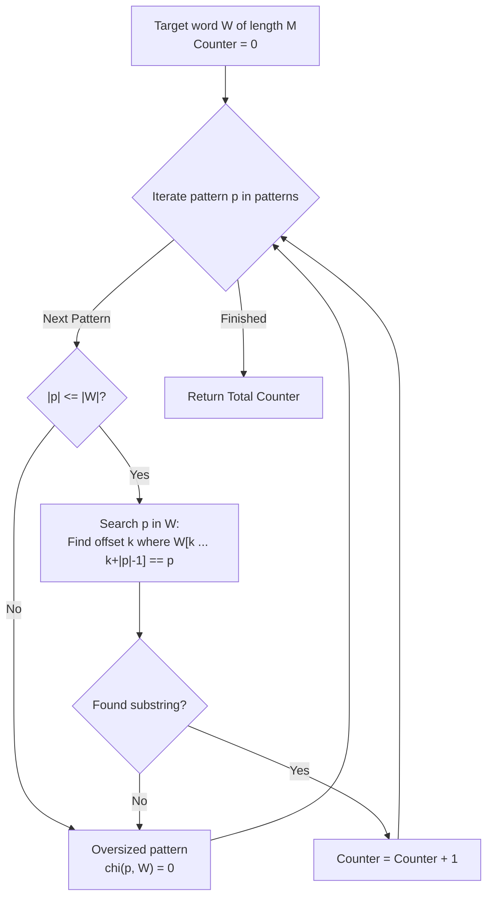

# Guided Example: Number of Strings That Appear as Substrings in Word

We formulate and trace the linear-scan substring verification and frequency counting algorithm on representative pattern sets to determine the total number of pattern entries occurring contiguously in a target text.

- **Primary Instance:** `patterns = ["a", "abc", "bc", "d"]`, `word = "abc"` ($P = 4, M = 3$)
  - Expected Output: `3` (patterns `"a"`, `"abc"`, and `"bc"` occur in `"abc"`)
- **Secondary Instance (Duplicates):** `patterns = ["a", "a", "a"]`, `word = "ab"` ($P = 3, M = 2$)
  - Expected Output: `3` (each entry evaluated independently)

---

## 1. Instance & Intuition

A string $p$ is defined as a contiguous substring of $word$ if there exists an integer starting offset $k \in \{0, \dots, |word| - |p|\}$ such that:
$$word[k \dots k + |p| - 1] = p$$

We are given a list of $P$ pattern strings and a target text $word$. We must count how many list entries are substrings of $word$:
1. **Contiguous Requirement:** Characters must appear in unbroken consecutive sequence (unlike subsequences, gaps are prohibited).
2. **Positional Independence:** Each entry in `patterns` is tested independently. If identical patterns occur at multiple indices in `patterns`, each copy that matches contributes $+1$ to the total.
3. **Multiplicity Invariance:** A single pattern that occurs multiple times within `word` (e.g. `"a"` in `"aaaa"`) contributes at most $+1$ towards its own array entry.

In our primary instance:
- Pattern 0 (`"a"`): matches slice $word[0 \dots 0]$ $\implies$ Match ($+1$).
- Pattern 1 (`"abc"`): matches slice $word[0 \dots 2]$ $\implies$ Match ($+1$).
- Pattern 2 (`"bc"`): matches slice $word[1 \dots 2]$ $\implies$ Match ($+1$).
- Pattern 3 (`"d"`): character `'d'` does not occur in `"abc"` $\implies$ Mismatch ($+0$).
- Total count: $1 + 1 + 1 + 0 = 3$.

---

## 2. Mathematical Formalism & Substring Predicates

Let $W = word$ with length $M = |W|$. Let $patterns = [p_0, p_1, \dots, p_{P-1}]$.

### Substring Indicator Function

For any pattern $p$ of length $L = |p|$:
$$\chi(p, W) = \begin{cases} 
1 & \text{if } \exists \, k \in \{0, \dots, M - L\} \text{ such that } W[k \dots k + L - 1] = p \\
0 & \text{otherwise}
\end{cases}$$

Notice that if $|p| > |W|$, the set of feasible starting indices is empty, so $\chi(p, W) = 0$ trivially.

### Objective Formulation

The total count of matching entries is:
$$\text{TotalMatches} = \sum_{j=0}^{P-1} \chi(p_j, W)$$

---

## 3. Step-by-Step Sliding Window Pattern Matching

We trace `patterns = ["a", "abc", "bc", "d"]` against `word = "abc"` ($M = 3$):

### Evaluating Pattern 0: $p_0 = \texttt{"a"}$ ($L = 1$)

- Candidate offsets: $k \in \{0, 1, 2\}$.
- $k = 0$: $word[0 \dots 0] = \texttt{"a"} == \texttt{"a"}$.
- Found match at index 0. $\chi(p_0, W) = 1$.
- Running Total: $1$.

### Evaluating Pattern 1: $p_1 = \texttt{"abc"}$ ($L = 3$)

- Candidate offsets: $k \in \{0\}$.
- $k = 0$: $word[0 \dots 2] = \texttt{"abc"} == \texttt{"abc"}$.
- Found match at index 0. $\chi(p_1, W) = 1$.
- Running Total: $1 + 1 = 2$.

### Evaluating Pattern 2: $p_2 = \texttt{"bc"}$ ($L = 2$)

- Candidate offsets: $k \in \{0, 1\}$.
- $k = 0$: $word[0 \dots 1] = \texttt{"ab"} \neq \texttt{"bc"}$.
- $k = 1$: $word[1 \dots 2] = \texttt{"bc"} == \texttt{"bc"}$.
- Found match at index 1. $\chi(p_2, W) = 1$.
- Running Total: $2 + 1 = 3$.

### Evaluating Pattern 3: $p_3 = \texttt{"d"}$ ($L = 1$)

- Candidate offsets: $k \in \{0, 1, 2\}$.
- $k = 0$: $word[0] = \texttt{'a'} \neq \texttt{'d'}$.
- $k = 1$: $word[1] = \texttt{'b'} \neq \texttt{'d'}$.
- $k = 2$: $word[2] = \texttt{'c'} \neq \texttt{'d'}$.
- No matching offset exists. $\chi(p_3, W) = 0$.
- Running Total: $3 + 0 = 3$.

---

## 4. Execution Trace Table

### Primary Trace: `patterns = ["a", "abc", "bc", "d"]`, `word = "abc"`

| Entry Index $j$ | Pattern $p_j$ | Length $|p_j|$ | Feasible Offsets | Matching Offset Found | Substring Slice | Indicator $\chi(p_j, W)$ | Running Total |
|---|---|---|---|---|---|---|---|
| 0 | `"a"` | 1 | $\{0, 1, 2\}$ | $k = 0$ | $word[0 \dots 0] = \texttt{"a"}$ | 1 | 1 |
| 1 | `"abc"` | 3 | $\{0\}$ | $k = 0$ | $word[0 \dots 2] = \texttt{"abc"}$ | 1 | 2 |
| 2 | `"bc"` | 2 | $\{0, 1\}$ | $k = 1$ | $word[1 \dots 2] = \texttt{"bc"}$ | 1 | 3 |
| 3 | `"d"` | 1 | $\{0, 1, 2\}$ | None | None | 0 | 3 |

### Secondary Trace: Duplicate Evaluation (`word = "ab"`)

| Entry Index $j$ | Pattern $p_j$ | In `word`? | Independent Contribution | Accumulated Count |
|---|---|---|---|---|
| 0 | `"a"` | Yes ($word[0]$) | $+1$ | 1 |
| 1 | `"a"` | Yes ($word[0]$) | $+1$ | 2 |
| 2 | `"a"` | Yes ($word[0]$) | $+1$ | 3 |

---

## 5. Algorithmic Correctness & Soundness

**Soundness.** For each pattern $p_j$, the indicator $\chi(p_j, W)$ evaluates to 1 if and only if an offset $k$ is found where $W[k \dots k+|p_j|-1] = p_j$. This guarantees that $p_j$ appears contiguously in $W$. Incrementing the accumulator by $\chi(p_j, W)$ ensures that only valid occurrences are counted.

**Completeness.** Every entry in `patterns` is iterated and checked. Testing every candidate start index $k \in \{0, \dots, M - |p_j|\}$ guarantees that any existing occurrence of $p_j$ in $W$ is located. Because distinct indices in `patterns` are evaluated separately, duplicate patterns are accounted for without double-counting a single pattern index.

---

## 6. Edge Cases & Traps

- **Duplicate Patterns in List:** The problem requires counting array *entries*, not unique strings. Deduplicating `patterns` via a hash set before counting would cause errors on inputs like `["a", "a", "a"]`.
- **Pattern Longer Than Word:** When $|p_j| > |word|$, the pattern cannot be a substring. Attempting slice comparisons without checking lengths could cause string index out-of-bounds exceptions.
- **Identical Single-Character Strings:** If $word = \texttt{"a"}$ and $p = \texttt{"a"}$, $k = 0$ matches immediately with $|p| = 1$.

---

## 7. Complexity Analysis

- **Time Complexity:**
  - Let $P$ be the number of patterns and $M$ the length of `word`.
  - For each pattern $p_j$ of length $L_j$, naive substring search takes $\mathcal{O}((M - L_j + 1) \cdot L_j) \le \mathcal{O}(M \cdot L_j)$ time.
  - Summing across all $P$ patterns: $\mathcal{O}(M \sum L_j)$.
  - Given $P \le 100$, $M \le 100$, and $L_j \le 100$, the maximum number of character comparisons is $100 \times 100 \times 100 = 10^6$, running in under 2 milliseconds.
  - (Alternatively, constructing an Aho-Corasick automaton or Suffix Automaton takes $\mathcal{O}(M + \sum L_j)$ time).
- **Auxiliary Space Complexity:**
  - The algorithm operates in-place using scalar iteration counters, requiring $\mathcal{O}(1)$ auxiliary memory.
