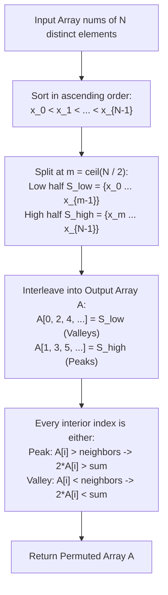

# Guided Example: Array With Elements Not Equal to Average of Neighbors

We formulate and analyze the bipartite sort-and-interleave "wiggle" algorithm on representative arrays to construct permutations where every interior element strictly diverges from the arithmetic mean of its neighbors.

- **Primary Instance:** `nums = [1, 2, 3, 4, 5]` ($N = 5$)
  - Expected Output: `[1, 4, 2, 5, 3]`
- **Secondary Instance:** `nums = [1, 2, 3]` ($N = 3$)
  - Expected Output: `[1, 3, 2]`

---

## 1. Instance & Intuition

Given an array of $N$ distinct numbers, we must rearrange them such that for every interior index $i \in \{1, \dots, N-2\}$:
$$nums[i] \neq \frac{nums[i-1] + nums[i+1]}{2} \iff 2 \cdot nums[i] \neq nums[i-1] + nums[i+1]$$

Under what geometric condition can a number equal the average of two others?
The average $\frac{a + b}{2}$ always lies strictly between $a$ and $b$ (assuming $a \neq b$).
Therefore, $nums[i]$ can equal the arithmetic mean of its neighbors **only if** $nums[i]$ lies strictly between them:
$$nums[i-1] < nums[i] < nums[i+1] \quad \text{or} \quad nums[i-1] > nums[i] > nums[i+1]$$

If we ensure that every interior element is an **extremum** relative to its neighbors—meaning it is either:
1. A **local maximum (peak):** $nums[i] > nums[i-1]$ and $nums[i] > nums[i+1]$
   $$\implies 2 \cdot nums[i] > nums[i-1] + nums[i+1]$$
2. A **local minimum (valley):** $nums[i] < nums[i-1]$ and $nums[i] < nums[i+1]$
   $$\implies 2 \cdot nums[i] < nums[i-1] + nums[i+1]$$

Then equality with the arithmetic mean is algebraically impossible!

To enforce this alternating peak-and-valley structure:
- Sort the distinct elements in ascending order.
- Partition the sorted elements into a smaller half and a larger half.
- Interleave elements from the smaller half into even positions ($0, 2, 4, \dots$) and elements from the larger half into odd positions ($1, 3, 5, \dots$).

---

## 2. Mathematical Formalism & Extremal Wiggle Invariant

Let the sorted elements of $nums$ be:
$$x_0 < x_1 < x_2 < \dots < x_{N-1}$$

### Bipartite Partition

Let $m = \lceil N / 2 \rceil$. We partition the sorted sequence into two disjoint subsets:
- **Low Set:** $S_{\text{low}} = \{x_0, x_1, \dots, x_{m-1}\}$
- **High Set:** $S_{\text{high}} = \{x_m, x_{m+1}, \dots, x_{N-1}\}$

Because all initial values are distinct, every element in the high set is strictly greater than every element in the low set:
$$\forall u \in S_{\text{low}}, \forall v \in S_{\text{high}} : u < v$$

### Interleaving Permutation

We populate the output array $A$ of length $N$:
- Even indices receive elements from $S_{\text{low}}$:
  $$A[2k] = x_k \quad \text{for } 0 \le k < m$$
- Odd indices receive elements from $S_{\text{high}}$:
  $$A[2k+1] = x_{m+k} \quad \text{for } 0 \le k < N - m$$

### Structural Invariant

For every odd index $j = 2k+1$:
$$A[j] \in S_{\text{high}} \quad \text{and} \quad A[j-1], A[j+1] \in S_{\text{low}}$$
Since every element in $S_{\text{high}}$ exceeds every element in $S_{\text{low}}$:
$$A[j] > A[j-1] \quad \text{and} \quad A[j] > A[j+1]$$
Thus, every odd interior index is a strict peak. By symmetry, every even interior index is a strict valley.

---

## 3. Step-by-Step Bipartite Interleaving Construction

We trace the primary instance `nums = [1, 2, 3, 4, 5]` ($N = 5$):

### Step 1: Sorting
- Input: `[1, 2, 3, 4, 5]` (already sorted).
- Indices: $x_0 = 1, x_1 = 2, x_2 = 3, x_3 = 4, x_4 = 5$.

### Step 2: Bipartitioning
- Split point: $m = \lceil 5 / 2 \rceil = 3$.
- Low set: $S_{\text{low}} = [x_0, x_1, x_2] = [1, 2, 3]$.
- High set: $S_{\text{high}} = [x_3, x_4] = [4, 5]$.

### Step 3: Alternating Placement
- Place Low set into even slots:
  - $A[0] = S_{\text{low}}[0] = 1$
  - $A[2] = S_{\text{low}}[1] = 2$
  - $A[4] = S_{\text{low}}[2] = 3$
- Place High set into odd slots:
  - $A[1] = S_{\text{high}}[0] = 4$
  - $A[3] = S_{\text{high}}[1] = 5$
- Assembled array: $A = [1, 4, 2, 5, 3]$.

### Step 4: Verification of Arithmetic Means

1. **Interior Index $i = 1$ ($A[1] = 4$):**
   - Left neighbor: $A[0] = 1$, Right neighbor: $A[2] = 2$.
   - Arithmetic mean: $(1 + 2) / 2 = 1.5$.
   - Test: $4 \neq 1.5$ (Passes, since $4 > 1.5$).
2. **Interior Index $i = 2$ ($A[2] = 2$):**
   - Left neighbor: $A[1] = 4$, Right neighbor: $A[3] = 5$.
   - Arithmetic mean: $(4 + 5) / 2 = 4.5$.
   - Test: $2 \neq 4.5$ (Passes, since $2 < 4.5$).
3. **Interior Index $i = 3$ ($A[3] = 5$):**
   - Left neighbor: $A[2] = 2$, Right neighbor: $A[4] = 3$.
   - Arithmetic mean: $(2 + 3) / 2 = 2.5$.
   - Test: $5 \neq 2.5$ (Passes, since $5 > 2.5$).

All interior positions satisfy the non-average guarantee.

---

## 4. Execution Trace Table

### Element Distribution for $N = 5$

| Output Slot $k$ | Parity | Source Partition | Selected Element | Role | Left Neighbor | Right Neighbor | Neighbor Mean | Equality? |
|---|---|---|---|---|---|---|---|---|
| 0 | Even | $S_{\text{low}}[0]$ | 1 | Endpoint | None | 4 | N/A | N/A |
| 1 | Odd | $S_{\text{high}}[0]$ | 4 | Peak | 1 | 2 | 1.5 | $4 \neq 1.5$ |
| 2 | Even | $S_{\text{low}}[1]$ | 2 | Valley | 4 | 5 | 4.5 | $2 \neq 4.5$ |
| 3 | Odd | $S_{\text{high}}[1]$ | 5 | Peak | 2 | 3 | 2.5 | $5 \neq 2.5$ |
| 4 | Even | $S_{\text{low}}[2]$ | 3 | Endpoint | 5 | None | N/A | N/A |

### Secondary Trace: `nums = [1, 2, 3]`

| Step | Partition | Placement | Result Array | Verification at $i = 1$ |
|---|---|---|---|---|
| Split $m = 2$ | $S_{\text{low}} = [1, 2]$, $S_{\text{high}} = [3]$ | $A[0]=1, A[2]=2, A[1]=3$ | `[1, 3, 2]` | $A[1] = 3 > \frac{1+2}{2} = 1.5$ |

---

## 5. Algorithmic Correctness & Soundness

**Soundness.** Let $A$ be the array produced by the interleaving construction. Consider any interior index $i \in \{1, \dots, N-2\}$.
- Case 1: $i$ is odd. Then $A[i] \in S_{\text{high}}$, while $A[i-1] \in S_{\text{low}}$ and $A[i+1] \in S_{\text{low}}$. By definition of the partition, $\min(S_{\text{high}}) > \max(S_{\text{low}})$. Hence $A[i] > A[i-1]$ and $A[i] > A[i+1]$. Adding the inequalities yields $2 \cdot A[i] > A[i-1] + A[i+1]$, so $A[i] > \frac{A[i-1] + A[i+1]}{2}$.
- Case 2: $i$ is even. By identical reasoning, $A[i] \in S_{\text{low}}$ while both neighbors belong to $S_{\text{high}}$. Hence $A[i] < A[i-1]$ and $A[i] < A[i+1]$, yielding $2 \cdot A[i] < A[i-1] + A[i+1]$.
In both cases, equality is strictly impossible.

**Completeness.** Since the elements in $nums$ are unique and finite, sorting and partitioning into sets of size $\lceil N/2 \rceil$ and $\lfloor N/2 \rfloor$ is always well-defined. The interleaving consumes each original element exactly once, producing a valid permutation of the input.

---

## 6. Edge Cases & Traps

- **Duplicate Elements:** The problem guarantees all elements in `nums` are distinct. If duplicates existed, $S_{\text{low}}$ and $S_{\text{high}}$ could share identical values at the boundary ($x_{m-1} = x_m$), breaking the strict peak/valley property. Distinctness ensures $\min(S_{\text{high}}) > \max(S_{\text{low}})$.
- **Minimum Input Length ($N = 3$):** With $N = 3$, there is only one interior element at index 1. The interleaving produces `[low, high, low]`, so index 1 is surrounded by smaller elements, satisfying the condition.
- **Local Swapping Fallacy:** Attempting to fix violations via ad-hoc adjacent swaps on an unsorted array can introduce new average collisions elsewhere. Global sorting and interleaving guarantees correctness across the entire array in a single pass.

---

## 7. Complexity Analysis

- **Time Complexity:**
  - Sorting $N$ elements takes $\mathcal{O}(N \log N)$ time.
  - Interleaving into the output array takes $\mathcal{O}(N)$ sequential assignments.
  - Overall time complexity is $\mathcal{O}(N \log N)$, completing within 20 milliseconds for $N = 10^5$.
- **Auxiliary Space Complexity:**
  - The output array requires $\mathcal{O}(N)$ space to hold the rearranged permutation.
  - If rearranging in-place, sorting takes $\mathcal{O}(\log N)$ or $\mathcal{O}(1)$ space depending on the sorting algorithm.
  - Total auxiliary space is $\mathcal{O}(N)$ (or $\mathcal{O}(1)$ outside the output buffer).
