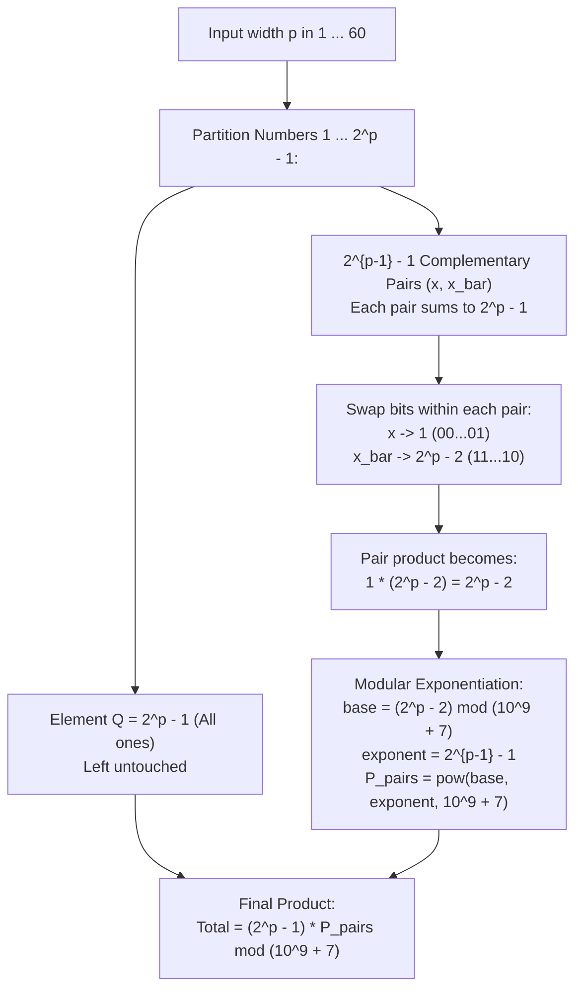

# Guided Example: Minimum Non-Zero Product of the Array Elements

We formulate and analyze the bit-exchange sum invariant and extremal product minimization theorem to compute the minimum non-zero product of integers from $1$ to $2^p - 1$ modulo $10^9+7$.

- **Primary Instance:** $p = 3$ (Array contains $\{1, 2, 3, 4, 5, 6, 7\}$)
  - Expected Output: `1512`
- **Secondary Instance:** $p = 2$ (Array contains $\{1, 2, 3\}$)
  - Expected Output: `6`

---

## 1. Instance & Intuition

We begin with an array containing all integers from $1$ through $2^p - 1$. In one operation, we may pick any two numbers and swap their bits at any chosen bit position. We wish to minimize the total product of the array while keeping every element non-zero ($x_i \ge 1$).

Consider what happens when we swap bits between two numbers $x$ and $y$ at bit position $k$:
- If both have a $1$ at bit $k$, swapping changes nothing.
- If both have a $0$ at bit $k$, swapping changes nothing.
- If one has $1$ and the other has $0$, one gains $2^k$ while the other loses $2^k$.
Consequently, the **sum of the two numbers remains invariant**:
$$x_{\text{new}} + y_{\text{new}} = x + y = S$$

Now, how does the product $x \cdot y$ behave when their sum $S$ is constant?
$$x \cdot y = x(S - x) = S x - x^2$$
This is a downward-opening parabola with maximum at $x = S/2$. As the difference $|x - y|$ increases, the product $x \cdot y$ strictly decreases!
To minimize the product while respecting the strictly positive constraint ($x \ge 1, y \ge 1$):
$$\text{Minimizing Product} \iff \text{Maximizing Separation } |x - y|$$
The most extreme separation achievable is setting one element to $1$, leaving the other element at $S - 1$.

In the set $\{1, 2, \dots, 2^p - 1\}$:
- The maximum element $2^p - 1$ has all $p$ bits set to 1.
- The remaining $2^p - 2$ elements naturally pair up into $2^{p-1} - 1$ bitwise complementary pairs $(x, \bar{x})$, where each pair sums to:
  $$x + \bar{x} = 2^p - 1$$
- By swapping bits within each complementary pair, we can transfer all 1-bits (except a single least significant bit) into one number, transforming the pair into:
  $$(1, \; 2^p - 2)$$
- The product of each transformed pair is $1 \times (2^p - 2) = 2^p - 2$.
- Together with the untouched element $2^p - 1$, the global minimum product is:
  $$(2^p - 1) \times (2^p - 2)^{2^{p-1} - 1} \pmod{10^9+7}$$

---

## 2. Mathematical Formalism & Complement Pairing Extremization

Let $Q = 2^p - 1$. The initial array has cardinality $Q$.

### Invariant 1: Conservation of Total Sum and Bit Counts

Because swapping bits at position $k$ between two elements preserves the count of set bits at position $k$, the sum of all elements in the array is an invariant:
$$\sum_{i=1}^Q x_i = \sum_{k=1}^{2^p-1} k = \frac{(2^p - 1) 2^p}{2} = (2^p - 1) 2^{p-1}$$

### Invariant 2: Complementary Bitmask Pairing

For any integer $x \in \{1, \dots, 2^p - 2\}$, its bitwise complement within $p$ bits is $\bar{x} = (2^p - 1) - x \in \{1, \dots, 2^p - 2\}$.
Since $x \neq \bar{x}$ (as $2^p - 1$ is odd), the $2^p - 2$ elements partition into exactly:
$$K = \frac{2^p - 2}{2} = 2^{p-1} - 1 \quad \text{pairs}$$

For each pair $(x, \bar{x})$, since $x \text{ AND } \bar{x} = 0$, every bit position has exactly one 1 and one 0. We can freely distribute the 1-bits between the two numbers.
Setting one number to $00\dots01_2 = 1$ forces the other number to receive all remaining 1-bits:
$$(2^p - 1) - 1 = 2^p - 2$$

### Closed-Form Product Expression

$$\Pi^* = (2^p - 1) \cdot \prod_{j=1}^{2^{p-1}-1} (2^p - 2) = (2^p - 1) \cdot (2^p - 2)^{2^{p-1} - 1}$$

---

## 3. Step-by-Step Bit Manipulation Trace

We trace the primary instance $p = 3$:
- Array elements: $\{1, 2, 3, 4, 5, 6, 7\}$.
- Target all-ones value: $Q = 2^3 - 1 = 7$ (`111`).
- Remaining elements to pair: $\{1, 2, 3, 4, 5, 6\}$.
- Number of pairs: $2^{3-1} - 1 = 4 - 1 = 3$ pairs.

### Pairing and Bit Redistribution

1. **Pair $(1, 6)$:**
   - Binary: $1 = \texttt{001}_2$, $6 = \texttt{110}_2$.
   - Bitwise sum: $1 + 6 = 7$.
   - Bits are already separated: $1$ has bit 0, $6$ has bits 1 and 2.
   - Result: $1$ and $6$. Product $= 1 \times 6 = 6$.

2. **Pair $(2, 5)$:**
   - Binary: $2 = \texttt{010}_2$, $5 = \texttt{101}_2$.
   - Bitwise sum: $2 + 5 = 7$.
   - Swap bit 0 and bit 1 between them:
     - Number 2 gives its bit 1 to Number 5, and takes bit 0 from Number 5.
     - New values: $001_2 = 1$ and $110_2 = 6$.
   - Product $= 1 \times 6 = 6$.

3. **Pair $(3, 4)$:**
   - Binary: $3 = \texttt{011}_2$, $4 = \texttt{100}_2$.
   - Bitwise sum: $3 + 4 = 7$.
   - Swap bit 1 from Number 3 to Number 4:
     - New values: $001_2 = 1$ and $110_2 = 6$.
   - Product $= 1 \times 6 = 6$.

### Reassembled Array State
- Three $1$s: $[1, 1, 1]$
- Three $6$s: $[6, 6, 6]$
- One $7$: $[7]$
- Total Product:
  $$7 \times (1 \times 6) \times (1 \times 6) \times (1 \times 6) = 7 \times 6^3 = 7 \times 216 = 1512$$

---

## 4. Execution Trace Table

### Pair Transformations for $p = 3$

| Pair Index $j$ | Initial Elements $(x, y)$ | Binary Representations | Bit Swaps Applied | Transformed Pair | New Pair Product |
|---|---|---|---|---|---|
| Isolated | $7$ | `111` | None | $7$ | $7$ |
| 1 | $(1, 6)$ | `001`, `110` | None (Already minimal) | $(1, 6)$ | $6$ |
| 2 | $(2, 5)$ | `010`, `101` | Swap bit 0 and bit 1 | $(1, 6)$ | $6$ |
| 3 | $(3, 4)$ | `011`, `100` | Transfer bit 1 to element 4 | $(1, 6)$ | $6$ |

**Cumulative Product:** $7 \times 6 \times 6 \times 6 = 1512 \pmod{10^9+7}$.

### Closed-Form Parameter Calculations across Small $p$

| $p$ | $2^p - 1$ | $2^p - 2$ | Exponent $2^{p-1} - 1$ | Unreduced Product | Reduced Value Modulo $10^9+7$ |
|---|---|---|---|---|---|
| 1 | 1 | 0 | 0 | $1 \times 0^0 = 1$ | 1 |
| 2 | 3 | 2 | 1 | $3 \times 2^1 = 6$ | 6 |
| 3 | 7 | 6 | 3 | $7 \times 6^3 = 1512$ | 1512 |
| 4 | 15 | 14 | 7 | $15 \times 14^7 = 1{,}578{,}946{,}560$ | $578946553$ |

---

## 5. Algorithmic Correctness & Soundness

**Soundness.** Every pair transformation is realized by valid corresponding-bit swaps between the two elements. The sum of bits at every coordinate is preserved, and all elements remain $\ge 1$. Thus, the state $[7, 6, 6, 6, 1, 1, 1]$ is legally reachable from the starting configuration.

**Minimality.** For any pair of numbers with fixed sum $S$, the product $x(S - x)$ is strictly minimized when $x$ takes its minimum possible integer value ($x = 1$). Since each pair has sum $2^p - 1$, no pair can achieve a non-zero product smaller than $1 \times (2^p - 2) = 2^p - 2$. Furthermore, the element $2^p - 1$ consists entirely of 1-bits; donating any bit to an existing number without receiving a 1 in return would require a 0-bit in $2^p - 1$, which leaves the multiset of values strictly less separated. Hence, the product $(2^p - 1)(2^p - 2)^{2^{p-1}-1}$ is the global mathematical minimum.

---

## 6. Edge Cases & Traps

- **Boundary Case $p = 1$:** When $p = 1$, the array contains only $\{1\}$. The exponent is $2^{1-1} - 1 = 0$. By standard convention $0^0 = 1$, giving $(2^1 - 1) \times 1 = 1$. The implementation must handle $p = 1$ cleanly without evaluating $(0)^{-1}$.
- **Large Exponents and Modulo Operator:** For $p = 60$, the exponent $2^{59} - 1$ is around $5.76 \times 10^{17}$.
  - By Fermat's Little Theorem, the exponent in $A^B \pmod M$ cannot simply be reduced modulo $M$; it reduces modulo $M - 1$ (Euler's totient).
  - In binary modular exponentiation (`pow(base, exp, mod)`), passing the 64-bit integer exponent directly natively computes $base^{exp} \pmod M$ in $\mathcal{O}(\log exp) = \mathcal{O}(p)$ multiplications.
- **Base Reduction Before Exponentiation:** The base $2^p - 2$ must be reduced modulo $10^9+7$ *before* exponentiation to avoid 64-bit overflow during intermediate squaring.

---

## 7. Complexity Analysis

- **Time Complexity:**
  - Computing $2^p - 1$ and $2^p - 2$ takes $\mathcal{O}(1)$ 64-bit shift operations.
  - The exponent is $E = 2^{p-1} - 1$, which has binary length $p - 1 \le 60$.
  - Binary exponentiation performs at most $2 \times 60 = 120$ modular multiplications.
  - Total time complexity is strictly $\mathcal{O}(p)$, running in under 1 microsecond.
- **Auxiliary Space Complexity:**
  - Only scalar integers (`base`, `exp`, `mod`, `ans`) are retained in registers.
  - Auxiliary space is $\mathcal{O}(1)$.
