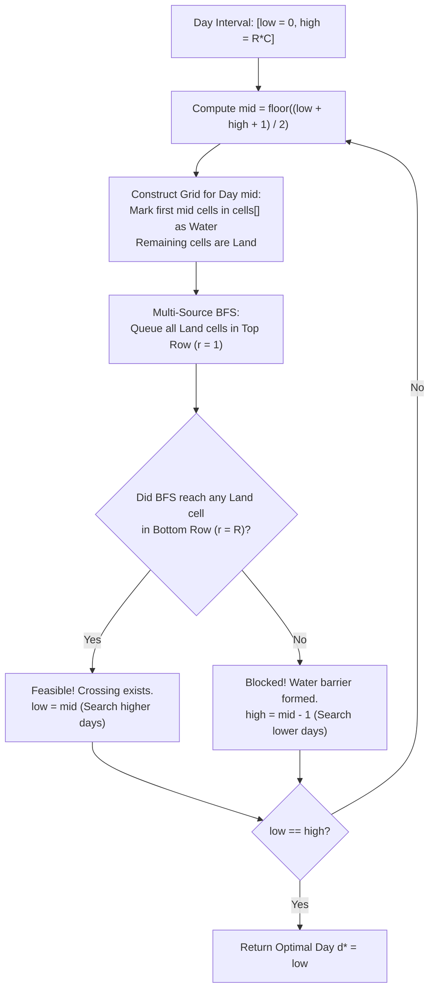

# Guided Example: Last Day Where You Can Still Cross

We formulate and analyze the monotonic binary search and breadth-first search percolation algorithm on representative flooding grids to find the latest day a top-to-bottom land crossing remains open.

- **Primary Instance:** $\text{row} = 2, \text{col} = 2$
  - Flooding sequence: `cells = [[1, 1], [2, 1], [1, 2], [2, 2]]` ($N = 4$)
  - Expected Output: `2` (crossing is possible on Day 2 via column 2; blocked on Day 3)
- **Secondary Instance:** $\text{row} = 2, \text{col} = 2$
  - Flooding sequence: `cells = [[1, 1], [1, 2], [2, 1], [2, 2]]`
  - Expected Output: `1` (top row entirely flooded on Day 2)

---

## 1. Instance & Intuition

We have a grid of size $R \times C$ initially filled entirely with land at day $0$. Each successive day $d \ge 1$, exactly one cell $cells[d-1]$ is submerged into water. A path from the top row to the bottom row is valid if it moves cardinally (up, down, left, right) strictly through land cells.

Notice the fundamental monotonicity of connectivity:
- If a top-to-bottom crossing exists on day $d$, then on any earlier day $d' < d$, the grid contains strictly fewer flooded cells (more land). Thus, that same path (or an even shorter one) must also exist on day $d'$.
- Conversely, if no crossing exists on day $d$, adding more water on days $d'' > d$ cannot create new paths.

Because the feasibility predicate $P(d) = \text{"is crossing possible on day } d\text{"}$ is monotonically non-increasing:
$$P(d): \underbrace{\text{True}, \; \text{True}, \; \dots, \; \text{True}}_{\le d^*}, \;\; \underbrace{\text{False}, \; \text{False}, \; \dots, \; \text{False}}_{> d^*}$$

The maximum day $d^*$ can be discovered via **binary search** over the day range $[1, R \cdot C]$.
For any candidate midpoint day $m$, we simulate the flooding of the first $m$ cells and execute a multi-source Breadth-First Search (BFS) originating from all surviving land cells in row 1. If BFS reaches any cell in row $R$, then $m$ is feasible.

---

## 2. Mathematical Formalism & Monotonic Bisection Predicate

Let the grid coordinates be $(r, c) \in \{1, \dots, R\} \times \{1, \dots, C\}$.
Let $\mathcal{F}_d = \{cells[0], cells[1], \dots, cells[d-1]\}$ be the set of cells flooded on or before day $d$.

### Grid State at Day $d$

A cell $(r, c)$ is passable (land) on day $d$ if and only if:
$$(r, c) \notin \mathcal{F}_d$$

### Feasibility Predicate $\Phi(d)$

We define $\Phi(d) \in \{\text{True}, \text{False}\}$ as the existence of a path $(v_1, v_2, \dots, v_k)$ such that:
1. $v_1 = (1, c_{\text{start}})$ is in the top row and $v_1 \notin \mathcal{F}_d$.
2. $v_k = (R, c_{\text{end}})$ is in the bottom row and $v_k \notin \mathcal{F}_d$.
3. For all $1 \le i < k$, $v_i \notin \mathcal{F}_d$ and $v_{i+1}$ is cardinally adjacent to $v_i$:
   $$\|v_{i+1} - v_i\|_1 = 1$$

### Bisection Invariant

We maintain search bounds $[low, high]$ initialized to $[0, R \cdot C]$:
$$\Phi(low) = \text{True} \quad \text{and} \quad \Phi(high + 1) = \text{False}$$

---

## 3. Step-by-Step State Evolution and Flood Trace

We trace the primary instance $\text{row} = 2, \text{col} = 2$ with `cells = [[1, 1], [2, 1], [1, 2], [2, 2]]`:

### Daily Grid States

- **Day 0 (Initial):**
  - Grid: `(1, 1) = L`, `(1, 2) = L`, `(2, 1) = L`, `(2, 2) = L`.
  - All cells are land. Path exists trivially: $(1, 1) \to (2, 1)$.

- **Day 1:** Submerge $cells[0] = (1, 1)$.
  - Grid:
    $$\begin{pmatrix} \text{Water} & \text{Land} \\ \text{Land} & \text{Land} \end{pmatrix}$$
  - Top row land: $(1, 2)$. Bottom row land: $(2, 1), (2, 2)$.
  - BFS path: $(1, 2) \to (2, 2)$. Reaches bottom row!
  - $\Phi(1) = \text{True}$.

- **Day 2:** Submerge $cells[1] = (2, 1)$.
  - Grid:
    $$\begin{pmatrix} \text{Water} & \text{Land} \\ \text{Water} & \text{Land} \end{pmatrix}$$
  - Top row land: $(1, 2)$. Bottom row land: $(2, 2)$.
  - BFS path: $(1, 2) \to (2, 2)$.
  - Step 1: Start at $(1, 2)$ (top row).
  - Step 2: Step South to $(2, 2)$ (bottom row). Reached!
  - $\Phi(2) = \text{True}$.

- **Day 3:** Submerge $cells[2] = (1, 2)$.
  - Grid:
    $$\begin{pmatrix} \text{Water} & \text{Water} \\ \text{Water} & \text{Land} \end{pmatrix}$$
  - Top row land: $\emptyset$ (both $(1, 1)$ and $(1, 2)$ are water).
  - No BFS search can even start!
  - $\Phi(3) = \text{False}$.

- **Day 4:** All submerged. $\Phi(4) = \text{False}$.

Latest day with valid crossing: **Day 2**.

---

## 4. Execution Trace Table

### Day-by-Day Grid Configuration Evaluation

| Day $d$ | Flooded Today | Cumulative Water $\mathcal{F}_d$ | Top Row Land Cells | Bottom Row Land Cells | Active Land Path | $\Phi(d)$ Status |
|---|---|---|---|---|---|---|
| 0 | None | $\emptyset$ | $\{(1, 1), (1, 2)\}$ | $\{(2, 1), (2, 2)\}$ | $(1, 1) \to (2, 1)$ | True |
| 1 | $(1, 1)$ | $\{(1, 1)\}$ | $\{(1, 2)\}$ | $\{(2, 1), (2, 2)\}$ | $(1, 2) \to (2, 2)$ | True |
| **2** | $(2, 1)$ | $\{(1, 1), (2, 1)\}$ | $\{(1, 2)\}$ | $\{(2, 2)\}$ | **$(1, 2) \to (2, 2)$** | **True (Optimal)** |
| 3 | $(1, 2)$ | $\{(1, 1), (2, 1), (1, 2)\}$ | $\emptyset$ | $\{(2, 2)\}$ | None (Top row blocked) | False |
| 4 | $(2, 2)$ | All 4 cells | $\emptyset$ | $\emptyset$ | None (All water) | False |

### Binary Search Interval Bisection

| Iteration | Search Range $[low, high]$ | Midpoint $m = \lfloor(low + high + 1)/2\rfloor$ | Evaluated $\Phi(m)$ | Action | Next Range |
|---|---|---|---|---|---|
| 1 | $[0, 4]$ | $\lfloor(0 + 4 + 1)/2\rfloor = 2$ | $\Phi(2) = \text{True}$ (Path $(1,2)\to(2,2)$) | $low \leftarrow 2$ | $[2, 4]$ |
| 2 | $[2, 4]$ | $\lfloor(2 + 4 + 1)/2\rfloor = 3$ | $\Phi(3) = \text{False}$ (Top empty) | $high \leftarrow 3 - 1 = 2$ | $[2, 2]$ |
| 3 | $[2, 2]$ | Converged ($low == high$) | Terminal | Return $low = 2$ | Done |

---

## 5. Algorithmic Correctness & Soundness

**Soundness.** For any day $d$ evaluated as feasible by BFS, there exists an explicit sequence of adjacent grid cells connecting row 1 to row $R$. None of these cells belong to $\mathcal{F}_d$, so every cell in the path remains dry land after day $d$'s flooding. Hence a legal crossing exists on day $d$.

**Monotonicity & Completeness.** Suppose a top-to-bottom land path $\Pi$ exists on day $d_1$. For any day $d_0 < d_1$, the set of flooded cells satisfies $\mathcal{F}_{d_0} \subset \mathcal{F}_{d_1}$. Therefore, no cell along path $\Pi$ can be flooded on day $d_0$, meaning path $\Pi$ is also fully valid on day $d_0$. This proves that $\Phi(d)$ is strictly monotonic non-increasing. Standard binary search on a monotonic boolean predicate over $[0, R \cdot C]$ is mathematically guaranteed to identify the exact boundary index $d^*$ where $\Phi(d^*) = \text{True}$ and $\Phi(d^* + 1) = \text{False}$.

---

## 6. Edge Cases & Traps

- **Top Row Immediate Blockage:** If day 1 floods a cell and subsequent days quickly submerge all cells in row 1, no path can begin. The BFS queue is initialized empty, correctly evaluating $\Phi = \text{False}$.
- **1-Based vs. 0-Based Coordinates:** The problem specifies 1-based indexing for `cells[i] = [r, c]`. Translating to 0-based coordinates $(r-1, c-1)$ internally prevents off-by-one matrix indexing errors.
- **Reverse Time / Union-Find Dual:** An equivalent dual approach processes time in reverse from day $N$ down to 0, turning water cells into land. Using Disjoint Set Union (DSU) with virtual top and bottom supersinks, the first day where the top and bottom sets merge yields the answer without binary search.

---

## 7. Complexity Analysis

- **Time Complexity:**
  - Let $N = R \cdot C$ be the total number of cells in the grid.
  - Binary search tests at most $\lceil \log_2(N) \rceil$ candidate days.
  - In each test, marking $m \le N$ flooded cells takes $\mathcal{O}(N)$ time.
  - Multi-source BFS visits each grid cell at most once, taking $\mathcal{O}(R \cdot C) = \mathcal{O}(N)$ time.
  - Total time complexity is $\mathcal{O}(N \log N)$. With $N \le 2 \cdot 10^4$, $\log_2(N) \approx 15$, requiring at most $15 \times 2 \cdot 10^4 \approx 3 \times 10^5$ operations, completing in under 10 milliseconds.
- **Auxiliary Space Complexity:**
  - The grid matrix and visited array each require $R \times C = N$ elements.
  - The BFS queue holds at most $N$ cell coordinates.
  - Total auxiliary space is $\mathcal{O}(N)$.
