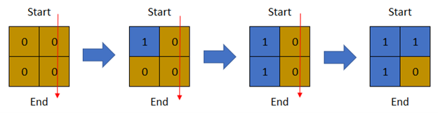
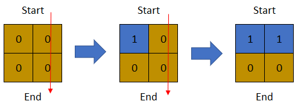
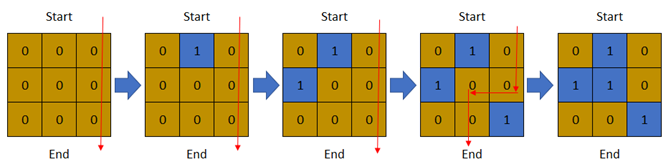

### 1. Description

There is a **1-based** binary matrix where `0` represents land and `1` represents water. You are given integers `row` and `col` representing the number of rows and columns in the matrix, respectively.

Initially on day `0`, the **entire** matrix is **land**. However, each day a new cell becomes flooded with **water**. You are given a **1-based** 2D array `cells`, where $\text{cells}[i] = [r_{i}, c_{i}]$ represents that on the $$i^{\text{th}}$$ day, the cell on the $r_{i}^th$ row and $c_{i}^th$ column (**1-based** coordinates) will be covered with **water** (i.e., changed to `1`).

You want to find the **last** day that it is possible to walk from the **top** to the **bottom** by only walking on land cells. You can start from **any** cell in the top row and end at **any** cell in the bottom row. You can only travel in the** four** cardinal directions (left, right, up, and down).

Return *the **last** day where it is possible to walk from the **top** to the **bottom** by only walking on land cells*.

### 2. Function Contract

- `n`: Input parameter.
- Returns expected result.

### 3. Examples

#### Example 1

- **Input:** $row = 2, col = 2, cells = [[1,1],[2,1],[1,2],[2,2]]$
- **Output:** `2`
- **Explanation:** The above image depicts how the matrix changes each day starting from day 0.
The last day where it is possible to cross from top to bottom is on day 2.
#### Example 2

- **Input:** $row = 2, col = 2, cells = [[1,1],[1,2],[2,1],[2,2]]$
- **Output:** `1`
- **Explanation:** The above image depicts how the matrix changes each day starting from day 0.
The last day where it is possible to cross from top to bottom is on day 1.
#### Example 3

- **Input:** $row = 3, col = 3, cells = [[1,2],[2,1],[3,3],[2,2],[1,1],[1,3],[2,3],[3,2],[3,1]]$
- **Output:** `3`
- **Explanation:** The above image depicts how the matrix changes each day starting from day 0.
The last day where it is possible to cross from top to bottom is on day 3.

### 4. Constraints

- $2 \le row, col \le 2 * 10^{4}$

- $4 \le row * col \le 2 * 10^{4}$

- $\text{cells.length} = row * col$

- $1 \le r_{i} \le row$

- $1 \le c_{i} \le col$

- All the values of `cells` are **unique**.