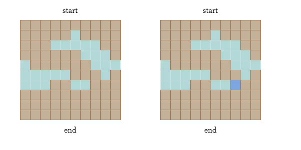
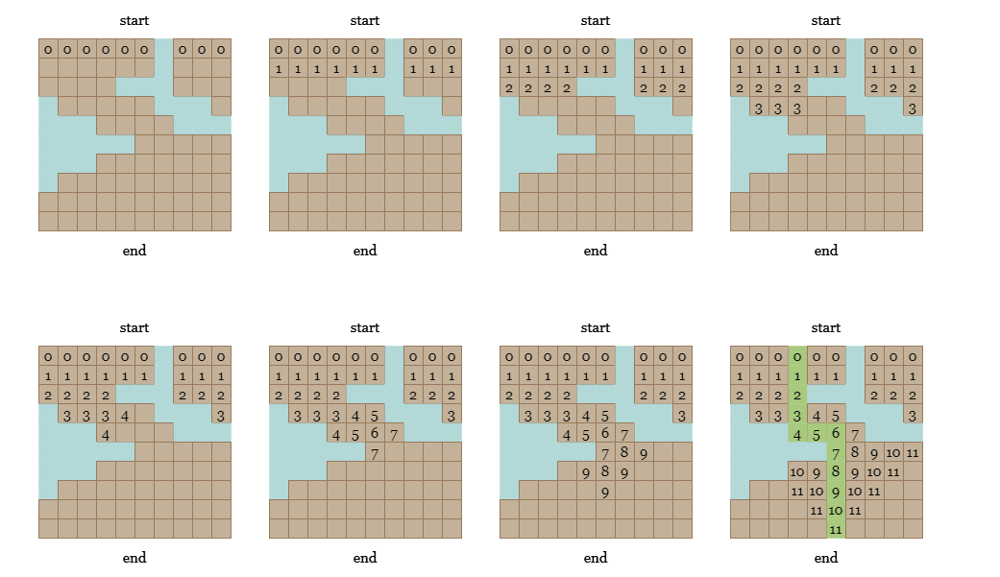
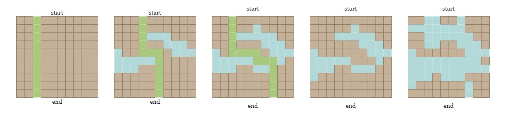
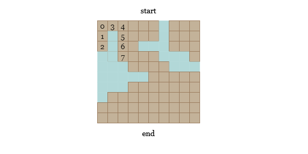
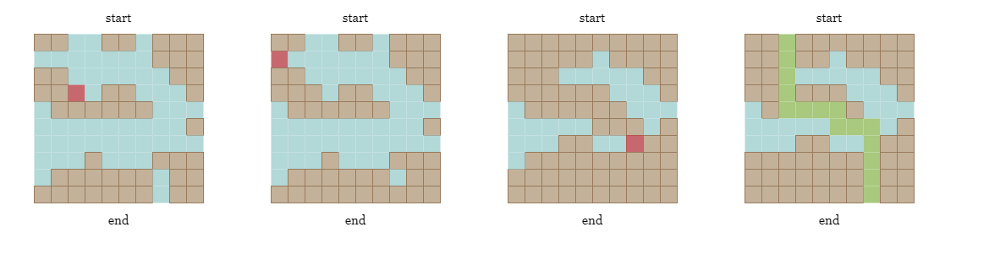
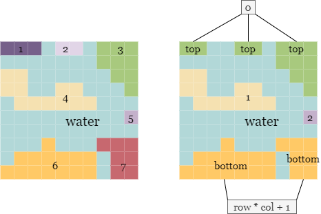
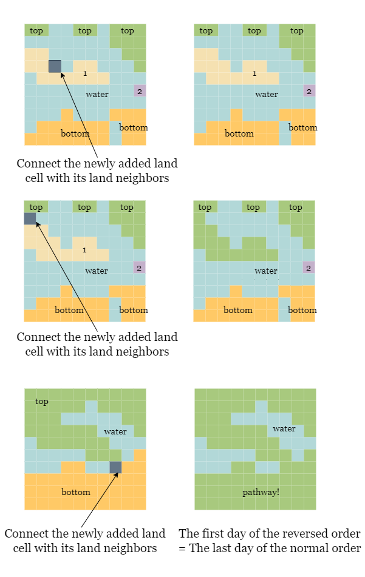
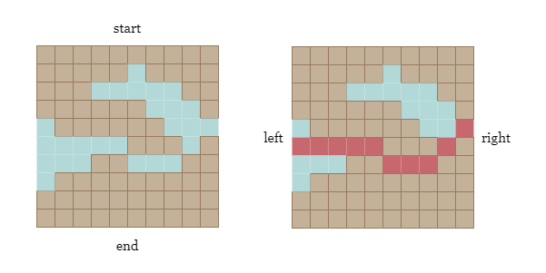

[TOC]

## Solution

---

### Overview

As shown in the picture below, we could find a path that connects the `start` (the top row) and the `end` (the bottom row) in the left grid. However, if the land cell colored in dark blue is covered by water, we won't be able to reach `end` from `start` by only walking on land cells.



---

### Approach 1: Binary Search + Breadth-First Search

#### Intuition

> If you are not familiar with breadth-first search (BFS), you can refer to our [Breadth-First Search Explore Card](https://leetcode.com/explore/featured/card/graph/620/breadth-first-search-in-graph/)

Breadth-First Search (BFS) is a graph traversal algorithm that explores all the nodes in a graph that can be reached from a given starting node. It starts by visiting the starting node, and then visits all the nodes at a distance of one from the starting node, then all the nodes at a distance of two, and so on. This method is usually implemented using a queue data structure, where the starting node is inserted into the queue and then removed, and its neighbors are inserted into the queue, and so on.

Now back to our problem, we split it into two parts:

- Given a graph, how do we determine if there is a pathway.

- As the water covers one more cell each day, how do we determine which day is the last day that a pathway exists?

<br>

To check if there is a path, we can start a BFS traversal from all land cells in the top row of the graph, and check if any of the land cell in the bottom is visited. We will mark all the land cells in the top row as visited, then we move on to the neighbor cells in the four directions of these land cells.

We can use a queue data structure to keep track of the cells to be visited. Start by inserting all the land cells in the top row of the grid into the queue. Then, we repeat the following steps until the queue is empty:

1. Dequeue the next cell from the queue.
2. Check if the cell is in the bottom row the grid. If it is, then the grid is connected, and we can still cross it.
3. If the cell is not in the bottom row of the grid, we will mark the it as visited, and enqueue its land neighbors which have not been visited yet.



4. If we complete the BFS without reaching any of the land cells at the bottom, it means that there is no pathway.

<br>

Now move to the second subproblem: how to locate the last day that we can still cross?

One approach is to evaluate each day one by one, beginning from the first day, and verify if we can cross on day `i` after the water covers cell $\text{cells}[i]$. However, this approach is inefficient because it requires at most $O(col\times row)$ BFS searches in the worst-case scenario.



Alternatively, we can use binary search to identify the last day on which we can still cross by observing the following property of the problem:

- If we can cross on day `i`, we can definitely cross on any day before `i`.
- If we can't cross on day `i`, we definitely cannot cross on any day after `i`.

Let `n` be the total number of days, and we know that the last day is between `1` and `n`, which is the maximum number of water cells that can be added to the map. Hence, our search space is `[left, right] = [1, n]`.

At each step, we compute the mid-day of our search space as $mid = right - (right - left) / 2$, and add all water cells from `cells[0 ~ mid]` to the grid, we then perform a BFS over the modified grid to determine if a pathway exists. If a path is present on day `mid`, we will move on to the half with larger values, `[mid, right]`, otherwise, we move on to the half with smaller values, `[left, mid - 1]`.

<br>

#### Algorithm

1) Initialize the search space by setting the left boundary to $left = 1$ and the right boundary to $right = n$.

2) Define `canCross(row, col, cells, day)` to check if we can still cross after `day` days.
- Create an all-zero grid of size $row * col$.
- Set all cells in `cells[:day]` to 1.
- Add all land cells in the first row to an queue `queue`.
- While `queue` is not empty, deque the first cell $(\text{cur}_{row}, \text{cur}_{col})$.
- If $\text{cur}_{row} = row - 1$, it means we have reached the bottom row, return `True`.
- Otherwise, we will check if it has unvisited land neighbors, then set their value to `-1`, and add them into `queue`.
- If we finish the BFS without reaching the bottom row, return `False`.

3) While `left < right`:

- Find the middle day $mid = right - (right - left) / 2$.
- Use `canCross(row, col, cells, mid)` to check if there is a pathway.
- If there is a pathway, set $left = mid$, otherwise, set $right = mid - 1$.

4) Return `left` as the last day when we can still cross.

#### Implementation

```python
class Solution:
    def canCross(self, row, col, cells, day):
        grid = [[0] * col for _ in range(row)]
        queue = collections.deque()

        for r, c in cells[:day]:
            grid[r - 1][c - 1] = 1

        for i in range(col):
            if not grid[0][i]:
                queue.append((0, i))
                grid[0][i] = -1

        while queue:
            r, c = queue.popleft()
            if r == row - 1:
                return True
            for dr, dc in [(1, 0), (-1, 0), (0, 1), (0, -1)]:
                new_row, new_col = r + dr, c + dc
                if 0 <= new_row < row and 0 <= new_col < col and grid[new_row][new_col] == 0:
                    grid[new_row][new_col] = -1
                    queue.append((new_row, new_col))

        return False

    def latestDayToCross(self, row: int, col: int, cells: List[List[int]]) -> int:
        left, right = 1, row * col

        while left < right:
            mid = right - (right - left) // 2
            if self.canCross(row, col, cells, mid):
                left = mid
            else:
                right = mid - 1

        return left
```

#### Complexity Analysis

* Time complexity: $O(\text{row} \cdot \text{col} \cdot\log (\text{row} \cdot \text{col}))$

- The binary search over a search space of size $n$ takes $O(\log n)$ steps to find the last day that we can still cross. The size of our search space is $\text{row} \cdot \text{col}$.

- At each step, we need to BFS over the modified grid, which takes $O(\text{row} \cdot \text{col})$.

* Space complexity: $O(\text{row} \cdot \text{col})$

- We need to build an 2-D array of size $\text{row} \times \text{col}$.
- During the BFS, we might have at most $O(\text{row} \cdot \text{col})$ in `queue`.

<br/>

---

### Approach 2: Binary Search + Depth-First Search

#### Intuition

> If you are not familiar with depth-first search (DFS), you can refer to our [Depth-First Search Explore Card](https://leetcode.com/explore/featured/card/graph/620/depth-first-search-in-graph/)

In the previous approach, we BFS over the grid to find if there is a pathway, this process can also be implemented with DFS, which is another graph traversal algorithm used to explore or search all the cells of a grid. We will start at a land cell in the top row and explore as far as possible along each path before backtracking.

We will visit an unvisited land cell, and then recursively visit all its adjacent land neighbors. This process continues until all reachable land cells in the grid have been visited or until we reach the bottom row.



To try all pathways, we must start DFS on each land cell in the top row of the grid. We can change the value of already visited cells to `-1` to avoid repeated visits to the same cell.

<br>

#### Algorithm

1) Initialize the search space by setting the left boundary to $left = 1$ and the right boundary to $right = n$.

2) Define `canCross(row, col, cells, day)` to check if we can still cross after `day` days.
- Create an all-zero grid of size $row * col$.
- Set all cells in `cells[:day]` to 1.
- Iterate over the first row, for any land cell `(0, c)`, start DFS from this cell to explore its unvisited land neighbors recursively. If we reach any cell in the last row, then return `true`.
- If we can't reach the last row, return `false`.

3) While the `left < right`:
- Find the middle day $mid = right - (right - left) / 2$.
- Check if there is a pathway after `mid` days.
- If there is a pathway, set $left = mid$, otherwise, set $right = mid - 1$.

4) Return `left` as the last day when we can still cross.

#### Implementation

```python
class Solution:
    def canCross(self, row, col, cells, day):
        grid = [[0] * col for _ in range(row)]

        for r, c in cells[:day]:
            grid[r - 1][c - 1] = 1

        def dfs(r, c):
            if r < 0 or r >= row or c < 0 or c >= col or grid[r][c] != 0:
                return False
            if r == row - 1:
                return True
            grid[r][c] = -1
            for dr, dc in [(1, 0), (-1, 0), (0, 1), (0, -1)]:
                if dfs(r + dr, c + dc):
                    return True
            return False

        for i in range(col):
            if grid[0][i] == 0 and dfs(0, i):
                return True

        return False

    def latestDayToCross(self, row: int, col: int, cells: List[List[int]]) -> int:
        left, right = 1, row * col

        while left < right:
            mid = right - (right - left) // 2
            if self.canCross(row, col, cells, mid):
                left = mid
            else:
                right = mid - 1

        return left
```

#### Complexity Analysis

* Time complexity: $O(\text{row} \cdot \text{col} \cdot\log \text{row} \cdot \text{col})$

- The binary search over a search space of size $n$ takes $O(\log n)$ steps to find the last day that we can still cross. The size of our search space is $\text{row} \cdot \text{col}$.

- The DFS method visits each cell at most once, which takes $O(\text{row} \cdot \text{col})$ time.

* Space complexity: $O(\text{row} \cdot \text{col})$

- We need to build an 2-D array of size $\text{row} \times \text{col}$.
- The recursion call stack from the DFS could use up to $O(\text{row} \cdot \text{col})$ space.

<br/>

---

### Approach 3: Disjoint Set Union (on land cells)

#### Intuition

> If you are not familiar with disjoint set union (DSU), you can refer to our [Disjoint Set Explore Card](https://leetcode.com/explore/learn/card/graph/618/disjoint-set/3881/). We will not talk about implementation details in this article, but only about the interface to the data structure.

A disjoint-set data structure, also called a union–find data structure or merge–find set, is a data structure that stores a collection of disjoint (non-overlapping) sets. Equivalently, it stores a partition of a set into disjoint subsets. It provides operations for adding new sets, merging sets (replacing them by their union), and finding a representative member of a set. It implements two useful operations:

- `Find`: Determine which subset a particular element is in. This can be used to determine if two elements are in the same subset.
- `Union`: Join two subsets into a single subset.

<br>

We need to reverse the days `cells`, which equals replacing water cells with land cells. This is necessary because we are searching for the last day when there is a path, which is the same as the first day in reversed order. During the union-find process, will we traverse through `cells` in reverse and replace the corresponding water cell $\text{cells}[i]$ by land cell. For each newly added land cell, we connect it with all of its neighboring land cells. We repeat this process until either the first row and the last row are connected or the traversal is complete.



> Considering that the top row may contain multiple disconnected cells (As shown on the left picture below, the group `1`, `2` and `3` contain cells in the top row, but they are not connected), how can we efficiently check whether a cell in the top row is connected to a cell in the bottom row? Do we need to check them one by one?

The answer is no, we just need two additional nodes in `dsu` (say `top` and `bottom`) that represent all land cells in the top row and all land cells in the bottom row, respectively.



During the iteration, for each water cell $\text{cells}[i]$ that will be replaced by land, in addition to connecting it with its land neighbors, we will also:
- connect it with `top` if it is in the first row.
- connect it with `bottom` if it is in the last row.

Therefore, we can simply check if the first row is connected with the bottom row after this day, by checking if `top` and `bottom` are connected.

You can refer to the following figure:



<br>

#### Algorithm

1) Create a disjoint set data structure `dsu` with a size of $row * col + 2$.

2) Create an all-one `grid` of size $row * col$ representing the water cells after the last day.

3) Iterate over reversed `cells`, for each cell $\text{cells}[i] = (r, c)$:
- Check its neighbors in all four directions, and if there is a land cell $(\text{new}_{r}, \text{new}_{c})$, we connect the root of $\text{cells}[i]$ to the root of this neighbor in `dsu`.

- If $r = 0$, connect it with `top`.
- If $r = row - 1$, connect it with `bottom`.
- Check if `top` and `bottom` are connected, and return `i` if they are.

#### Implementation

```python
class DSU:
    def __init__(self, n):
        self.root = list(range(n))
        self.size = [1] * n

    def find(self, x):
        if self.root[x] != x:
            self.root[x] = self.find(self.root[x])
        return self.root[x]

    def union(self, x, y):
        root_x = self.find(x)
        root_y = self.find(y)
        if root_x == root_y:
            return

        if self.size[root_x] > self.size[root_y]:
            root_x, root_y = root_y, root_x
        self.root[root_x] = root_y
        self.size[root_y] += self.size[root_x]

class Solution:
    def latestDayToCross(self, row: int, col: int, cells: List[List[int]]) -> int:
        dsu = DSU(row * col + 2)
        grid = [[1] * col for _ in range(row)]
        directions = [(0, 1), (0, -1), (1, 0), (-1, 0)]

        for i in range(len(cells) - 1, -1, -1):
            r, c = cells[i][0] - 1, cells[i][1] - 1
            grid[r][c] = 0
            index_1 = r * col + c + 1
            for dr, dc in directions:
                new_r, new_c = r + dr, c + dc
                index_2 = new_r * col + new_c + 1
                if 0 <= new_r < row and 0 <= new_c < col and grid[new_r][new_c] == 0:
                    dsu.union(index_1, index_2)

            if r == 0:
                dsu.union(0, index_1)
            if r == row - 1:
                dsu.union(row * col + 1, index_1)
            if dsu.find(0) == dsu.find(row * col + 1):
                return i
```

#### Complexity Analysis

* Time complexity: $O(\text{row} \cdot \text{col})$

- For $T$ operations, the amortized time complexity of the union-find algorithm (using path compression with union by rank) is $O(alpha(T))$. Here, $\alpha(T)$ is the inverse Ackermann function that grows so slowly, that it doesn't exceed $4$ for all reasonable $T$ (approximately $T < 10^{600}$). You can read more about the complexity of union-find [here](https://en.wikipedia.org/wiki/Disjoint-set_data_structure#Time_complexity). Because the function grows so slowly, we consider it to be $O(1)$.
- We iterate over the reversed `cells` and perform `union` and `find` operations on cells of number $(\text{row} \cdot \text{col})$, we consider the time complexity to be $O(\text{row} \cdot \text{col})$.

* Space complexity: $O(\text{row} \cdot \text{col})$

- We use two arrays of size $\text{row} \cdot \text{col} + 2$ to save the root and rank of each cell in the disjoint set data structure.

- We also create an array of size $\text{row} \times \text{col}$ to represent each cell.

<br/>

---

### Approach 4: Disjoint Set Union (on water cells)

#### Intuition

In contrast to the previous method of connecting the land cells in a reversed time, we now aim to connect water cells instead.

If we find a water pathway that connects the leftmost and rightmost columns on a particular day `i`, it implies that there is no land pathway that connects the top and bottom rows, which is the day we are looking for.

In short: **the last day when a land pathway exists is right before the first day when a water pathway exists**.



To achieve this, we use the disjoint set union method similar to before, with a few minor differences:

- Our connection condition is no longer four directions, but all eight directions.  If there is an eight-way connected water pathway, it is sufficient to block all land pathways from the top row to the bottom row.
- We are looking for the waterway that connects `left` and `right`, so we need two additional nodes in `dsu` (say `left` and `right`) that represent all water cells in the leftmost column and all water cells in the rightmost column, respectively. By checking if `left` and `right` are connected, we can verify the existence of a valid waterway.

<br>

#### Algorithm

1) Create a disjoint set union data structure `dsu` with a size of $row * col + 2$.

2) Create an all-zero `grid` of size $row * col$ representing the land cells on the first day.

3) Iterate over `cells`, for each water cell $\text{cells}[i]$ on day `i`:
- Check its neighbors in all eight directions, and if there is a water cell neighbor $(\text{new}_{r}, \text{new}_{c})$, we connect the root of $\text{cells}[i]$ to the root of this neighbor in `dsu`.
- If $c = 0$, connect it with `left`.
- If $c = col - 1$, connect it with `right`.
- Check if `left` and `right` are connected, and return `i` if they are.

#### Implementation

```python
class DSU:
    def __init__(self, n):
        self.root = list(range(n))
        self.size = [1] * n

    def find(self, x):
        if self.root[x] != x:
            self.root[x] = self.find(self.root[x])
        return self.root[x]

    def union(self, x, y):
        root_x = self.find(x)
        root_y = self.find(y)
        if root_x == root_y:
            return

        if self.size[root_x] > self.size[root_y]:
            root_x, root_y = root_y, root_x
        self.root[root_x] = root_y
        self.size[root_y] += self.size[root_x]

class Solution:
    def latestDayToCross(self, row: int, col: int, cells: List[List[int]]) -> int:
        dsu = DSU(row * col + 2)
        grid = [[0] * col for _ in range(row)]
        directions = [(0, 1), (0, -1), (1, 0), (-1, 0), (1, 1), (1, -1), (-1, 1), (-1, -1)]

        for i in range(row * col):
            r, c = cells[i][0] - 1, cells[i][1] - 1
            grid[r][c] = 1
            index_1 = r * col + c + 1
            for dr, dc in directions:
                new_r, new_c = r + dr, c + dc
                index_2 = new_r * col + new_c + 1
                if 0 <= new_r < row and 0 <= new_c < col and grid[new_r][new_c] == 1:
                    dsu.union(index_1, index_2)

            if c == 0:
                dsu.union(0, index_1)
            if c == col - 1:
                dsu.union(row * col + 1, index_1)
            if dsu.find(0) == dsu.find(row * col + 1):
                return i
```

#### Complexity Analysis

* Time complexity: $O(\text{row} \cdot \text{col} \cdot \alpha(\text{row} \cdot \text{col}))$

- For $T$ operations, the amortized time complexity of the union-find algorithm (using path compression with union by rank) is $O(alpha(T))$. Here, $\alpha(T)$ is the inverse Ackermann function that grows so slowly, that it doesn't exceed $4$ for all reasonable $T$ (approximately $T < 10^{600}$). You can read more about the complexity of union-find [here](https://en.wikipedia.org/wiki/Disjoint-set_data_structure#Time_complexity). Because the function grows so slowly, we consider it to be $O(1)$.
- We iterate over `cells` and perform `union` and `find` operations on cells of number $(\text{row} \cdot \text{col})$, we consider the time complexity to be $O(\text{row} \cdot \text{col})$.

* Space complexity: $O(\text{row} \cdot \text{col})$

- We use two arrays of size $\text{row} \cdot \text{col} + 2$ to save the root and rank of each cell in the disjoint set union data structure.

- We also create an array of size $\text{row} \times \text{col}$ to represent each cell.

<br/>