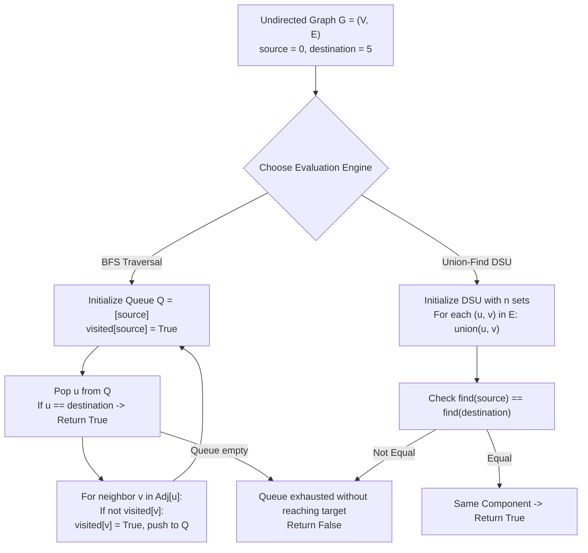

# Guided Example: Find if Path Exists in Graph

We formulate and trace graph reachability and connected component identification algorithms (BFS and Disjoint Set Union) on representative graphs to decide whether a path connects two designated vertices.

- **Primary Instance (Disconnected Components):** $n = 6$, `edges = [[0, 1], [0, 2], [3, 5], [5, 4], [4, 3]]`, `source = 0`, `destination = 5`
  - Expected Output: `false`
- **Secondary Instance (Connected Cycle):** $n = 3$, `edges = [[0, 1], [1, 2], [2, 0]]`, `source = 0`, `destination = 2`
  - Expected Output: `true`

---

## 1. Instance & Intuition

Given an undirected graph $G = (V, E)$ with vertices $\{0, \dots, n-1\}$, we want to determine if there exists a sequence of vertices $(v_0, v_1, \dots, v_k)$ such that:
$$v_0 = \text{source}, \quad v_k = \text{destination}, \quad \text{and } (v_i, v_{i+1}) \in E \quad \forall 0 \le i < k$$

In an undirected graph, connectivity is an **equivalence relation** (reflexive, symmetric, transitive). The vertex set partitions into mutually disjoint **connected components**:
- Vertices in the same component can reach each other.
- Vertices in different components have no path between them.

Testing whether a path exists between `source` and `destination` is therefore identical to asking:
$$\text{"Do source and destination belong to the same connected component?"}$$

In our primary instance:
- Component 1: Vertices $\{0, 1, 2\}$ linked by edges $(0, 1)$ and $(0, 2)$.
- Component 2: Vertices $\{3, 4, 5\}$ linked by cycle edges $(3, 5), (5, 4), (4, 3)$.
- The `source` $0$ belongs to Component 1, whereas `destination` $5$ belongs to Component 2.
- No bridge exists between the two components, so the algorithm returns `false`.

---

## 2. Formal Invariants & Traversal Architecture

Let $G = (V, E)$ with $|V| = n$.

### Approach A: Breadth-First Search (BFS) Traversal

We maintain:
- A queue $Q$ of discovered vertices pending expansion, initialized with $\{\text{source}\}$.
- A boolean array $\text{visited}$ of size $n$, with $\text{visited}[\text{source}] = \text{True}$.

**BFS Invariant:** Every vertex enqueued has been verified as reachable from `source`. When popping vertex $u$:
- If $u == \text{destination}$, path existence is certified $\implies$ Return `true`.
- Otherwise, for every unvisited neighbor $v \in \text{Adj}[u]$, mark $\text{visited}[v] = \text{True}$ and push to $Q$.
- If $Q$ empties without reaching `destination`, all reachable vertices have been exhausted $\implies$ Return `false`.

### Approach B: Disjoint Set Union (DSU / Union-Find)

Each vertex starts in its own singleton equivalence class: $\text{parent}[i] = i$.
- For each undirected edge $(u, v) \in E$: execute $\text{union}(u, v)$.
- After processing all edges: return $\text{find}(\text{source}) == \text{find}(\text{destination})$.

---

## 3. Step-by-Step State Evolution and Flood Trace

We trace the primary instance with BFS:
- $n = 6$, `edges = [[0, 1], [0, 2], [3, 5], [5, 4], [4, 3]]`
- Adjacency List:
  - $\text{Adj}[0] = [1, 2]$
  - $\text{Adj}[1] = [0]$
  - $\text{Adj}[2] = [0]$
  - $\text{Adj}[3] = [5, 4]$
  - $\text{Adj}[4] = [5, 3]$
  - $\text{Adj}[5] = [3, 4]$
- $\text{source} = 0$, $\text{destination} = 5$.

### BFS Execution

1. **Initialization:**
   - Queue $Q = [0]$.
   - Visited: `[True, False, False, False, False, False]`.

2. **Step 1 (Expand Vertex 0):**
   - Pop $u = 0$. Is $0 == 5$? No.
   - Inspect neighbors: $\text{Adj}[0] = [1, 2]$.
   - Neighbor 1: unvisited $\implies$ mark $\text{visited}[1] = \text{True}$, push $1$ to $Q$.
   - Neighbor 2: unvisited $\implies$ mark $\text{visited}[2] = \text{True}$, push $2$ to $Q$.
   - Queue state: $Q = [1, 2]$.

3. **Step 2 (Expand Vertex 1):**
   - Pop $u = 1$. Is $1 == 5$? No.
   - Inspect neighbors: $\text{Adj}[1] = [0]$.
   - Neighbor 0: already visited.
   - Queue state: $Q = [2]$.

4. **Step 3 (Expand Vertex 2):**
   - Pop $u = 2$. Is $2 == 5$? No.
   - Inspect neighbors: $\text{Adj}[2] = [0]$.
   - Neighbor 0: already visited.
   - Queue state: $Q = []$.

5. **Termination:**
   - Queue is empty.
   - Visited vertices: $\{0, 1, 2\}$.
   - Target vertex 5 is unvisited.
   - Return `false`.

---

## 4. Execution Trace Table

### BFS Traversal Step Log

| Step | Active Vertex $u$ | Destination Check ($u == 5$) | Neighbors Examined | Newly Enqueued Vertices | Visited Set $\mathcal{V}$ | Queue $Q$ Contents |
|---|---|---|---|---|---|---|
| Init | None | N/A | None | $\{0\}$ | $\{0\}$ | `[0]` |
| 1 | 0 | False ($0 \neq 5$) | 1, 2 | 1, 2 | $\{0, 1, 2\}$ | `[1, 2]` |
| 2 | 1 | False ($1 \neq 5$) | 0 (Already visited) | None | $\{0, 1, 2\}$ | `[2]` |
| 3 | 2 | False ($2 \neq 5$) | 0 (Already visited) | None | $\{0, 1, 2\}$ | `[]` |
| End | None | Queue Empty | N/A | None | $\{0, 1, 2\}$ | `[]` (Return `false`) |

### DSU Equivalence Class Merging Trace

| Edge Processed | DSU State Before Edge | Sets Merged | Representative Leader Array |
|---|---|---|---|
| Initial | 6 disjoint singletons | None | `[0, 1, 2, 3, 4, 5]` |
| $(0, 1)$ | $\{0\}, \{1\}$ | $\{0, 1\}$ | `[0, 0, 2, 3, 4, 5]` |
| $(0, 2)$ | $\{0, 1\}, \{2\}$ | $\{0, 1, 2\}$ | `[0, 0, 0, 3, 4, 5]` |
| $(3, 5)$ | $\{3\}, \{5\}$ | $\{3, 5\}$ | `[0, 0, 0, 3, 4, 3]` |
| $(5, 4)$ | $\{3, 5\}, \{4\}$ | $\{3, 4, 5\}$ | `[0, 0, 0, 3, 3, 3]` |
| $(4, 3)$ | $\{3, 4, 5\}$ | Cycle (Already united) | `[0, 0, 0, 3, 3, 3]` |

- $\text{find}(0) = 0$ (Leader of Component 1).
- $\text{find}(5) = 3$ (Leader of Component 2).
- Check: $\text{find}(0) == \text{find}(5) \implies 0 == 3$ is **False**.

---

## 5. Algorithmic Correctness & Soundness

**Soundness.** Every vertex added to the BFS queue is reachable from `source` via a witnessed path of edges. If the destination is popped or enqueued, a concrete path from `source` to `destination` exists, guaranteeing soundness of returning `true`. In DSU, the invariant holds that $\text{find}(u) == \text{find}(v)$ if and only if there is an edge sequence connecting $u$ and $v$.

**Completeness.** In a graph with $V$ vertices, the connected component containing `source` is finite. BFS systematically visits all vertices at distance 1, then distance 2, and so on. If `destination` is connected to `source` by any path of length $L$, BFS will encounter it during layer $L$. Only when every connected vertex has been exhaustively explored without discovering `destination` does the queue empty, proving that no path can exist.

---

## 6. Edge Cases & Traps

- **Trivial Path (`source == destination`):** A vertex is always connected to itself by a path of length 0. The check `source == destination` can return `true` immediately without graph traversal.
- **Empty Edge List ($E = 0$):** If $E = 0$ and $source \neq destination$, no edges exist. The adjacency list is empty and BFS halts after 1 step, correctly returning `false`.
- **Large Graphs and Recursion Limits:** For $V = 2 \cdot 10^5$, a path graph (a single long line) traversed via naive recursive DFS will trigger a Call Stack Overflow in Python or C++. Iterative BFS or DSU with path compression avoids stack exhaustion.

---

## 7. Complexity Analysis

- **Time Complexity:**
  - **BFS / DFS:**
    - Constructing the adjacency list takes $\mathcal{O}(V + E)$ time.
    - BFS visits each vertex at most once and scans each undirected edge twice.
    - Total BFS time is strictly $\mathcal{O}(V + E)$.
  - **Union-Find (DSU):**
    - Processing $E$ edges with path compression and union-by-rank takes $\mathcal{O}(V + E \cdot \alpha(V))$ time, where $\alpha$ is the inverse Ackermann function ($\alpha(V) \le 4$).
  - For $V, E \le 2 \cdot 10^5$, operations are bounded by $\approx 4 \times 10^5$, executing in under 20 milliseconds.
- **Auxiliary Space Complexity:**
  - Adjacency list: $\mathcal{O}(V + E)$ space.
  - Visited array and queue: $\mathcal{O}(V)$ space.
  - Total auxiliary space is $\mathcal{O}(V + E)$ (or $\mathcal{O}(V)$ for DSU without adjacency lists).
