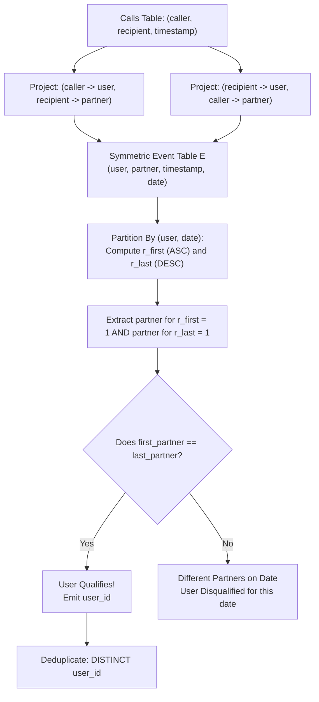

# Guided Example: First and Last Call On the Same Day

We formulate and execute the bidirectional call expansion and partitioned temporal ranking algorithm on representative call records to identify users whose earliest and latest calls on a single calendar day involve the exact same counterpart.

- **Primary Instance:** 
  - Call 1: User 1 calls User 2 at `2021-08-10 09:00:00`
  - Call 2: User 1 calls User 3 at `2021-08-10 17:00:00`
- **Expected Output:**
  - Users `2` and `3` qualify (each had a single call with User 1)
  - User `1` is disqualified for this date (first call with User 2, last call with User 3)

---

## 1. Instance & Intuition

The `Calls` table records telephone events with a caller, a recipient, and a timestamp. A phone call is inherently a bidirectional interaction: both participants take part in the conversation at that exact moment.

For a specific user $u$ on a specific calendar day $D$:
1. We collect all calls that user $u$ participated in on day $D$ (whether $u$ initiated the call or received it).
2. We identify the counterpart in the chronologically **first** call of that day ($first\_person$).
3. We identify the counterpart in the chronologically **last** call of that day ($last\_person$).
4. If $first\_person == last\_person$, user $u$ meets the criteria for day $D$.

Key observation on single calls:
- If a user participated in **exactly one call** on day $D$, that single conversation is simultaneously their first call and their last call. Thus, $first\_person == last\_person$ holds trivially, and that user automatically qualifies!

In our primary instance:
- User 1 has two calls on `2021-08-10`: first with User 2, last with User 3. Since $2 \neq 3$, User 1 does not qualify on this date.
- User 2 has one call on `2021-08-10`: with User 1. First and last partner is User 1 ($1 == 1$). User 2 qualifies!
- User 3 has one call on `2021-08-10`: with User 1. First and last partner is User 1 ($1 == 1$). User 3 qualifies!

---

## 2. Relational Formalism & Temporal Windows

Let the input relation be $\text{Calls}(caller\_id, recipient\_id, call\_time)$.

### Step 1: Bidirectional Perspective Unification

Because every call is an undirected communication between two parties, we construct the symmetric event relation $E$:
$$E = \pi_{caller\_id \to user, \, recipient\_id \to partner, \, call\_time}(\text{Calls}) \;\cup\; \pi_{recipient\_id \to user, \, caller\_id \to partner, \, call\_time}(\text{Calls})$$

Let $date(t)$ denote the calendar date component of timestamp $t$.

### Step 2: Temporal Boundary Ranking

For each partition $(user, date(call\_time))$, we assign chronological ranks in both directions:
- **Forward Rank:**
  $$r_{\text{first}} = \text{DENSE\_RANK}() \text{ OVER } (\text{PARTITION BY } user, date(call\_time) \text{ ORDER BY } call\_time \text{ ASC})$$
- **Backward Rank:**
  $$r_{\text{last}} = \text{DENSE\_RANK}() \text{ OVER } (\text{PARTITION BY } user, date(call\_time) \text{ ORDER BY } call\_time \text{ DESC})$$

### Step 3: Partner Matching Predicate

For a user $u$ on day $D$:
- Let $P_{\text{first}}(u, D) = \{partner \mid (u, partner, t) \in E \wedge date(t) = D \wedge r_{\text{first}} = 1\}$.
- Let $P_{\text{last}}(u, D) = \{partner \mid (u, partner, t) \in E \wedge date(t) = D \wedge r_{\text{last}} = 1\}$.

The qualifying user set is:
$$\mathcal{U}^* = \pi_{user}\Big(\{(u, D) \mid P_{\text{first}}(u, D) \cap P_{\text{last}}(u, D) \neq \emptyset\}\Big)$$

---

## 3. Step-by-Step Window Partitioning Trace

We trace the primary scenario on date `2021-08-10`:
- Call A: `(1, 2, '2021-08-10 09:00:00')`
- Call B: `(1, 3, '2021-08-10 17:00:00')`

### Phase 1: Symmetric Expansion

| Record | Perspective `user` | Interaction `partner` | Date | Timestamp |
|---|---|---|---|---|
| A1 | 1 | 2 | `2021-08-10` | `09:00:00` |
| A2 | 2 | 1 | `2021-08-10` | `09:00:00` |
| B1 | 1 | 3 | `2021-08-10` | `17:00:00` |
| B2 | 3 | 1 | `2021-08-10` | `17:00:00` |

### Phase 2: Partitioned Window Ranks

1. **Partition `(user = 1, date = '2021-08-10')`:**
   - Call at `09:00:00`: partner 2 $\implies r_{\text{first}} = 1, r_{\text{last}} = 2$.
   - Call at `17:00:00`: partner 3 $\implies r_{\text{first}} = 2, r_{\text{last}} = 1$.
   - $first\_partner = 2$, $last\_partner = 3$.
   - Comparison: $2 == 3$ is **False**. User 1 does not qualify.

2. **Partition `(user = 2, date = '2021-08-10')`:**
   - Call at `09:00:00`: partner 1 $\implies r_{\text{first}} = 1, r_{\text{last}} = 1$.
   - $first\_partner = 1$, $last\_partner = 1$.
   - Comparison: $1 == 1$ is **True**. User 2 **qualifies**!

3. **Partition `(user = 3, date = '2021-08-10')`:**
   - Call at `17:00:00`: partner 1 $\implies r_{\text{first}} = 1, r_{\text{last}} = 1$.
   - $first\_partner = 1$, $last\_partner = 1$.
   - Comparison: $1 == 1$ is **True**. User 3 **qualifies**!

---

## 4. Execution Trace Table

### Complete Event Analysis for Date `2021-08-10`

| User | Partner | Timestamp | Date | $r_{\text{first}}$ | $r_{\text{last}}$ | Role in Day | Equal Partners ($first == last$)? | Qualifying Result |
|---|---|---|---|---|---|---|---|---|
| 1 | 2 | `09:00:00` | `2021-08-10` | 1 | 2 | Earliest Call | No ($2 \neq 3$) | Disqualified |
| 1 | 3 | `17:00:00` | `2021-08-10` | 2 | 1 | Latest Call | No ($2 \neq 3$) | Disqualified |
| 2 | 1 | `09:00:00` | `2021-08-10` | 1 | 1 | Sole Call | **Yes ($1 == 1$)** | **User 2 Qualifies** |
| 3 | 1 | `17:00:00` | `2021-08-10` | 1 | 1 | Sole Call | **Yes ($1 == 1$)** | **User 3 Qualifies** |

### Diagnostic Scenarios Summary

| Scenario | Calls Made on Date | User Evaluated | Earliest Partner | Latest Partner | Equality Check | Qualifying Status |
|---|---|---|---|---|---|---|
| Multiple Calls, Same Partner | `1 -> 2` at 10am, `2 -> 1` at 8pm | User 1 | 2 | 2 | $2 == 2$ | **Qualifies** |
| Multiple Calls, Same Partner | `1 -> 2` at 10am, `2 -> 1` at 8pm | User 2 | 1 | 1 | $1 == 1$ | **Qualifies** |
| Different Partners | `1 -> 2` at 9am, `1 -> 3` at 5pm | User 1 | 2 | 3 | $2 \neq 3$ | Disqualified |
| Single Daily Call | `4 -> 8` at 12pm | User 4 | 8 | 8 | $8 == 8$ | **Qualifies** |

---

## 5. Algorithmic Correctness & Soundness

**Soundness.** A user $u$ is emitted only if there exists a calendar date $D$ where the partner associated with $r_{\text{first}} = 1$ is identical to the partner associated with $r_{\text{last}} = 1$. The symmetric table $E$ includes all incoming and outgoing conversations. Because window functions partition by both user and date and order strictly by timestamp, the earliest and latest partners on day $D$ are faithfully extracted. If they match, the user strictly meets the problem condition.

**Completeness.** Any qualifying user participates in at least one day $D$ where their first call counterpart equals their last call counterpart. Symmetrizing the calls ensures neither caller-initiated nor recipient-received interactions are omitted. Ranking every $(user, date)$ partition guarantees that the global minimum and maximum timestamps for each active day are evaluated. Taking the distinct projection of qualifying user IDs produces all valid users without duplicates.

---

## 6. Edge Cases & Traps

- **Asymmetric Perspective Fallacy:** If calls are filtered only by `caller_id = user`, calls received by the user are ignored. Phone communication involves both participants; symmetrizing via `UNION` is mandatory.
- **Multiple Calls on the Same Second:** If a user participated in multiple calls with identical timestamps, `DENSE_RANK()` or `RANK()` may produce ties. Checking whether the intersection between earliest partner sets and latest partner sets is non-empty handles simultaneous timestamps robustly.
- **Deduplication:** A user may qualify on multiple distinct calendar days. Returning `DISTINCT user_id` ensures each qualifying person appears exactly once in the final table.

---

## 7. Complexity Analysis

- **Time Complexity:**
  - Let $R$ be the number of rows in the `Calls` table.
  - Symmetrizing the calls generates $2R$ records in $\mathcal{O}(R)$ time.
  - Window ranking partitioned by $(user, date)$ and ordered by timestamp takes $\mathcal{O}(R \log R)$ time via index sorting or hash partitioning.
  - Filtering for $first\_partner == last\_partner$ takes $\mathcal{O}(R)$ time.
  - Deduplicating distinct qualifying users takes $\mathcal{O}(|V|)$ time.
  - Total time complexity is $\mathcal{O}(R \log R)$.
- **Auxiliary Space Complexity:**
  - The symmetric table $E$ stores $2R$ records: $\mathcal{O}(R)$.
  - Window ranking state and hash aggregation require $\mathcal{O}(R)$ space.
  - Total auxiliary space is $\mathcal{O}(R)$.
