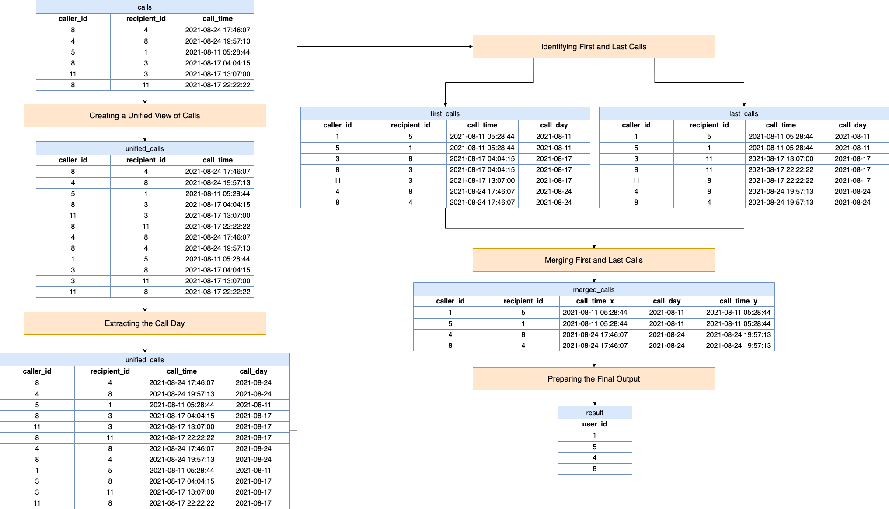

[TOC]

# Solution

---

## pandas

### Approach: Dual Perspective Call Analysis

The approach begins by creating a comprehensive view of call data, where each call is represented from both the caller and recipient's perspectives. It then isolates the date part of each call to focus on daily activities. The method proceeds to identify and extract the first and last calls of each user for each day, using this to determine if these calls were to the same person. Finally, it compiles a list of unique users meeting this criterion.

**Visualization of Approach:**



#### Intuition

Let's review the intuition behind each step given the following input DataFrame:

Calls DataFrame (`calls`):

<table>
    <tr>
        <th>caller_id</th>
        <th>recipient_id</th>
        <th>call_time</th>
    </tr>
    <tr>
        <td>8</td>
        <td>4</td>
        <td>2021-08-24 17:46:07</td>
    </tr>
    <tr>
        <td>4</td>
        <td>8</td>
        <td>2021-08-24 19:57:13</td>
    </tr>
    <tr>
        <td>5</td>
        <td>1</td>
        <td>2021-08-11 05:28:44</td>
    </tr>
    <tr>
        <td>8</td>
        <td>3</td>
        <td>2021-08-17 04:04:15</td>
    </tr>
    <tr>
        <td>11</td>
        <td>3</td>
        <td>2021-08-17 13:07:00</td>
    </tr>
    <tr>
        <td>8</td>
        <td>11</td>
        <td>2021-08-17 22:22:22</td>
    </tr>
</table>
<br>

1. **Creating a Unified View of Calls**

```python
unified_calls = pd.concat(
    [
        calls,
        calls.rename(columns={"caller_id": "recipient_id", "recipient_id": "caller_id"}),
    ],
    ignore_index=True,
)
```
- The objective here is to consider each user as a participant in a call, regardless of whether they are the caller or the recipient.
- The function concatenates the original `calls` DataFrame with a modified version where the $\text{caller}_{id}$ and $\text{recipient}_{id}$ columns are swapped.
- This results in a DataFrame ($\text{unified}_{calls}$) where each call is represented twice: once from the perspective of the caller and once from the perspective of the recipient.
- $\text{ignore}_{index}=True$ is used to re-index the concatenated DataFrame.

$\text{unified}_{calls}$:
<table>
    <tr>
        <th>caller_id</th>
        <th>recipient_id</th>
        <th>call_time</th>
    </tr>
    <tr>
        <td>8</td>
        <td>4</td>
        <td>2021-08-24 17:46:07</td>
    </tr>
    <tr>
        <td>4</td>
        <td>8</td>
        <td>2021-08-24 19:57:13</td>
    </tr>
    <tr>
        <td>5</td>
        <td>1</td>
        <td>2021-08-11 05:28:44</td>
    </tr>
    <tr>
        <td>8</td>
        <td>3</td>
        <td>2021-08-17 04:04:15</td>
    </tr>
    <tr>
        <td>11</td>
        <td>3</td>
        <td>2021-08-17 13:07:00</td>
    </tr>
    <tr>
        <td>8</td>
        <td>11</td>
        <td>2021-08-17 22:22:22</td>
    </tr>
    <tr>
        <td>4</td>
        <td>8</td>
        <td>2021-08-24 17:46:07</td>
    </tr>
    <tr>
        <td>8</td>
        <td>4</td>
        <td>2021-08-24 19:57:13</td>
    </tr>
    <tr>
        <td>1</td>
        <td>5</td>
        <td>2021-08-11 05:28:44</td>
    </tr>
    <tr>
        <td>3</td>
        <td>8</td>
        <td>2021-08-17 04:04:15</td>
    </tr>
    <tr>
        <td>3</td>
        <td>11</td>
        <td>2021-08-17 13:07:00</td>
    </tr>
    <tr>
        <td>11</td>
        <td>8</td>
        <td>2021-08-17 22:22:22</td>
    </tr>
</table>
<br>

2. **Extracting the Call Day**

```python
unified_calls["call_day"] = unified_calls["call_time"].dt.date
```
- To analyze calls by day, we need to isolate the date part of the $\text{call}_{time}$.
- This line adds a new column $\text{call}_{day}$ to $\text{unified}_{calls}$, which contains just the date component of each $\text{call}_{time}$.
- The `.dt.date` accessor is used to extract the date from the datetime objects in $\text{call}_{time}$.

$\text{unified}_{calls}$:
<table>
    <tr>
        <th>caller_id</th>
        <th>recipient_id</th>
        <th>call_time</th>
        <th>call_day</th>
    </tr>
    <tr>
        <td>8</td>
        <td>4</td>
        <td>2021-08-24 17:46:07</td>
        <td>2021-08-24</td>
    </tr>
    <tr>
        <td>4</td>
        <td>8</td>
        <td>2021-08-24 19:57:13</td>
        <td>2021-08-24</td>
    </tr>
    <tr>
        <td>5</td>
        <td>1</td>
        <td>2021-08-11 05:28:44</td>
        <td>2021-08-11</td>
    </tr>
    <tr>
        <td>8</td>
        <td>3</td>
        <td>2021-08-17 04:04:15</td>
        <td>2021-08-17</td>
    </tr>
    <tr>
        <td>11</td>
        <td>3</td>
        <td>2021-08-17 13:07:00</td>
        <td>2021-08-17</td>
    </tr>
    <tr>
        <td>8</td>
        <td>11</td>
        <td>2021-08-17 22:22:22</td>
        <td>2021-08-17</td>
    </tr>
    <tr>
        <td>4</td>
        <td>8</td>
        <td>2021-08-24 17:46:07</td>
        <td>2021-08-24</td>
    </tr>
    <tr>
        <td>8</td>
        <td>4</td>
        <td>2021-08-24 19:57:13</td>
        <td>2021-08-24</td>
    </tr>
    <tr>
        <td>1</td>
        <td>5</td>
        <td>2021-08-11 05:28:44</td>
        <td>2021-08-11</td>
    </tr>
    <tr>
        <td>3</td>
        <td>8</td>
        <td>2021-08-17 04:04:15</td>
        <td>2021-08-17</td>
    </tr>
    <tr>
        <td>3</td>
        <td>11</td>
        <td>2021-08-17 13:07:00</td>
        <td>2021-08-17</td>
    </tr>
    <tr>
        <td>11</td>
        <td>8</td>
        <td>2021-08-17 22:22:22</td>
        <td>2021-08-17</td>
    </tr>
</table>
<br>

3. **Identifying First and Last Calls**

```python
first_call_indices = unified_calls.groupby(["call_day", "caller_id"])["call_time"].idxmin()
last_call_indices = unified_calls.groupby(["call_day", "caller_id"])["call_time"].idxmax()

first_calls = unified_calls.loc[first_call_indices]
last_calls = unified_calls.loc[last_call_indices]
```
- This step is crucial to find the first and last calls made by each user on each day.
- By grouping $\text{unified}_{calls}$ by $\text{call}_{day}$ and $\text{caller}_{id}$, we can use `idxmin()` and `idxmax()` to find the indices of the earliest and latest call times, respectively, within each group.
- `first_call_indices` and `last_call_indices` store these indices.
- $\text{first}_{calls}$ and $\text{last}_{calls}$ DataFrames are then created by selecting rows from $\text{unified}_{calls}$ using these indices, representing the first and last calls for each user on each day.

$\text{first}_{calls}$:
<table>
    <tr>
        <th>caller_id</th>
        <th>recipient_id</th>
        <th>call_time</th>
        <th>call_day</th>
    </tr>
    <tr>
        <td>1</td>
        <td>5</td>
        <td>2021-08-11 05:28:44</td>
        <td>2021-08-11</td>
    </tr>
    <tr>
        <td>5</td>
        <td>1</td>
        <td>2021-08-11 05:28:44</td>
        <td>2021-08-11</td>
    </tr>
    <tr>
        <td>3</td>
        <td>8</td>
        <td>2021-08-17 04:04:15</td>
        <td>2021-08-17</td>
    </tr>
    <tr>
        <td>8</td>
        <td>3</td>
        <td>2021-08-17 04:04:15</td>
        <td>2021-08-17</td>
    </tr>
    <tr>
        <td>11</td>
        <td>3</td>
        <td>2021-08-17 13:07:00</td>
        <td>2021-08-17</td>
    </tr>
    <tr>
        <td>4</td>
        <td>8</td>
        <td>2021-08-24 17:46:07</td>
        <td>2021-08-24</td>
    </tr>
    <tr>
        <td>8</td>
        <td>4</td>
        <td>2021-08-24 17:46:07</td>
        <td>2021-08-24</td>
    </tr>
</table>
<br>

$\text{last}_{calls}$:
<table>
    <tr>
        <th>caller_id</th>
        <th>recipient_id</th>
        <th>call_time</th>
        <th>call_day</th>
    </tr>
    <tr>
        <td>1</td>
        <td>5</td>
        <td>2021-08-11 05:28:44</td>
        <td>2021-08-11</td>
    </tr>
    <tr>
        <td>5</td>
        <td>1</td>
        <td>2021-08-11 05:28:44</td>
        <td>2021-08-11</td>
    </tr>
    <tr>
        <td>3</td>
        <td>11</td>
        <td>2021-08-17 13:07:00</td>
        <td>2021-08-17</td>
    </tr>
    <tr>
        <td>8</td>
        <td>11</td>
        <td>2021-08-17 22:22:22</td>
        <td>2021-08-17</td>
    </tr>
    <tr>
        <td>11</td>
        <td>8</td>
        <td>2021-08-17 22:22:22</td>
        <td>2021-08-17</td>
    </tr>
    <tr>
        <td>4</td>
        <td>8</td>
        <td>2021-08-24 19:57:13</td>
        <td>2021-08-24</td>
    </tr>
    <tr>
        <td>8</td>
        <td>4</td>
        <td>2021-08-24 19:57:13</td>
        <td>2021-08-24</td>
    </tr>
</table>
<br>

4. **Merging First and Last Calls**

```python
merged_calls = first_calls.merge(last_calls, on=["caller_id", "recipient_id", "call_day"])
```
- The goal is to determine if the first and last calls of a user on a given day were with the same recipient.
- By merging $\text{first}_{calls}$ and $\text{last}_{calls}$ on $\text{caller}_{id}$, $\text{recipient}_{id}$, and $\text{call}_{day}$, we combine records where the first and last calls match in terms of the caller, recipient, and day.
- This merge results in $\text{merged}_{calls}$, which includes only those calls where the caller's first and last calls of the day were with the same recipient.

$\text{merged}_{calls}$:
<table>
    <tr>
        <th>caller_id</th>
        <th>recipient_id</th>
        <th>call_time_x</th>
        <th>call_day</th>
        <th>call_time_y</th>
    </tr>
    <tr>
        <td>1</td>
        <td>5</td>
        <td>2021-08-11 05:28:44</td>
        <td>2021-08-11</td>
        <td>2021-08-11 05:28:44</td>
    </tr>
    <tr>
        <td>5</td>
        <td>1</td>
        <td>2021-08-11 05:28:44</td>
        <td>2021-08-11</td>
        <td>2021-08-11 05:28:44</td>
    </tr>
    <tr>
        <td>4</td>
        <td>8</td>
        <td>2021-08-24 17:46:07</td>
        <td>2021-08-24</td>
        <td>2021-08-24 19:57:13</td>
    </tr>
    <tr>
        <td>8</td>
        <td>4</td>
        <td>2021-08-24 17:46:07</td>
        <td>2021-08-24</td>
        <td>2021-08-24 19:57:13</td>
    </tr>
</table>
<br>

5. **Preparing the Final Output**

```python
result = (
    merged_calls[["caller_id"]]
    .rename(columns={"caller_id": "user_id"})
    .drop_duplicates()
)
```
- Finally, the function prepares the output, which is a list of unique user IDs who meet the criteria.
- We select the $\text{caller}_{id}$ column from $\text{merged}_{calls}$, rename it to $\text{user}_{id}$ for clarity, and use $\text{drop}_{duplicates}()$ to ensure each user ID is listed only once.
- This results in `result`, a DataFrame containing the unique IDs of users whose first and last calls of the day were with the same person.

`result`:
<table>
    <tr>
        <th>user_id</th>
    </tr>
    <tr>
        <td>1</td>
    </tr>
    <tr>
        <td>5</td>
    </tr>
    <tr>
        <td>4</td>
    </tr>
    <tr>
        <td>8</td>
    </tr>
</table>
<br>

#### Implementation

```python
import pandas as pd

def same_day_calls(calls: pd.DataFrame) -> pd.DataFrame:
    # Step 1: Create a unified view of calls
    # Each call is represented twice, from both caller's and recipient's perspectives.
    unified_calls = pd.concat(
        [
            calls,
            calls.rename(
                columns={"caller_id": "recipient_id", "recipient_id": "caller_id"}
            ),
        ],
        ignore_index=True,
    )

    # Step 2: Extract the date part from call_time to identify the call day
    unified_calls["call_day"] = unified_calls["call_time"].dt.date

    # Step 3: Identify the first (earliest) and last (latest) calls of each day for each user
    # Group by call_day and caller_id, then find the index of the min/max call_time
    first_call_indices = unified_calls.groupby(["call_day", "caller_id"])[
        "call_time"
    ].idxmin()
    last_call_indices = unified_calls.groupby(["call_day", "caller_id"])[
        "call_time"
    ].idxmax()

    first_calls = unified_calls.loc[first_call_indices]
    last_calls = unified_calls.loc[last_call_indices]

    # Step 4: Merge first and last calls to find users whose first and last calls are with the same recipient
    merged_calls = first_calls.merge(
        last_calls, on=["caller_id", "recipient_id", "call_day"]
    )

    # Step 5: Prepare the final output
    # Select unique caller_id and rename to user_id
    result = (
        merged_calls[["caller_id"]]
        .rename(columns={"caller_id": "user_id"})
        .drop_duplicates()
    )

    return result

```

---

## Database

### Approach: Dual-Ranking Unified Call Analysis

The "Dual-Ranking Unified Call Analysis" approach utilizes a combination of SQL Common Table Expressions (CTEs) and window functions to identify users whose first and last calls each day are with the same person. Initially, it constructs a unified view of calls by treating each user as a participant, regardless of whether they are a caller or recipient. Subsequently, it employs dual-ranking to determine each user's earliest and latest calls per day. Finally, the approach filters and groups this data to isolate users who interacted with the same individual in both their first and last calls of any given day.

#### Intuition

Here's a breakdown of the logic:

Let's break down the SQL query step by step and explain the intuition behind each part:

1. **Creating a Unified View of Calls (CTE: `UnifiedCalls`)**

- The goal of this step is to consider each user as a participant in a call, regardless of whether they are the caller or the recipient.
- This allows us to later analyze calls by focusing solely on the $\text{user}_{id}$, without worrying about whether they were the caller or the recipient in the original data.

```sql
WITH UnifiedCalls AS (
  -- Include calls where the user is the caller
  SELECT
    caller_id AS user_id,
    call_time,
    recipient_id AS other_participant_id
  FROM
    Calls
  UNION
-- Include calls where the user is the recipient
  SELECT
    recipient_id AS user_id,
    call_time,
    caller_id AS other_participant_id
  FROM
    Calls
)
```

- We create two SELECT statements within a CTE named `UnifiedCalls`.
- The first SELECT transforms rows from the `Calls` table by treating the $\text{caller}_{id}$ as $\text{user}_{id}$ and keeping the $\text{recipient}_{id}$ as `other_participant_id`.
- The second SELECT does the opposite: it treats the $\text{recipient}_{id}$ as $\text{user}_{id}$ and the $\text{caller}_{id}$ as `other_participant_id`.
- We use the UNION operator to combine these two sets of results. This ensures every call is represented twice: once from the perspective of the caller and once from the perspective of the recipient.

2. **Ranking Calls for Each User on Each Day (CTE: `RankedCalls`)**

- The goal of this step is to identify the first and last calls made by each user on each day.
- These rankings allow us to easily identify the first and last calls of each day for each user, as they will have ranks 1 in their respective ordering.

```sql
RankedCalls AS (
  SELECT
    user_id,
    other_participant_id,
    DATE(call_time) AS call_date,
-- Extracting just the date part of call_time
    DENSE_RANK() OVER (
      PARTITION BY user_id,
      DATE(call_time)
      ORDER BY
        call_time ASC
    ) AS rank_earliest_call,
    DENSE_RANK() OVER (
      PARTITION BY user_id,
      DATE(call_time)
      ORDER BY
        call_time DESC
    ) AS rank_latest_call
  FROM
    UnifiedCalls
)
```
- We create a CTE named `RankedCalls` where we use the $\text{DENSE}_{RANK}()$ window function twice.
- The first use of $\text{DENSE}_{RANK}()$ (named as `rank_earliest_call`) ranks calls for each $\text{user}_{id}$ and $\text{call}_{date}$ (date part of $\text{call}_{time}$) in ascending order of $\text{call}_{time}$. The earliest call of the day gets the rank 1.
- The second use of $\text{DENSE}_{RANK}()$ (named as `rank_latest_call`) ranks the same calls but in descending order of $\text{call}_{time}$. The latest call of the day gets the rank 1.

3. **Selecting Users with Matching Call Partners on the Same Day**

- The goal of this step is to find users whose first and last calls of the day were with the same person.
- This step is key to solving the problem. It filters down to users who started and ended their calling day with the same person, as required by the problem statement.

```sql
SELECT
  DISTINCT user_id
FROM
  RankedCalls
WHERE
  rank_earliest_call = 1
  OR rank_latest_call = 1 -- Filtering for first and last calls
GROUP BY
  user_id,
  call_date
HAVING
  COUNT(DISTINCT other_participant_id) = 1;
```
- In the final SELECT statement, we filter out rows from `RankedCalls` where the rank is either 1 in ascending order (`rank_earliest_call`) or 1 in descending order (`rank_latest_call`). This effectively selects the first and last calls of each user for each day.
- We then group the results by $\text{user}_{id}$ and $\text{call}_{date}$.
- The $HAVING COUNT(DISTINCT other_{participant\_id}) = 1$ clause is crucial. It ensures that for each group (user-day combination), there is only one distinct `other_participant_id` for both the first and last calls. In other words, the user's first and last calls of the day were with the same person.

#### Implementation

```mysql []
-- CTE to create a unified view of all calls, treating each user as a 'participant'
WITH UnifiedCalls AS (
  -- Include calls where the user is the caller
  SELECT
    caller_id AS user_id,
    call_time,
    recipient_id AS other_participant_id
  FROM
    Calls
  UNION
-- Include calls where the user is the recipient
  SELECT
    recipient_id AS user_id,
    call_time,
    caller_id AS other_participant_id
  FROM
    Calls
),
-- CTE to rank the calls for each user on each day
RankedCalls AS (
  SELECT
    user_id,
    other_participant_id,
    DATE(call_time) AS call_date,
-- Extracting just the date part of call_time
    DENSE_RANK() OVER (
      PARTITION BY user_id,
      DATE(call_time)
      ORDER BY
        call_time ASC
    ) AS rank_earliest_call,
    DENSE_RANK() OVER (
      PARTITION BY user_id,
      DATE(call_time)
      ORDER BY
        call_time DESC
    ) AS rank_latest_call
  FROM
    UnifiedCalls
) -- Selecting users whose first and last calls of the day were with the same person
SELECT
  DISTINCT user_id
FROM
  RankedCalls
WHERE
  rank_earliest_call = 1
  OR rank_latest_call = 1 -- Filtering for first and last calls
GROUP BY
  user_id,
  call_date
HAVING
  COUNT(DISTINCT other_participant_id) = 1;

```