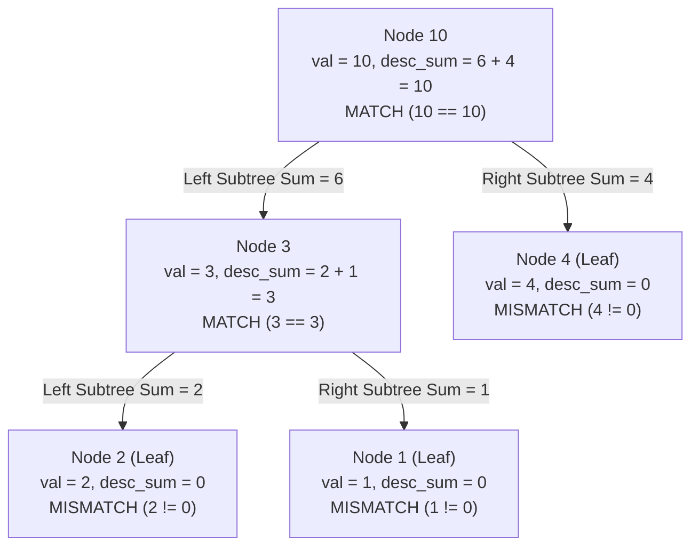

# Guided Example: Count Nodes Equal to Sum of Descendants

We formulate and execute the bottom-up post-order tree traversal algorithm on representative binary trees to count all nodes whose stored value matches the aggregate sum of their strict descendants.

- **Primary Instance:** `root = [10, 3, 4, 2, 1]` ($N = 5$)
  - Expected Output: `2` (nodes with values `3` and `10` qualify)
- **Secondary Instance (Zero-Value Leaf):** `root = [0]` ($N = 1$)
  - Expected Output: `1` (leaf with value `0` equals empty descendant sum `0`)

---

## 1. Instance & Intuition

In a binary tree, the strict descendants of a node $u$ are all nodes situated in its left and right subtrees. The node $u$ itself is excluded from its descendant set:
$$\text{Descendants}(u) = \text{Subtree}(u.\text{left}) \cup \text{Subtree}(u.\text{right})$$

We are tasked with counting every node $u$ whose value satisfies:
$$u.\text{val} = \sum_{v \in \text{Descendants}(u)} v.\text{val}$$

Boundary conditions on leaves:
- A leaf node has no children ($\text{Descendants}(u) = \emptyset$).
- An empty summation evaluates to 0.
- Therefore, a leaf qualifies if and only if its value is $0$.

Computing the descendant sum naively from top to bottom takes $\mathcal{O}(N^2)$ time because descendant subtrees are repeatedly traversed. 
Instead, a **post-order depth-first search (DFS)** traverses children before parents:
1. Recurse on the left child, receiving total left subtree sum $S_L$.
2. Recurse on the right child, receiving total right subtree sum $S_R$.
3. The descendant sum of the current node is $S_L + S_R$.
4. Test if $u.\text{val} == S_L + S_R$; if so, increment our counter.
5. Return the full subtree sum $u.\text{val} + S_L + S_R$ upward to the parent in $\mathcal{O}(1)$ time per node.

---

## 2. Formal Invariants & Bottom-Up DFS Recurrence

Let $T$ be a binary tree rooted at $root$.

### Total Subtree Sum Function

For any node $u$:
$$\sigma(u) = \begin{cases} 
0 & \text{if } u = \text{null} \\
u.\text{val} + \sigma(u.\text{left}) + \sigma(u.\text{right}) & \text{otherwise}
\end{cases}$$

### Descendant Sum Predicate

The sum of all strict descendants beneath node $u$ is:
$$\delta(u) = \sigma(u.\text{left}) + \sigma(u.\text{right})$$

The equality predicate is:
$$\mathcal{M}(u) = \mathbb{I}\Big(u.\text{val} = \delta(u)\Big) = \begin{cases} 1 & \text{if } u.\text{val} = \sigma(u.\text{left}) + \sigma(u.\text{right}) \\ 0 & \text{otherwise} \end{cases}$$

The objective is to compute the total qualifying count:
$$\text{TotalCount} = \sum_{u \in T} \mathcal{M}(u)$$

---

## 3. Step-by-Step Post-Order Traversal Trace

We trace the primary instance `root = [10, 3, 4, 2, 1]`:

### Step 1: Leaf Node 2 (Left child of 3)
- Left child: `null` ($\sigma = 0$). Right child: `null` ($\sigma = 0$).
- Descendant sum: $\delta(2) = 0 + 0 = 0$.
- Test: $u.\text{val} = 2 \neq 0$ (Mismatch).
- Return total subtree sum: $\sigma(2) = 2 + 0 = 2$.

### Step 2: Leaf Node 1 (Right child of 3)
- Left child: `null` ($\sigma = 0$). Right child: `null` ($\sigma = 0$).
- Descendant sum: $\delta(1) = 0 + 0 = 0$.
- Test: $u.\text{val} = 1 \neq 0$ (Mismatch).
- Return total subtree sum: $\sigma(1) = 1 + 0 = 1$.

### Step 3: Internal Node 3
- Left child sum received: $\sigma(2) = 2$.
- Right child sum received: $\sigma(1) = 1$.
- Descendant sum: $\delta(3) = 2 + 1 = 3$.
- Test: $u.\text{val} = 3 == 3$ (**Match!**).
- Counter increments: $\text{count} \leftarrow 0 + 1 = 1$.
- Return total subtree sum: $\sigma(3) = 3 + 3 = 6$.

### Step 4: Leaf Node 4 (Right child of 10)
- Descendant sum: $\delta(4) = 0$.
- Test: $u.\text{val} = 4 \neq 0$ (Mismatch).
- Return total subtree sum: $\sigma(4) = 4 + 0 = 4$.

### Step 5: Root Node 10
- Left child sum received: $\sigma(3) = 6$.
- Right child sum received: $\sigma(4) = 4$.
- Descendant sum: $\delta(10) = 6 + 4 = 10$.
- Test: $u.\text{val} = 10 == 10$ (**Match!**).
- Counter increments: $\text{count} \leftarrow 1 + 1 = 2$.
- Return total subtree sum: $\sigma(10) = 10 + 10 = 20$.

Final answer emitted: **2**.

---

## 4. Execution Trace Table

### Complete Post-Order Node Evaluations

| Post-Order Order | Node Value $u.\text{val}$ | Left Sum $\sigma_L$ | Right Sum $\sigma_R$ | Descendant Sum $\delta(u) = \sigma_L + \sigma_R$ | Match Condition $u.\text{val} == \delta(u)$? | Total Subtree Sum Returned $\sigma(u)$ | Cumulative Matches |
|---|---|---|---|---|---|---|---|
| 1 | 2 | 0 | 0 | 0 | False ($2 \neq 0$) | $2 + 0 = 2$ | 0 |
| 2 | 1 | 0 | 0 | 0 | False ($1 \neq 0$) | $1 + 0 = 1$ | 0 |
| **3** | **3** | **2** | **1** | **3** | **True ($3 == 3$)** | **$3 + 3 = 6$** | **1** |
| 4 | 4 | 0 | 0 | 0 | False ($4 \neq 0$) | $4 + 0 = 4$ | 1 |
| **5** | **10** | **6** | **4** | **10** | **True ($10 == 10$)** | **$10 + 10 = 20$** | **2** |

### Secondary Instance Trace: `root = [0]`

| Post-Order Step | Node Value | Subtree Sum Left | Subtree Sum Right | Descendant Sum | Match Status | Final Subtree Sum | Total Matches |
|---|---|---|---|---|---|---|---|
| 1 | 0 | 0 | 0 | 0 | **True ($0 == 0$)** | 0 | **1** |

---

## 5. Algorithmic Correctness & Soundness

**Soundness.** We prove by structural induction on the height of binary tree nodes that $\sigma(u)$ correctly computes the sum of all node values in the subtree rooted at $u$.
- Base Case: A null node has sum 0.
- Inductive Step: Assume $\sigma(u.\text{left})$ and $\sigma(u.\text{right})$ correctly equal the total sums of all nodes in the left and right subtrees, respectively. Because the strict descendants of $u$ partition disjointly into the left subtree and the right subtree, the descendant sum is strictly $\delta(u) = \sigma(u.\text{left}) + \sigma(u.\text{right})$. Comparing $u.\text{val} == \delta(u)$ evaluates the exact problem definition. The returned sum $u.\text{val} + \delta(u)$ accounts for $u$ itself, maintaining the inductive invariant for the parent.

**Completeness.** A depth-first search visits every node in the binary tree exactly once. Because post-order ordering guarantees that both child subtrees are completely aggregated before evaluating the parent, every node is checked against its exact complete descendant sum without omitting any node.

---

## 6. Edge Cases & Traps

- **64-bit Integer Overflow:** Node values can be up to $10^5$, with $N = 10^5$ nodes. A degenerate tree (linked list) with values $10^5$ has total sum $10^5 \times 10^5 = 10^{10}$, which exceeds 32-bit signed integer limits ($2.14 \times 10^9$). Subtree sum accumulators must use 64-bit integers (`long long` or `int64`).
- **Zero Values in Non-Leaf Nodes:** If an internal node has value 0 and all its descendants also have value 0, its descendant sum is 0, correctly counting as a match.
- **Deep Recursion Limit:** For $N = 10^5$, an unbalanced linear chain can cause stack overflow in standard Python recursion (default limit 1000). Setting `sys.setrecursionlimit(200000)` or using an explicit iterative post-order traversal with a stack prevents crashes.

---

## 7. Complexity Analysis

- **Time Complexity:**
  - Post-order DFS visits each of the $N$ nodes exactly once.
  - At each node, computing the sum of two returned values and checking equality takes $\mathcal{O}(1)$ time.
  - Total time complexity is strictly $\mathcal{O}(N)$, optimal since every node must be read.
- **Auxiliary Space Complexity:**
  - The call stack depth is bounded by the height of the tree $H$.
  - In a balanced tree, $H = \mathcal{O}(\log N)$.
  - In the worst-case degenerate skewed tree, $H = \mathcal{O}(N)$.
  - Total auxiliary space is $\mathcal{O}(H) \le \mathcal{O}(N)$.
