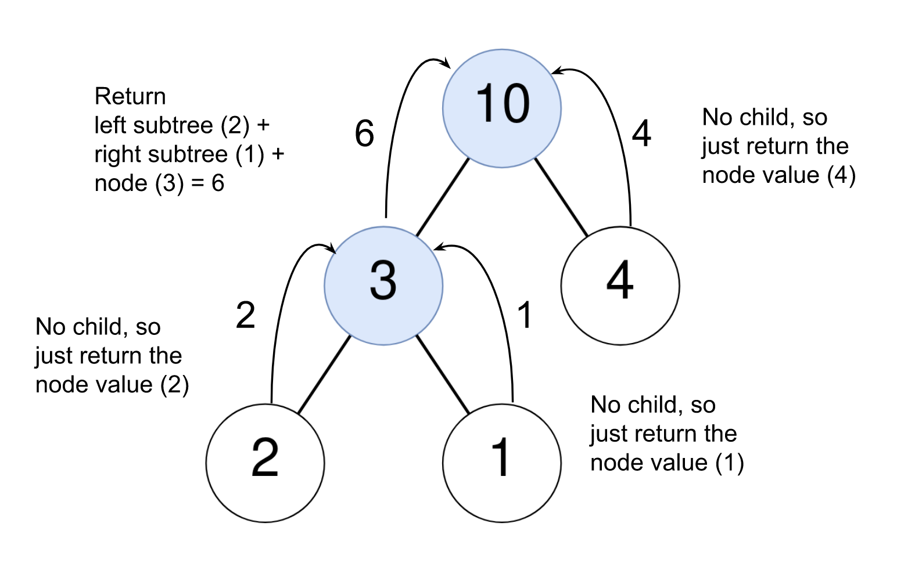

## Solution

---

### Approach: Depth-First Search with Postorder Traversal

#### Intuition

We need to find the sum of all nodes in the given node's subtree and then check if this sum is equal to the value of the given node. One way to find the sum of all nodes in a subtree is to iterate over each node in each subtree, adding their values. This method, however, will be repetitive, re-calculating the sums of subtrees towards the bottom of the tree many times. The efficient way is to recursively find the sum of the subtree for each node and use it to check if the parent node should be counted or not. This is because in the recursive approach, the sum of nodes will be calculated from bottom to top, and hence, the sum of nodes can be reused instead of going all the way to the bottom leaves of the tree each time.

We start implementing the recursive function with the base case. When the tree is empty, the sum of subtree nodes will be `0`; this will be the base condition. Then, for the other nodes, we will make a recursive call with the left and right child. Nodes should be counted when their value is equal to the sum of the values of their descendants. To check if the current node should be counted in the final answer, we will add the values returned from the left and right child to find the sum of the subtree. If this sum is equal to the value of the current node, we increment the counter variable where we store our answer. The recursive function will return the sum of the left and right subtrees and the current node's value. From `equalToDescendants`, after we call the recursive function, we will return the counter variable.



#### Algorithm

1. Initialize a global variable `count` to `0`. This will store the answer.
2. Implement the recursive function `countNodes(root)` as follows:

1. Base condition: If `root` is `NULL`, return `0`.
2. Store the sum of the left subtree in the variable `left` by calling `countNodes(root.left)` and the sum of the right subtree in the variable `right` by calling `countNodes(root.right)`.
3. Increment the variable `count` if the sum $left + right$ is equal to `root.val`.
4. Return $left + right + \text{root.val}$.
3. Call `countNodes(root)`.
4. Return `count`.

#### Implementation

```cpp
class Solution {
public:
    int count;

    long countNodes(TreeNode* root) {
        if (root == NULL) {
            return 0;
        }

        long left = countNodes(root->left);
        long right = countNodes(root->right);

        if (root->val == left + right) {
            count++;
        }

        return left + right + root->val;
    }

    int equalToDescendants(TreeNode* root) {
        countNodes(root);
        return count;
    }
};
```

#### Complexity Analysis

Let $N$ be the number of nodes in the tree.

* Time complexity: $O(N)$

  We will visit each node in the tree only once, hence the time complexity will be equal to $O(N)$.

* Space complexity: $O(N)$

  The main space required is by the recursive stack calls. The maximum number of active stack calls will equal the tree's height. In the worst case, if the tree is completely unbalanced (e.g., a linked list), the call stack can grow as deep as the number of nodes, resulting in a space complexity of $O(N)$.
  <br/>

---