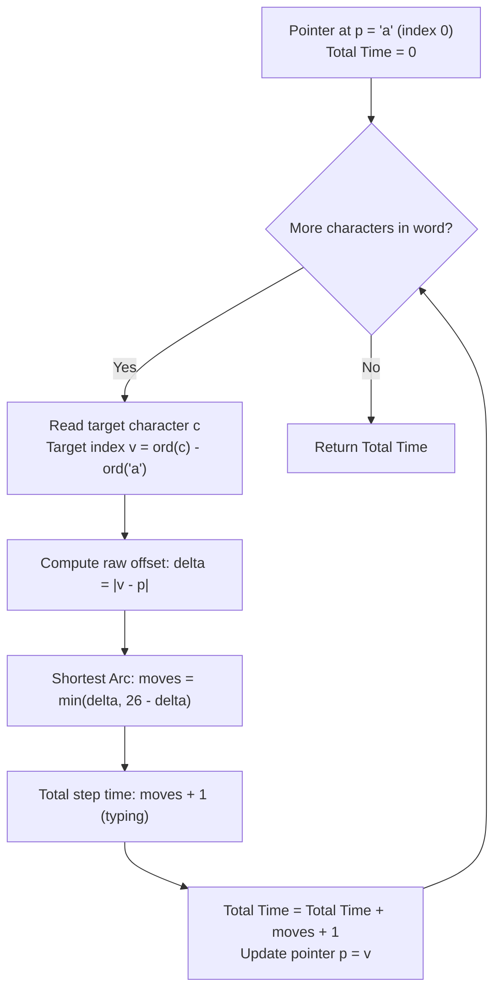

# Guided Example: Minimum Time to Type Word Using Special Typewriter

We formulate and trace the circular metric optimization and greedy shortest-arc navigation algorithm on representative word sequences to compute the minimum seconds required to type text on a circular dial.

- **Primary Instance:** `word = "bza"` ($N = 3$)
  - Initial pointer position: `'a'`
  - Expected Output: `7` (4 movement seconds + 3 typing seconds)
- **Secondary Instance:** `word = "abc"` ($N = 3$)
  - Expected Output: `5` (2 movement seconds + 3 typing seconds)

---

## 1. Instance & Intuition

A circular typewriter arranges the 26 lowercase English letters $\texttt{'a'}$ through $\texttt{'z'}$ in a closed ring. The pointer begins at position $\texttt{'a'}$ at time $t = 0$.
At each second, we may:
1. Advance the pointer 1 position clockwise.
2. Advance the pointer 1 position counterclockwise.
3. Type the character currently situated under the pointer.

To type each character of `word` in strict left-to-right order:
- Typing every character takes exactly 1 second. For a word of length $N$, the typing time is unconditionally fixed at $N$ seconds.
- Navigating the pointer from current letter $u$ to next target letter $v$ can proceed either clockwise or counterclockwise around the 26-element circle.
- The minimum movement time is the length of the shorter circular arc:
  $$\text{dist}(u, v) = \min\Big(|v - u|, \; 26 - |v - u|\Big)$$

Because movement choices for subsequent characters depend only on arriving at the required target letter and not on which direction was chosen, taking the shortest arc locally at each step yields the unique globally minimal time.

In our primary instance `word = "bza"`:
- Step 1 (from `'a'` to `'b'`): clockwise distance is 1, counterclockwise is 25 $\implies$ 1 move + 1 type $= 2$ s.
- Step 2 (from `'b'` to `'z'`): clockwise distance is 24, counterclockwise is 2 ($\texttt{'b'} \to \texttt{'a'} \to \texttt{'z'}$) $\implies$ 2 moves + 1 type $= 3$ s.
- Step 3 (from `'z'` to `'a'`): clockwise distance is 1 ($\texttt{'z'} \to \texttt{'a'}$), counterclockwise is 25 $\implies$ 1 move + 1 type $= 2$ s.
- Total time: $2 + 3 + 2 = 7$ seconds.

---

## 2. Mathematical Formalism & Modular Circular Metric

Let the 26 letters be mapped to residue classes modulo 26:
$$\text{pos}(c) = \text{ord}(c) - \text{ord}(\texttt{'a'}) \in \{0, 1, \dots, 25\}$$

### Circular Distance Function

For any two letter positions $u, v \in \{0, \dots, 25\}$, let $\Delta = |v - u|$.
The geodesic distance on the discrete circle $\mathbb{Z}_{26}$ is:
$$d(u, v) = \min(\Delta, \; 26 - \Delta)$$

### Total Cost Formula

Starting with $p_0 = \text{pos}(\texttt{'a'}) = 0$, for each target character $w_i$ (where $0 \le i < N$):
$$\text{Cost}_i = d(p_i, \text{pos}(w_i)) + 1$$
$$\text{TotalTime} = \sum_{i=0}^{N-1} \text{Cost}_i = N + \sum_{i=0}^{N-1} d(p_i, \text{pos}(w_i))$$
where the pointer updates to $p_{i+1} = \text{pos}(w_i)$.

---

## 3. Step-by-Step Circular Dial Navigation Trace

We trace `word = "bza"` ($N = 3$):

- **Initial State:** Pointer at $p = \texttt{'a'}$ (position 0), Cumulative Time $= 0$.

### Character 1: Target $\texttt{'b'}$ (Position 1)

- Raw difference: $\Delta = |1 - 0| = 1$.
- Clockwise distance: $\Delta = 1$.
- Counterclockwise distance: $26 - 1 = 25$.
- Shortest path: $\min(1, 25) = 1$ move (Clockwise).
- Typing cost: $+1$ second.
- Step time: $1 + 1 = 2$ seconds.
- Cumulative Time: $0 + 2 = 2$.
- Pointer updates to: $p = \texttt{'b'}$ (position 1).

### Character 2: Target $\texttt{'z'}$ (Position 25)

- Raw difference: $\Delta = |25 - 1| = 24$.
- Clockwise distance: $\Delta = 24$.
- Counterclockwise distance: $26 - 24 = 2$ ($\texttt{'b'} \to \texttt{'a'} \to \texttt{'z'}$).
- Shortest path: $\min(24, 2) = 2$ moves (Counterclockwise).
- Typing cost: $+1$ second.
- Step time: $2 + 1 = 3$ seconds.
- Cumulative Time: $2 + 3 = 5$.
- Pointer updates to: $p = \texttt{'z'}$ (position 25).

### Character 3: Target $\texttt{'a'}$ (Position 0)

- Raw difference: $\Delta = |0 - 25| = 25$.
- Clockwise distance: $26 - 25 = 1$ ($\texttt{'z'} \to \texttt{'a'}$).
- Counterclockwise distance: $\Delta = 25$.
- Shortest path: $\min(25, 1) = 1$ move (Clockwise).
- Typing cost: $+1$ second.
- Step time: $1 + 1 = 2$ seconds.
- Cumulative Time: $5 + 2 = 7$.
- Pointer updates to: $p = \texttt{'a'}$ (position 0).

Final execution time: **7 seconds**.

---

## 4. Execution Trace Table

### Primary Trace: `word = "bza"`

| Step $i$ | Target Letter | Start Pointer | Target Position | Clockwise Arc | Counterclockwise Arc | Chosen Shortest Arc | Typing Seconds | Step Duration | Running Total Time |
|---|---|---|---|---|---|---|---|---|---|
| Init | None | `'a'` (0) | N/A | N/A | N/A | N/A | N/A | N/A | 0 |
| 1 | `'b'` | `'a'` (0) | 1 | 1 | 25 | 1 (CW) | 1 | 2 | 2 |
| 2 | `'z'` | `'b'` (1) | 25 | 24 | 2 | 2 (CCW) | 1 | 3 | 5 |
| 3 | `'a'` | `'z'` (25) | 0 | 1 | 25 | 1 (CW) | 1 | 2 | **7** |

### Secondary Trace: `word = "abc"`

| Step $i$ | Target Letter | Start Position | Target Position | Direct Difference | Shortest Arc | Step Cost | Running Total |
|---|---|---|---|---|---|---|---|
| 1 | `'a'` | 0 | 0 | 0 | $\min(0, 26) = 0$ | $0 + 1 = 1$ | 1 |
| 2 | `'b'` | 0 | 1 | 1 | $\min(1, 25) = 1$ | $1 + 1 = 2$ | 3 |
| 3 | `'c'` | 1 | 2 | 1 | $\min(1, 25) = 1$ | $1 + 1 = 2$ | **5** |

---

## 5. Algorithmic Correctness & Soundness

**Soundness.** Every character must be typed in sequence. Between typing character $w_{i-1}$ and character $w_i$, the pointer must relocate from position $\text{pos}(w_{i-1})$ to $\text{pos}(w_i)$. On a circle of 26 vertices, there are exactly two simple paths between any two points: clockwise and counterclockwise, having lengths $\Delta$ and $26 - \Delta$. Moving along the shorter path achieves the destination in the minimal possible steps. Each character requires 1 second to print. Thus the total time is guaranteed achievable and valid.

**Optimality (Greedy Choice Property).** Once the pointer reaches character $w_i$, its position is uniquely $\text{pos}(w_i)$, regardless of whether the pointer traveled clockwise or counterclockwise to get there. Because future transitions depend exclusively on the final position $\text{pos}(w_i)$, the choice of direction for step $i$ has zero effect on subsequent step costs. Minimizing each step's travel time independently guarantees global minimality.

---

## 6. Edge Cases & Traps

- **Consecutive Duplicate Letters:** If the word contains identical consecutive letters (e.g. `"aa"`), the distance is $\Delta = 0$, requiring 0 moves and 1 second to type. The formula $\min(0, 26) + 1 = 1$ handles this cleanly.
- **Diameter Traversal ($\Delta = 13$):** If two letters are diametrically opposite (e.g. `'a'` to `'n'`), $\Delta = 13$ and $26 - 13 = 13$. Both directions are equally optimal, yielding $\min(13, 13) = 13$.
- **Starting at `'a'`:** The pointer does not start at the first letter of `word`; it starts unconditionally at `'a'`. If `word[0] != 'a'`, the initial travel from `'a'` to `word[0]` must be counted.

---

## 7. Complexity Analysis

- **Time Complexity:**
  - The algorithm iterates over the string of length $N$.
  - At each character, calculating arithmetic differences, taking minimums, and updating the pointer takes $\mathcal{O}(1)$ operations.
  - Total time complexity is strictly $\mathcal{O}(N)$, completing in under 1 millisecond for $N \le 100$.
- **Auxiliary Space Complexity:**
  - The algorithm maintains only a current pointer integer and a cumulative time counter.
  - Auxiliary space is strictly $\mathcal{O}(1)$.
