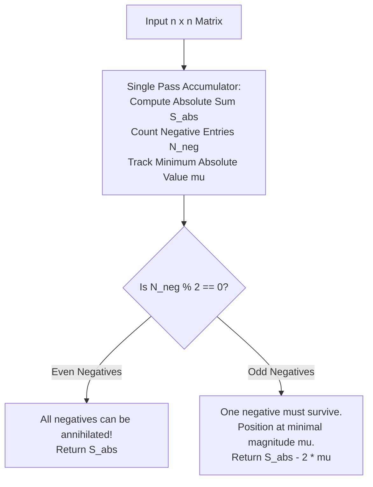

# Guided Example: Maximum Matrix Sum

We formulate and analyze the parity invariance and path-translocation theorem on representative matrices to maximize the global matrix sum under adjacent-pair sign flip operations.

- **Primary Instance (Odd Negative Count):**
  $$matrix = \begin{pmatrix} 1 & 2 & 3 \\ -1 & -2 & -3 \\ 1 & 2 & 3 \end{pmatrix}$$
  - Negative count: 3 (odd)
  - Minimum absolute value: 1
  - Expected Output: `16` (absolute sum 18 minus $2 \times 1$)
- **Secondary Instance (Even Negative Count):**
  $$matrix = \begin{pmatrix} 1 & -1 \\ -1 & 1 \end{pmatrix}$$
  - Negative count: 2 (even)
  - Expected Output: `4` (all elements converted to positive)

---

## 1. Instance & Intuition

We are given an $n \times n$ integer matrix. In one operation, we choose any two cardinally adjacent cells and multiply both values by $-1$. We may perform this operation an arbitrary number of times.

Consider what an adjacent sign flip does:
1. **Both Negative:** Flipping $(-a, -b)$ yields $(+a, +b)$. The number of negative numbers decreases by 2.
2. **Both Positive:** Flipping $(+a, +b)$ yields $(-a, -b)$. The number of negative numbers increases by 2.
3. **One Negative, One Positive:** Flipping $(-a, +b)$ yields $(+a, -b)$. The number of negative numbers remains unchanged, but the negative sign has effectively **transported** from one cell to its neighbor!

Because the grid is a connected graph:
- A negative sign can be walked along any path of adjacent cells to any location in the matrix.
- Whenever any two negative signs meet at adjacent cells, a single operation annihilates both, turning both positive.

This establishes two universal outcomes:
- **Even Number of Negatives:** Every negative sign can be paired up along a path and annihilated. Every element in the matrix can be made non-negative, achieving the sum of absolute values $\sum |x|$.
- **Odd Number of Negatives:** Negative signs can be paired up until exactly **one** negative sign remains. Because that single negative sign can be moved to any cell in the grid, we should position it at the cell with the **minimum absolute value** $m = \min |x|$. The global maximum sum is $\sum |x| - 2m$.

In our primary instance:
- The elements have absolute sum $3 \times (1 + 2 + 3) = 18$.
- There are 3 negative numbers (odd).
- The minimum absolute value is 1.
- Shifting the odd negative sign to 1 gives maximum sum $18 - 2(1) = 16$.

---

## 2. Mathematical Formalism & Parity Conservation

Let the matrix entries be $A_{i, j}$ for $(i, j) \in \{0, \dots, n-1\}^2$.
Let the number of strictly negative elements be:
$$\mathcal{N} = \sum_{i=0}^{n-1} \sum_{j=0}^{n-1} \mathbb{I}(A_{i, j} < 0)$$

### Invariant: Parity Conservation

Each operation on adjacent cells $u$ and $v$ changes the negative count by:
$$\Delta \mathcal{N} \in \{-2, 0, +2\}$$
Therefore, the parity of the negative count is strictly conserved:
$$\mathcal{N} \pmod 2 \equiv \text{constant}$$

### Theorem: Canonical Matrix Sum

Let:
$$S_{\text{abs}} = \sum_{i=0}^{n-1} \sum_{j=0}^{n-1} |A_{i, j}| \quad \text{and} \quad \mu = \min_{0 \le i, j < n} |A_{i, j}|$$

The maximum achievable matrix sum is:
$$\text{MaxSum} = \begin{cases} 
S_{\text{abs}} & \text{if } \mathcal{N} \text{ is even} \\
S_{\text{abs}} - 2\mu & \text{if } \mathcal{N} \text{ is odd}
\end{cases}$$

*(Notice that if the matrix contains a zero, $\mu = 0$, so $S_{\text{abs}} - 2(0) = S_{\text{abs}}$, correctly reflecting that the negative sign can be absorbed by the zero).*

---

## 3. Step-by-Step Translocation and Cancellation Trace

We trace the primary instance:
$$matrix = \begin{pmatrix} 1 & 2 & 3 \\ -1 & -2 & -3 \\ 1 & 2 & 3 \end{pmatrix}$$

### Step 1: Scan and Aggregate Statistics
- Row 0: `[1, 2, 3]` $\implies$ absolute sum $= 6$, negatives $= 0$, minimum magnitude $= 1$.
- Row 1: `[-1, -2, -3]` $\implies$ absolute sum $= 6$, negatives $= 3$, minimum magnitude $= 1$.
- Row 2: `[1, 2, 3]` $\implies$ absolute sum $= 6$, negatives $= 0$, minimum magnitude $= 1$.
- **Totals:**
  - Total absolute sum $S_{\text{abs}} = 6 + 6 + 6 = 18$.
  - Total negative count $\mathcal{N} = 3$ (Odd).
  - Global minimum magnitude $\mu = \min(1, 2, 3) = 1$.

### Step 2: Physical Flips (Constructive Demonstration)
1. **Annihilate Pair $(-2, -3)$:**
   - Cells $(1, 1) = -2$ and $(1, 2) = -3$ share an edge.
   - Flip both: $(1, 1)$ becomes $+2$, $(1, 2)$ becomes $+3$.
   - Matrix becomes:
     $$\begin{pmatrix} 1 & 2 & 3 \\ -1 & 2 & 3 \\ 1 & 2 & 3 \end{pmatrix}$$
   - Only a single negative remains at $(1, 0) = -1$.
2. **Relocate Negative to Global Minimum:**
   - The surviving negative is already at cell $(1, 0)$ with absolute value $|-1| = 1 = \mu$.
   - No further movement is needed.
3. **Compute Final Sum:**
   $$\text{Sum} = (1 + 2 + 3) + (-1 + 2 + 3) + (1 + 2 + 3) = 6 + 4 + 6 = 16$$

---

## 4. Execution Trace Table

### Cell-by-Cell Statistics for Primary Matrix

| Cell $(r, c)$ | Original Value $A_{r, c}$ | Absolute Value $\lvert A_{r, c} \rvert$ | Sign Parity | Running Absolute Sum $S_{\text{abs}}$ | Running Negatives $\mathcal{N}$ | Running Minimum $\mu$ |
|---|---|---|---|---|---|---|
| $(0, 0)$ | 1 | 1 | Positive | 1 | 0 | 1 |
| $(0, 1)$ | 2 | 2 | Positive | 3 | 0 | 1 |
| $(0, 2)$ | 3 | 3 | Positive | 6 | 0 | 1 |
| $(1, 0)$ | -1 | 1 | **Negative** | 7 | 1 | 1 |
| $(1, 1)$ | -2 | 2 | **Negative** | 9 | 2 | 1 |
| $(1, 2)$ | -3 | 3 | **Negative** | 12 | 3 | 1 |
| $(2, 0)$ | 1 | 1 | Positive | 13 | 3 | 1 |
| $(2, 1)$ | 2 | 2 | Positive | 15 | 3 | 1 |
| $(2, 2)$ | 3 | 3 | Positive | 18 | 3 | 1 |

**Evaluation:**
- $\mathcal{N} = 3$ is odd $\implies$ Result $= S_{\text{abs}} - 2\mu = 18 - 2(1) = 16$.

### Comparative Diagnostic Scenarios

| Matrix Form | Negative Count $\mathcal{N}$ | Minimum Absolute Value $\mu$ | Parity Branch | Final Formula | Result |
|---|---|---|---|---|---|
| `[[1, -1], [-1, 1]]` | 2 (Even) | 1 | Even | $S_{\text{abs}} = 4$ | 4 |
| `[[1, 2], [-3, 4]]` | 1 (Odd) | 1 | Odd | $10 - 2(1)$ | 8 |
| `[[-1, 0], [-2, -3]]` | 3 (Odd) | 0 | Odd | $6 - 2(0)$ | 6 |
| `[[-5, -5], [-5, -5]]` | 4 (Even) | 5 | Even | $S_{\text{abs}} = 20$ | 20 |

---

## 5. Algorithmic Correctness & Soundness

**Soundness.** In any state reachable via adjacent flips, the number of negative numbers must have the same parity as $\mathcal{N}$ because each operation alters the count by $\pm 2$ or $0$. When $\mathcal{N}$ is odd, at least one cell must remain negative. The sum of all elements in any configuration with at least one negative cell $c^*$ cannot exceed $\sum_{c \neq c^*} |A_c| - |A_{c^*}| = S_{\text{abs}} - 2|A_{c^*}|$. This quantity is maximized by choosing $c^*$ such that $|A_{c^*}| = \mu$, yielding an upper bound of $S_{\text{abs}} - 2\mu$.

**Completeness (Reachability).** Because the grid graph is connected, for any two cells $u$ and $v$, there exists a simple path $u = p_0, p_1, \dots, p_k = v$. Sequentially applying adjacent flips along this path transfers the sign from $u$ to $v$ without modifying the signs of any intermediate cells along the path. By induction, any pair of negative signs can be brought together and canceled, and any single remaining negative sign can be routed to the cell realizing the global minimum $\mu$. Thus, the bound is constructively achievable.

---

## 6. Edge Cases & Traps

- **Presence of Zero:** If any cell in the matrix contains $0$, then $\mu = 0$. Even if $\mathcal{N}$ is odd, the negative sign can be deposited onto the $0$ (since $-0 = 0$), avoiding any deduction from the positive sum ($S_{\text{abs}} - 2(0) = S_{\text{abs}}$).
- **64-bit Integer Overflow:** With $n = 250$, the matrix contains $250^2 = 62{,}500$ cells, each up to $10^5$. The total sum can reach $62{,}500 \times 10^5 = 6.25 \times 10^9$, exceeding 32-bit signed integer limits ($2.14 \times 10^9$). The sum accumulator must use 64-bit integer types (`long long` or `int64`).
- **Graph Disconnection Fallacy:** The rule applies to adjacent cells (horizontal and vertical). If diagonal flips were permitted, connectivity would still hold; standard 4-directional adjacency is already sufficient for full grid connectivity.

---

## 7. Complexity Analysis

- **Time Complexity:**
  - A single pass iterates through all $n \times n = n^2$ cells of the matrix.
  - At each cell, computing $|x|$, adding to the accumulator, testing $x < 0$, and updating the running minimum takes $\mathcal{O}(1)$ time.
  - Total time complexity is strictly $\mathcal{O}(n^2)$, optimal for reading the input.
- **Auxiliary Space Complexity:**
  - Only scalar accumulator variables ($S_{\text{abs}}, \mathcal{N}, \mu$) are stored.
  - Auxiliary space is strictly $\mathcal{O}(1)$.
