[TOC]

## Solution

---

### Approach: Journey From Minus to Plus

#### Intuition

To maximize the matrix sum, let’s first imagine the ideal situation: if every element in the matrix were positive, we would have the highest possible sum. Since we can flip pairs of adjacent elements by multiplying them by -1, we could, in theory, make all values positive if we wanted. So, we start by calculating the sum of the absolute values of all elements, as this would be the ideal maximum sum if all elements were positive.

Next, we need to think about when flipping doesn’t work perfectly. Specifically, if there’s an odd number of negative elements, it won’t be possible to make everything positive because one negative will always remain. This observation leads us to a simple rule: if there’s an even count of negative numbers, we can flip them all to positive values. But if the count is odd, one number has to stay negative, which means the sum can’t be quite as high as in the ideal case.

To minimize the impact of this remaining negative, we want it to be the smallest number in the matrix. So, while calculating the absolute sum, we also track the smallest absolute value. This way, if we end up with an odd count of negatives, we can subtract twice this smallest value from the total. This subtraction accounts for the one unavoidable negative element and keeps the final sum as high as possible.

<details>
  <summary>Why subtract twice the smallest absolute value? (Click Here!)</summary>
  <p>For an odd count of negative numbers, flipping a negative number to positive adds that number's absolute value to the total sum. For example, if we had flipped -1 to +1, it would increase the sum by +1. However, since we can't flip this number (due to the odd count of negatives), we need to "remove" this potential gain. This is why we subtract twice the smallest absolute value: once to account for the gain we didn’t get and again because we didn’t flip it.</p>
</details>

</br>

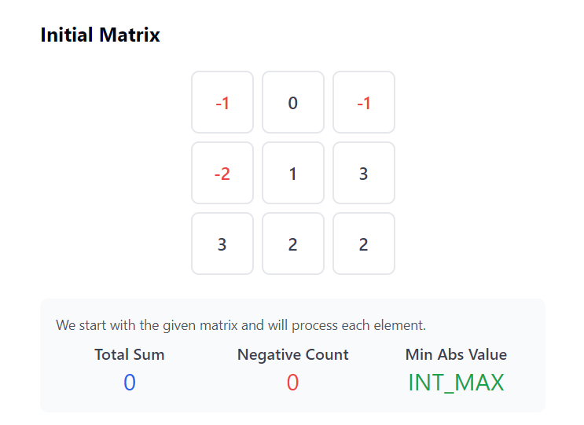

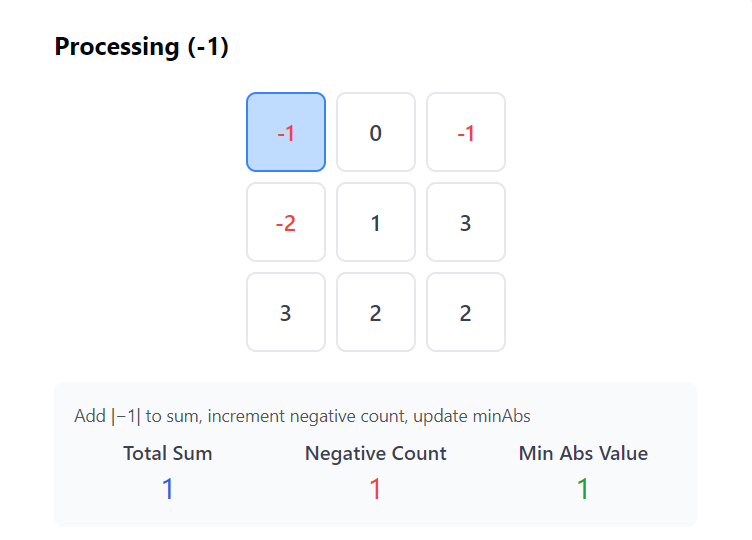

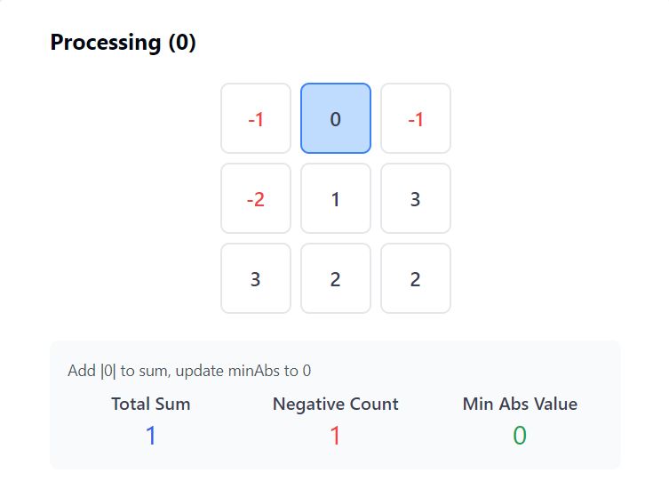

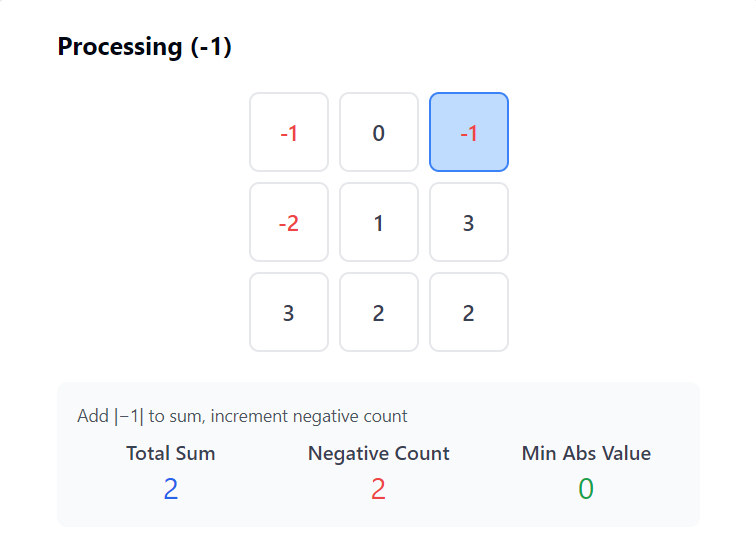

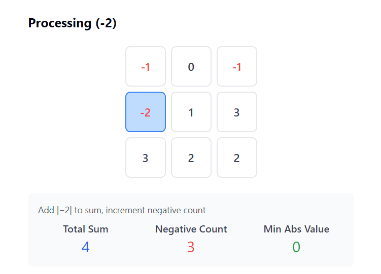

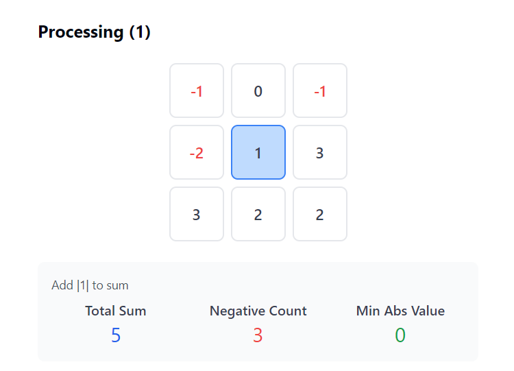

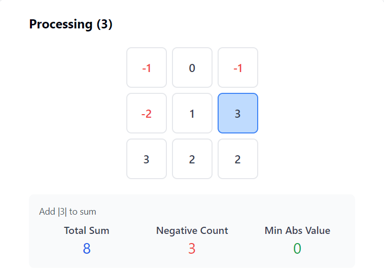

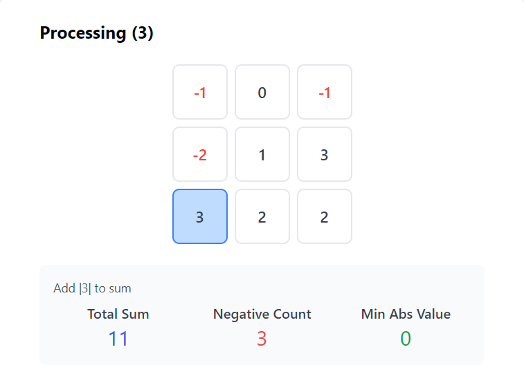

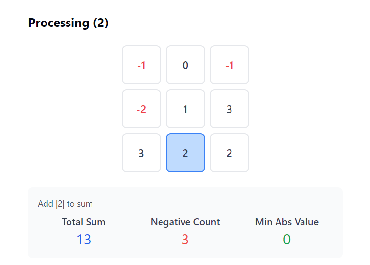

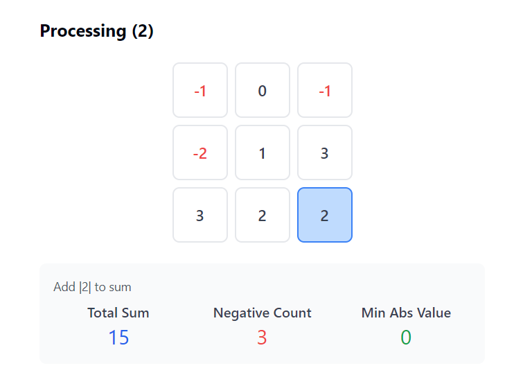

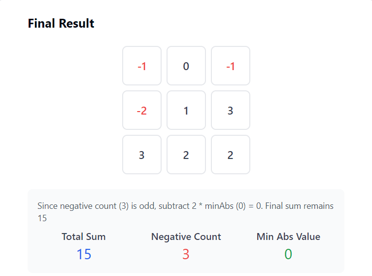

#### Algorithm

- Initialize `totalSum` to 0, `minAbsVal` to $\text{INT}_{MAX}$, and `negativeCount` to 0 to store the sum of absolute values, track the smallest absolute value, and count the number of negative elements, respectively.

- For each row in `matrix`:
  - For each `val` in the row:
- Add the absolute value of `val` to `totalSum` to accumulate the absolute sum.
- If `val` is negative, increment `negativeCount`.
- Update `minAbsVal` to the smaller of `minAbsVal` and `abs(val)`.

- After traversing the matrix, check if `negativeCount` is odd:
  - If it is, subtract $2 * minAbsVal$ from `totalSum` to adjust for the odd number of negatives, ensuring the maximum possible matrix sum.

- Return `totalSum`, which now represents the maximum achievable matrix sum after adjustments.

#### Implementation

```python
class Solution:
    def maxMatrixSum(self, matrix: List[List[int]]) -> int:
        total_sum = 0
        min_abs_val = float("inf")
        negative_count = 0

        for row in matrix:
            for val in row:
                total_sum += abs(val)
                if val < 0:
                    negative_count += 1
                min_abs_val = min(min_abs_val, abs(val))

        # Adjust if the count of negative numbers is odd
        if negative_count % 2 != 0:
            total_sum -= 2 * min_abs_val

        return total_sum
```

#### Complexity Analysis

Let `n` be the number of rows and `m` be the number of columns in the matrix.

- Time complexity: $O(n \times m)$

    The algorithm iterates through each element in the matrix, performing constant-time operations per element, resulting in an overall time complexity of $O(n \times m)$.

- Space complexity: $O(1)$

    The algorithm uses a constant amount of space, independent of the size of the matrix, resulting in a space complexity of $O(1)$.

---