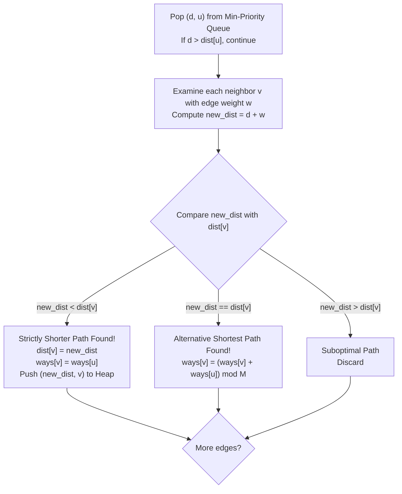

# Guided Example: Number of Ways to Arrive at Destination

We formulate and trace Dijkstra's shortest path algorithm augmented with path-counting dynamic programming on representative weighted road networks to determine the number of distinct minimum-time routes modulo $10^9+7$.

- **Primary Instance:** $n = 7$, `roads = [[0, 6, 7], [0, 1, 2], [1, 2, 3], [1, 3, 3], [6, 3, 3], [3, 5, 1], [6, 5, 1], [2, 5, 1], [0, 4, 5], [4, 6, 2]]`
  - Start vertex: `0`, Destination: `6`
  - Minimal distance: $7$
  - Expected Output: `4` (four distinct paths of length 7)
- **Secondary Instance:** $n = 3$, `roads = [[0, 1, 1], [1, 2, 1], [0, 2, 2]]`
  - Expected Output: `2` (paths $0 \to 1 \to 2$ and $0 \to 2$, both length 2)

---

## 1. Instance & Intuition

In a connected weighted graph where positive edge weights denote travel times, we wish to find:
1. The global minimum travel time $d^*$ from origin $0$ to destination $n-1$.
2. The total number of distinct routes that attain this exact minimal travel time $d^*$, reduced modulo $10^9+7$.

Standard Dijkstra's algorithm tracks only the single minimum distance to each vertex. However, because edge weights are positive ($w_e > 0$), the graph of all shortest paths forms a **Directed Acyclic Graph (DAG)**. 

On this shortest-path DAG, path counting obeys optimal substructure:
- If a route to neighbor $v$ through $u$ achieves a strictly shorter distance than any previously seen path to $v$, then all prior paths to $v$ are obsolete. We reset $v$'s minimum distance to $dist[u] + w(u, v)$ and set $v$'s path count to inherit directly from $u$: $ways[v] = ways[u]$.
- If a route through $u$ achieves the exact same minimal distance as $v$'s current best ($dist[u] + w(u, v) == dist[v]$), we have discovered an alternative set of optimal routes. We accumulate the ways: $ways[v] \leftarrow (ways[v] + ways[u]) \pmod{10^9+7}$.
- If a route through $u$ is strictly longer, it is discarded.

In our primary instance with $n = 7$:
- Minimal distance from $0$ to $6$ is 7.
- Four distinct routes achieve distance 7:
  1. $0 \xrightarrow{7} 6$ (direct highway, time 7)
  2. $0 \xrightarrow{5} 4 \xrightarrow{2} 6$ (via node 4, time $5 + 2 = 7$)
  3. $0 \xrightarrow{2} 1 \xrightarrow{3} 2 \xrightarrow{1} 5 \xrightarrow{1} 6$ (via 1, 2, 5, time $2 + 3 + 1 + 1 = 7$)
  4. $0 \xrightarrow{2} 1 \xrightarrow{3} 3 \xrightarrow{1} 5 \xrightarrow{1} 6$ (via 1, 3, 5, time $2 + 3 + 1 + 1 = 7$)
- Total routes: $1 + 1 + 1 + 1 = 4$.

---

## 2. Formal Invariants & Augmented Dijkstra Recurrence

Let $G = (V, E, w)$ with $V = \{0, \dots, n-1\}$.
All path additions are computed modulo $M = 10^9 + 7$.

### State Definitions

For every vertex $v \in V$:
- $dist[v]$: minimum known distance from vertex $0$ to vertex $v$.
- $ways[v]$: number of distinct shortest paths from vertex $0$ to $v$.

### Base Initialization

$$dist[0] = 0, \quad ways[0] = 1$$
$$\forall v > 0: dist[v] = \infty, \quad ways[v] = 0$$

### Edge Relaxation Rules

When settling vertex $u$ with known optimal distance $dist[u]$ and inspecting adjacent edge $(u, v)$ with weight $w$:
Let $new\_dist = dist[u] + w$.
$$\begin{cases} 
\text{Strict Improvement } (new\_dist < dist[v]): & dist[v] \leftarrow new\_dist, \; ways[v] \leftarrow ways[u], \; \text{push}(new\_dist, v) \\
\text{Tied Distance } (new\_dist == dist[v]): & ways[v] \leftarrow (ways[v] + ways[u]) \pmod M \\
\text{Suboptimal } (new\_dist > dist[v]): & \text{Ignore transition}
\end{cases}$$

---

## 3. Step-by-Step Dynamic Programming Evaluation

We trace the primary instance ($n = 7$, destination $= 6$):

### Priority Queue Events

1. **Pop $(0, \text{node } 0)$:**
   - Relax $(0, 1, 2) \implies dist[1] = 2, ways[1] = 1$.
   - Relax $(0, 4, 5) \implies dist[4] = 5, ways[4] = 1$.
   - Relax $(0, 6, 7) \implies dist[6] = 7, ways[6] = 1$.

2. **Pop $(2, \text{node } 1)$:**
   - Relax $(1, 2, 3) \implies new\_dist = 2 + 3 = 5$. $dist[2] = 5, ways[2] = 1$.
   - Relax $(1, 3, 3) \implies new\_dist = 2 + 3 = 5$. $dist[3] = 5, ways[3] = 1$.

3. **Pop $(5, \text{node } 2)$:**
   - Relax $(2, 5, 1) \implies new\_dist = 5 + 1 = 6$. $dist[5] = 6, ways[5] = ways[2] = 1$.

4. **Pop $(5, \text{node } 3)$:**
   - Relax $(3, 5, 1) \implies new\_dist = 5 + 1 = 6$.
     - Matches existing $dist[5] == 6$!
     - Accumulate ways: $ways[5] \leftarrow ways[5] + ways[3] = 1 + 1 = 2$.
   - Relax $(3, 6, 3) \implies new\_dist = 5 + 3 = 8 > dist[6] = 7$ (Ignored).

5. **Pop $(5, \text{node } 4)$:**
   - Relax $(4, 6, 2) \implies new\_dist = 5 + 2 = 7$.
     - Matches existing $dist[6] == 7$!
     - Accumulate ways: $ways[6] \leftarrow ways[6] + ways[4] = 1 + 1 = 2$.

6. **Pop $(6, \text{node } 5)$:**
   - Note: Node 5 has $ways[5] = 2$ (one route via 2, one route via 3).
   - Relax $(5, 6, 1) \implies new\_dist = 6 + 1 = 7$.
     - Matches existing $dist[6] == 7$!
     - Accumulate ways: $ways[6] \leftarrow ways[6] + ways[5] = 2 + 2 = 4$.

7. **Pop $(7, \text{node } 6)$:**
   - Target reached with final values: $dist[6] = 7$, $ways[6] = 4$.

Final output emitted: **4**.

---

## 4. Execution Trace Table

### Node State Evolution

| Step | Settled Node $u$ | Settled Distance $dist[u]$ | Active Neighbor $v$ | Edge Weight $w$ | Candidate $dist[u] + w$ | Existing $dist[v]$ | Action Taken | Resulting $ways[v]$ |
|---|---|---|---|---|---|---|---|---|
| 1 | 0 | 0 | 1 | 2 | 2 | $\infty$ | Strict Update | $ways[1] = 1$ |
| 1 | 0 | 0 | 4 | 5 | 5 | $\infty$ | Strict Update | $ways[4] = 1$ |
| 1 | 0 | 0 | 6 | 7 | 7 | $\infty$ | Strict Update | $ways[6] = 1$ |
| 2 | 1 | 2 | 2 | 3 | 5 | $\infty$ | Strict Update | $ways[2] = 1$ |
| 2 | 1 | 2 | 3 | 3 | 5 | $\infty$ | Strict Update | $ways[3] = 1$ |
| 3 | 2 | 5 | 5 | 1 | 6 | $\infty$ | Strict Update | $ways[5] = 1$ |
| 4 | 3 | 5 | 5 | 1 | 6 | 6 | **Tied Distance** | $ways[5] = 1 + 1 = 2$ |
| 5 | 4 | 5 | 6 | 2 | 7 | 7 | **Tied Distance** | $ways[6] = 1 + 1 = 2$ |
| 6 | 5 | 6 | 6 | 1 | 7 | 7 | **Tied Distance** | $ways[6] = 2 + 2 = \mathbf{4}$ |

### Final State Summary

| Vertex Index $v$ | True Shortest Distance $dist[v]$ | Count of Optimal Routes $ways[v]$ | Contributing Predecessors in Shortest-Path DAG |
|---|---|---|---|
| 0 | 0 | 1 | None (Origin) |
| 1 | 2 | 1 | $\{0\}$ |
| 2 | 5 | 1 | $\{1\}$ |
| 3 | 5 | 1 | $\{1\}$ |
| 4 | 5 | 1 | $\{0\}$ |
| 5 | 6 | 2 | $\{2, 3\}$ |
| **6** | **7** | **4** | **$\{0, 4, 5\}$** |

---

## 5. Algorithmic Correctness & Soundness

**Soundness.** Because all edge weights are strictly positive ($w_e \ge 1$), Dijkstra's algorithm visits vertices in monotonically non-decreasing order of their true shortest distance. When a vertex $u$ is popped from the min-priority queue with its finalized distance $dist[u]$, all shortest paths to $u$ have already been discovered and tallied in $ways[u]$. Any edge $(u, v)$ satisfying $dist[u] + w(u, v) = dist[v]$ is an edge in the shortest-path DAG. Adding $ways[u]$ to $ways[v]$ partitions the set of shortest paths to $v$ according to their final hop into $v$, which is mutually exclusive and exhaustive.

**Completeness.** Every path of length $dist[n-1]$ consists of a sequence of tight edges in the shortest-path DAG. Since Dijkstra explores every incident edge of settled vertices, every tight edge $(u, v)$ is relaxed after $u$'s distance is finalized. The modular additions preserve correctness in $\mathbb{Z} / (10^9 + 7)\mathbb{Z}$, guaranteeing that no valid route is omitted.

---

## 6. Edge Cases & Traps

- **64-bit Distance Types:** Edge weights can be up to $10^9$ with $n = 200$. A path can span up to 200 edges, giving total distance up to $2 \times 10^{11}$, which overflows 32-bit signed integers ($2.14 \times 10^9$). Distance arrays must strictly use 64-bit integer types (`long long` or `uint64_t`).
- **Duplicate Priority Queue Entries:** Standard Dijkstra may insert a vertex multiple times as distances decrease. The check `if (d > dist[u]) continue;` is required to discard stale heap entries; otherwise, redundant relaxations will double-count paths.
- **Disconnected Destination:** Although the problem statement guarantees connectivity, if a node were unreachable, $dist[v] = \infty$ and $ways[v] = 0$.

---

## 7. Complexity Analysis

- **Time Complexity:**
  - Building the adjacency list: $\mathcal{O}(V + E)$ time.
  - Priority queue operations: at most $E$ elements pushed. Each push and pop takes $\mathcal{O}(\log V)$ time.
  - Each directed edge is relaxed once.
  - Total time complexity is strictly $\mathcal{O}((V + E) \log V)$.
  - With $V \le 200$ and $E \le \frac{200 \times 199}{2} \approx 2 \cdot 10^4$, total operations are bounded by $2 \cdot 10^4 \log_2(200) \approx 1.6 \times 10^5$, executing in under 5 milliseconds.
- **Auxiliary Space Complexity:**
  - Adjacency list requires $\mathcal{O}(V + E)$ memory.
  - $dist$ and $ways$ arrays take $\mathcal{O}(V)$ space.
  - Priority queue holds at most $\mathcal{O}(E)$ entries.
  - Total auxiliary space is $\mathcal{O}(V + E)$.
