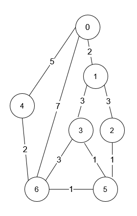

### 1. Description

You are in a city that consists of `n` intersections numbered from `0` to $n - 1$ with **bi-directional** roads between some intersections. The inputs are generated such that you can reach any intersection from any other intersection and that there is at most one road between any two intersections.

You are given an integer `n` and a 2D integer array `roads` where $\text{roads}[i] = [u_{i}, v_{i}, \text{time}_{i}]$ means that there is a road between intersections $u_{i}$ and $v_{i}$ that takes $\text{time}_{i}$ minutes to travel. You want to know in how many ways you can travel from intersection `0` to intersection $n - 1$ in the **shortest amount of time**.

Return *the **number of ways** you can arrive at your destination in the **shortest amount of time***. Since the answer may be large, return it **modulo** $10^{9} + 7$.

### 2. Function Contract

- `n`: Input parameter.
- Returns expected result.

### 3. Examples

#### Example 1

- **Input:** $n = 7, roads = [[0,6,7],[0,1,2],[1,2,3],[1,3,3],[6,3,3],[3,5,1],[6,5,1],[2,5,1],[0,4,5],[4,6,2]]$
- **Output:** `4`
- **Explanation:** The shortest amount of time it takes to go from intersection 0 to intersection 6 is 7 minutes.
The four ways to get there in 7 minutes are:
- 0 ➝ 6
- 0 ➝ 4 ➝ 6
- 0 ➝ 1 ➝ 2 ➝ 5 ➝ 6
- 0 ➝ 1 ➝ 3 ➝ 5 ➝ 6
#### Example 2

- **Input:** $n = 2, roads = [[1,0,10]]$
- **Output:** `1`
- **Explanation:** There is only one way to go from intersection 0 to intersection 1, and it takes 10 minutes.

### 4. Constraints

- $1 \le n \le 200$

- $n - 1 \le \text{roads.length} \le n * (n - 1) / 2$

- $\text{roads}[i].length = 3$

- $0 \le u_{i}, v_{i} \le n - 1$

- $1 \le \text{time}_{i} \le 10^{9}$

- $u_{i} \neq v_{i}$

- There is at most one road connecting any two intersections.

- You can reach any intersection from any other intersection.