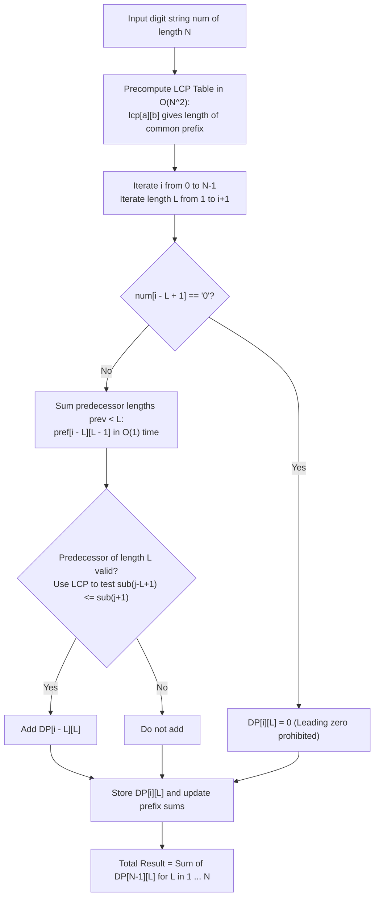

# Guided Example: Number of Ways to Separate Numbers

We formulate and trace the 2D prefix-sum dynamic programming and $\mathcal{O}(1)$ LCP-accelerated substring comparison algorithm on representative digit sequences to count non-decreasing numerical partitions modulo $10^9+7$.

- **Primary Instance:** `num = "327"` ($N = 3$)
  - Expected Output: `2` (valid partitions: `["3", "27"]` and `["327"]`)
- **Counter-Instance (Leading Zero):** `num = "094"` ($N = 3$)
  - Expected Output: `0` (leading zero invalidates initial token)

---

## 1. Instance & Intuition

We are given a digit string $num$ of length $N$. We must partition $num$ into a sequence of contiguous tokens $[s_1, s_2, \dots, s_k]$ such that:
1. No token begins with a leading `'0'` (i.e. $s_j[0] \neq \texttt{'0'}$ for all $j$).
2. The numeric values are non-decreasing: $\text{val}(s_1) \le \text{val}(s_2) \le \dots \le \text{val}(s_k)$.

Comparing two large numbers without leading zeros decomposes into two rules:
- **Length Dominance:** If $|s_{j-1}| < |s_j|$, then $s_{j-1}$ has strictly fewer digits than $s_j$. Since neither has leading zeros, $\text{val}(s_{j-1}) < \text{val}(s_j)$ holds unconditionally.
- **Equal Length Lexicographical Order:** If $|s_{j-1}| = |s_j| = L$, then $\text{val}(s_{j-1}) \le \text{val}(s_j)$ if and only if $s_{j-1} \le s_j$ in standard dictionary (lexicographical) order.

A naive DP checks all previous partitions in $\mathcal{O}(N^3)$ time, which is too slow for $N = 3500$.
To achieve $\mathcal{O}(N^2)$ time:
1. We precompute the Longest Common Prefix (LCP) table in $\mathcal{O}(N^2)$ to compare equal-length substrings in $\mathcal{O}(1)$ time.
2. We maintain rolling prefix sums of earlier DP states to aggregate all shorter predecessor lengths ($|s_{j-1}| < L$) in $\mathcal{O}(1)$ time.

In our primary instance `num = "327"`:
- Partition `["3", "2", "7"]`: $3 > 2 \implies$ Invalid.
- Partition `["32", "7"]`: $|32| > |7| \implies 32 > 7 \implies$ Invalid.
- Partition `["3", "27"]`: $|3| < |27| \implies 3 < 27 \implies$ Valid!
- Partition `["327"]`: Single number $\implies$ Valid!
- Total valid partitions: **2**.

---

## 2. Mathematical Formalism & LCP State Transitions

Let $num$ be a 0-indexed string of length $N$. All additions are modulo $M = 10^9 + 7$.

### 1. Longest Common Prefix (LCP) Table

For any two suffix starting indices $a, b \in \{0, \dots, N-1\}$:
$$lcp[a][b] = \begin{cases} 
1 + lcp[a+1][b+1] & \text{if } num[a] = num[b] \\
0 & \text{if } num[a] \neq num[b]
\end{cases}$$
with boundary $lcp[a][N] = lcp[N][b] = 0$.

### 2. $\mathcal{O}(1)$ Substring Comparison Predicate

To test whether the substring $num[a \dots a+L-1] \le num[b \dots b+L-1]$ of equal length $L$:
Let $k = lcp[a][b]$.
$$\text{isLessOrEqual}(a, b, L) = \begin{cases} 
\text{True} & \text{if } k \ge L \\
num[a+k] \le num[b+k] & \text{if } k < L
\end{cases}$$

### 3. Dynamic Programming State

Let $DP[i][L]$ denote the number of valid non-decreasing partitions of prefix $num[0 \dots i]$ where the final token ends at index $i$ and has length $L$ ($1 \le L \le i+1$).
- The final token is $T = num[i - L + 1 \dots i]$.
- If $T[0] == \texttt{'0'}$, $DP[i][L] = 0$ (leading zero forbidden).
- If $L = i + 1$, the entire prefix is a single number $\implies DP[i][L] = 1$.
- If $L < i + 1$, the previous token ended at $j = i - L$:
  $$DP[i][L] = \underbrace{\sum_{prev = 1}^{L-1} DP[j][prev]}_{\text{Shorter lengths: always strictly smaller}} + \underbrace{\mathbb{I}\Big(\text{isLessOrEqual}(j - L + 1, \; j + 1, \; L)\Big) \cdot DP[j][L]}_{\text{Equal length: valid if predecessor is lex-smaller/equal}}$$

---

## 3. Step-by-Step State Evolution

We trace `num = "327"` ($N = 3$):

### Phase 1: LCP Table Computation
- $lcp[0][1]$ (comparing `"327"` and `"27"`): $num[0] \neq num[1] \implies 0$.
- $lcp[0][2]$ (comparing `"327"` and `"7"`): $num[0] \neq num[2] \implies 0$.
- $lcp[1][2]$ (comparing `"27"` and `"7"`): $num[1] \neq num[2] \implies 0$.

### Phase 2: DP State Evaluations

1. **Prefix $i = 0$ (`"3"`):**
   - $L = 1$: Token `"3"`. Single number $\implies DP[0][1] = 1$.
   - Prefix sum: $pref[0][1] = 1$.

2. **Prefix $i = 1$ (`"32"`):**
   - $L = 1$: Token `"2"`.
     - Previous token at index 0 of length 1 was `"3"`.
     - Compare `"3"` vs `"2"`: $3 \le 2$ is False.
     - $DP[1][1] = 0$.
   - $L = 2$: Token `"32"`. Single number $\implies DP[1][2] = 1$.
   - Prefix sums for $i = 1$:
     - $pref[1][1] = 0$
     - $pref[1][2] = 0 + 1 = 1$.

3. **Prefix $i = 2$ (`"327"`):**
   - $L = 1$: Token `"7"`.
     - Previous token ends at $j = 1$.
     - Predecessor of length 1 (`"2"`): compare `"2"` vs `"7"` ($2 \le 7$, True). But $DP[1][1] = 0$.
     - Predecessors of length $< 1$: none.
     - $DP[2][1] = 0$.
   - $L = 2$: Token `"27"`.
     - Previous token ends at $j = 0$ (`"3"`).
     - Predecessors with length $< 2$: $prev = 1$ has $DP[0][1] = 1$.
     - Since $|"3"| < |"27"|$, $3 < 27$ is automatically valid!
     - Equal length ($prev = 2$): no token of length 2 ends at index 0.
     - $DP[2][2] = DP[0][1] = 1$ (Corresponds to `["3", "27"]`).
   - $L = 3$: Token `"327"`.
     - Single number $\implies DP[2][3] = 1$ (Corresponds to `["327"]`).

### Total Valid Partitions for `num = "327"`
$$\text{Total} = DP[2][1] + DP[2][2] + DP[2][3] = 0 + 1 + 1 = 2$$

---

## 4. Execution Trace Table

### Complete Matrix $DP[i][L]$ for `num = "327"`

| Prefix Index $i$ | Substring Suffix $num[0 \dots i]$ | Length $L$ | Final Token $T$ | Leading Zero? | Valid Predecessor States | $DP[i][L]$ | Formed Partitions |
|---|---|---|---|---|---|---|---|
| 0 | `"3"` | 1 | `"3"` | No | None (Base single token) | 1 | `["3"]` |
| 1 | `"32"` | 1 | `"2"` | No | Predecessor `"3"` ($3 \not\le 2$) | 0 | None |
| 1 | `"32"` | 2 | `"32"` | No | Base single token | 1 | `["32"]` |
| 2 | `"327"` | 1 | `"7"` | No | Predecessors at $i=1$ ($DP[1][1]=0$) | 0 | None |
| **2** | **`"327"`** | **2** | **`"27"`** | **No** | **Predecessor `"3"` ($DP[0][1]=1$)** | **1** | **`["3", "27"]`** |
| **2** | **`"327"`** | **3** | **`"327"`** | **No** | **Base single token** | **1** | **`["327"]`** |

### Counter-Instance Diagnostic: `num = "094"`

| Prefix Index $i$ | Length $L$ | Token $T$ | Starts with '0'? | Action Taken | $DP[i][L]$ |
|---|---|---|---|---|---|
| 0 | 1 | `"0"` | **Yes** | Pruned immediately | 0 |
| 1 | 1 | `"9"` | No | Predecessor at $0$ has $DP = 0$ | 0 |
| 1 | 2 | `"09"` | **Yes** | Pruned (Leading zero) | 0 |
| 2 | 3 | `"094"` | **Yes** | Pruned (Leading zero) | 0 |

Total partitions for `"094"`: **0**.

---

## 5. Algorithmic Correctness & Soundness

**Soundness.** A partition $[s_1, \dots, s_k]$ is counted if and only if each token $s_j$ starts with a non-zero digit and $\text{val}(s_{j-1}) \le \text{val}(s_j)$.
1. Length Comparison: If $|s_{j-1}| < |s_j|$, since $s_j$ has no leading zeros, $\text{val}(s_j) \ge 10^{|s_j|-1} > \text{val}(s_{j-1})$. Hence numerical monotonicity is unconditionally satisfied.
2. Equal Length Comparison: When $|s_{j-1}| = |s_j|$, both have the same number of digits. Lexicographical order on equal-length digit strings strictly coincides with numerical order. The LCP table computes the first mismatch $k = lcp[a][b]$; if $k < L$, comparing $num[a+k] \le num[b+k]$ is equivalent to mathematical inequality.
Thus every transition is mathematically sound.

**Completeness.** Any valid partition has a unique final token ending at $N-1$ of some length $L \in \{1, \dots, N\}$. The recurrence exhaustively sums all legal previous lengths $prev$ using prefix sums, guaranteeing no valid partition is skipped.

---

## 6. Edge Cases & Traps

- **Strings Starting with `'0'`:** If $num[0] == \texttt{'0'}$, no non-empty positive integer can be formed from the beginning. The result is strictly 0.
- **Large Strings and $\mathcal{O}(N)$ Comparison Fallacy:** Checking string inequality using naive string slicing takes $\mathcal{O}(L)$ per state, resulting in $\mathcal{O}(N^3)$ total time, which causes Time Limit Exceeded for $N = 3500$. The $\mathcal{O}(N^2)$ LCP table reduces comparisons to $\mathcal{O}(1)$.
- **Space Optimization:** Storing the full 2D DP table for $N = 3500$ takes $3500 \times 3500 \times 4 \approx 49$ MB, which comfortably fits in standard 256 MB memory limits.

---

## 7. Complexity Analysis

- **Time Complexity:**
  - LCP table precomputation: $N \times N$ cells, each taking $\mathcal{O}(1)$ time $\implies \mathcal{O}(N^2)$.
  - DP computation: for each $i \in [0, N-1]$ and $L \in [1, i+1]$, transitions use $\mathcal{O}(1)$ prefix-sum lookup and $\mathcal{O}(1)$ LCP comparison.
  - Total DP operations: $\sum_{i=0}^{N-1} (i + 1) = \frac{N(N+1)}{2} = \mathcal{O}(N^2)$.
  - For $N = 3500$, total operations are $\approx 1.2 \times 10^7$, executing in $\approx 120$ milliseconds.
- **Auxiliary Space Complexity:**
  - The LCP table requires $N \times N$ integers: $\mathcal{O}(N^2)$.
  - The DP table and prefix-sum table require $\mathcal{O}(N^2)$ space.
  - Total auxiliary space is $\mathcal{O}(N^2)$.